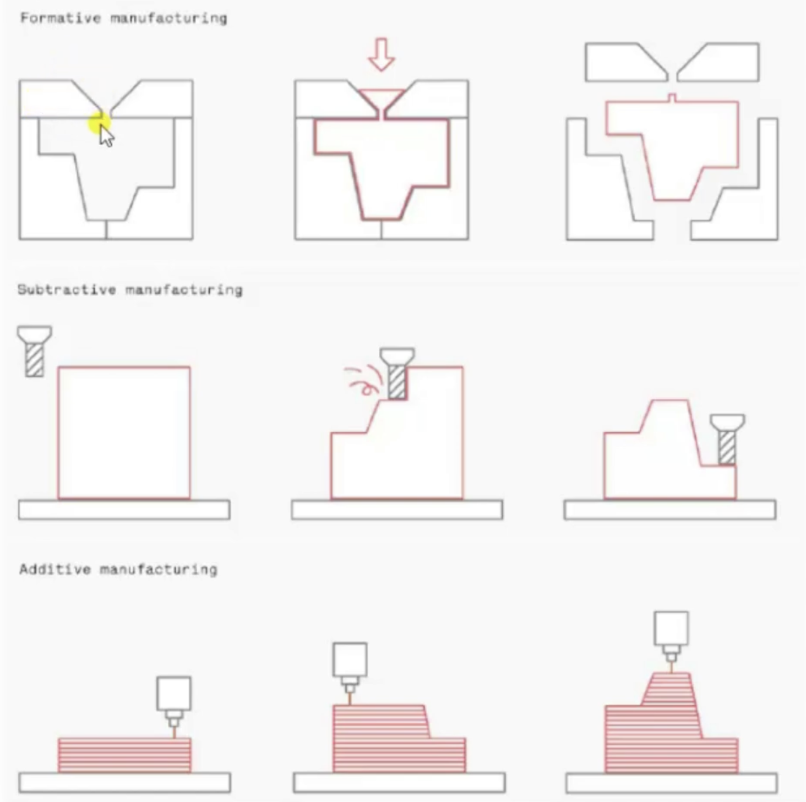
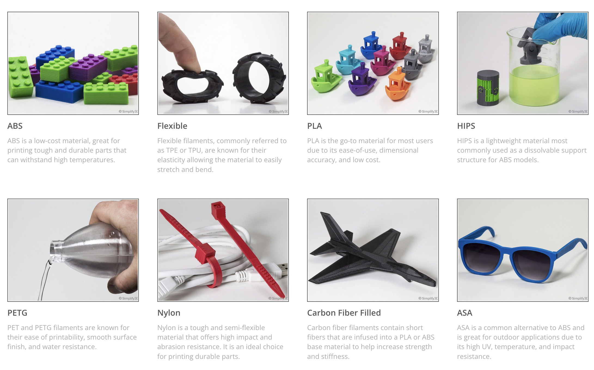
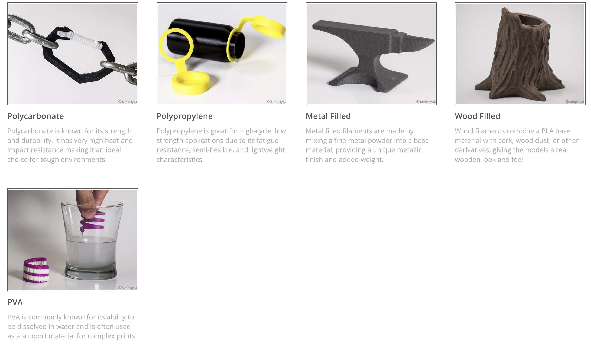
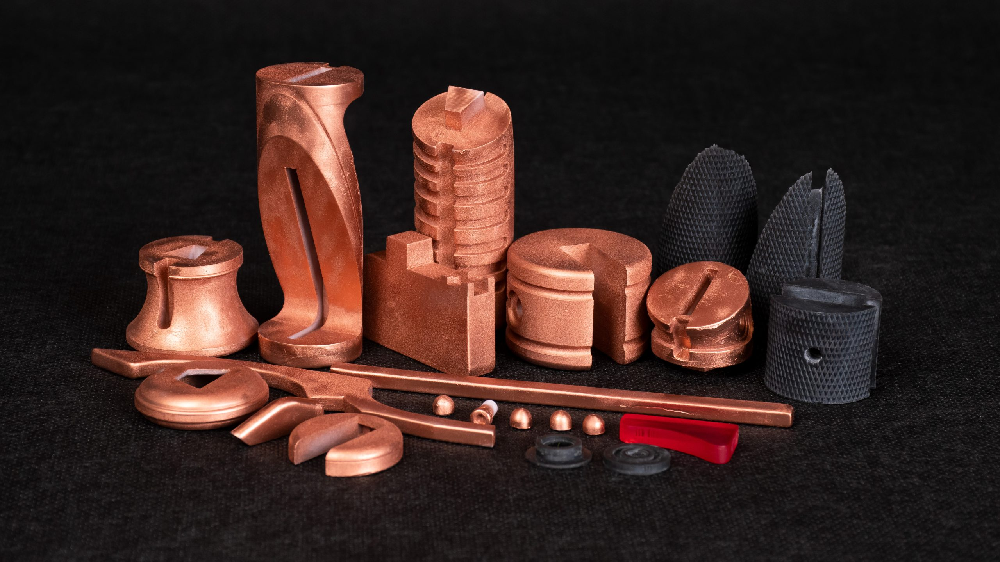
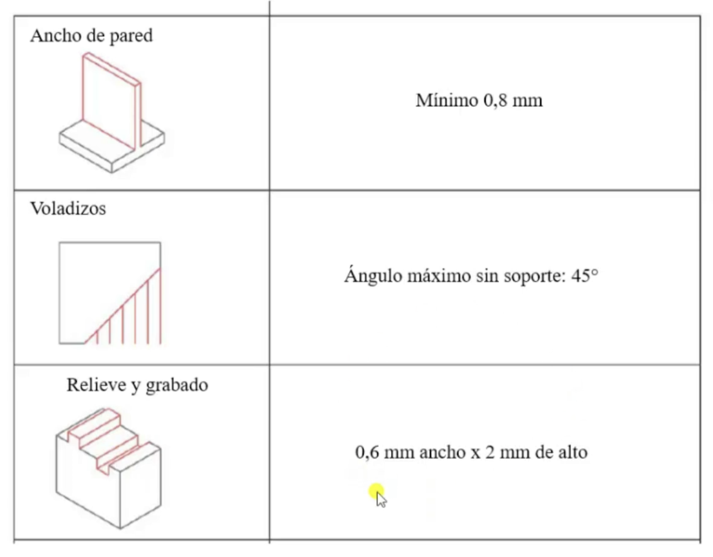
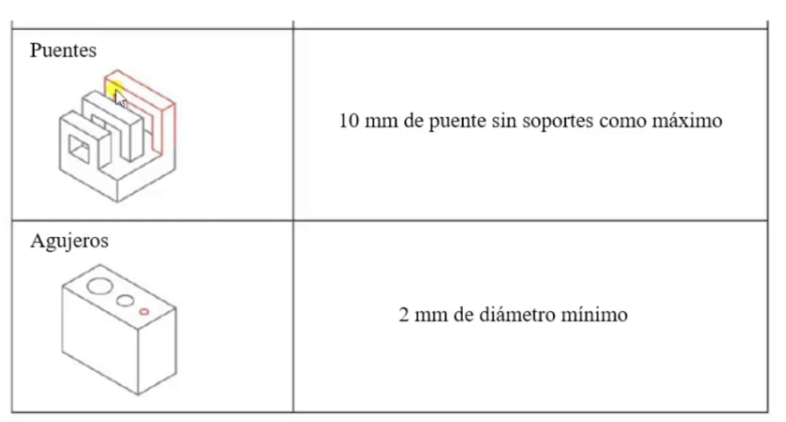
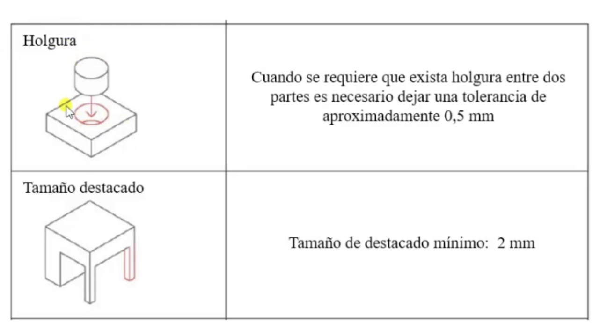
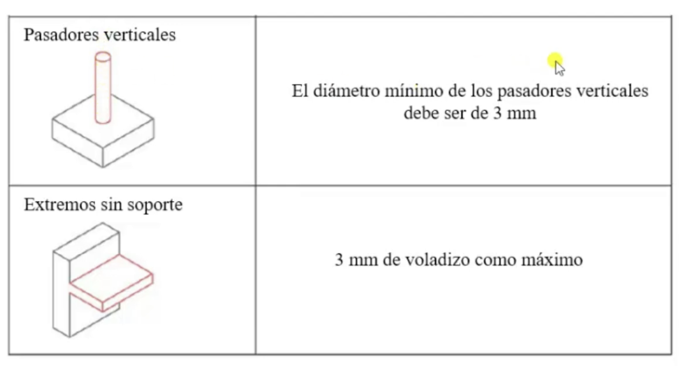

# Fabricació additiva 

## Introducció a la fabricació additiva: tecnologies i aplicacions

<figure markdown="span">
    { width="600" }
    <figcaption>Foto de Fabacademy: https://fabacademy.org/2026/classes/scanning_printing/index.html</figcaption>
</figure>

La fabricació additiva consisteix a "afegir" material. A diferència de la substractiva, com per exemple el tornejat o la conformació per deformació plàstica com el laminatge. 

<figure markdown="span">
    { width="600" }
    <figcaption>Foto de Fabacademy: https://fabacademy.org/2026/classes/scanning_printing/index.html</figcaption>
</figure>

L'impressió 3d concretament, és la fabricació d'objectes tridimensionals mitjançant impressores 3d, aplicant capa per capa els materials d'impressió. La forma d'aplicació de les capes pot canviar depenent del tipus de tecnologia que s'està aplicant, però, la filosofia n'és la mateixa: Una model 3d (CAD) es divideix en capes i la impressió de cadascuna d'aquestes serveix per l'aplicació de la següent. 

<figure markdown="span">
    { width="600" }
    <figcaption>Foto de Juan Manuel Vallejos: https://youtu.be/1uPXr-qcN88?si=Z02xiDveUOKyz1uW</figcaption>
</figure>

En aquest context, la manufactura additiva és la més adeqüada per dissenys complexes de baixa producció els quals altres processos no poden produir. També és d'una gran utilitat quan escau un prototip ràpid i únic.

<!--<video width="600" controls>
  <source src="./img/ilefante.mp4" type="video/mp4">
</video>-->

<figure markdown="span">
    { width="600" }
    <figcaption>Producció pròpia</figcaption>
</figure>

## Tecnologies d'impressió 3D

<figure markdown="span">
    { width="600" }
    <figcaption>Foto de Fabacademy: https://fabacademy.org/2026/classes/scanning_printing/index.html</figcaption>
</figure>

<figure markdown="span">
    { width="600" }
    <figcaption>Foto de Fabacademy: https://fabacademy.org/2026/classes/scanning_printing/index.html</figcaption>
</figure>

Generalment es treballarà en màquines de tres eixos, tot i que n'existeixen que tenen més. 

### FDM

En aquest procés, es carrega una bobina de filament en la impressora i s'alimenta a través del capçal d'extrussió una volta la boquilla ha assolit la temperatura desitjada per la fusió del material, un motor mou el filament a través de la boquilla, la qual fon el polímer. Una vegada la capa s'ha finalitzat, o bé el llit es mou cap avall per deixar espai per la següent capa o bé el capçal es mou cap amunt.

<figure markdown="span">
    { width="600" }
    <figcaption>Foto de Fabacademy: https://fabacademy.org/2026/classes/scanning_printing/index.html</figcaption>
</figure>

<figure markdown="span">
    { width="600" }
    <figcaption>Foto de Fabacademy: https://fabacademy.org/2026/classes/scanning_printing/index.html</figcaption>
</figure>

Aquest procés té una producció lenta en comparació a la resta. Hi ha regles de disseny que cal seguir:

<figure markdown="span">
    { width="600" }
    <figcaption>Foto de Fabacademy: https://fabacademy.org/2026/classes/scanning_printing/index.html</figcaption>
</figure>

<figure markdown="span">
    { width="600" }
    <figcaption>Foto de Fabacademy: https://fabacademy.org/2026/classes/scanning_printing/index.html</figcaption>
</figure>

<figure markdown="span">
    { width="600" }
    <figcaption>Foto de Fabacademy: https://fabacademy.org/2026/classes/scanning_printing/index.html</figcaption>
</figure>

<figure markdown="span">
    { width="600" }
    <figcaption>Foto de Fabacademy: https://fabacademy.org/2026/classes/scanning_printing/index.html</figcaption>
</figure>

### SLA

<figure markdown="span">
    { width="600" }
    <figcaption>Foto de Fabacademy: https://fabacademy.org/2026/classes/scanning_printing/index.html</figcaption>
</figure>

Aquest mètode fa servir resines termoestables, les quals no es poden reutilitzar, cal curar-les una vegada finalitzat el procés d'impressió.

<figure markdown="span">
    { width="600" }
    <figcaption>Foto de Fabacademy: https://fabacademy.org/2026/classes/scanning_printing/index.html</figcaption>
</figure>

<figure markdown="span">
    { width="600" }
    <figcaption>Foto de Fabacademy: https://fabacademy.org/2026/classes/scanning_printing/index.html</figcaption>
</figure>

<figure markdown="span">
    { width="600" }
    <figcaption>Foto de Fabacademy: https://fabacademy.org/2026/classes/scanning_printing/index.html</figcaption>
</figure>

30 fraus d'inclinació, perquè el líquid puga caure a la piscina

### SLS 

    <iframe src="https://www.youtube.com/embed/FiMQ8kG7394?si=_92RDKiM4-zjBRcs" title="YouTube video player" frameborder="0" allow="accelerometer; autoplay; clipboard-write; encrypted-media; gyroscope; picture-in-picture; web-share" referrerpolicy="strict-origin-when-cross-origin" allowfullscreen style="position: absolute; top: 0; left: 0; width: 100%; height: 100%;"></iframe>

    <iframe src="https://www.youtube.com/embed/Fx3XwzGwQSY?si=DEEAc_5jt8xG6p67" title="YouTube video player" frameborder="0" allow="accelerometer; autoplay; clipboard-write; encrypted-media; gyroscope; picture-in-picture; web-share" referrerpolicy="strict-origin-when-cross-origin" allowfullscreen style="position: absolute; top: 0; left: 0; width: 100%; height: 100%;"></iframe>

### Materials usats

<figure markdown="span">
    { width="600" }
    <figcaption>Foto de SIMPLIFY3D: https://www.simplify3d.com/resources/materials-guide/</figcaption>
</figure>

<figure markdown="span">
    { width="600" }
    <figcaption>Foto de SIMPLIFY3D: https://www.simplify3d.com/resources/materials-guide/</figcaption>
</figure>

    <iframe src="https://www.youtube.com/embed/9B-HGhN_jCk?si=Is07oqxZEMNJ_LOo" title="YouTube video player" frameborder="0" allow="accelerometer; autoplay; clipboard-write; encrypted-media; gyroscope; picture-in-picture; web-share" referrerpolicy="strict-origin-when-cross-origin" allowfullscreen style="position: absolute; top: 0; left: 0; width: 100%; height: 100%;"></iframe>

## Processament i postprocessament de peces additives

Es pot treballar amb paper de vider per millorar acabats i es pot pintar o be amb pintura o acetona que donarà un acabat brillant.

<figure markdown="span">
    { width="600" }
    <figcaption>Foto de Fabacademy: https://fabacademy.org/2026/classes/scanning_printing/index.html</figcaption>
</figure>

Alternativament, es pot crear un electroplatejat, aquest consisteix en el recobriment de la peça plàstica amb un material metàl·lic mitjançant el procés d'electròlisi.

<figure markdown="span">
    { width="600" }
    <figcaption>Foto de Prusa Research: https://blog.prusa3d.com/how-hard-can-electroplating-3d-prints-be_92939/</figcaption>
</figure>

### Optimització i validació de peces

<figure markdown="span">
    { width="600" }
    <figcaption>Foto de Juan Manuel Vallejos: https://youtu.be/e6K11gD296s?si=RiIuVc3CInFobMKH</figcaption>
</figure>

<figure markdown="span">
    { width="600" }
    <figcaption>Foto de Juan Manuel Vallejos: https://youtu.be/e6K11gD296s?si=RiIuVc3CInFobMKH</figcaption>
</figure>

<figure markdown="span">
    { width="600" }
    <figcaption>Foto de Juan Manuel Vallejos: https://youtu.be/e6K11gD296s?si=RiIuVc3CInFobMKH</figcaption>
</figure>

<figure markdown="span">
    { width="600" }
    <figcaption>Foto de Juan Manuel Vallejos: https://youtu.be/e6K11gD296s?si=RiIuVc3CInFobMKH</figcaption>
</figure>

    <iframe src="https://www.youtube.com/embed/uTfwTPKnq4I?si=vIj1NpyZPMUc-egF" title="YouTube video player" frameborder="0" allow="accelerometer; autoplay; clipboard-write; encrypted-media; gyroscope; picture-in-picture; web-share" referrerpolicy="strict-origin-when-cross-origin" allowfullscreen style="position: absolute; top: 0; left: 0; width: 100%; height: 100%;"></iframe>

Les peces poden fallar per moltes causes. Potser el plàstic no ha adherit bé a la base (com a la foto de l'esquerra) o ha adherit massa bé (com a la foto del mig)

## Bibliografia

- https://youtu.be/1uPXr-qcN88?si=XrOl_kbqfHAfZhBP
- https://youtu.be/lLMTyAHrItM?si=VsbAnZSTsz_TvBQF
- https://youtu.be/OUUXpF2-DRU?si=ZTHUQWpPsxqoH9sP
- https://youtu.be/hkIEhsvKtFg?si=TdY-FBNosRDgjueF
- https://youtu.be/hkIEhsvKtFg?si=TdY-FBNosRDgjueF
- https://youtu.be/e6K11gD296s?si=V3ACQMQpC10lnBJ1
- https://youtu.be/87Ms03E8oj4?si=ioMebX0tGbIfykd-
- https://youtu.be/jWiBP4O7o8M?si=nz1EiSuEdE6nFiGB
- https://youtu.be/gY9UAnKx9ow?si=WsgTRy4I8Lp4Tjdh
- https://youtu.be/uTfwTPKnq4I?si=6wLnMD3WVvkagB9m
- https://youtu.be/hQHFh7Bi5LA?si=2VU7YeI4r4ENklXg
- https://fabacademy.org/2026/classes/scanning_printing/index.html
- https://www.simplify3d.com/resources/materials-guide/
- https://learn.fablabbcn.org/fabacademy/classes/05-3DScanningandPrinting/
- https://youtu.be/FiMQ8kG7394?si=VF1pszNYEDQ_To6Z
- https://youtu.be/Fx3XwzGwQSY?si=DEEAc_5jt8xG6p67
- https://youtu.be/9B-HGhN_jCk?si=Is07oqxZEMNJ_LOo