# Fabricació additiva 

## Introducció a la fabricació additiva: tecnologies i aplicacions

<figure markdown="span">
    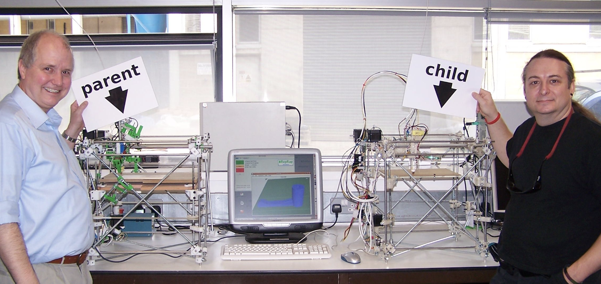{ width="600" }
    <figcaption>Foto de Fabacademy: https://fabacademy.org/2026/classes/scanning_printing/index.html</figcaption>
</figure>

La fabricació additiva consisteix a "afegir" material. A diferència de la substractiva, com per exemple el tornejat o la conformació per deformació plàstica com el laminatge. 

<!--<video width="600" controls>
  <source src="./img/ilefante.mp4" type="video/mp4">
</video>-->

<figure markdown="span">
    { width="600" }
    <figcaption>Producció pròpia</figcaption>
</figure>

## Tecnologies d'impressió 3D

<figure markdown="span">
    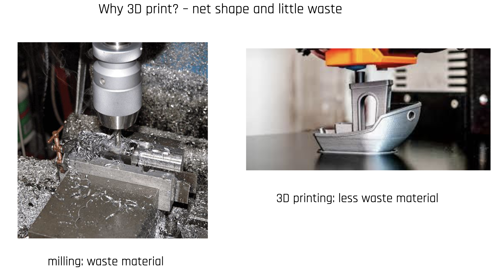{ width="600" }
    <figcaption>Foto de Fabacademy: https://fabacademy.org/2026/classes/scanning_printing/index.html</figcaption>
</figure>

<figure markdown="span">
    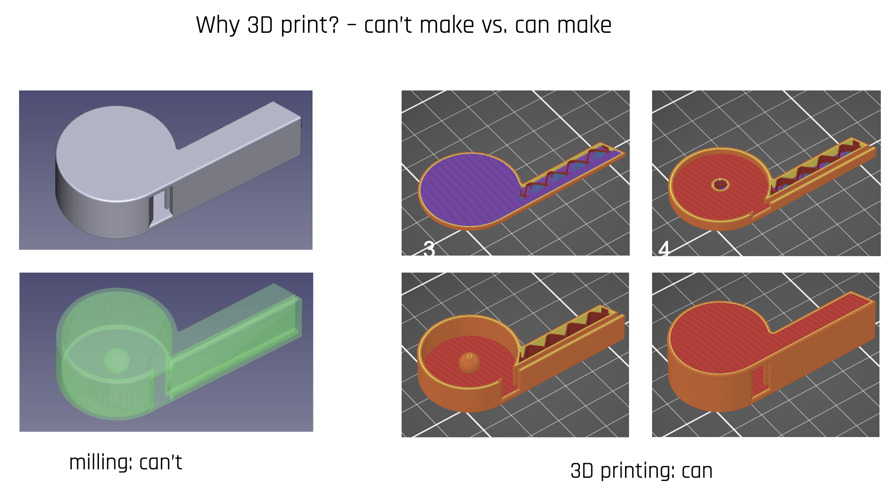{ width="600" }
    <figcaption>Foto de Fabacademy: https://fabacademy.org/2026/classes/scanning_printing/index.html</figcaption>
</figure>

Generalment es treballarà en màquines de tres eixos, tot i que n'existeixen que tenen més. 

### FDM

<figure markdown="span">
    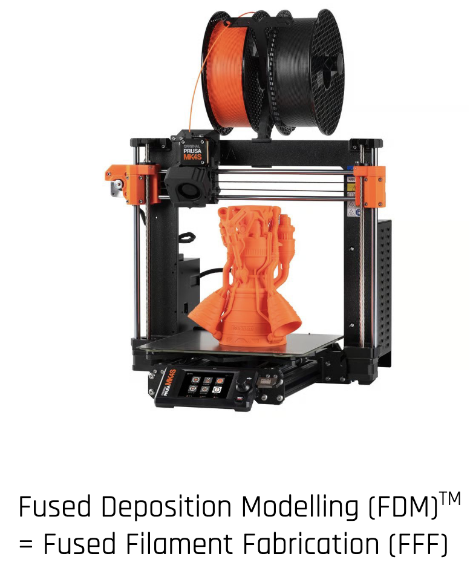{ width="600" }
    <figcaption>Foto de Fabacademy: https://fabacademy.org/2026/classes/scanning_printing/index.html</figcaption>
</figure>

<figure markdown="span">
    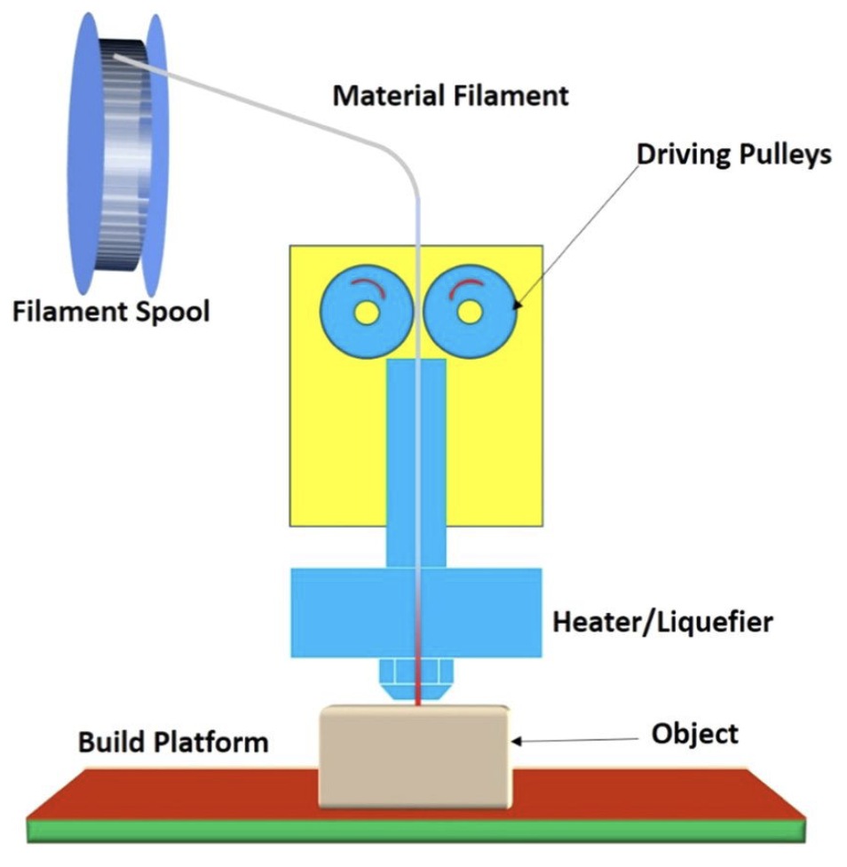{ width="600" }
    <figcaption>Foto de Fabacademy: https://fabacademy.org/2026/classes/scanning_printing/index.html</figcaption>
</figure>

Aquest procés té una producció lenta en comparació a la resta. Hi ha regles de disseny que cal seguir:

<figure markdown="span">
    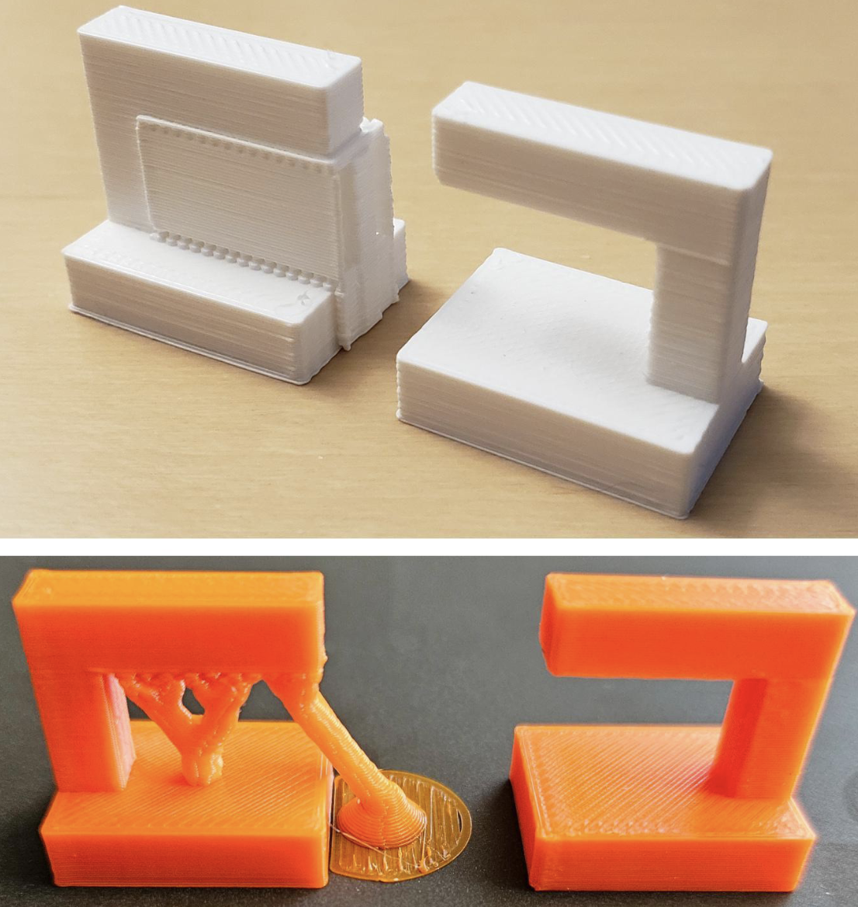{ width="600" }
    <figcaption>Foto de Fabacademy: https://fabacademy.org/2026/classes/scanning_printing/index.html</figcaption>
</figure>

<figure markdown="span">
    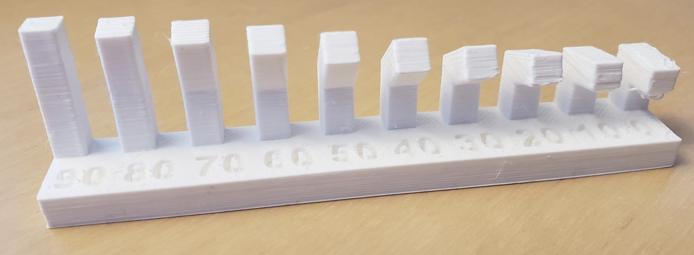{ width="600" }
    <figcaption>Foto de Fabacademy: https://fabacademy.org/2026/classes/scanning_printing/index.html</figcaption>
</figure>

<figure markdown="span">
    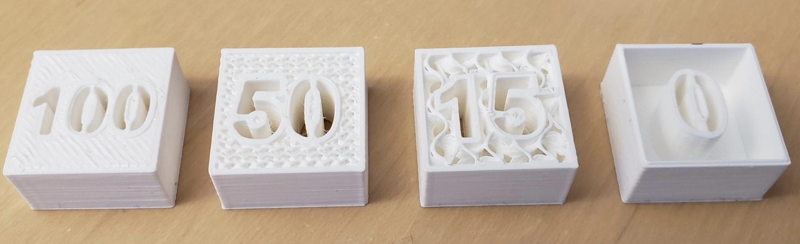{ width="600" }
    <figcaption>Foto de Fabacademy: https://fabacademy.org/2026/classes/scanning_printing/index.html</figcaption>
</figure>

<figure markdown="span">
    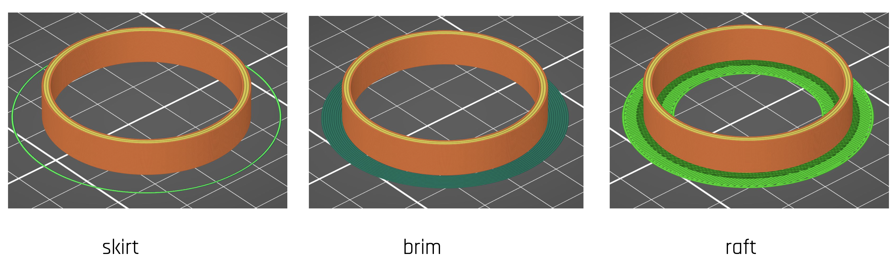{ width="600" }
    <figcaption>Foto de Fabacademy: https://fabacademy.org/2026/classes/scanning_printing/index.html</figcaption>
</figure>

### SLA

<figure markdown="span">
    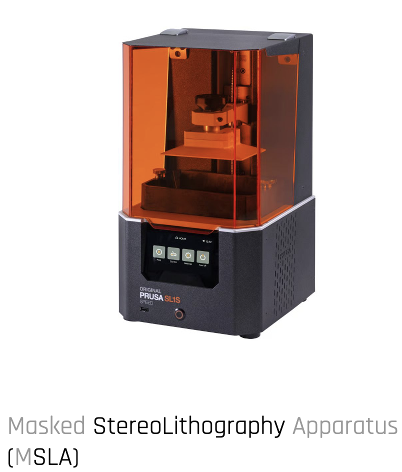{ width="600" }
    <figcaption>Foto de Fabacademy: https://fabacademy.org/2026/classes/scanning_printing/index.html</figcaption>
</figure>

Aquest mètode fa servir resines termoestables, les quals no es poden reutilitzar, cal curar-les una vegada finalitzat el procés d'impressió.

<figure markdown="span">
    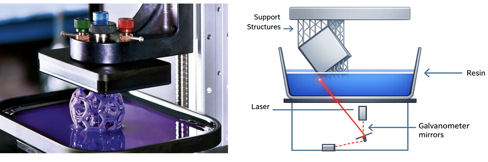{ width="600" }
    <figcaption>Foto de Fabacademy: https://fabacademy.org/2026/classes/scanning_printing/index.html</figcaption>
</figure>

<figure markdown="span">
    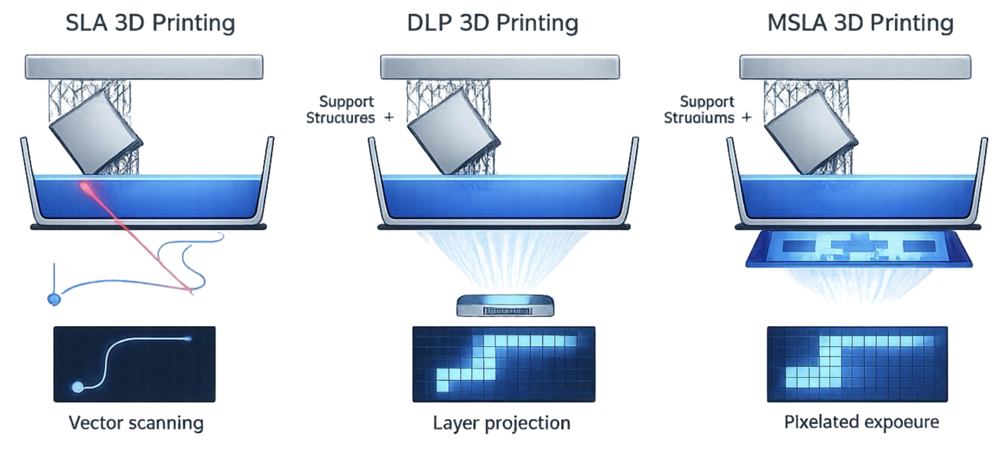{ width="600" }
    <figcaption>Foto de Fabacademy: https://fabacademy.org/2026/classes/scanning_printing/index.html</figcaption>
</figure>

<figure markdown="span">
    { width="600" }
    <figcaption>Foto de Fabacademy: https://fabacademy.org/2026/classes/scanning_printing/index.html</figcaption>
</figure>

30 fraus d'inclinació, perquè el líquid puga caure a la piscina

### SLS 

### Materials usats

<figure style="display: flex; flex-direction: column; align-items: center; gap: 0.5rem;">
  

    
    
  

  <figcaption>Foto de SIMPLIFY3D: https://www.simplify3d.com/resources/materials-guide/</figcaption>
</figure>

## Processament i postprocessament de peces additives

Es pot treballar amb paper de vider per millorar acabats i es pot pintar o be amb pintura o acetona que donarà un acabat brillant.

<figure markdown="span">
    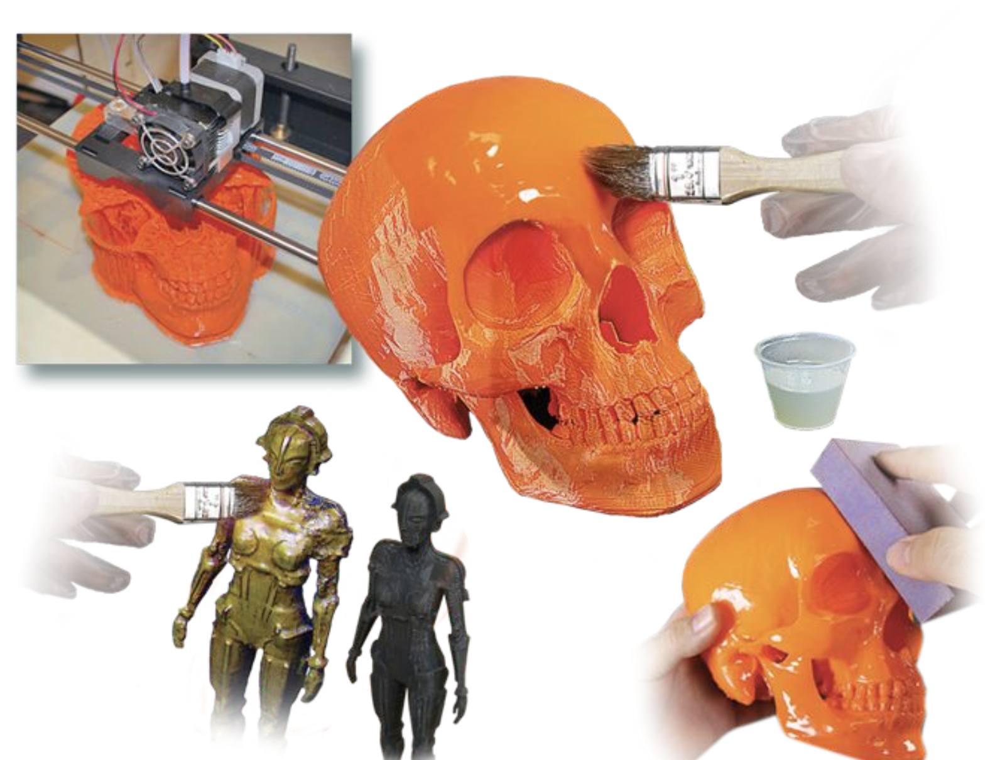{ width="600" }
    <figcaption>Foto de Fabacademy: https://fabacademy.org/2026/classes/scanning_printing/index.html</figcaption>
</figure>

### Paràmetres

### Optimització i validació de peces

<figure markdown="span">
    { width="600" }
    <figcaption>Foto de Fabacademy: https://fabacademy.org/2026/classes/scanning_printing/index.html</figcaption>
</figure>

Les peces poden fallar per moltes causes. Potser el plàstic no ha adherit bé a la base (com a la foto de l'esquerra) o ha adherit massa bé (com a la foto del mig)

