# Processos de mecanització i control numèric (CNC)

## Generalitats de la conformació per arrancada de material

Els processos d'arrancada de material consisteixen a la retirada de material de la superfície d'un 'totxo' d'una manera controlada. Aquesta retirada pot realitzar-se mitjançant un procés químic o físic. Així doncs, és possible classificar-los en dos grups principals:

- Processos d'arrancada de material: On s'usa una ferramenta de tall.
- Processos no convencionals: Processos fisicoquímics en ausència d'una ferramenta de tall.

<figure markdown="span">
    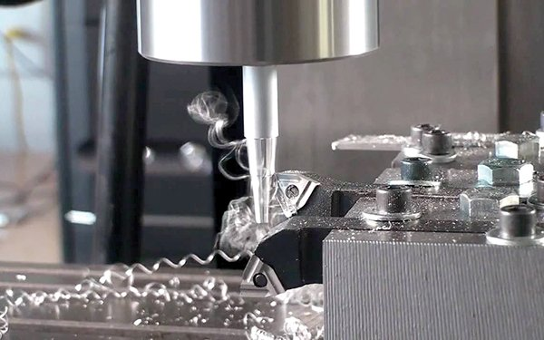{ width="600" }
    <figcaption>Foto de FerrePro: https://ferrepro.mx/mecanizado-por-arranque-de-viruta/</figcaption>
</figure>

Respecte de l'arrancada de material, s'ha de seguir la seüent lògica:

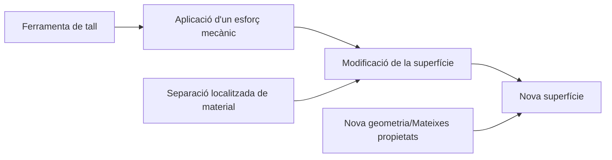
``` mermaid
graph LR
  A[Aplicació d'un esforç mecànic] --> B[Modificació de la superfície];
  B --> C[Nova superfície];
  D[Ferramenta de tall] --> A;
  E[Separació localitzada de material] --> B;
  F[Nova geometria/Mateixes propietats] --> C;
```

En aquest flux de traball, l'arrancada està influenciada per:


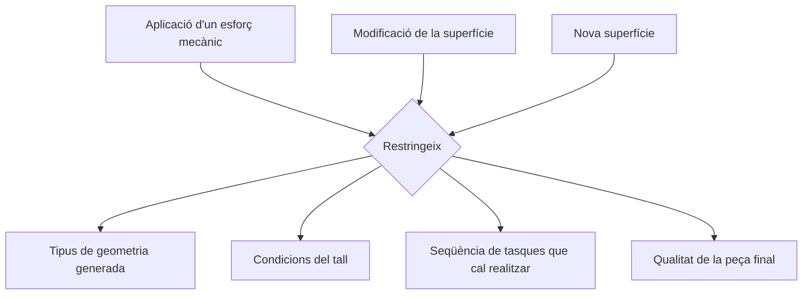
``` mermaid
graph TB
  A[Aplicació d'un esforç mecànic] --> D{Restringeix};
  B[Modificació de la superfície] --> D;
  C[Nova superfície] --> D;
  D --> E[Tipus de geometria generada];
  D --> F[Condicions del tall];
  D --> G[Seqüència de tasques que cal realitzar];
  D --> H[Qualitat de la peça final];
```

### Conceptes bàsics 

Dins de l'arrancada, cal destacar les característiques següents:

- Es tracta d'un procés on es realitzen canvis de forma prou significatius en comparació a la peça base
- Genera desperdici en forma de viruta
- S'obtenen peces acabades, les quals no requereixen postprocesat
- S'assoleixen toleràncies i acabats superficials prou superiors a la resta de processos de conformat
- Dona la possibilitat d'obtindre tot tipus de geometria, tant senzilles com complexes

***Què caracteritza el procés d'arrancada?***

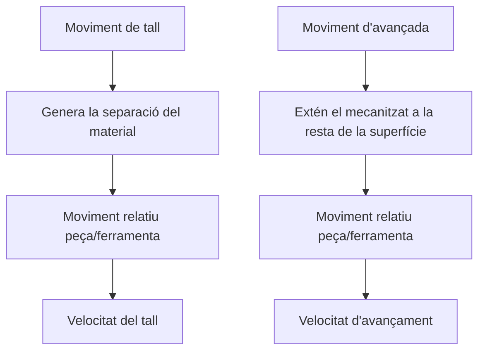
``` mermaid
graph TB
    A["Moviment de tall"]
    A --> B["Genera la separació del material"]
    B --> C["Moviment relatiu peça/ferramenta"]
    C --> D["Velocitat del tall"]

    E["Moviment d'avançada"]
    E --> F["Extén el mecanitzat a la resta de la superfície"]
    F --> G["Moviment relatiu peça/ferramenta"]
    G --> H["Velocitat d'avançament"]
```
<figure markdown="span">
    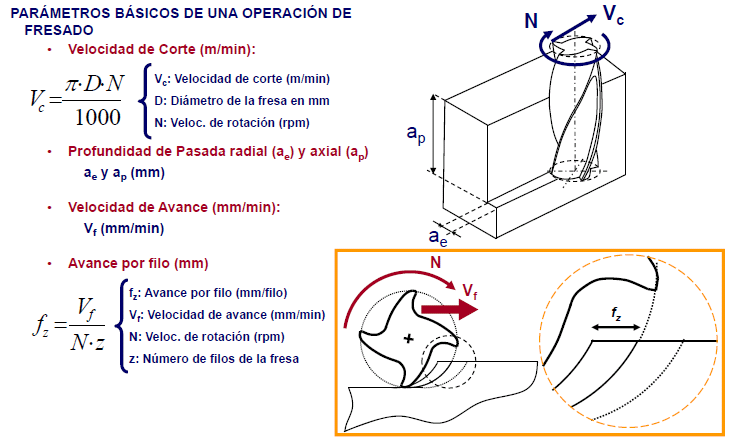{ width="600" }
    <figcaption>Foto de Mundo Fresadora: https://mundofresadora.blogspot.com/2016/01/uso-y-aplicaciones-especificas-de-las.html</figcaption>
</figure>

El material arrancat s'anomena viruta

<figure markdown="span">
    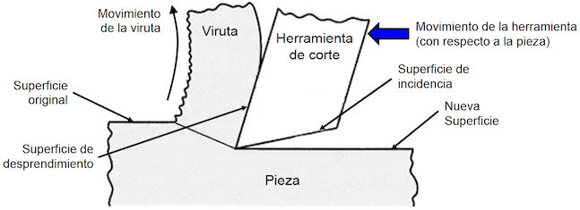{ width="800" }
    <figcaption>Foto de Ingenierizando: https://www.ingenierizando.com/fabricacion/viruta/</figcaption>
</figure>

<figure markdown="span">
    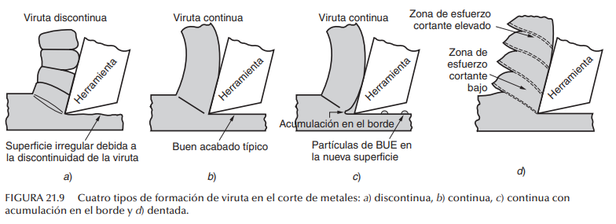{ width="800" }
    <figcaption>Foto de ingenieria mecanica blog: https://ingenieriamecanicacol.blogspot.com/2023/05/teoria-del-maquinado-de-metales.html</figcaption>
</figure>

<figure markdown="span">
    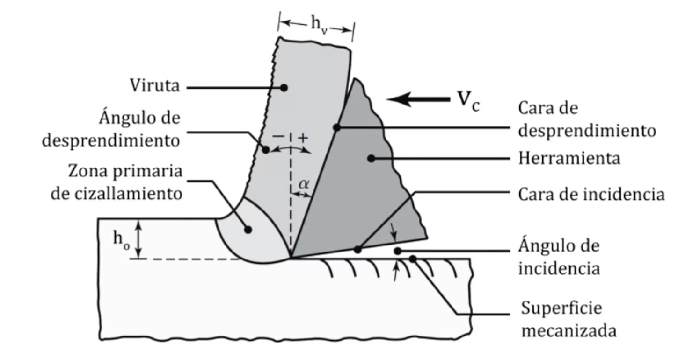{ width="800" }
    <figcaption>Foto de Universitat Politècnica de València: https://youtu.be/ldK49aQk01k?si=yGAJzxiSOeM9M4SH</figcaption>
</figure>

***Efectes principals del procés de tall***

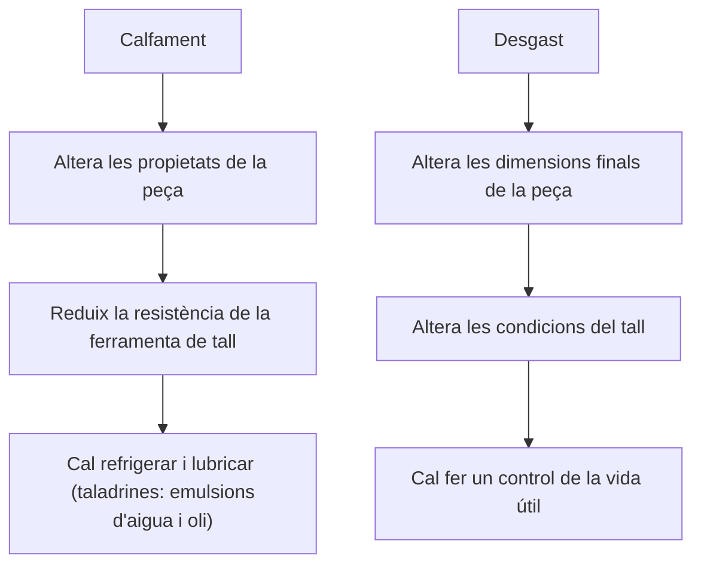
``` mermaid
graph TB
    A["Calfament"]
    A --> B["Altera les propietats de la peça"]
    B --> C["Reduix la resistència de la ferramenta de tall"]
    C --> D["Cal refrigerar i lubricar <br> (taladrines: emulsions d'aigua i oli)"]

    E["Desgast"]
    E --> F["Altera les dimensions finals de la peça"]
    F --> G["Altera les condicions del tall"]
    G --> H["Cal fer un control de la vida útil"]
```

### Eines de tall

Hi ha dos tipus principals de tipologia de la ferramenta:

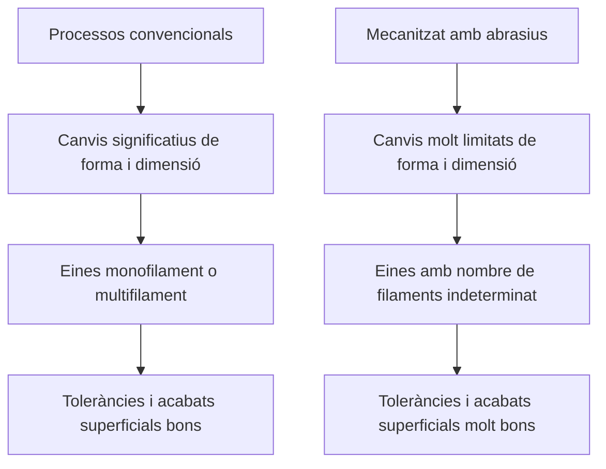
``` mermaid
graph TB
    A["Processos convencionals"]
    A --> B["Canvis significatius de forma i dimensió"]
    B --> C["Eines monofilament o multifilament"]
    C --> D["Toleràncies i acabats superficials bons"]

    E["Mecanitzat amb abrasius"]
    E --> F["Canvis molt limitats de forma i dimensió"]
    F --> G["Eines amb nombre de filaments indeterminat"]
    G --> H["Toleràncies i acabats superficials molt bons"]
```

## Màquines eina

Els processos d'arrancada convencionals es classifiquen en els següents:

### Fresadora

<figure markdown="span">
    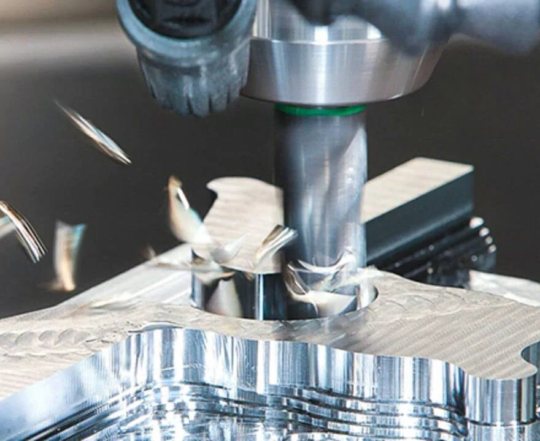{ width="600" }
    <figcaption>Foto de Zintilon: https://www.zintilon.com/es/blog/metal-milling-vs-wood-milling/</figcaption>
</figure>

<figure markdown="span">
    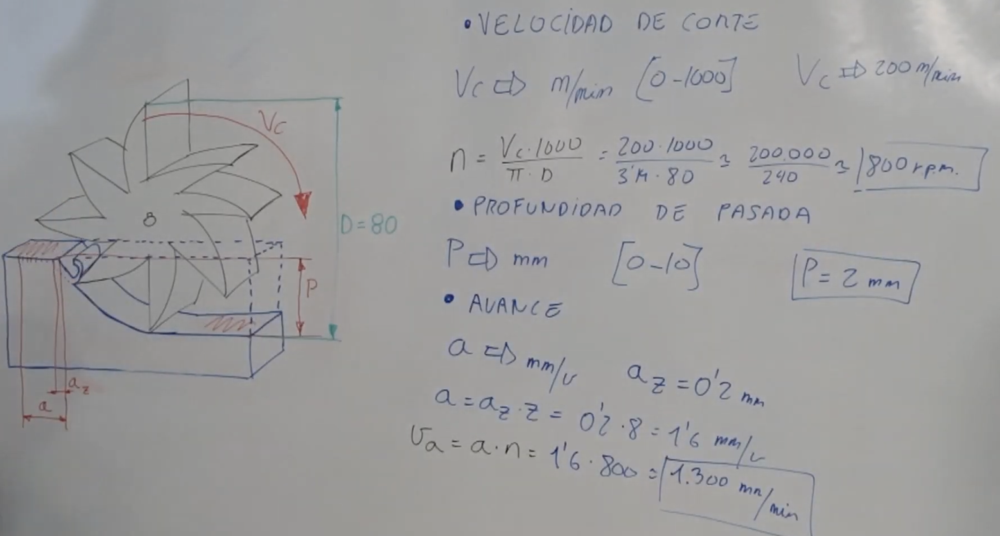{ width="600" }
    <figcaption>Foto de Universitat Politècnica de València: https://youtu.be/Ls9MNu8CA6c?si=fyLtfczAcwVG0Erf</figcaption>
</figure>

El procés de fresat consisteix a arrancar material per generar geometries prismàtiques mitjançant la utilització d'una eina multifilament. Aquesta eina multifilament gira sobre el seu mateix eix i el moviment d'avançada pot ser de l'eina sobra la peça fixa o viceversa. 
Existeixen dos tipus d'actuadors, els quals s'anomenen freses. Per una banda hi ha freses monobloc i per l'altra de plaquetes.

<figure markdown="span">
    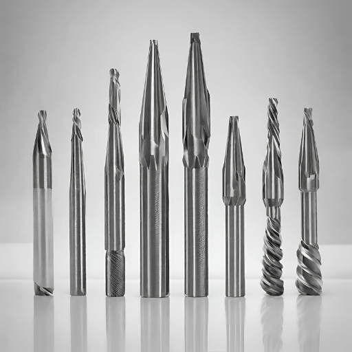{ width="400" }
    <figcaption>Foto de Sendmill: https://ssendmill.com/es/tipos-de-fresas/</figcaption>
</figure>

<figure markdown="span">
    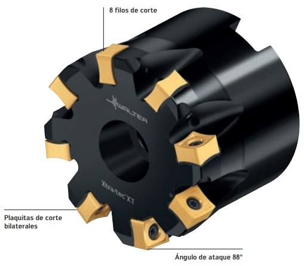{ width="400" }
    <figcaption>Foto de IZARO: https://www.izaro.com/fresa-de-planear-con-plaquitas-de-corte-pequenas/c-1602748688/</figcaption>
</figure>

<figure markdown="span">
    { width="600" }
    <figcaption>Foto de Universitat Politècnica de València: https://youtu.be/Ls9MNu8CA6c?si=fyLtfczAcwVG0Erf</figcaption>
</figure>

Les monobloc són generalment més xicotetes i són utilitzades per realitzar peces amb poc detall geomètric. Contrariament, les de plaquetes intercanviables s'utilitzen per realitzar una gran arrancada de material. 
Les plaquetes intercanviables, com bé indica el seu nom, permeten l'ús de la mateixa fresa amb canvi de filament mentre que les monobloc només poden utilitzar-se per l'ús pel que han estat conformades.

Existeixen dos classificacions per determinar el treball de fresat. Per una banda es pot determinar en funció de la subjecció de la ferramenta, i per l'altra en funció del moviment de tall:

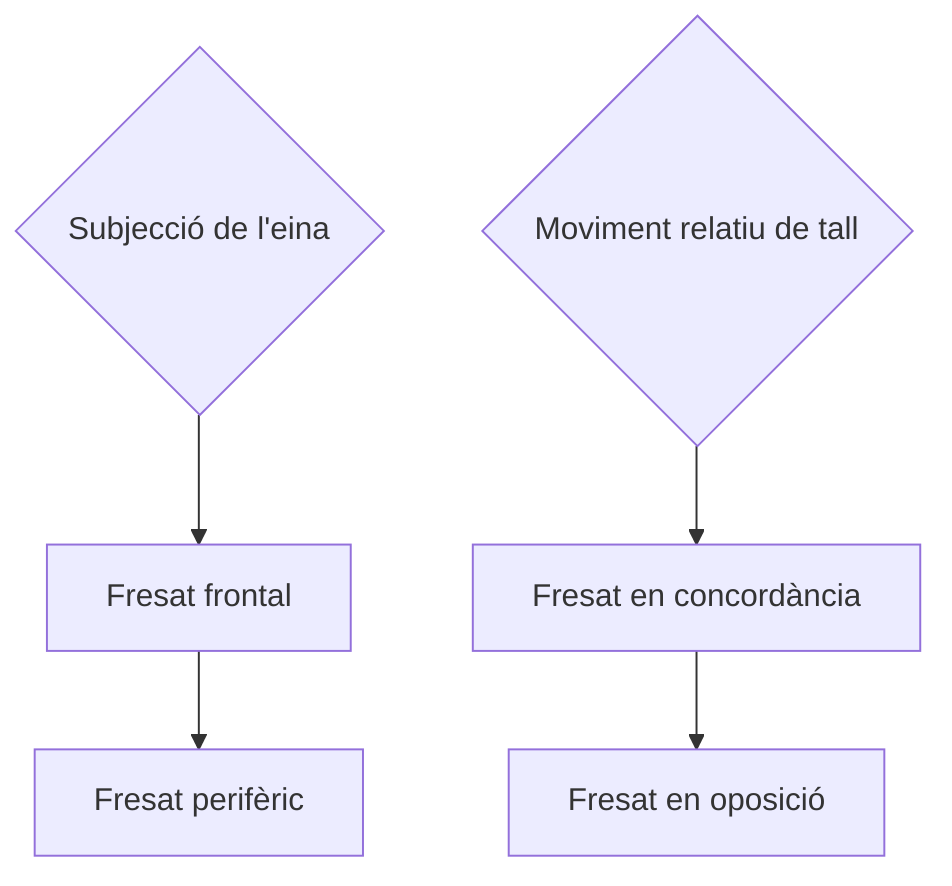
``` mermaid
graph TB
    A{"Subjecció de l'eina"}
    A --> B["Fresat frontal"]
    B --> C["Fresat perifèric"]

    E{"Moviment relatiu de tall"}
    E --> F["Fresat en concordància"]
    F --> G["Fresat en oposició"]
```

<figure markdown="span">
    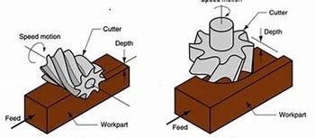{ width="600" }
    <figcaption>Foto de DADESIN: https://www.dadesin.com/es/news/face-vs-peripheral-milling.html</figcaption>
</figure>

<figure markdown="span">
    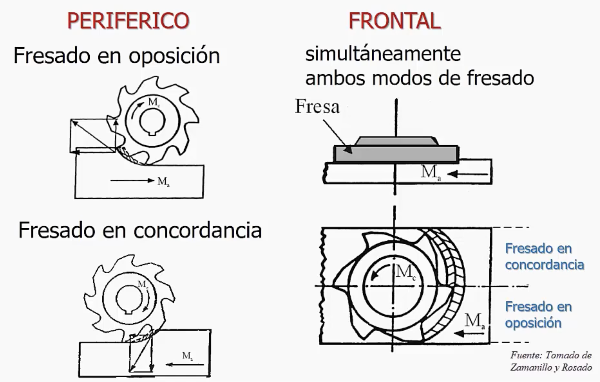{ width="600" }
    <figcaption>Foto de Universitat Politècnica de València: https://youtu.be/Ls9MNu8CA6c?si=fyLtfczAcwVG0Erf</figcaption>
</figure>

El fresat perifèric limita prou les profonditats de tall assolibles, i limita la llibertat d'actuació en algunes parts de la peça.
Des del punt de vista del moviment de tall, és possible classificar entre tall en oposició i en concordància. El fresat en oposició pot causar un desgast excessiu al filament de la fresa per una falta de secció de tall inicial. En el fresat en concordància les vibracions són majors i poden provocar una vida util de l'eina inferior. Amb respecte dels acabats assolits, en el tall a concordància són de major qualitat, malgrat que per metalls més durs es recomanable utilitzar el tall en oposició.

<figure markdown="span">
    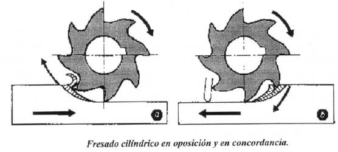{ width="500" }
    <figcaption>Foto de Universidade da Coruña: https://lim.ii.udc.es/docencia/din-proind/docs/respuestas/p75.htm</figcaption>
</figure>

Per mecanitzar, és impertaiu fixar bé la peça al llit. Existeixen diverses maneres de fer-ho. 
Per una banda es pot fer mitjançant brides.

<figure markdown="span">
    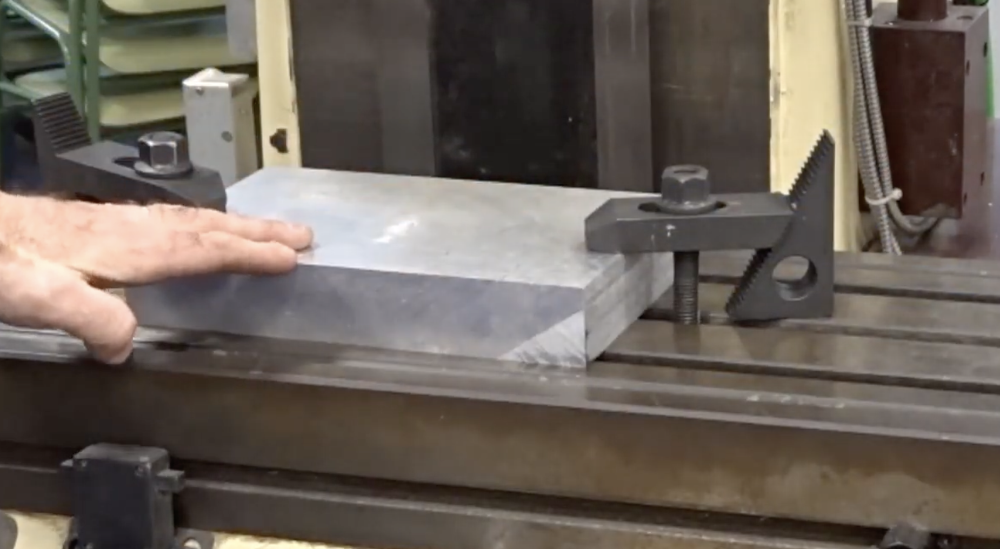{ width="600" }
    <figcaption>Foto de Universitat Politècnica de València: https://youtu.be/d4w4ii1umqw?si=86gxL-KaDs7augJD</figcaption>
</figure>

Per un altra, les brides baixes, aquestes deixen tota la superfície superior lliure per poder planejar.

<figure markdown="span">
    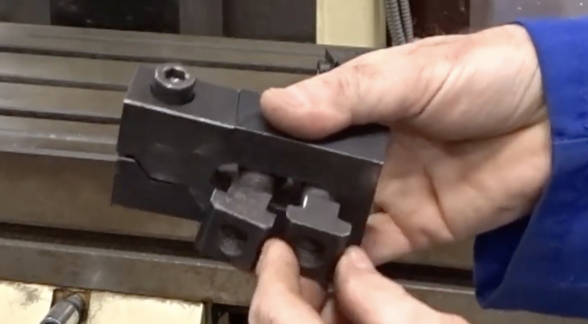{ width="600" }
    <figcaption>Foto de Universitat Politècnica de València: https://youtu.be/d4w4ii1umqw?si=86gxL-KaDs7augJD</figcaption>
</figure>
<figure markdown="span">
    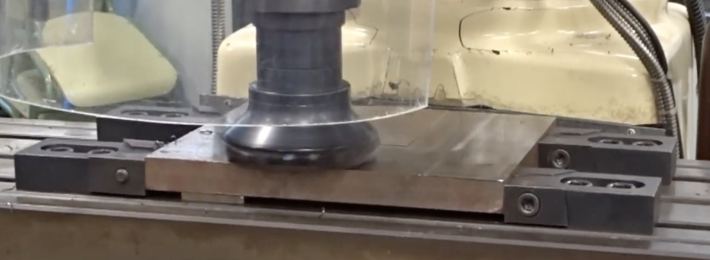{ width="600" }
    <figcaption>Foto de Universitat Politècnica de València: https://youtu.be/d4w4ii1umqw?si=86gxL-KaDs7augJD</figcaption>
</figure>

També, es poden utilitzar mordasses. Poden haver-hi hidràuliques o mecàniques.

<figure markdown="span">
    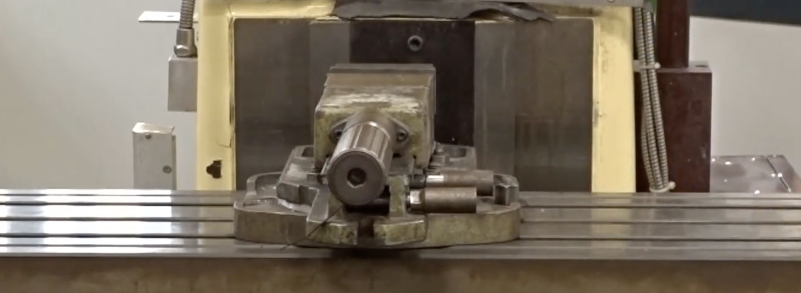{ width="600" }
    <figcaption>Foto de Universitat Politècnica de València: https://youtu.be/d4w4ii1umqw?si=86gxL-KaDs7augJD</figcaption>
</figure>
<figure markdown="span">
    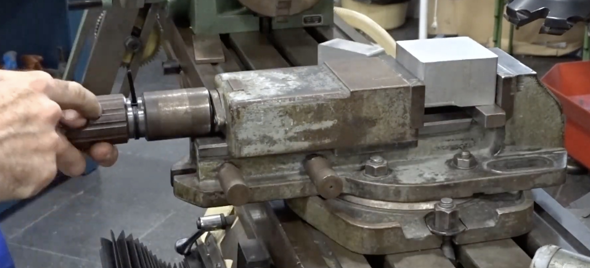{ width="600" }
    <figcaption>Foto de Universitat Politècnica de València: https://youtu.be/d4w4ii1umqw?si=86gxL-KaDs7augJD</figcaption>
</figure>
<figure markdown="span">
    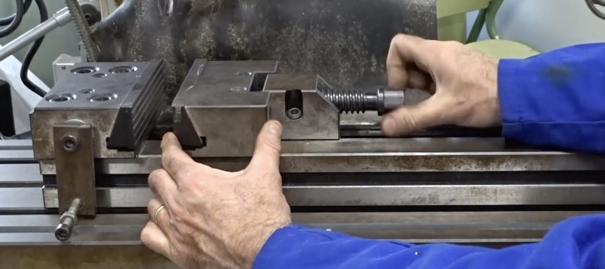{ width="600" }
    <figcaption>Foto de Universitat Politècnica de València: https://youtu.be/d4w4ii1umqw?si=86gxL-KaDs7augJD</figcaption>
</figure>
<figure markdown="span">
    { width="600" }
    <figcaption>Foto de Universitat Politècnica de València: https://youtu.be/d4w4ii1umqw?si=86gxL-KaDs7augJD</figcaption>
</figure>

També és possible fer ús d'un plat divisor universal de tres garres. Aquest últim només s'utilitza per peces de revolució. Pot utilitzar-se de manera vertical o horitzontal.

<figure markdown="span">
    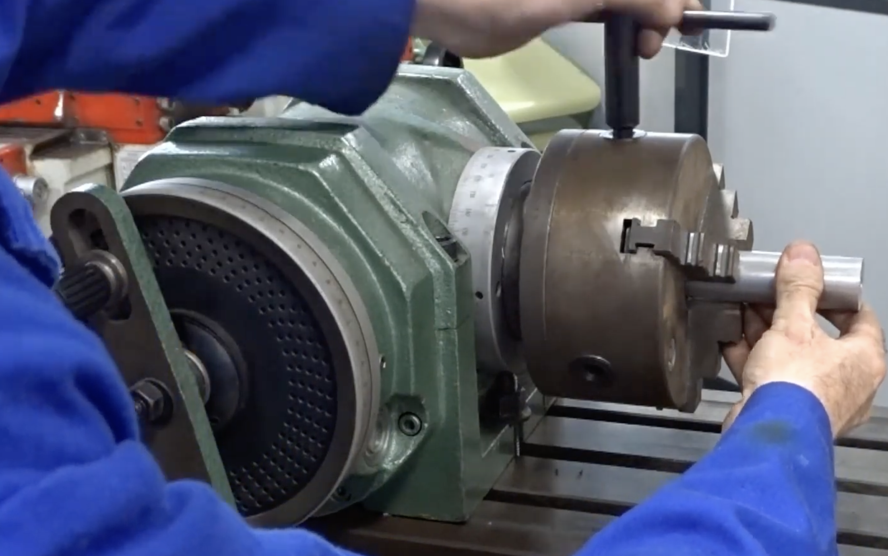{ width="600" }
    <figcaption>Foto de Universitat Politècnica de València: https://youtu.be/d4w4ii1umqw?si=86gxL-KaDs7augJD</figcaption>
</figure>

Una variant del plat divisor és el de punt i contrapunt.

<figure markdown="span">
    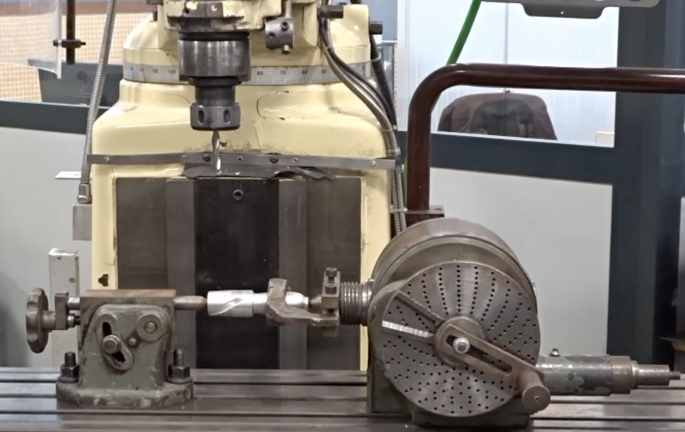{ width="600" }
    <figcaption>Foto de Universitat Politècnica de València: https://youtu.be/d4w4ii1umqw?si=86gxL-KaDs7augJD</figcaption>
</figure>

Si es vol mecanitzar un objecte de revolució d'una mida gran, caldrà utilitzar una taula circular.

<figure markdown="span">
    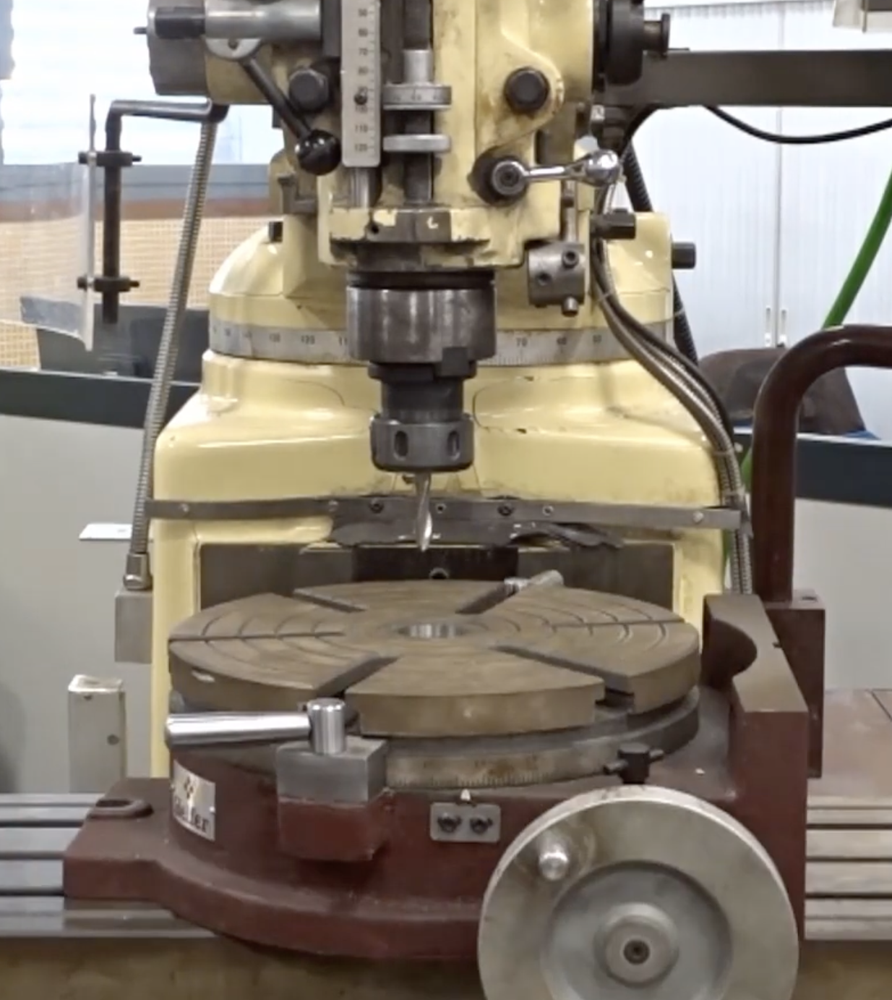{ width="600" }
    <figcaption>Foto de Universitat Politècnica de València: https://youtu.be/d4w4ii1umqw?si=86gxL-KaDs7augJD</figcaption>
</figure>

Darrerament, per configuracions verticals s'utilitzarà l'esquadra amb gats. és molt robust i per tant, evita les vibracions que es generarien en les mordasses.

<figure markdown="span">
    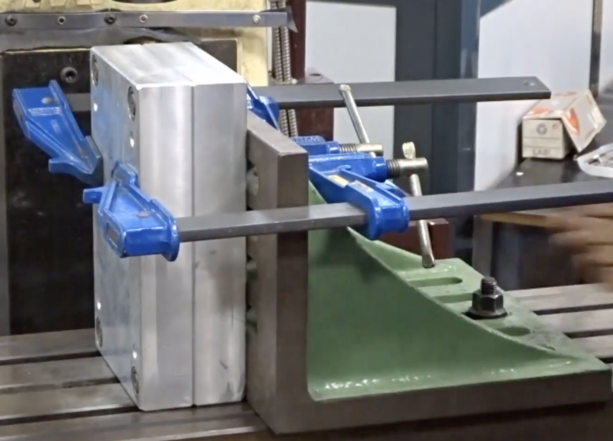{ width="600" }
    <figcaption>Foto de Universitat Politècnica de València: https://youtu.be/d4w4ii1umqw?si=86gxL-KaDs7augJD</figcaption>
</figure>


El fresat, presenta els següents tipus d'operacions possibles:

<div style="position: relative; padding-bottom: 56.25%; height: 0; overflow: hidden; max-width: 100%; margin-bottom: 24px;">
    <iframe src="https://www.youtube.com/embed/ZchOy9UVjJw?si=tdl3DaiNiuwmEit8" title="YouTube video player" frameborder="0" allow="accelerometer; autoplay; clipboard-write; encrypted-media; gyroscope; picture-in-picture; web-share" referrerpolicy="strict-origin-when-cross-origin" allowfullscreen style="position: absolute; top: 0; left: 0; width: 100%; height: 100%;"></iframe>
</div>

<div style="position: relative; padding-bottom: 56.25%; height: 0; overflow: hidden; max-width: 100%; margin-bottom: 24px;">
    <iframe src="https://www.youtube.com/embed/JPvkoq0_YhM?si=vMUeslt7Si1mKQc0" title="YouTube video player" frameborder="0" allow="accelerometer; autoplay; clipboard-write; encrypted-media; gyroscope; picture-in-picture; web-share" referrerpolicy="strict-origin-when-cross-origin" allowfullscreen style="position: absolute; top: 0; left: 0; width: 100%; height: 100%;"></iframe>
</div>

<div style="position: relative; padding-bottom: 56.25%; height: 0; overflow: hidden; max-width: 100%; margin-bottom: 24px;">
    <iframe src="https://www.youtube.com/embed/tQqw0utbx9o?si=iJXS4lgxi83onY_i" title="YouTube video player" frameborder="0" allow="accelerometer; autoplay; clipboard-write; encrypted-media; gyroscope; picture-in-picture; web-share" referrerpolicy="strict-origin-when-cross-origin" allowfullscreen style="position: absolute; top: 0; left: 0; width: 100%; height: 100%;"></iframe>
</div>

#### Planejat

<figure markdown="span">
    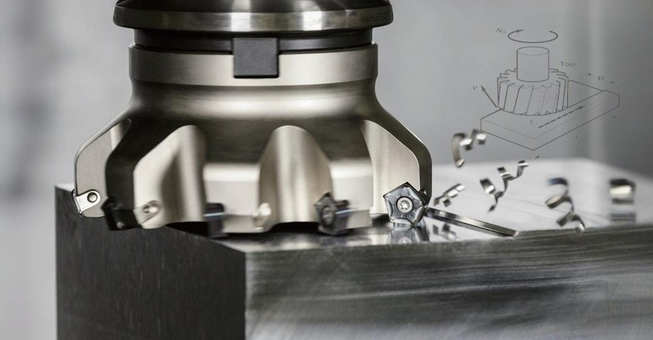{ width="500" }
    <figcaption>Foto de AT Machining: https://at-machining.com/es/cnc-milling-a-detailed-explanation/</figcaption>
</figure>

Es treballa de forma frontal per generar una superfície a una cara de la peça.

#### Ranurat

<figure markdown="span">
    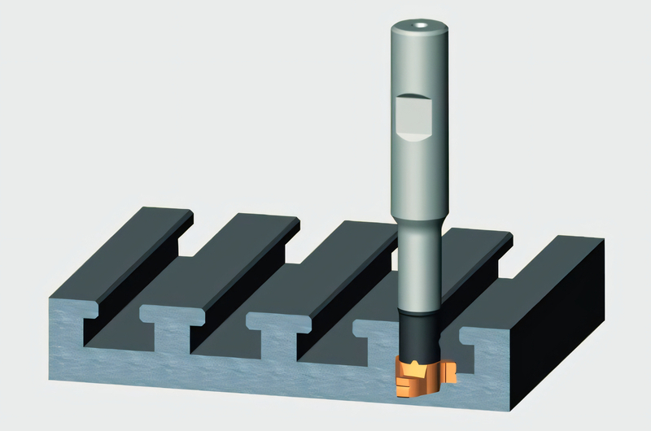{ width="500" }
    <figcaption>Foto de AT Machining: https://at-machining.com/es/cnc-milling-a-detailed-explanation/</figcaption>
</figure>

Pot realitzar-se mitjançant amb fresat frontal o perifèric. 

#### Buit

<figure markdown="span">
    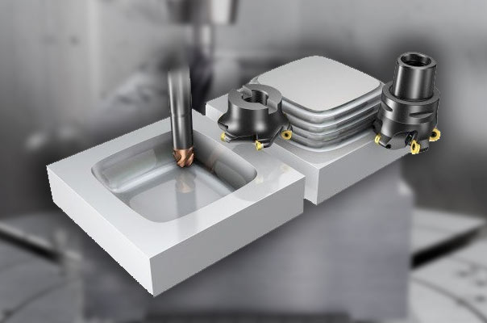{ width="500" }
    <figcaption>Foto de 4ATOOLS: https://4atools.com/herramientas-de-fresado/</figcaption>
</figure>

És una de les operacions més habituals, consisteix a crear un buidament d'un totxo massís el qual no té cap orifici central.

#### Xamfranat

<figure markdown="span">
    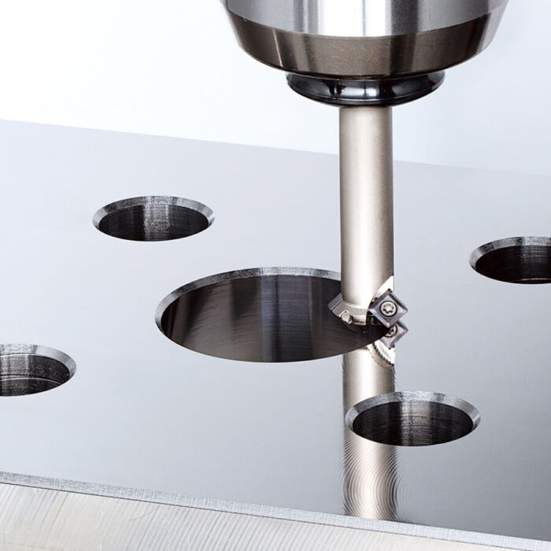{ width="500" }
    <figcaption>Foto de Tungaloy: https://tungaloy.com/es/whats-new/chamfering-techniques-applications-tools/</figcaption>
</figure>

Poden ser rectes o arrodonits, l'objectiu d'aquesta operació és l'eliminació d'aristes vives.

#### Contornat i perfilat

<figure markdown="span">
    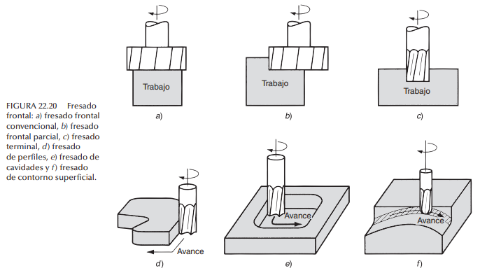{ width="800" }
    <figcaption>Foto de ingenieria mecanica blog: https://ingenieriamecanicacol.blogspot.com/2023/05/operaciones-de-maquinado-y-maquinas.html</figcaption>
</figure>

Aquesta operació perfet obtindre acabats superficials complexos. La geometria de la fresa és essencial per assolir les diverses superficies.

### Torn

Consisteix en arrancar material per obtindre una peça de revolució. Per aconseguir-ho s'utilitza una eina monofilament que interfereix amb el totxo que gira sobre el seu eix. L'eina avança sobre la peça.

<figure markdown="span">
    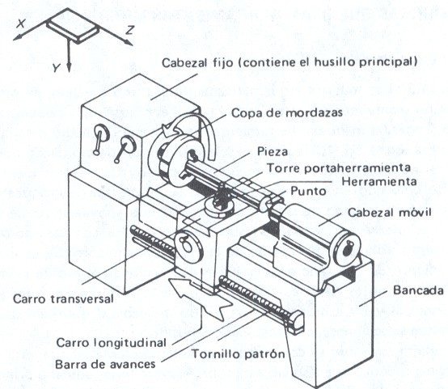{ width="600" }
    <figcaption>Foto de Procesos Miguel: https://procesosmiguel.blogspot.com/2020/10/partes-de-una-maquina-de-torno.html</figcaption>
</figure>

<figure markdown="span">
    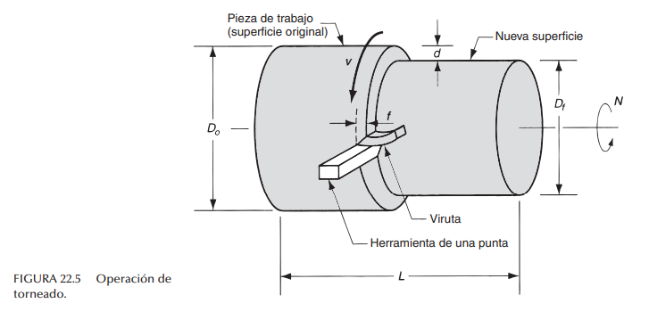{ width="800" }
    <figcaption>Foto de ingenieria mecanica blog: https://ingenieriamecanicacol.blogspot.com/2023/05/operaciones-de-maquinado-y-maquinas.html</figcaption>
</figure>

<div style="position: relative; padding-bottom: 56.25%; height: 0; overflow: hidden; max-width: 100%; margin-bottom: 24px;">
    <iframe src="https://www.youtube.com/embed/WuV71AhbRHc?si=UCa9luiGvL3h7d0_" title="YouTube video player" frameborder="0" allow="accelerometer; autoplay; clipboard-write; encrypted-media; gyroscope; picture-in-picture; web-share" referrerpolicy="strict-origin-when-cross-origin" allowfullscreen style="position: absolute; top: 0; left: 0; width: 100%; height: 100%;"></iframe>
</div>

<div style="position: relative; padding-bottom: 56.25%; height: 0; overflow: hidden; max-width: 100%; margin-bottom: 24px;">
    <iframe src="https://www.youtube.com/embed/y9doqBR_RTk?si=EEqYVLqgVLa39amY" title="YouTube video player" frameborder="0" allow="accelerometer; autoplay; clipboard-write; encrypted-media; gyroscope; picture-in-picture; web-share" referrerpolicy="strict-origin-when-cross-origin" allowfullscreen style="position: absolute; top: 0; left: 0; width: 100%; height: 100%;"></iframe>
</div>

Les operacions bàsiques del torn són les següents:

#### Tornejat d'exteriors

<figure markdown="span">
    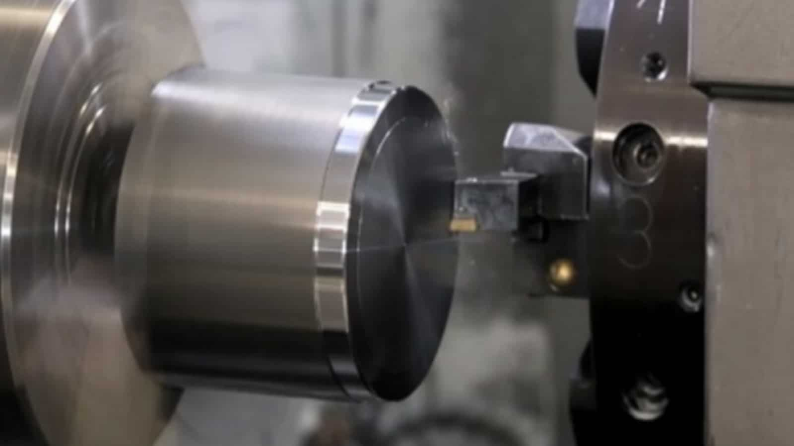{ width="600" }
    <figcaption>Foto de rapid direct: https://www.rapiddirect.com/es/blog/types-of-turning-operations/</figcaption>
</figure>

<figure markdown="span">
    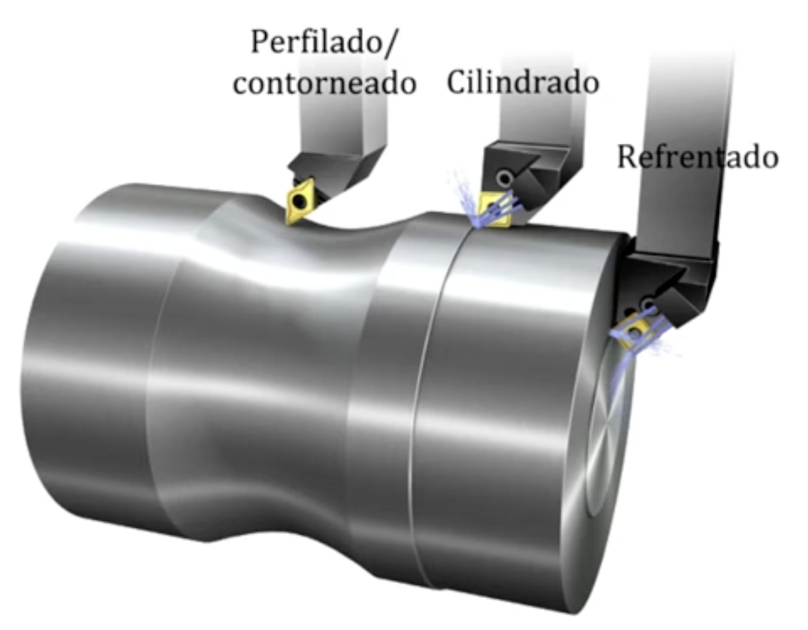{ width="600" }
    <figcaption>Foto de Universitat Politècnica de València: https://youtu.be/XZtquL7ypsQ?si=PCEKHrNlwgardByr</figcaption>
</figure>

Pel cilindrat l'enina seguira una trajectòria paral·lela a l'eix mentre que arranca material. En cas que el moviment es realitzés perpendicularment a l'eix l'operació s'anomena refrentat. 
En els torns per control numèric sobretot es fa també ús de l'operació de contornat, la qual segueix un perfil compexe.

#### Tronejat d'interiors

<figure markdown="span">
    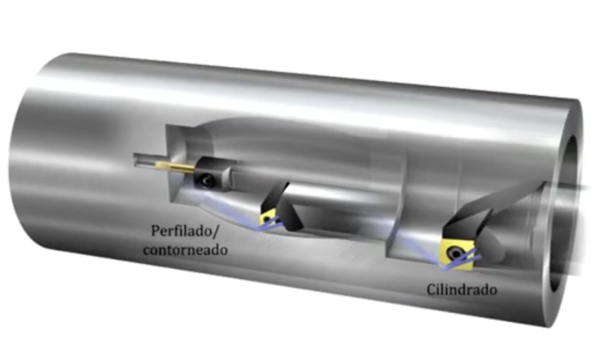{ width="600" }
    <figcaption>Foto de Universitat Politècnica de València: https://youtu.be/XZtquL7ypsQ?si=PCEKHrNlwgardByr</figcaption>
</figure>

Aquestes operacions es poden translladar a l'interior de la peça, tot i que per fer-ho és necessari un forat prèviament realitzat.

#### Ranurat

<figure markdown="span">
    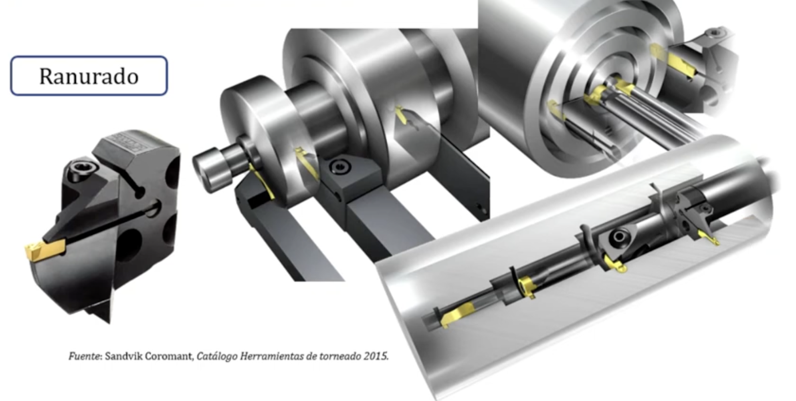{ width="600" }
    <figcaption>Foto de Universitat Politècnica de València: https://youtu.be/XZtquL7ypsQ?si=PCEKHrNlwgardByr</figcaption>
</figure>

Cal una eina específica i llarga per entrar dins un forat previament fet que a l'altura determinada fa les ranures.

#### Tronçat

Si la ranura exterior es realitza fins l'eix s'assoleix un tronçat. Aquesta operació es busca per aconseguir separar la peça. No s'arriba fins el fons

<figure markdown="span">
    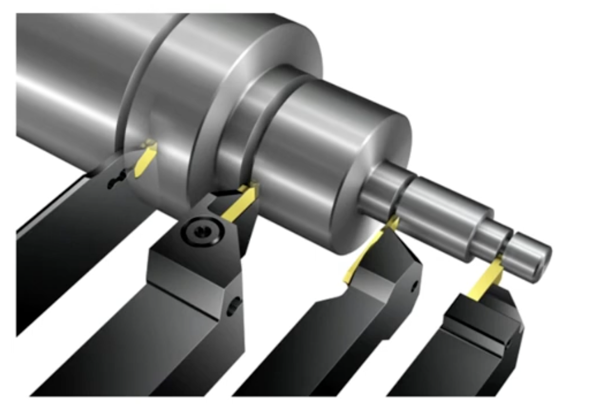{ width="600" }
    <figcaption>Foto de Universitat Politècnica de València: https://youtu.be/XZtquL7ypsQ?si=PCEKHrNlwgardByr</figcaption>
</figure>

#### Roscat

La ferramenta de tall té el perfil de la rosca i l'avançament (mm/rev) s'estableix igual al pas de la rosca.

<figure markdown="span">
    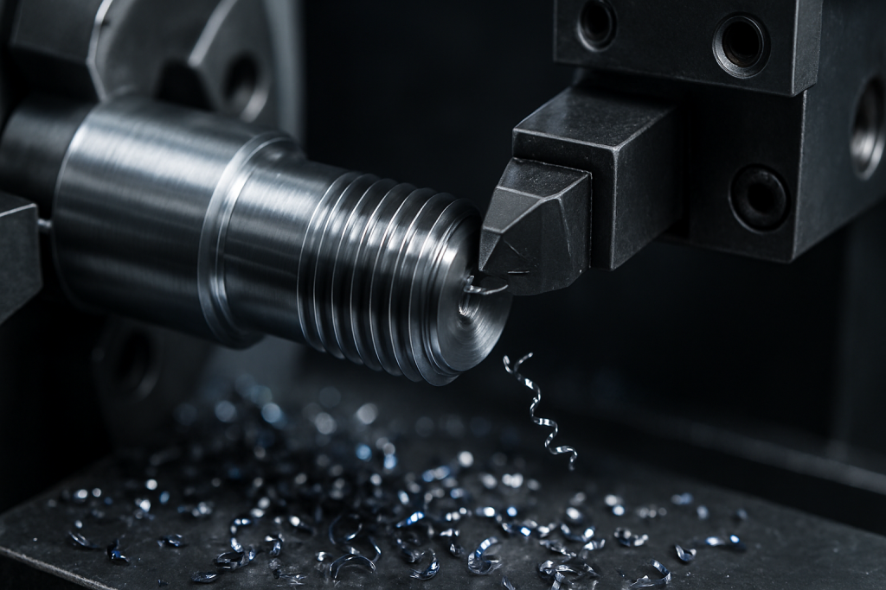{ width="600" }
    <figcaption>Foto de Mettcom: https://mettcom.com/blog/tecnologia-procesos/roscado-piezas-metalicas/</figcaption>
</figure>

#### Mandrinat 

Es fa en vertical quan la peça es gran, posant l'eix vertical

<figure markdown="span">
    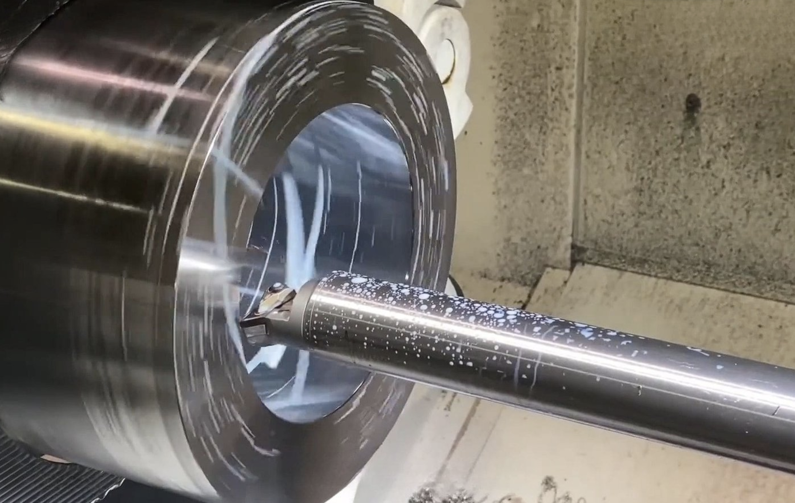{ width="600" }
    <figcaption>Foto de J&M: https://jmcncmachine.com/es/por-que-se-prefiere-una-mandrinadora-a-un-torno-para-la-mayoria-de-las-tareas-de-mandrinado/</figcaption>
</figure>

<div style="position: relative; padding-bottom: 56.25%; height: 0; overflow: hidden; max-width: 100%; margin-bottom: 24px;">
    <iframe src="https://www.youtube.com/embed/ysZo38ii-zU?si=rFOZyHYRoEnx_O3H" title="YouTube video player" frameborder="0" allow="accelerometer; autoplay; clipboard-write; encrypted-media; gyroscope; picture-in-picture; web-share" referrerpolicy="strict-origin-when-cross-origin" allowfullscreen style="position: absolute; top: 0; left: 0; width: 100%; height: 100%;"></iframe>
</div>

<div style="position: relative; padding-bottom: 56.25%; height: 0; overflow: hidden; max-width: 100%; margin-bottom: 24px;">
    <iframe src="https://www.youtube.com/embed/ux58mHH7PCU?si=pa9pwjQx_6MrjT9m" title="YouTube video player" frameborder="0" allow="accelerometer; autoplay; clipboard-write; encrypted-media; gyroscope; picture-in-picture; web-share" referrerpolicy="strict-origin-when-cross-origin" allowfullscreen style="position: absolute; top: 0; left: 0; width: 100%; height: 100%;"></iframe>
</div>

<div style="position: relative; padding-bottom: 56.25%; height: 0; overflow: hidden; max-width: 100%; margin-bottom: 24px;">
    <iframe src="https://www.youtube.com/embed/na0RyfBNY8k?si=9V1sNEdUE196dA69" title="YouTube video player" frameborder="0" allow="accelerometer; autoplay; clipboard-write; encrypted-media; gyroscope; picture-in-picture; web-share" referrerpolicy="strict-origin-when-cross-origin" allowfullscreen style="position: absolute; top: 0; left: 0; width: 100%; height: 100%;"></iframe>
</div>

### Planejadora

En castellà *cepilladora*, consisteix a l'utilització d'una eiana monofinlament que es desplaça per generar superfícies planes, ranures o perfils. La peça es la que es mou gràcies a la bancada. Mitjançant aquest procés es pot atacar tant la superfície superior com les laterals de la peça. El procés destaca per la grandària de les peces que es poden fer servir.

<figure markdown="span">
    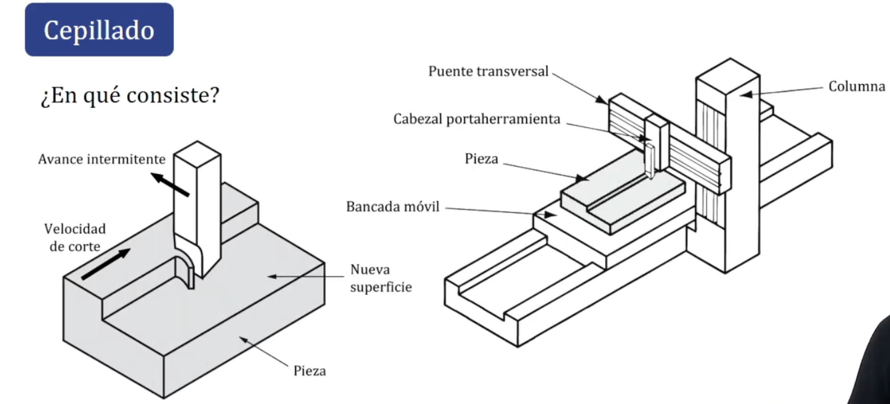{ width="600" }
    <figcaption>Foto de Universitat Politècnica de València: https://youtu.be/2AokUrGqB3M?si=e3EGhrUNbopQMU1K</figcaption>
</figure>

### Llimadora

En el procés de llimat és la ferramenta la que es desplaça sobre la peça. Aquest té un ús similar al de la planejadora (superfícies planes, ranures o perfils i eina monofilament). En aquest cas, però, només es pot "atacar" la superfície superior i la carrera està limitada a la llargaria de tall que té l'ariet.

<figure markdown="span">
    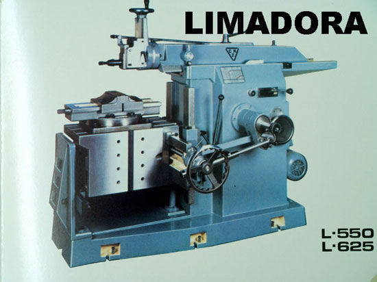{ width="600" }
    <figcaption>Foto de Mecanizado al paso: https://mecanizadoalpaso.blogspot.com/2019/03/limado-mecanizados-por-arranque-de.html</figcaption>
</figure>

<figure markdown="span">
    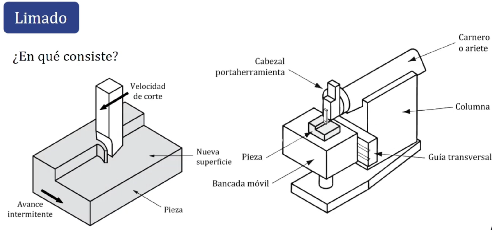{ width="600" }
    <figcaption>Foto de Universitat Politècnica de València: https://youtu.be/2AokUrGqB3M?si=e3EGhrUNbopQMU1K</figcaption>
</figure>

### Mortasadora

Aquesta és una variant del llimat. En aquesta màquina, només es poden generar ranures i perfils (no superficies planes), ja que presenta un moviment de tall vertical. És el moviment de rotació de l'eix on està la peça el que extén el tall a tot el conjunt. 

<figure markdown="span">
    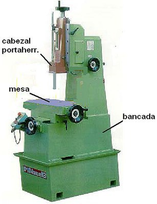{ width="600" }
    <figcaption>Foto de IMH Campus: https://www.imh.eus/es/imh/comunicacion/docu-libre/procesos-fabricacion/mecanizado/arranque-de-viruta/mortajado</figcaption>
</figure>

<figure markdown="span">
    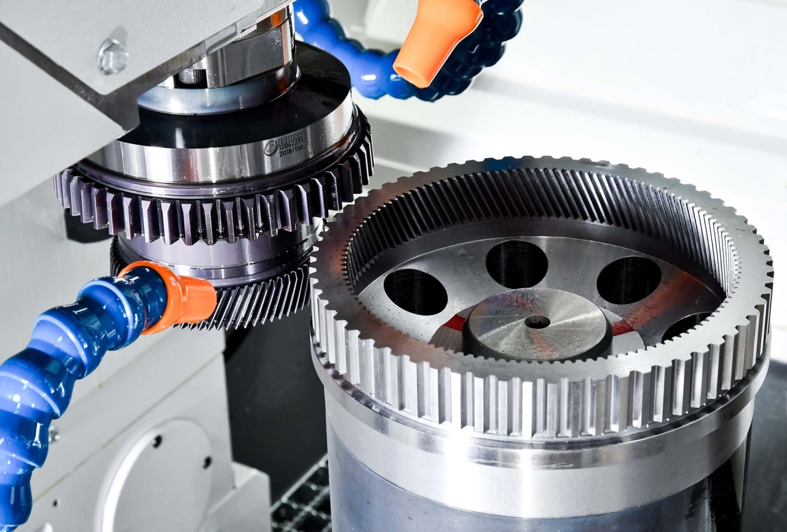{ width="600" }
    <figcaption>Foto de LIBHERR: https://www.liebherr.com/es-int/t%C3%A9cnica-de-engranajes-y-automatizaci%C3%B3n/mortajado-por-generacion/ls400em-6440911</figcaption>
</figure>

Presenta unes toleràncies grans i rugositats àmplies. A banda, no permet una producció en sèrie.

### Brotxadora

<figure markdown="span">
    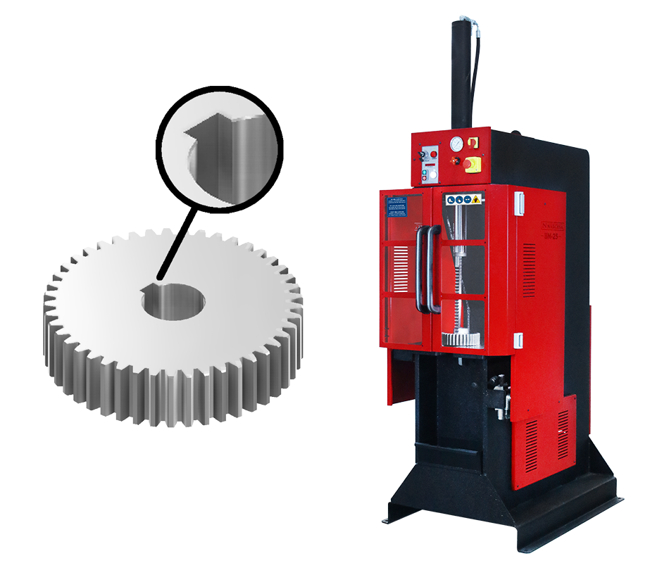{ width="600" }
    <figcaption>Foto de NARGESA: https://nargesa.com/es/maquinaria-industrial/brochadora-vertical-bm25</figcaption>
</figure>

Utilitza una eina multifilament per crear ranures, perfils i orificis amb forma. S'assoleix mitjançant el moviment de la ferramenta sobre la peça. Cada filament ataca més distància que l'anterior per arrancar viruta progressivament. Així, només cal una única passada.

<figure markdown="span">
    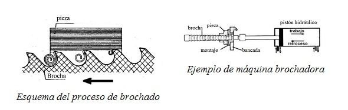{ width="600" }
    <figcaption>Foto de Mecánica y Electromecánica - Escuela Técnica: https://mecanicaesctec.blogspot.com/2020/09/diseno-y-procesamiento-mecanico-la-broca.html</figcaption>
</figure>

<figure markdown="span">
    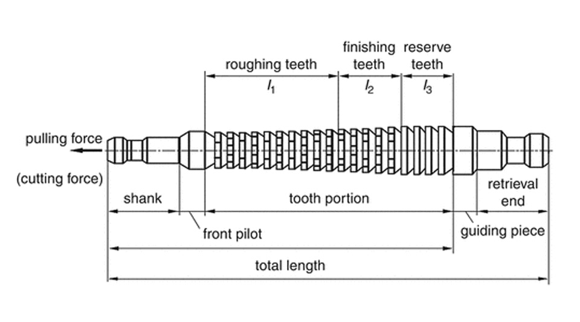{ width="600" }
    <figcaption>Foto de Getzshape: https://www.getzshape.com/es/blog/broaching-machining/</figcaption>
</figure>

Depenent de la geometria que es vol assolir, caldrà seleccionar una brotxa distinta.

<figure markdown="span">
    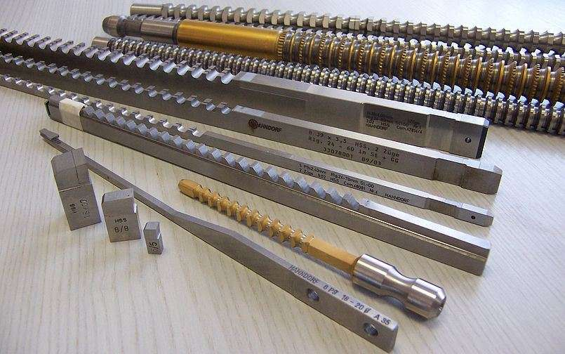{ width="600" }
    <figcaption>Foto de PRO-LEAN: https://proleantech.com/es/mastering-broaching-machining-process-applications-and-advantages/</figcaption>
</figure>

En aquest procés, cal destacar que les toleràncies i rugositats són millors que les obtingudes en els processos anteriors. 

### Serrat

Com. ben bé indica el seu nom, aquest procés utilitza una eina multifilament per provocar una separació de material. Els moviments de tall i avançada els produeix la mateixa eina. Les dets estan lleugerament desviades del filament per garantir que l'eina no tinga problemes de fricció. 

<figure markdown="span">
    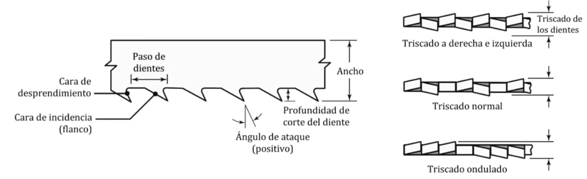{ width="600" }
    <figcaption>Foto de Universitat Politècnica de València: https://youtu.be/2AokUrGqB3M?si=e3EGhrUNbopQMU1K</figcaption>
</figure>

<figure markdown="span">
    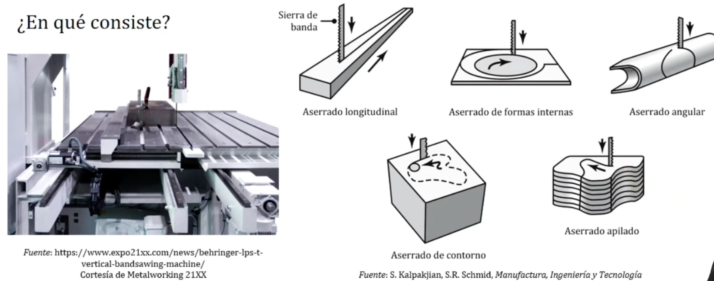{ width="600" }
    <figcaption>Foto de Universitat Politècnica de València: https://youtu.be/2AokUrGqB3M?si=e3EGhrUNbopQMU1K</figcaption>
</figure>

Aquets procés genera grans toleràncies i rugositats. És adaptable a una producció en sèrie.

### Perforadora 
La perforadora o *taladradora* en castellà és una màquina eina amb la qual es realitzen forats en les peces mitjançant una eina anomenada broca.

<figure markdown="span">
    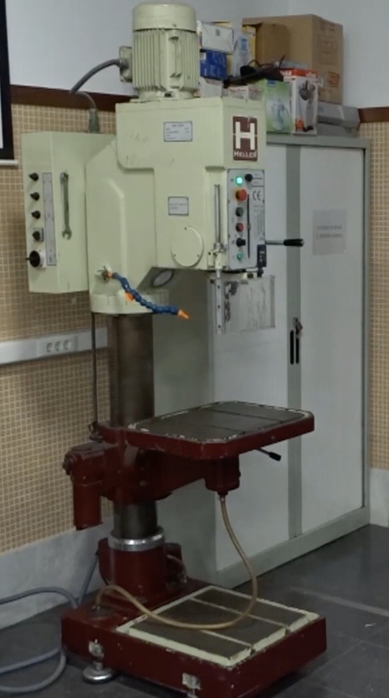{ width="600" }
    <figcaption>Foto de Universitat Politècnica de València: https://youtu.be/kYZVsE992sM?si=_GmBr1ugdeOYpKRw</figcaption>
</figure>

<figure markdown="span">
    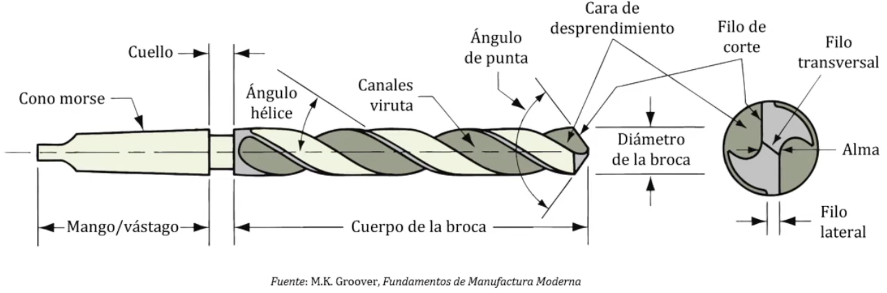{ width="600" }
    <figcaption>Foto de Universitat Politècnica de València: https://youtu.be/tC7jfKrcGYo?si=DMJQVW-HuEtWPh8I</figcaption>
</figure>

<div style="position: relative; padding-bottom: 56.25%; height: 0; overflow: hidden; max-width: 100%; margin-bottom: 24px;">
    <iframe src="https://www.youtube.com/embed/kYZVsE992sM?si=_GmBr1ugdeOYpKRw" title="YouTube video player" frameborder="0" allow="accelerometer; autoplay; clipboard-write; encrypted-media; gyroscope; picture-in-picture; web-share" referrerpolicy="strict-origin-when-cross-origin" allowfullscreen style="position: absolute; top: 0; left: 0; width: 100%; height: 100%;"></iframe>
</div>

És important abans de perforar utilitzar una broca de punt per fer una marca a la peça, ja que, sinó, la broca per foradar pot doblar-se i trencar-se. 
Per subjectar les peçes a la taula, d'una manera similar a la fresa, s'utilitzaran mordasses, brides, brides ràpides, l'esquadra amb gats i el plat de garres. 

<div style="position: relative; padding-bottom: 56.25%; height: 0; overflow: hidden; max-width: 100%; margin-bottom: 24px;">
    <iframe src="https://www.youtube.com/embed/https://youtu.be/qlDrGygqb6g?si=9_6THQsI3BrvOzm2" title="YouTube video player" frameborder="0" allow="accelerometer; autoplay; clipboard-write; encrypted-media; gyroscope; picture-in-picture; web-share" referrerpolicy="strict-origin-when-cross-origin" allowfullscreen style="position: absolute; top: 0; left: 0; width: 100%; height: 100%;"></iframe>
</div>

Respecte de les condicions per realitzar el tall, cal seguir les mateixes indicacions que pel tornejat i fresat:

<figure markdown="span">
    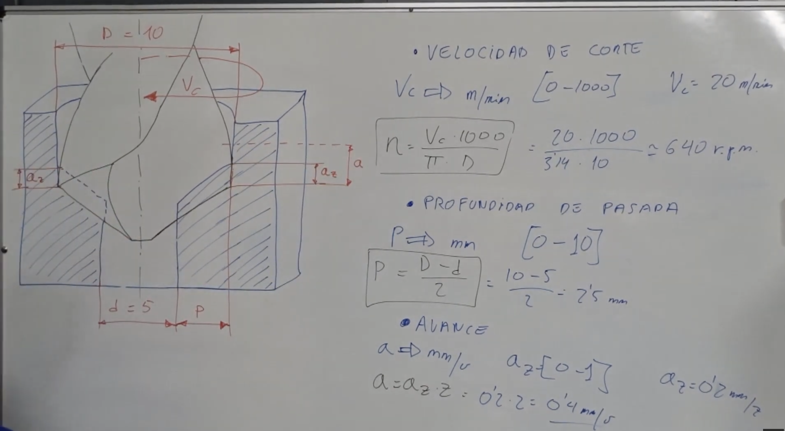{ width="600" }
    <figcaption>Foto de Universitat Politècnica de València: https://youtu.be/s5tzbl8Ce7k?si=jUqKfLY6FAoEvMsq</figcaption>
</figure>

Entre les operacions possibles amb la perforadora es poden destacar: el puntejat, per marcar els forats inicials on anirà la broca; perforat o reperforat, per fer o engrandir les forats; atrompetat, avellanat, que realitza una superfície cònica amb un i profunditat establerts sobre un forat ja fet; abocardat, per eliminar les rebabes de la cara oposada de la peça (s'utilitza la meitat de la velocitat); lamat, similar a l'avellanat però amb l'objectiu d'aconseguir una superfície plana en comptes de cònica o l'escarit, que necessita també un forat previament fet. Aquesta darrera és una operació d'acabat, la qual millora les toleràncies superficials.

<div style="position: relative; padding-bottom: 56.25%; height: 0; overflow: hidden; max-width: 100%; margin-bottom: 24px;">
    <iframe src="https://www.youtube.com/embed/https://youtu.be/Hqa_40Agcw8?si=FGgsZbofgD06r80w" title="YouTube video player" frameborder="0" allow="accelerometer; autoplay; clipboard-write; encrypted-media; gyroscope; picture-in-picture; web-share" referrerpolicy="strict-origin-when-cross-origin" allowfullscreen style="position: absolute; top: 0; left: 0; width: 100%; height: 100%;"></iframe>
</div>

És poden realitzar també un conjunt d'operacions addicionals entre les quals destaca:

- El roscat: Per realitzar-la cal un màscle de rosca especial. És imperatiu un forat realitzat prèviament a la rosca d'un diàmetre menor. 

- Refrentat: L'objectiu en aquest procés és obtindre una superfície plana. 

- Trepanat: S'usa una corona per obtindre forats de grans dimensions en peces d'un espesor xicotet. 

<figure markdown="span">
    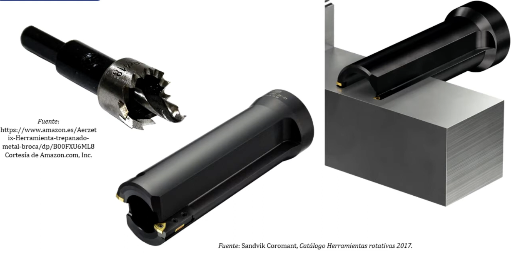{ width="600" }
    <figcaption>Foto de Universitat Politècnica de València: https://youtu.be/tC7jfKrcGYo?si=DMJQVW-HuEtWPh8I</figcaption>
</figure>

- Retallat: Aquesta és molt similar al trepanat, l'avantatge és que l'eina utilitzada pot ajustar el seu diàmetre. En aquesta operació cal un forat prèviament realitzat. Aquest mètode, però, genera rebabes al material.

<figure markdown="span">
    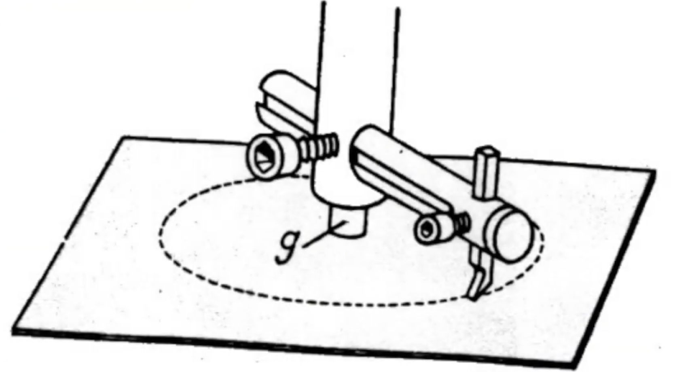{ width="600" }
    <figcaption>Foto de Universitat Politècnica de València: https://youtu.be/gpKxls6KpZ4?si=IgbziXioVTy02GmN</figcaption>
</figure>

- Trossejat: Cal fer.ho servir quan es vol separar una peça en dues parts.

- Mandrinat: També cal un forat fet prèviament, però, a diferència del perforat, aquest mètode assoleix millors acabats superficials. 

<div style="position: relative; padding-bottom: 56.25%; height: 0; overflow: hidden; max-width: 100%; margin-bottom: 24px;">
    <iframe src="https://www.youtube.com/embed/https://youtu.be/gpKxls6KpZ4?si=DL5gGdsHnAp4CLMK" title="YouTube video player" frameborder="0" allow="accelerometer; autoplay; clipboard-write; encrypted-media; gyroscope; picture-in-picture; web-share" referrerpolicy="strict-origin-when-cross-origin" allowfullscreen style="position: absolute; top: 0; left: 0; width: 100%; height: 100%;"></iframe>
</div>

### Rectificadora

Consisteix a utilitzar uns queixals que tenen diverses geometries en funció de la geometria de la peça que es vol treballar i que es mouen mitjançant gir i rotació respecte del seu eix. 

<figure markdown="span">
    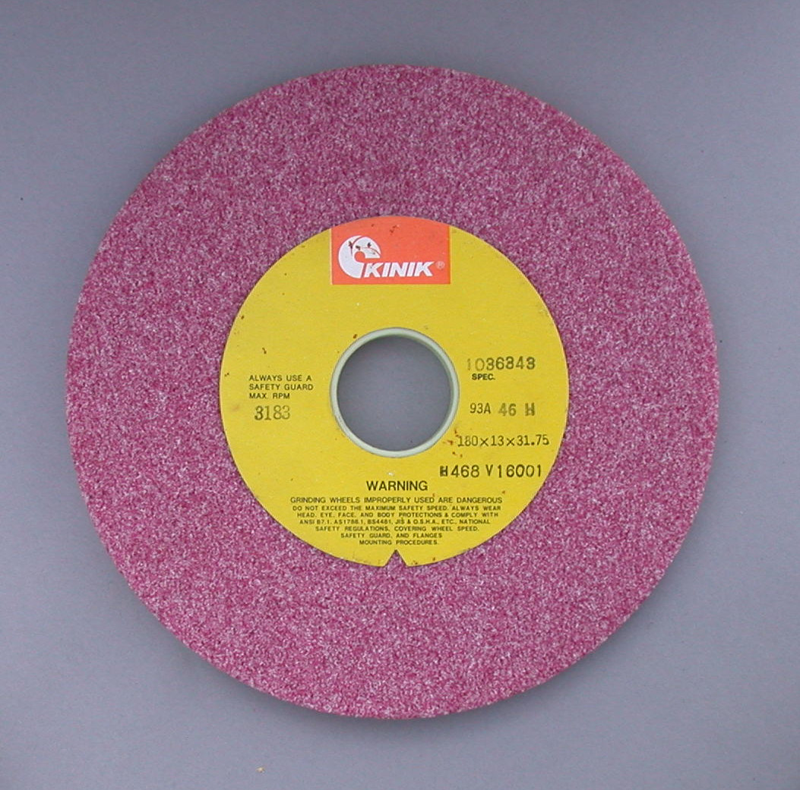{ width="600" }
    <figcaption>Foto de Wikimedia: https://commons.wikimedia.org/wiki/File:GrindingStraightWheelH468V.jpg</figcaption>
</figure>

<figure markdown="span">
    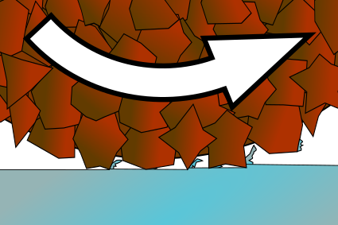{ width="600" }
    <figcaption>Foto de Wikimedia: https://commons.wikimedia.org/wiki/File:Unbestimmte_Schneide.svg</figcaption>
</figure>

Els queixals, tenen una gradària del gra molt controlada, amb l'objectiu d'arrancar material d'una manera uniforme, estan algutinats i presenten porositat. Arranca molt poca quantitat i no està controlat l'angle d'incidència. Pel desgrast del gra i l'aglutinant, els grans superficials es desprenen i els interiors (no desgagstats) continuen actuant. És important adquar els queixals quan aquests han patit desgast.

#### Rectificat en pla

En aquest cas, el queixal pot actuar de manera forntal o perifèrica. 

<figure markdown="span">
    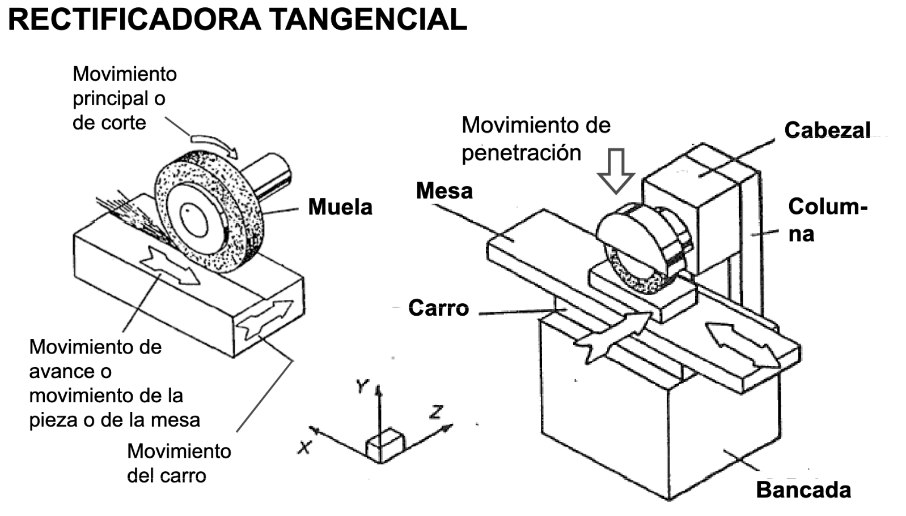{ width="600" }
    <figcaption>Foto de Euskal Herriko Unibertsitatea EHU: https://studylib.es/doc/6363477/rectificadora-tangencial</figcaption>
</figure>

<figure markdown="span">
    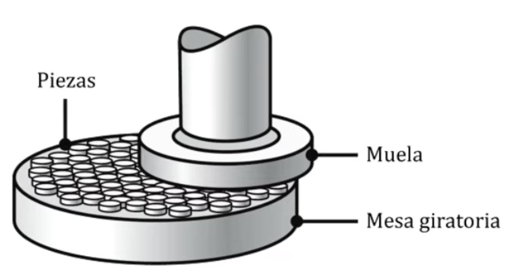{ width="600" }
    <figcaption>Foto de Universitat Politècnica de València: https://youtu.be/gxC0hV9MkW4?si=Lgg-dpw-6TWXu242</figcaption>
</figure>

Depenent del tipus de col·locació del queixal, canviarà la geometria del queixal mateix.

<figure markdown="span">
    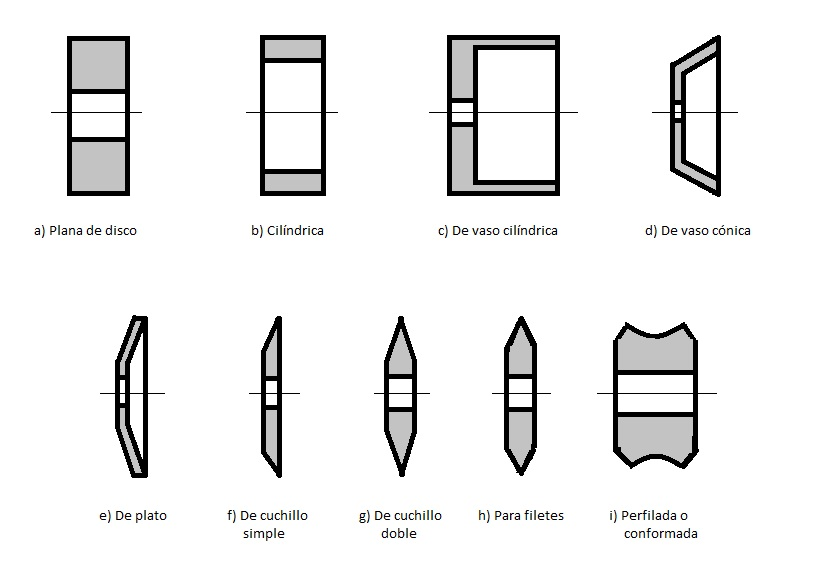{ width="600" }
    <figcaption>Foto de Wikimedia: https://commons.wikimedia.org/wiki/File:Unbestimmte_Schneide.svg</figcaption>
</figure>

#### Rectificat cilíndric

Si es tracta de geometries de revolució, caldrà fer ús del rectificat cilindric. 
És possible combinar diversos tipus de geometria amb diversitat de moviments d'avançament per realitzar el rectificat. 

<figure markdown="span">
    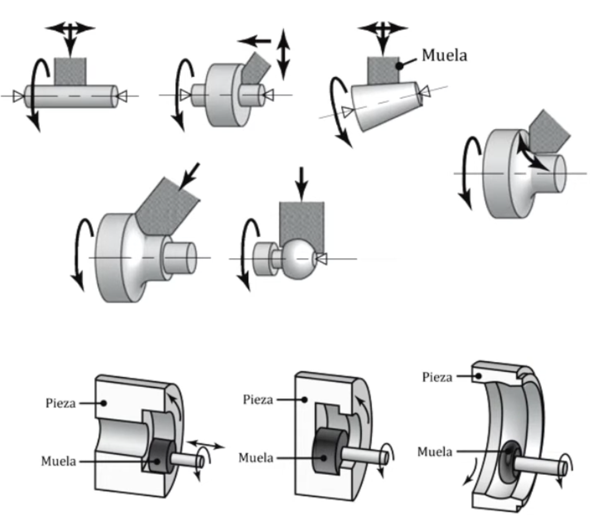{ width="600" }
    <figcaption>Foto de Universitat Politècnica de València: https://youtu.be/gxC0hV9MkW4?si=Lgg-dpw-6TWXu242</figcaption>
</figure>

Aquest rectiicat, també pot tractar superficies interiors o exteriors:

<figure markdown="span">
    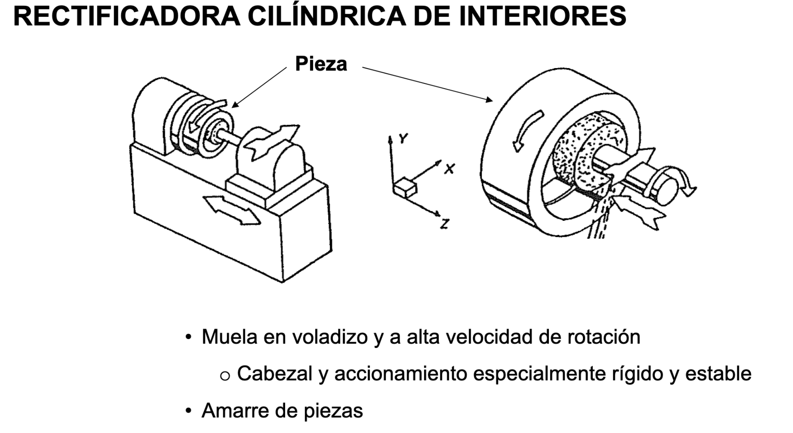{ width="600" }
    <figcaption>Foto de Euskal Herriko Unibertsitatea EHU: https://studylib.es/doc/6363477/rectificadora-tangencial</figcaption>
</figure>

<figure markdown="span">
    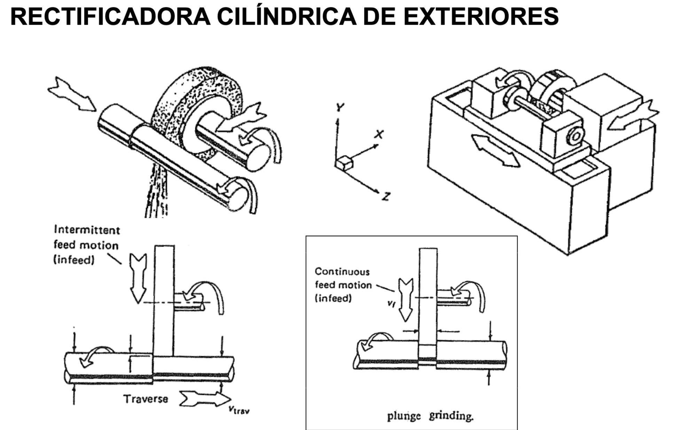{ width="600" }
    <figcaption>Foto de Euskal Herriko Unibertsitatea EHU: https://studylib.es/doc/6363477/rectificadora-tangencial</figcaption>
</figure>

A banda, dins dels tipus de rectificat cilíndric, també existeix l'anomenat "sense centres". En aquest cas, la peça no és subjecta a cap eix, sinó que és guiada per uns rodets que controlen el moviment contra el queixal. Els rodets, permeten treballar peces d'una massa més elevada i un treball en sèrie.

<figure markdown="span">
    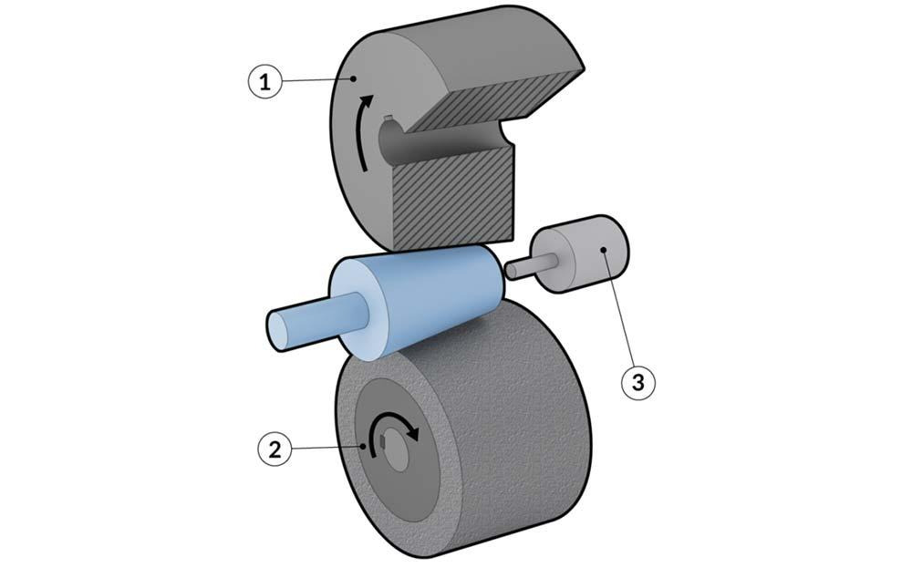{ width="600" }
    <figcaption>Foto de Richconn: https://richconn.com/es/centerless-grinding-101/</figcaption>
</figure>

### Brunyit i superacabat

El brunyit, és el procés que s'utilitza per millorar l'acabat de rectificat. Es realitza mitjançant les passades de pedres de brunyit sense molta pressió per la superfície. Aquest procés permet assolir toleràncies i rugositats molt xicotetes.

<figure markdown="span">
    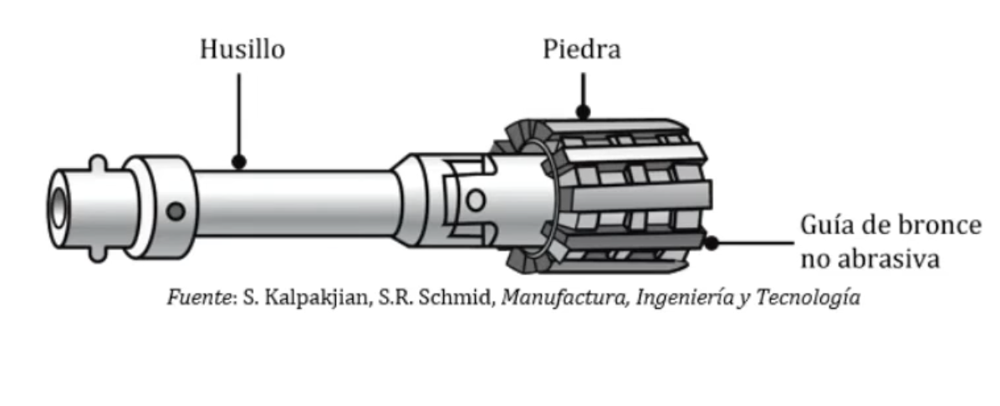{ width="600" }
    <figcaption>Foto de Universitat Politècnica de València: https://youtu.be/gxC0hV9MkW4?si=7IHJh7LzWi__j7bj</figcaption>
</figure>

<figure markdown="span">
    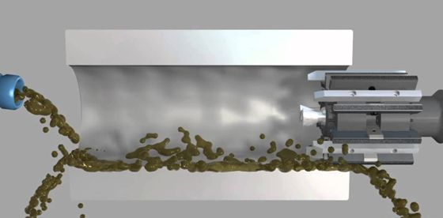{ width="600" }
    <figcaption>Foto de WAYKEN: https://waykenrm.com/es/blogs/honing-process/</figcaption>
</figure>

La ferramenta es desplaça en vertical i rotant sobre l'eix. En el superacabat, però, la pedra està subjectada amb un útil i és la peça la que gira sobre sí mateixa. 

<figure markdown="span">
    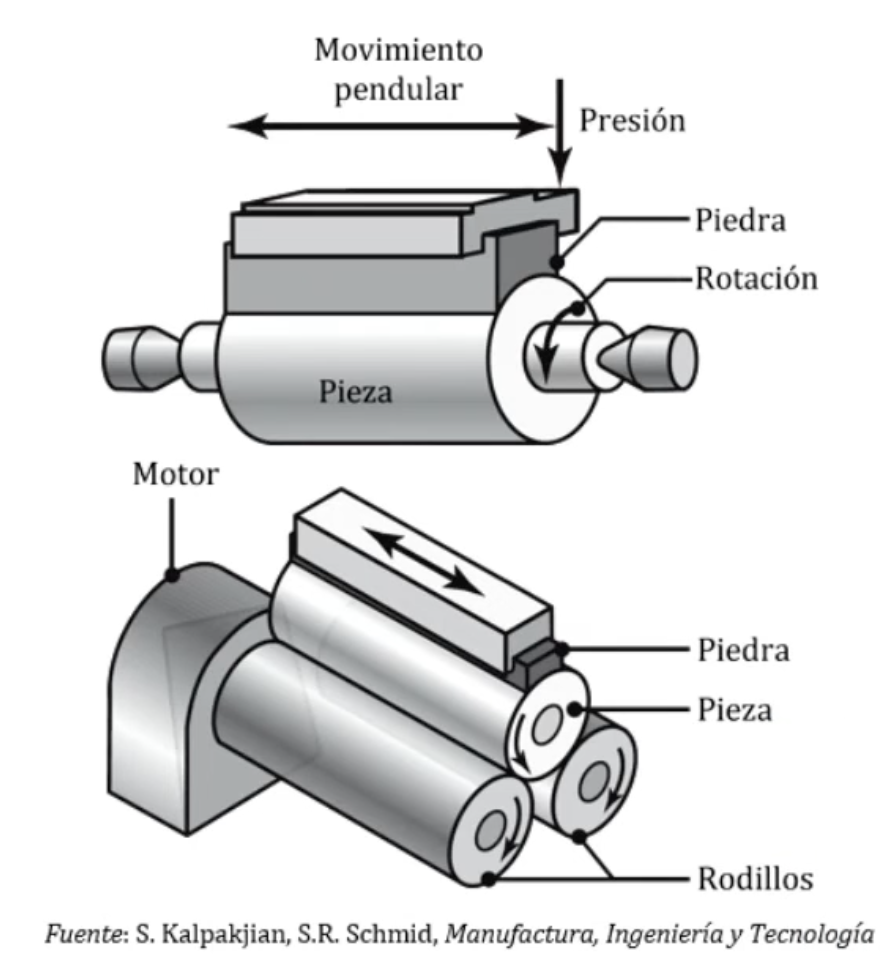{ width="600" }
    <figcaption>Foto de Universitat Politècnica de València: https://youtu.be/gxC0hV9MkW4?si=7IHJh7LzWi__j7bj</figcaption>
</figure>

### Polit i lapat

En aquest cas, no existeis una eina específica que realitze l'acció, sinó que hi ha un útil que subjecta en forma de pols o solució aquosa l'abrasiu perquè actue sobre la peça. L'objectiu és millorar la qualitat superficial. Es tracta d'un procés manual només automatitzat en alguns casos. 

<figure markdown="span">
    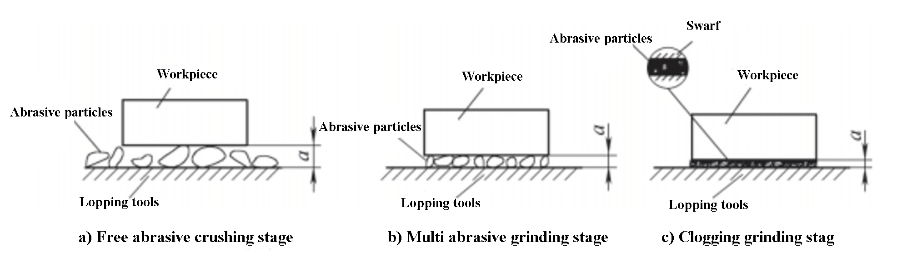{ width="600" }
    <figcaption>Foto de machinemfg: machinemfg.com</figcaption>
</figure>

<figure markdown="span">
    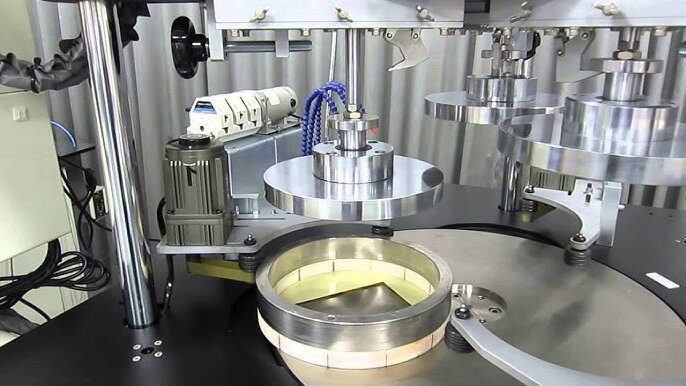{ width="600" }
    <figcaption>Foto de Shengen Fab: shengenfab.com</figcaption>
</figure>

<figure markdown="span">
    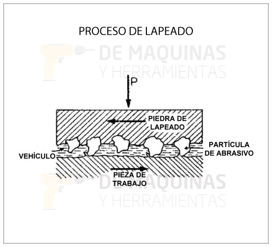{ width="600" }
    <figcaption>Foto de demaquinasyherramientas: demaquinasyherramientas.com</figcaption>
</figure>

<figure markdown="span">
    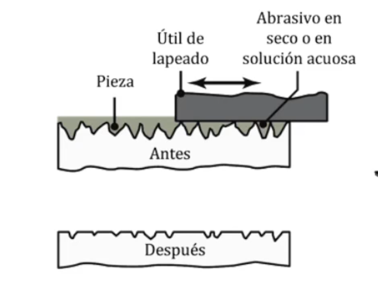{ width="600" }
    <figcaption>Foto de Universitat Politècnica de València: https://youtu.be/gxC0hV9MkW4?si=7IHJh7LzWi__j7bj</figcaption>
</figure>


## Mecanització d'alta precisió

S'utilitzen amb abrasius, es caracteritzen per tindre un nombre de filaments indeterminats que actuen de forma aleatòria sobre la peça, els quals retiren molt poc material a elevades velocitats de tall i on cal controlar l'elevada temperatura generada per la velocitat amb refrigerants.
És important destacar que les toleràncies i acabats que permeten els abrasius és molt elevada, per aquest motiu, són habitualment utilitzats amb funció de postprocessat.

### Electroerosió

És un procés de fabricació també conegut com mecanitzat per descàrrega elèctrica (EDM). Consisteix en generar un arc elèctric entre una peça i un electrode en un medi dielèctric per arrancar i erosionar particules de la peça fins reproduir en aquesta les formes de l'electrode. 

<figure markdown="span">
    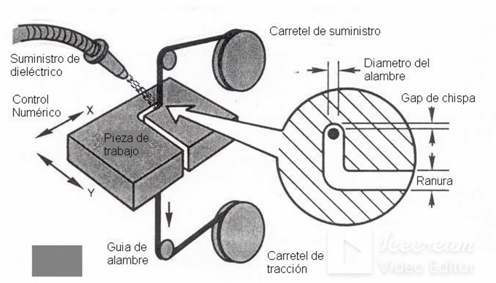{ width="600" }
    <figcaption>Foto de José Francisco Hernández Feregrino: https://youtu.be/usxl_5sQJiI?si=elnEyXNB2m2O4WZJ</figcaption>
</figure>

La qualitat, diàmetre i material del fil utilitzat afecten directament a la velocitat amb la qual una peça pot ser treballada i el seu grosor. El dil pot ser de llautó i zinc.
La taula on es munta la peça és "terra", es a dir, té polaritat negativa.

<figure markdown="span">
    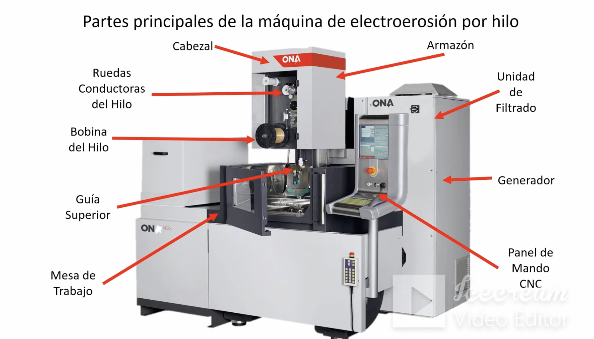{ width="600" }
    <figcaption>Foto de José Francisco Hernández Feregrino: https://youtu.be/usxl_5sQJiI?si=elnEyXNB2m2O4WZJ</figcaption>
</figure>

És imperatiu, però, que tots els materials que es pretenguen tallar mitjançant l'electroerosió siguen conductors o semiconductors. 

<!--### Rectificació-->

### Tornejament i fresatge de precisió

Quan es busca assolir unes precisions superiors cal recorrer a el tornejament de precissió i el fresat de precisió. 

Tornejat
- Convencional: El torn fa girar la peça mentre una eina la mecanitza. Les toleràncies típiques són de ±0,1 mm o més, amb acabats superficials mitjans. Depèn molt de l'habilitat de l'operari.
- De precisió: similar però

    - Toleràncies de ±0,001 – ±0,01 mm
    - Fusos d'alta rigidesa amb rodaments de precisió
    - Control CNC amb retroalimentació de posició en temps real
    - Eines de CBN (nitrur cúbic de bor) o diamant policristal·lí
    - Acabats superficials de Ra 0,1 µm o millors
    - ontrol estricte de temperatura a l'entorn de treball


Fresatge
- Convencional: Una fresa rotatòria arrenca material per crear plans, ranures o formes. Toleràncies de ±0,05 – ±0,5 mm segons l'operari i la màquina.
- De precisió: Similar, però

    - Toleràncies de ±0,001 – ±0,005 mm
    - Centres de mecanitzat CNC de 5 eixos amb compensació tèrmica
    - Estratègies de trajectòria d'eina optimitzades (CAM avançat)
    - Mesura en màquina amb sondes de contacte
    - Vibracions controlades (taules anti-vibració, fus d'alta freqüència)

## Programació i control numèric

Per controlar les màquines de fabricació (fresadores, impressores 3D, plotters de tall...) s'ha de programar el seu moviment i les funcions que farà durant aquest moviment. Per fer-ho s'usen els anomenats ```g-code``` i ```m-code```.   

### Automatització

### Programació CNC 

#### Alguns comandaments essencials de codi G:

**G00** representa moviments ràpids.

```
 G00 X5 Y10 Z5;
```
**G01** Talla en una línia recta. Aquest, cal acompanyar-ho del comandament `F`, el qual representa el 'Feed Rate' de la màquina (mm/min).

```
G01 X10 Y0 F500;
```

**G02** Talla una corba en sentit horari. Cal acompanyar-ho de `R` (radi).

```
G02 X2 Y10 R5;
```

**G03** Corba tallada en sentit antihorari.

```
G03 X10 Y-10 R5;
```

**G5** Arista matada

**G7** Arista viva

**G21** Estableix el mode mètric.

**G20** Estableix el mode imperial.

**G40** Desactiva la compensació de la ferramenta.

**G41** Compensació lateral ferramenta (es mou cap a l'esquerra)

**G42** Compensació lateral ferramenta (es mou cap a la dreta)

**G43** Compensació longitud

Exemple complet bàsic amb compensació

```
O0001
G21 G17 G90        ; mm, pla XY, coordenades absolutes
G00 X0 Y0 Z5       ; posició inicial
T01 M06            ; canvi d'eina
G43 H01 Z2         ; compensació de longitud
M03 S1000          ; rotatció del broquet

; Activació de la compensació de radi
G00 X10 Y-5
G01 G41 D01 Y0 F150  ; activar G41 amb corrector D01

; Trajectòria de mecanitzat
G01 X50
G01 Y30
G01 X10
G01 Y0

; Cancel·lació de la compensació
G01 G40 Y-5          ; G40 = cancel·lar compensació
G00 Z50
M05
M30
```

**G53** Coordenades de la màquina

**G54** Coordenades del sistema (Offset)

**G83** Peck drilling

```
G83 X Y Z R P Q F
```

**G90** Distàcies absolutes.

**G91** Distàncies incrementals.

**G94** 'Feed Rate' establit en `mm` o `inch` / min, la qual cosa depen de si `G20` o `G21` està aplicat.

**G95** 'Feed Rate' establit en `mm` o `inch` / revolució


---

#### Alguns comandaments essencials de codi M:

**M0** Pausa la màquina, quan és polsa sobre l'actuador de la màquina una altra vegada continuarà des d'on està.

**M2** Acaba el programa.

**M3** Comença a girar el fus en sentit horari. Pot combinar-se amb el comandament `S` per determinar la velocitat de gir RPM

```
M3 S1200;
``` 

**M4** Comença a girar el fus en sentit antihorari. Pot combinar-se amb el comandament `S` per determinar la velocitat de gir RPM. Cal tindre ne compte, però, que calen unes eines especials per treballar en sentit antihorari.

```
M4 S1200;
``` 

**M5** Para el gir del fus.

**M8** Comença l'enfredament per aigua o activa un relé SSR (Relé d'Estat Sòlid).

**M9** Para l'enfredament per aigua o activa un relé SSR (Relé d'Estat Sòlid).

**M30** Para el programa i torna a la primera línia

**M98** Comença subprograma

**M99** Acaba subprograma


---

#### Codis de lletres

**F** Feed Rate

**R** Radi

**S** velocitat del fus

**X** Moure's en direcció X

**Y** Moure's en direcció Y

**Z** Moure's en direcció Z

**N** Número de línia

**I** Distància en X al centre quan es fa un cercle

**J** Distància en Y al centre quan es fa un cercle. Exemple: ```G3 X-10 Y-5 I-5 J0```

### Robots industrials

<figure markdown="span">
    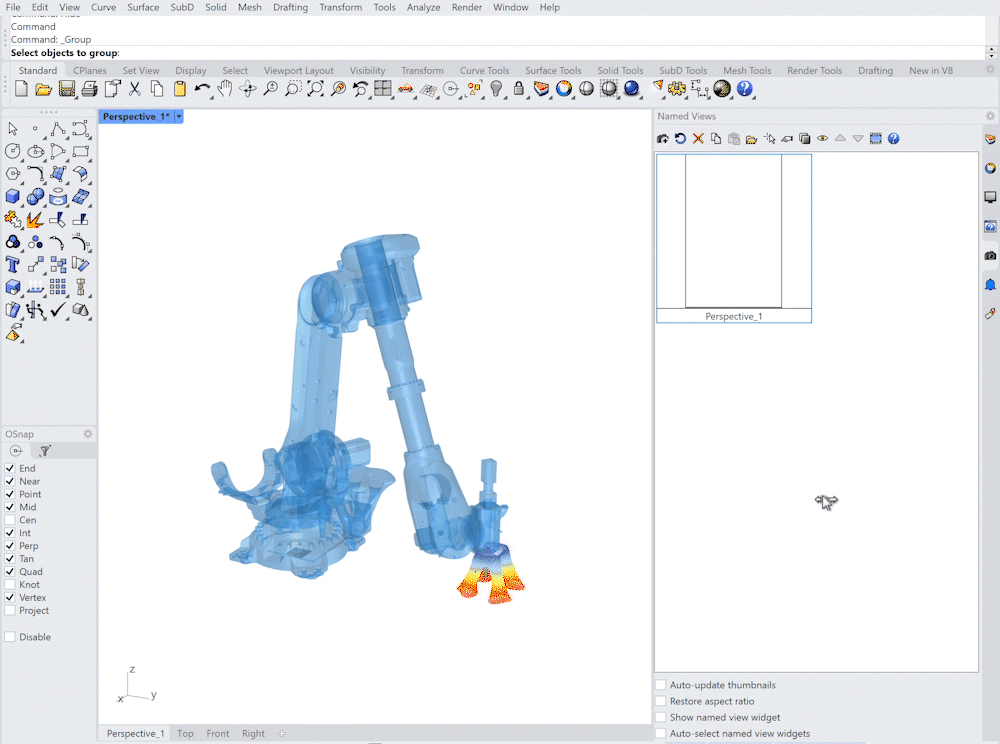{ width="600" }
    <figcaption>Producció pròpia</figcaption>
</figure>

La robòtica és una disciplina que tracta d'investigar i desenvolupar uns sistemes mecànics anomenats robots, els quals tenen una gran varietat d'aplicacions científiques, industrials, domèstiques i comercials.

<figure markdown="span">
    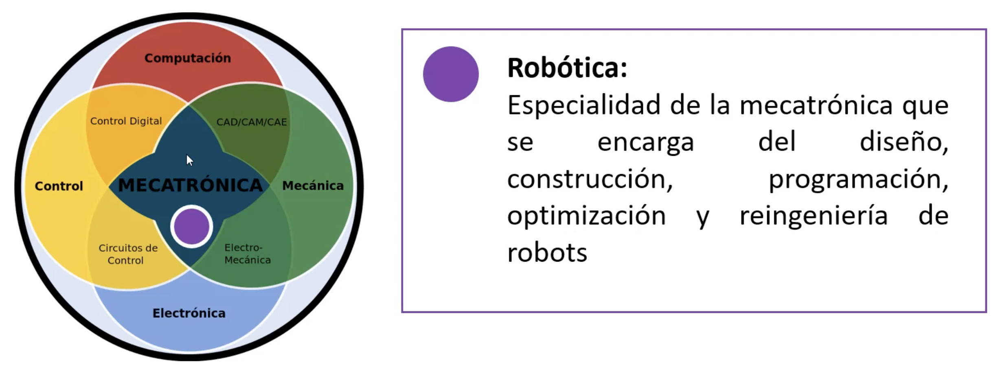{ width="600" }
    <figcaption>Foto de César Chávez: https://youtu.be/x_PvOL_Cvps?si=uwE6qCtyG2a8kXvX</figcaption>
</figure>

<figure markdown="span">
    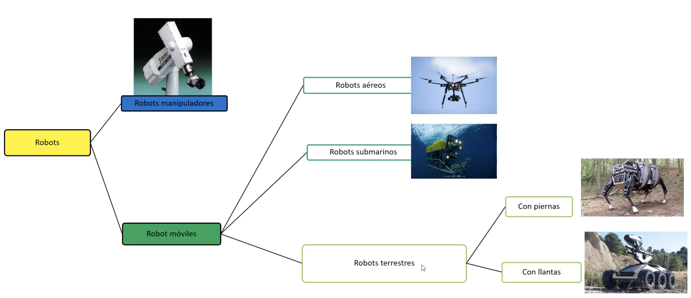{ width="600" }
    <figcaption>Foto de César Chávez: https://youtu.be/x_PvOL_Cvps?si=uwE6qCtyG2a8kXvX</figcaption>
</figure>

Un robot és un manipulador multifuncional reprogramable. L'habilitat de reprogramar és la que dona al robot la seua utilitat, adaptabilitat i versatilitat. Els robots a la industria s'encarreguen d'automatitzar la producció.
Els robots, constitueixen una cadena cinemàtica oberta.

<figure markdown="span">
    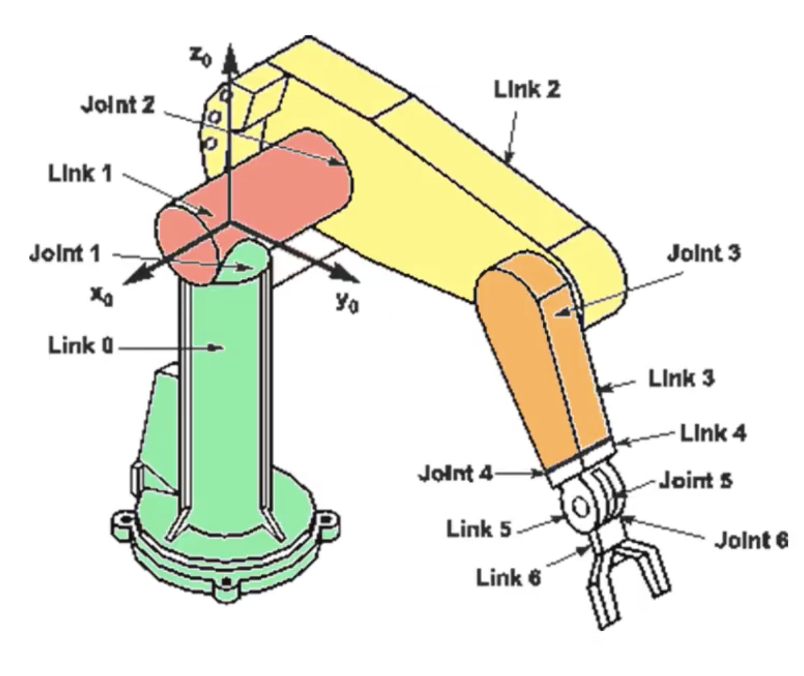{ width="600" }
    <figcaption>Foto de César Chávez: https://youtu.be/x_PvOL_Cvps?si=uwE6qCtyG2a8kXvX</figcaption>
</figure>

<figure markdown="span">
    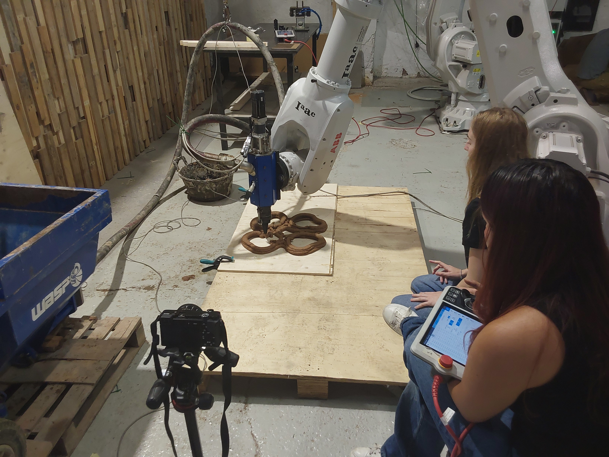{ width="600" }
    <figcaption>Producció pròpia</figcaption>
</figure>

Un robot ha de tindre sis graus de llibertat: tres per posicionament i tres per orientació. Si no en té sis, un robot no pot accedir a tots els punts dins del seu volum o espai de treball amb una orientació arbritrària.
L'espai de treball és el volum total recorregut per l'extrem del robot quan aquest executat tots els seus moviments possibles. L'espai està restringit per la geometria i les restriccions mecàniques de les juntes. 

<figure markdown="span">
    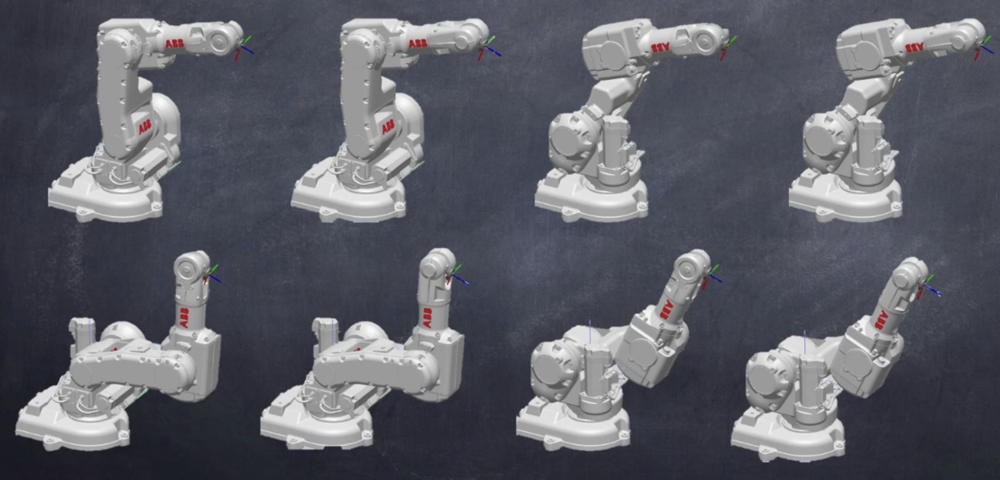{ width="600" }
    <figcaption>Foto de Universitat Politècnica de València: https://youtu.be/U48pJzoX0pU?si=xXBOolhXitef2DFc</figcaption>
</figure>

<figure markdown="span">
    { width="600" }
    <figcaption>Producció pròpia</figcaption>
</figure>

<figure markdown="span">
    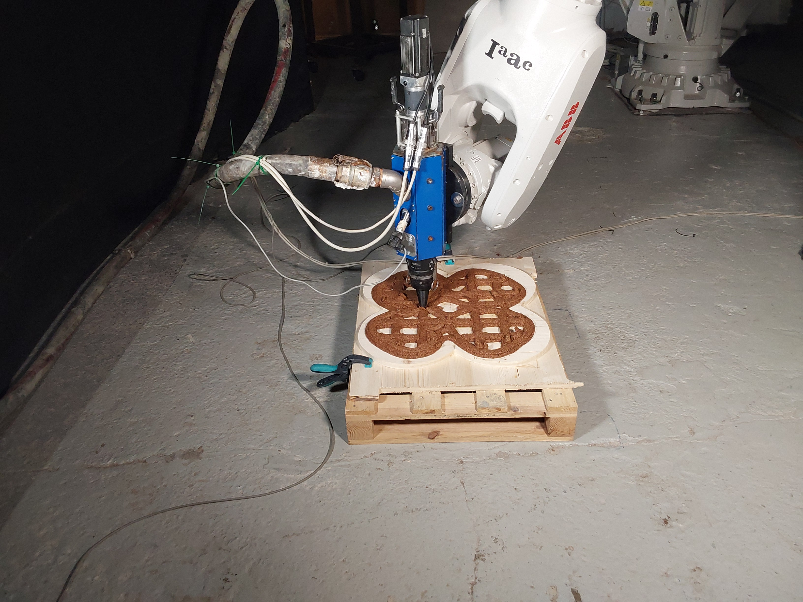{ width="600" }
    <figcaption>Producció pròpia</figcaption>
</figure>

Hi ha dos concepts que cal tindre en compte amb els robots industrials:

- Exactitud: És la mesura que determina tot el que pot apropar-se un manipulador a un punt determinat.

- Repetibilitat: És la capacitat d'un manipulador per tornar a un punt el qual havia assolit amb anterioritat.

<figure markdown="span">
    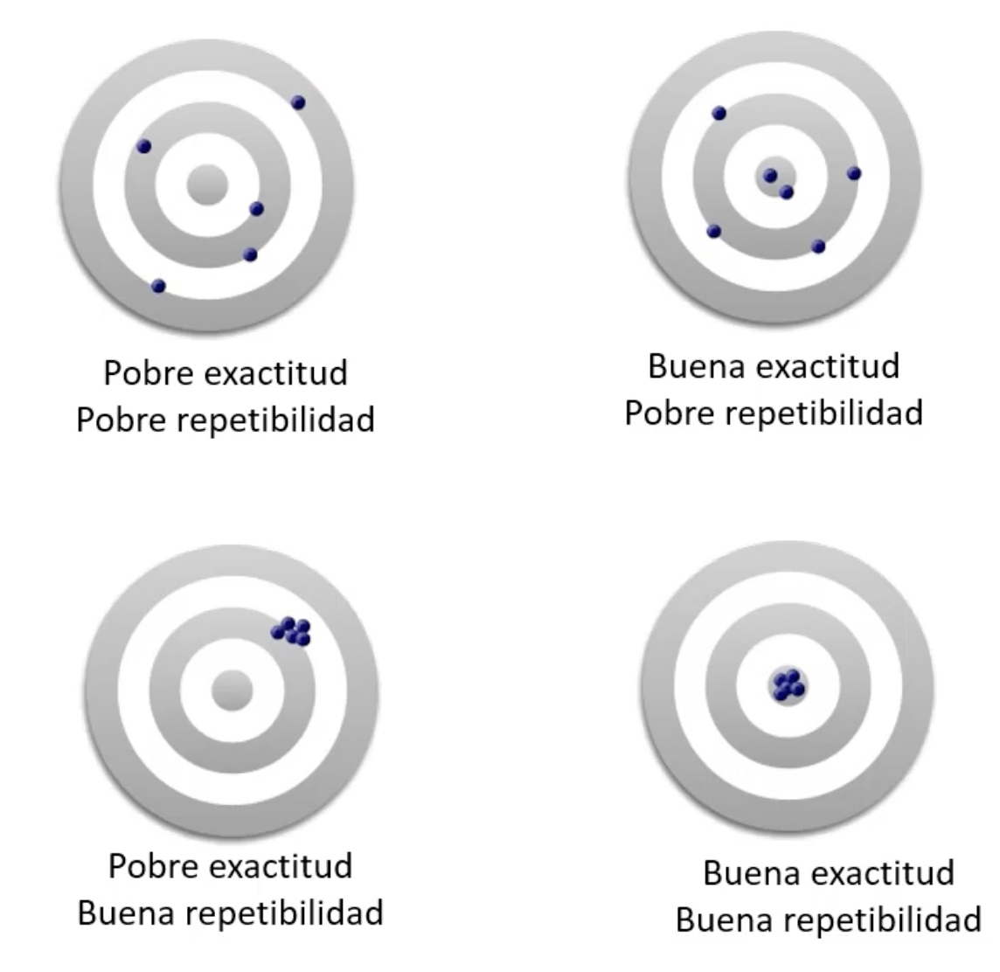{ width="600" }
    <figcaption>Foto de César Chávez: https://youtu.be/x_PvOL_Cvps?si=uwE6qCtyG2a8kXvX</figcaption>
</figure>

L'actuador (o end-effector) és l'eina que es col·locarà a l'extrem del robot.

<figure markdown="span">
    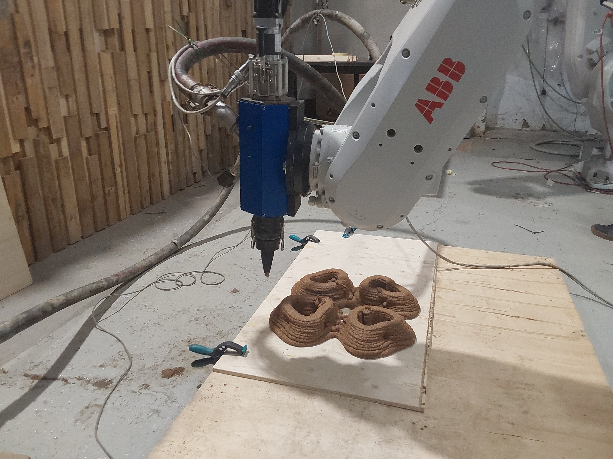{ width="600" }
    <figcaption>Producció pròpia</figcaption>
</figure>

Existeixen tres nivells de programació de robots industrials:

- Nivell robot: Es programa tot el codi indicant moviment, velocitats i actuadors.

- Nivell objecte: En aquest cas, es disposa d'un conjunt de rutines com a primitives i el robot gracies a aquestes les pot adaptar

- Nivell tasca: Ací, només es determina la posició. El robot, a partir de la seua programació interpretarà com fer-ho.

Per programar robots, existeixen diversitats de llenguatges, ja que no estan estandaritzats.

<figure markdown="span">
    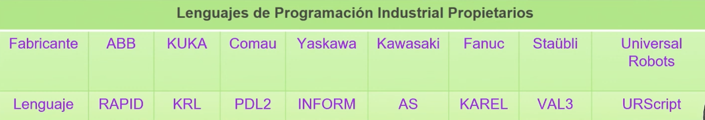{ width="600" }
    <figcaption>Foto de Universitat Politècnica de València: https://youtu.be/U48pJzoX0pU?si=xXBOolhXitef2DFc</figcaption>
</figure>

<figure markdown="span">
    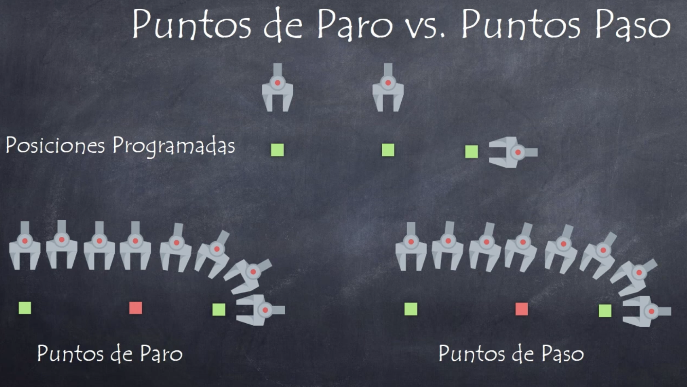{ width="600" }
    <figcaption>Foto de Universitat Politècnica de València: https://youtu.be/U48pJzoX0pU?si=xXBOolhXitef2DFc</figcaption>
</figure>

A l'hora de programar, els punts de parada, interpolen la posició i mantenen una velocitat constant.

<div style="position: relative; padding-bottom: 56.25%; height: 0; overflow: hidden; max-width: 100%; margin-bottom: 24px;">
    <iframe src="https://www.youtube.com/embed/https://youtu.be/BBrLAOr89KY?si=jCvhvbgrbstrT97L" title="YouTube video player" frameborder="0" allow="accelerometer; autoplay; clipboard-write; encrypted-media; gyroscope; picture-in-picture; web-share" referrerpolicy="strict-origin-when-cross-origin" allowfullscreen style="position: absolute; top: 0; left: 0; width: 100%; height: 100%;"></iframe>
</div>

<figure markdown="span">
    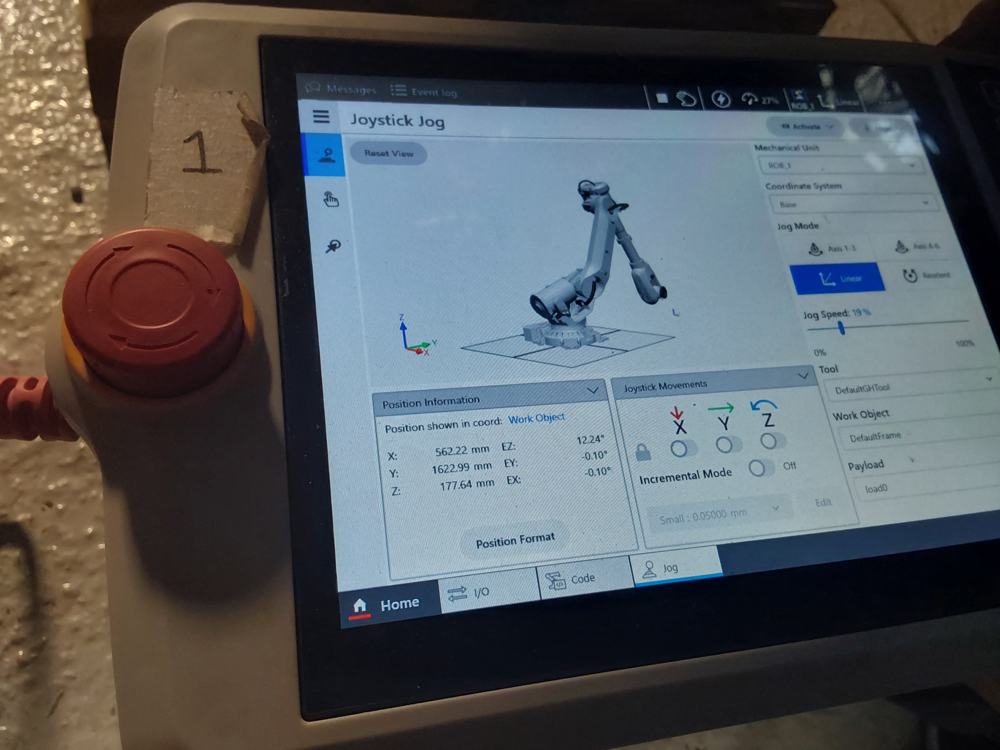{ width="600" }
    <figcaption>Producció pròpia</figcaption>
</figure>

<figure markdown="span">
    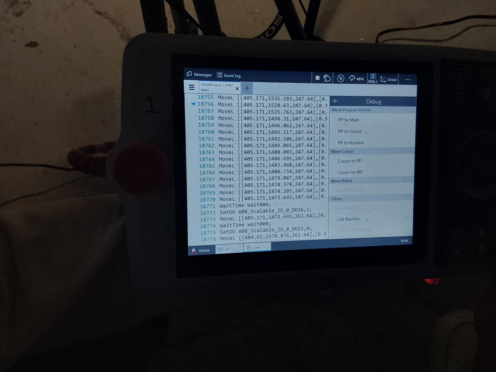{ width="600" }
    <figcaption>Producció pròpia</figcaption>
</figure>


## Bibliografia

- https://youtu.be/ldK49aQk01k?si=hPgdnU55ASCvHbVV
- https://youtu.be/gxC0hV9MkW4?si=zBMZYWqB5UgjGoZt
- https://www.haascnc.com/service/service-content/guide-procedures/mill---g-codes.html#gsc.tab=0
- https://youtu.be/AMsFpDHanDI?si=L296jtK6R-KRNY7t
- https://youtu.be/Ls9MNu8CA6c?si=sMYUoNUAVkchpD1t
- https://youtu.be/tQqw0utbx9o?si=aFDS8nZCi78QroU6
- https://youtu.be/Eh5D_kUtCJE?si=rysSzuadcCH64ghb
- https://youtu.be/d4w4ii1umqw?si=x0n7hr-gAfk8Xy72
- https://youtu.be/uE9LTJwCCAI?si=RGuY9lwC1gtHidOg
- https://youtu.be/ZchOy9UVjJw?si=XzyHUvAmQ4NIi87P
- https://youtu.be/JPvkoq0_YhM?si=cydR8es-7d_cr6mc
- https://youtu.be/tQqw0utbx9o?si=w_7sCpOc4kSchBDH
- https://youtu.be/XZtquL7ypsQ?si=Fe5ndq8N9ohtiVZS
- https://youtu.be/WuV71AhbRHc?si=Rz4kxopG9LeStx2z
- https://youtu.be/y9doqBR_RTk?si=KWjNrrhigmpaq97S
- https://youtu.be/ysZo38ii-zU?si=mCRDwH1b40_PXkn9
- https://youtu.be/ux58mHH7PCU?si=HumqN8I1_gWpJZcs
- https://youtu.be/na0RyfBNY8k?si=AcBzpnNON25vy6XM
- https://youtu.be/2AokUrGqB3M?si=h8eDvjLowausf8NK
- https://youtu.be/kYZVsE992sM?si=MRlgRcz6oA1-ZxtR
- https://youtu.be/qlDrGygqb6g?si=sOSfmf4RaH1ezhtL
- https://youtu.be/s5tzbl8Ce7k?si=V3kVMXoW6H35bCXf
- https://youtu.be/Hqa_40Agcw8?si=HQowwyXLiv0MeJPm
- https://youtu.be/gpKxls6KpZ4?si=5QjgvqVaRFIBJV1E
- https://youtu.be/tC7jfKrcGYo?si=U4m1Ca1-EvxyHIvd
- https://youtu.be/usxl_5sQJiI?si=jAqvnXK3P5ezy0jD
- https://youtu.be/El8ucn7pPps?si=lK0b_IYc37s-25dM
- https://www.lsrpf.com/es/blog/precision-cnc-milling-explained-process-advantages-and-key-applications
- https://www.youtube.com/watch?v=x_PvOL_Cvps
- https://www.youtube.com/watch?v=CzdfIzwP5p4
- https://www.youtube.com/watch?v=BBrLAOr89KY
- https://www.youtube.com/watch?v=U48pJzoX0pU&list=PLjzuoBhdtaXNJsStcYKhRM8q3rBqWGV2J
- https://youtu.be/RUOVfhYTkug?si=Y5EkgkmmwwVDpGLp
- https://youtu.be/MEM6pOk74II?si=sXKEhOWiHqQa60FC
- https://youtu.be/X5-9Qj_TsoE?si=uWrHYMFNasWDqb5j
- https://youtu.be/6b_4A8HMNQY?si=u-v7Cm_JB-Qo9PiH
- https://youtu.be/SEaobruYOCM?si=illTlA9JodJOB3md
- https://youtu.be/rvgUYeDGRKI?si=ZblQoe5LHzcs5zmf
- https://youtu.be/1EGJXvpmhVs?si=YzI10ET2QKm8VTYn
- https://youtu.be/DTlr5OireSU?si=5sGvh58GHmFISmmy
- https://youtu.be/vC1wua6nLcA?si=NhHUM_WMLXaA_3TW
- https://youtu.be/0RqXxT9u_Xc?si=T3VziqacEV2eDu9X
- https://youtu.be/JkI-Ep0Sm3E?si=X0YbxrWA_BXaUggW
- https://youtu.be/meHgUV0LP9E?si=LlQ5ZqY2WtSUVUUR
- https://youtu.be/8AbA9TJG4aU?si=bQYh5iJZPfpkzNEX
- https://youtu.be/xzmk_afdpmk?si=WdN4HuEsx7Id50Vo
- https://www.youtube.com/watch?v=Fd7wjZDoh7g

