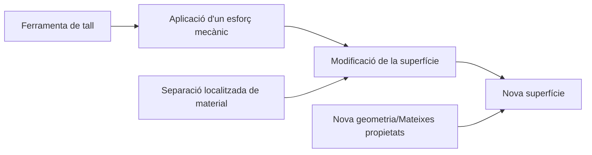
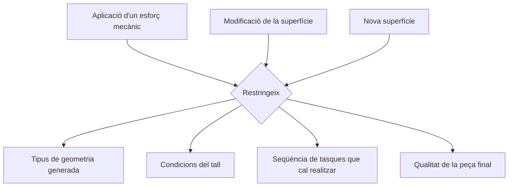
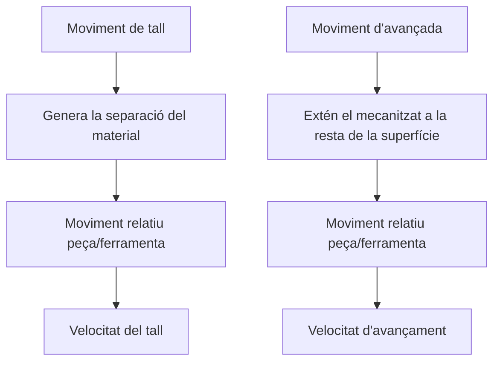
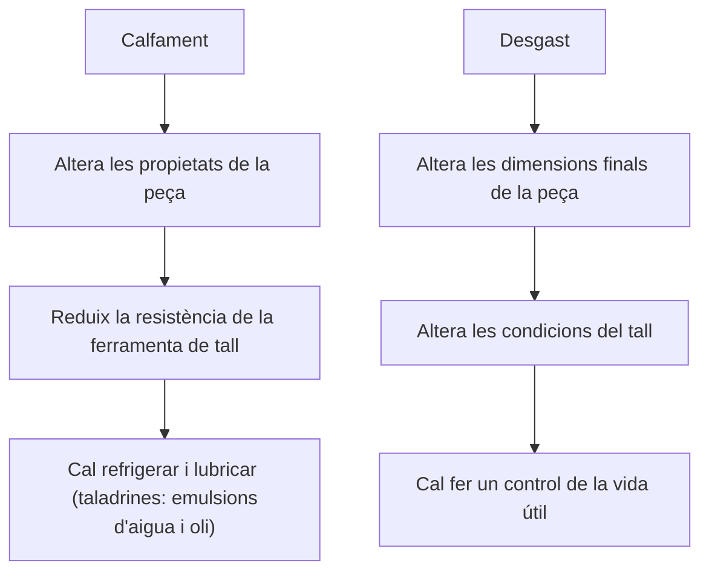
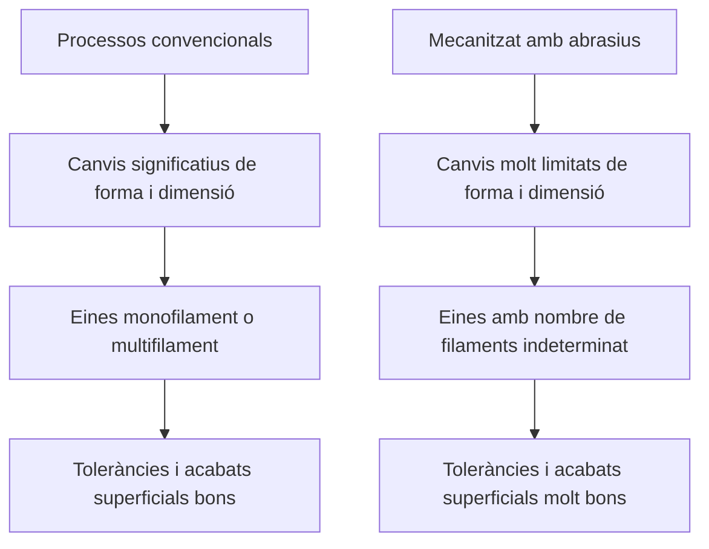

# Processos de mecanització i control numèric (CNC)

## Generalitats de la conformació per arrancada de material

Els processos d'arrancada de material consisteixen a la retirada de material de la superfície d'un 'totxo' d'una manera controlada. Aquesta retirada pot realitzar-se mitjançant un procés químic o físic. Així doncs, és possible classificar-los en dos grups principals:

- Processos d'arrancada de material: On s'usa una ferramenta de tall.
- Processos no convencionals: Processos fisicoquímics en ausència d'una ferramenta de tall.

<figure markdown="span">
    { width="600" }
    <figcaption>Foto de FerrePro: https://ferrepro.mx/mecanizado-por-arranque-de-viruta/</figcaption>
</figure>

Respecte de l'arrancada de material, s'ha de seguir la seüent lògica:



En aquest flux de traball, l'arrancada està influenciada per:




### Conceptes bàsics 

Dins de l'arrancada, cal destacar les característiques següents:

- Es tracta d'un procés on es realitzen canvis de forma prou significatius en comparació a la peça base
- Genera desperdici en forma de viruta
- S'obtenen peces acabades, les quals no requereixen postprocesat
- S'assoleixen toleràncies i acabats superficials prou superiors a la resta de processos de conformat
- Dona la possibilitat d'obtindre tot tipus de geometria, tant senzilles com complexes

***Què caracteritza el procés d'arrancada?***


<figure markdown="span">
    { width="600" }
    <figcaption>Foto de Mundo Fresadora: https://mundofresadora.blogspot.com/2016/01/uso-y-aplicaciones-especificas-de-las.html</figcaption>
</figure>

El material arrancat s'anomena viruta

<figure markdown="span">
    { width="800" }
    <figcaption>Foto de Ingenierizando: https://www.ingenierizando.com/fabricacion/viruta/</figcaption>
</figure>

<figure markdown="span">
    { width="800" }
    <figcaption>Foto de ingenieria mecanica blog: https://ingenieriamecanicacol.blogspot.com/2023/05/teoria-del-maquinado-de-metales.html</figcaption>
</figure>

<figure markdown="span">
    { width="800" }
    <figcaption>Foto de Universitat Politècnica de València: https://youtu.be/ldK49aQk01k?si=yGAJzxiSOeM9M4SH</figcaption>
</figure>

***Efectes principals del procés de tall***



### Eines de tall

Hi ha dos tipus principals de tipologia de la ferramenta:



## Màquines eina

Els processos d'arrancada convencionals es classifiquen en els següents:

### Planejadora
Cepilladora

### Llimadora
Limadora

### Mortasadora
Mortajadora

### Brotxadora
Brochadora

### Torn

### Fresadora

Important fresar sempre en concordància (quan es tracte de programació)

<figure markdown="span">
    { width="800" }
    <figcaption>Foto de Universidade da Coruña: https://lim.ii.udc.es/docencia/din-proind/docs/respuestas/p75.htm</figcaption>
</figure>

### Perforadora 
Taladradora

### Rectificadora

Consisteix a utilitzar uns queixals que tenen diverses geometries en funció de la geometria de la peça que es vol treballar i que es mouen mitjançant gir i rotació respecte del seu eix. 

<figure markdown="span">
    { width="600" }
    <figcaption>Foto de Wikimedia: https://commons.wikimedia.org/wiki/File:GrindingStraightWheelH468V.jpg</figcaption>
</figure>

<figure markdown="span">
    { width="600" }
    <figcaption>Foto de Wikimedia: https://commons.wikimedia.org/wiki/File:Unbestimmte_Schneide.svg</figcaption>
</figure>

Els queixals, tenen una gradària del gra molt controlada, amb l'objectiu d'arrancar material d'una manera uniforme, estan algutinats i presenten porositat. Arranca molt poca quantitat i no està controlat l'angle d'incidència. Pel desgrast del gra i l'aglutinant, els grans superficials es desprenen i els interiors (no desgagstats) continuen actuant. És important adquar els queixals quan aquests han patit desgast.

#### Rectificat en pla

En aquest cas, el queixal pot actuar de manera forntal o perifèrica. 

<figure markdown="span">
    { width="600" }
    <figcaption>Foto de Euskal Herriko Unibertsitatea EHU: https://studylib.es/doc/6363477/rectificadora-tangencial</figcaption>
</figure>

<figure markdown="span">
    { width="600" }
    <figcaption>Foto de Universitat Politècnica de València: https://youtu.be/gxC0hV9MkW4?si=Lgg-dpw-6TWXu242</figcaption>
</figure>

Depenent del tipus de col·locació del queixal, canviarà la geometria del queixal mateix.

<figure markdown="span">
    { width="600" }
    <figcaption>Foto de Wikimedia: https://commons.wikimedia.org/wiki/File:Unbestimmte_Schneide.svg</figcaption>
</figure>

#### Rectificat cilíndric

Si es tracta de geometries de revolució, caldrà fer ús del rectificat cilindric. 
És possible combinar diversos tipus de geometria amb diversitat de moviments d'avançament per realitzar el rectificat. 

<figure markdown="span">
    { width="600" }
    <figcaption>Foto de Universitat Politècnica de València: https://youtu.be/gxC0hV9MkW4?si=Lgg-dpw-6TWXu242</figcaption>
</figure>

Aquest rectiicat, també pot tractar superficies interiors o exteriors:

<figure markdown="span">
    { width="600" }
    <figcaption>Foto de Euskal Herriko Unibertsitatea EHU: https://studylib.es/doc/6363477/rectificadora-tangencial</figcaption>
</figure>

<figure markdown="span">
    { width="600" }
    <figcaption>Foto de Euskal Herriko Unibertsitatea EHU: https://studylib.es/doc/6363477/rectificadora-tangencial</figcaption>
</figure>

A banda, dins dels tipus de rectificat cilíndric, també existeix l'anomenat "sense centres". En aquest cas, la peça no és subjecta a cap eix, sinó que és guiada per uns rodets que controlen el moviment contra el queixal. Els rodets, permeten treballar peces d'una massa més elevada i un treball en sèrie.

<figure markdown="span">
    { width="600" }
    <figcaption>Foto de Richconn: https://richconn.com/es/centerless-grinding-101/</figcaption>
</figure>

### Brunyit i superacabat

El brunyit, és el procés que s'utilitza per millorar l'acabat de rectificat. Es realitza mitjançant les passades de pedres de brunyit sense molta pressió per la superfície. Aquest procés permet assolir toleràncies i rugositats molt xicotetes.

<figure markdown="span">
    { width="600" }
    <figcaption>Foto de Universitat Politècnica de València: https://youtu.be/gxC0hV9MkW4?si=7IHJh7LzWi__j7bj</figcaption>
</figure>

<figure markdown="span">
    { width="600" }
    <figcaption>Foto de WAYKEN: https://waykenrm.com/es/blogs/honing-process/</figcaption>
</figure>

La ferramenta es desplaça en vertical i rotant sobre l'eix. En el superacabat, però, la pedra està subjectada amb un útil i és la peça la que gira sobre sí mateixa. 

<figure markdown="span">
    { width="600" }
    <figcaption>Foto de Universitat Politècnica de València: https://youtu.be/gxC0hV9MkW4?si=7IHJh7LzWi__j7bj</figcaption>
</figure>

### Polit i lapat

En aquest cas, no existeis una eina específica que realitze l'acció, sinó que hi ha un útil que subjecta en forma de pols o solució aquosa l'abrasiu perquè actue sobre la peça. L'objectiu és millorar la qualitat superficial. Es tracta d'un procés manual només automatitzat en alguns casos. 

<figure markdown="span">
    { width="600" }
    <figcaption>Foto de machinemfg: machinemfg.com</figcaption>
</figure>

<figure markdown="span">
    { width="600" }
    <figcaption>Foto de Shengen Fab: shengenfab.com</figcaption>
</figure>

<figure markdown="span">
    { width="600" }
    <figcaption>Foto de demaquinasyherramientas: demaquinasyherramientas.com</figcaption>
</figure>

<figure markdown="span">
    { width="600" }
    <figcaption>Foto de Universitat Politècnica de València: https://youtu.be/gxC0hV9MkW4?si=7IHJh7LzWi__j7bj</figcaption>
</figure>


## Mecanització d'alta precisió

S'utilitzen amb abrasius, es caracteritzen per tindre un nombre de filaments indeterminats que actuen de forma aleatòria sobre la peça, els quals retiren molt poc material a elevades velocitats de tall i on cal controlar l'elevada temperatura generada per la velocitat amb refrigerants.
És important destacar que les toleràncies i acabats que permeten els abrasius és molt elevada, per aquest motiu, són habitualment utilitzats amb funció de postprocessat.

### Electroerosió

### Rectificació

### Tornejament de precisió

### Fresatge de precisió


## Programació i control numèric

Per controlar les màquines de fabricació (fresadores, impressores 3D, plotters de tall...) s'ha de programar el seu moviment i les funcions que farà durant aquest moviment. Per fer-ho s'usen els anomenats ```g-code``` i ```m-code```.   

### Automatització


### Programació CNC 

#### Alguns comandaments essencials de codi G:

**G00** representa moviments ràpids.

```
 G00 X5 Y10 Z5;
```
**G01** Talla en una línia recta. Aquest, cal acompanyar-ho del comandament `F`, el qual representa el 'Feed Rate' de la màquina (mm/min).

```
G01 X10 Y0 F500;
```

**G02** Talla una corba en sentit horari. Cal acompanyar-ho de `R` (radi).

```
G02 X2 Y10 R5;
```

**G03** Corba tallada en sentit antihorari.

```
G03 X10 Y-10 R5;
```

**G5** Arista matada

**G7** Arista viva

**G21** Estableix el mode mètric.

**G20** Estableix el mode imperial.

**G40** Desactiva la compensació de la ferramenta.

**G41** Compensació lateral ferramenta (es mou cap a l'esquerra)

**G42** Compensació lateral ferramenta (es mou cap a la dreta)

**G43** Compensació longitud

Exemple complet bàsic amb compensació

```
O0001
G21 G17 G90        ; mm, pla XY, coordenades absolutes
G00 X0 Y0 Z5       ; posició inicial
T01 M06            ; canvi d'eina
G43 H01 Z2         ; compensació de longitud
M03 S1000          ; rotatció del broquet

; Activació de la compensació de radi
G00 X10 Y-5
G01 G41 D01 Y0 F150  ; activar G41 amb corrector D01

; Trajectòria de mecanitzat
G01 X50
G01 Y30
G01 X10
G01 Y0

; Cancel·lació de la compensació
G01 G40 Y-5          ; G40 = cancel·lar compensació
G00 Z50
M05
M30
```

**G53** Coordenades de la màquina

**G54** Coordenades del sistema (Offset)

**G83** Peck drilling

```
G83 X Y Z R P Q F
```

**G90** Distàcies absolutes.

**G91** Distàncies incrementals.

**G94** 'Feed Rate' establit en `mm` o `inch` / min, la qual cosa depen de si `G20` o `G21` està aplicat.

**G95** 'Feed Rate' establit en `mm` o `inch` / revolució


---

#### Alguns comandaments essencials de codi M:

**M0** Pausa la màquina, quan és polsa sobre l'actuador de la màquina una altra vegada continuarà des d'on està.

**M2** Acaba el programa.

**M3** Comença a girar el fus en sentit horari. Pot combinar-se amb el comandament `S` per determinar la velocitat de gir RPM

```
M3 S1200;
``` 

**M4** Comença a girar el fus en sentit antihorari. Pot combinar-se amb el comandament `S` per determinar la velocitat de gir RPM. Cal tindre ne compte, però, que calen unes eines especials per treballar en sentit antihorari.

```
M4 S1200;
``` 

**M5** Para el gir del fus.

**M8** Comença l'enfredament per aigua o activa un relé SSR (Relé d'Estat Sòlid).

**M9** Para l'enfredament per aigua o activa un relé SSR (Relé d'Estat Sòlid).

**M30** Para el programa i torna a la primera línia

**M98** Comença subprograma

**M99** Acaba subprograma


---

#### Codis de lletres

**F** Feed Rate

**R** Radi

**S** velocitat del fus

**X** Moure's en direcció X

**Y** Moure's en direcció Y

**Z** Moure's en direcció Z

**N** Número de línia

**I** Distància en X al centre quan es fa un cercle

**J** Distància en Y al centre quan es fa un cercle. Exemple: ```G3 X-10 Y-5 I-5 J0```

### Robots industrials


## Bibliografia

- https://youtu.be/ldK49aQk01k?si=hPgdnU55ASCvHbVV
- https://youtu.be/gxC0hV9MkW4?si=zBMZYWqB5UgjGoZt
- https://www.haascnc.com/service/service-content/guide-procedures/mill---g-codes.html#gsc.tab=0
