# Conformació de materials 

## Fonaments de la conformació per deformació plàstica: fonaments i anàlisis de tensió i deformació

La deformació plàstica consisteix en l'aplicació d'un esforç mecànic mitjançant càrregues sobre el material per aconseguir superanr el límit de fluència del material modificant la geometria i que el canvi de forma siga permanent per obtenir una nova geometria, la qual depenent de les condicions de treball i les propietats del material poden ser distintes respecte a les considerades inicialment

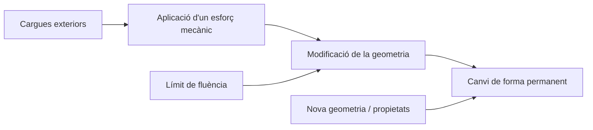
``` mermaid
graph LR
  A[Cargues exteriors] --> B[Aplicació d'un esforç mecànic];
  B --> C[Modificació de la geometria];
  D[Límit de fluència] --> C;
  C -->E[Canvi de forma permanent];
  F[Nova geometria / propietats] -->E;
```

Aquest procés es restrigeix d'acord amb:

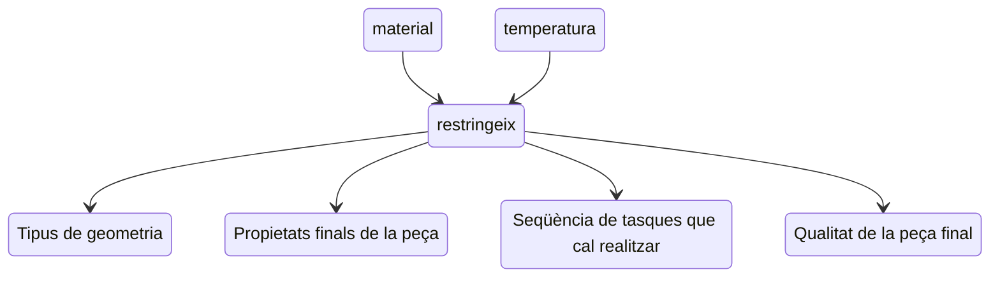
``` mermaid
stateDiagram-v2
  state material
  state temperatura
    material --> restringeix
    temperatura --> restringeix
    restringeix --> S1
    restringeix --> S2
    restringeix --> S3
    restringeix --> S4
    S1: Tipus de geometria
    S2: Propietats finals de la peça
    S3: Seqüència de tasques que cal realitzar
    S4: Qualitat de la peça final
```

La deformació plàstica per tant és la deformació aplicada a un material no recuperable

<figure markdown="span">
    { width="300" }
    <figcaption>Foto de Juan Manuel Vallejos: https://youtu.be/5u1yQZHw1iA?si=0obRAIccrV5Q-MD6</figcaption>
</figure>

La deformació plàstica provoca:

- Canvis de forma significatius respecte a la matèria de partida.
-  Millores en les característiques mecàniques del material.
- En alguns casos s'obtenen peces acabades sense necessitat de processament posterior.
- Toleràncies més ajustades i acabats superficials millors que en peces obtingudes per fosa.
- Possibilitat d'obtenir tant geometries senzilles com complexes.

Els efectes de la temperatura en el procés de deformació plàstica es basen en l'assoliment de la temperatura de recristalització, la qual es pot definir com la meitat de la de fusió. Arribar a aquesta temperatura provoca un creiximent del gra i canvia la localització de la deformació en la estrucutra (a les vores del gra o al gra). Si es treballa per sota de la T s'anomenta conformat en fred i si es treballa per damunt conformat en calent.

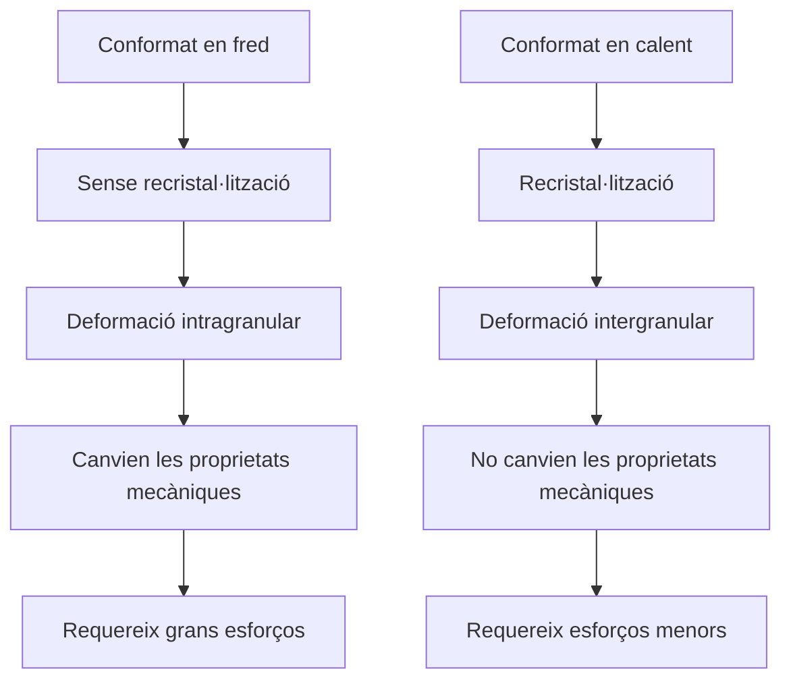
``` mermaid
graph TB
    A["Conformat en fred"]
    A --> B["Sense recristal·lització"]
    B --> C["Deformació intragranular"]
    C --> D["Canvien les proprietats mecàniques"]
    D --> E["Requereix grans esforços"]

    F["Conformat en calent"]
    F --> G["Recristal·lització"]
    G --> H["Deformació intergranular"]
    H --> I["No canvien les proprietats mecàniques"]
    I --> J["Requereix esforços menors"]
```

Les formes inicials inclouen barres, totxos cilíndrics, totxos rectangulars i planxes, així com altres formes similars elementals. Els processos de deformació volumètrica que refinen les formes originals, algunes vegades milloren les propietats mecàniques. El treball dels processos de deformació consisteix a sotmetre el metall a un esforç suficient per a fer que aquest fluisca plàsticament i prenga la forma desitjada.

### Conformat en fred

El treball en fred o sota la temperatura de cristal·lització és apropiat quan el canvi de forma és menys sever i hi ha necessitat de millorar les propietats mecàniques, o aconseguir un bon acabat en la peça final.

<figure markdown="span">
    { width="600" }
    <figcaption>Foto de Universitat Politècnica de València: https://www.weerg.com/es/guias/galvanizacion</figcaption>
</figure>

Les operacions de treball en fred es poden usar no solament per a donar forma al producte, sinó també per a incrementar la seva resistència mitjançant l'enduriment per deformació.

Això provoca que el material no estiga homogeneïtzat; tensions residuals als materials; un augment de la duresa, el límit elàstic i la fragilitat; i que l'esforç requerit depenga del grau de deformació.

### Conformat en calent

El treball en calent es requereix generalment quan involucra la deformació volumètrica de grans peces de treball. En aquest cas, ocorre una major homogeneïtat del material, No s'acumulen tensions residuals al material, les proprietats mecàniques no són afectades, i l'esforç que es requereix depen de la velocitat de deformació.

<figure markdown="span">
    { width="600" }
    <figcaption>Foto de Universitat Politècnica de València: https://www.weerg.com/es/guias/galvanizacion</figcaption>
</figure>

Amb les operacions de treball en calent es poden aconseguir canvis significatius en la forma de les peces de treball.

## Processos de deformació volumètrica

``` mermaid
graph TB
    A["Processos de deformació volumètrica"]
    A --> B["Canvis significatius de forma (3D)"]
    B --> C["Conformat en calent"]
    C --> D["Toleràncies i acabats superficials limitats"]

    E["Processos de conformat de xapa"]
    E --> F["Canvis en forma 2D, mantenint un espessor]
    F --> G["Conformat en fred"]
    G --> H["Toleràncies i acabats superficials bons"]
```

### Laminatge

El laminatge és un procés de deformació en el qual el gruix del material de treball es redueix mitjançant forces de compressió exercides per dos corrons oposats.

<figure markdown="span">
    { width="600" }
    <figcaption>Foto de Fundamentos de la manufactura moderna</figcaption>
</figure>

El procés s'usa per a reduir el gruix d'una secció transversal rectangular. Un procés estretament relacionat és el laminatge de perfils, en el qual una secció transversal quadrada es transforma en un perfil, tal com en una biga en I.

La majoria del laminatge es realitza en calent a causa de la gran quantitat de deformació requerida. Els metalls laminats en calent estan generalment lliures d'esforços residuals i les seues propietats són isotròpiques. Els desavantatges són que el producte no pot mantenir-se dins de toleràncies adequades, i la superfície presenta una capa d'òxid característica.

El treball comença amb un lingot d'acer fos recentment solidificat. Encara calent, el lingot es col·loca en un forn on roman durant moltes hores, fins a aconseguir la temperatura uniforme en tota la seua extensió, perquè puga fluir consistentment durant el laminatge.

El lingot reescalfat passa al molí de laminació, on es lamina per a convertir-lo en una de les tres formes intermèdies anomenades lupies, totxos o planxes.

Les lupies es laminen per a generar perfils estructurals i raïls per a ferrocarril. Els totxos es laminen per a produir barres i varetes. Aquestes formes són la matèria primera per al maquinat, estirat de filferro, forjat i altres processos de treball de metalls. Les planxes es laminen per a convertir-les en plaques, làmines i tires.

<figure markdown="span">
    { width="600" }
    <figcaption>Foto de Fundamentos de la manufactura moderna</figcaption>
</figure>

Involucra el laminatge de planxes, tires, làmines i plaques, peces de treball de secció transversal rectangular amb un ample
major que el gruix. En el laminatge pla, es pressiona el treball entre dos corrons de manera que el seu gruix es redueix a una quantitat anomenada *draft*

La fricció es presenta en el laminatge amb un cert coeficient de fricció, i la força de compressió dels corrons, multiplicada per aquest coeficient de fricció, dona per resultat una força de fricció entre els corrons i el treball. En el costat de l'entrada del punt neutre la força de fricció té una direcció; en l'altre costat, té la direcció oposada. No obstant això, les dues forces no són iguals. La força de fricció és major en l'entrada, de manera que la força neta estira el treball a través dels corrons. El laminatge no seria possible sense aquestes diferències. Hi ha un límit per al màxim *draft* possible que pot aconseguir el laminatge pla amb un coeficient de fricció

El laminatge en calent es caracteritza sovint per una condició anomenada adherència, en la qual la superfície calenta del material de treball es pega als corrons sobre l'arc de contacte. Aquesta condició ocorre sovint en el laminat d'acers i aliatges per a alta  temperatura. Quan ocorre l'adherència, el coeficient de fricció pot ser tan alt com 0.7. La conseqüència de l'adherència és que les capes superficials del material de treball no es poden moure a la mateixa velocitat que la velocitat del corró *vr*; i sota la superfície la deformació és més severa a fi de permetre el pas de la peça a través de l'obertura entre els corrons.

<figure markdown="span">
    { width="600" }
    <figcaption>Foto de Fundamentos de la manufactura moderna</figcaption>
</figure>

Variació típica de pressió al llarg de la longitud de contacte en el laminatge pla. La pressió pic es localitza en el punt neutre. L'àrea sota la corba, representada per la integral, és la força de laminació F.

<figure markdown="span">
    { width="600" }
    <figcaption>Foto de Fundamentos de la manufactura moderna</figcaption>
</figure>

#### Laminatge de perfils

<figure markdown="span">
    { width="600" }
    <figcaption>Foto de Voestalpine: https://www.voestalpine.com/sadef/es/Laminado-en-frio</figcaption>
</figure>

En el laminatge de perfils, el material de treball es deforma per a generar un contorn en la secció transversal. Els productes fets per aquest procediment inclouen perfils de construcció com a bigues en I, en L i canals en O.

Els corrons formadors són més complicats; i el material inicial, de forma usualment quadrada, requereix una transformació gradual a través de diversos corrons per a aconseguir la secció final. El disseny de la seqüència de les formes intermèdies i els corresponents corrons es diu disseny de passades de laminació. La seva meta és aconseguir una deformació uniforme

#### Molins laminadors

<figure markdown="span">
    { width="600" }
    <figcaption>Foto de Fundamentos de la manufactura moderna</figcaption>
</figure>

Es disposa de diverses configuracions de molins de laminació:

Dos corrons oposats i es denomina molí de laminació de dos corrons, aquesta, pot ser reversible o no reversible. En el molí no reversible els corrons giren sempre en la mateixa direcció i el treball sempre passa a través del mateix costat. El molí reversible permet la rotació dels corrons en totes dues direccions, de manera que el treball pot passar a través de qualsevol direcció. Això permet una sèrie de reduccions que es fan a través del mateix joc de corrons, passant simplement el treball diverses vegades des de direccions oposades. El desavantatge de la configuració reversible és la quantitat significativa de moviment angular a causa de la rotació de grans corrons

En la configuració de tres corrons, hi ha tres corrons en una columna vertical i la direcció de rotació de cada corró roman sense canvi. Per a aconseguir una sèrie de reduccions es pot passar el material de treball en qualsevol direcció, ja siga elevant o baixant la tira després de cada pas. L'equip en un molí de tres corrons es torna més complicat a causa del mecanisme elevador que es necessita per a elevar o baixar el material de treball.

En els molins de quatre corrons s'usen dos corrons de diàmetre menor per a fer contacte amb el treball i dos corrons darrere com a suport, A causa de les altes forces de laminatge, els corrons menors podrien desviar-se elàsticament amb el pas de la laminació, si no fos pels corrons més grans de suport que els suporten.

Una altra configuració que permet l'ús de corrons menors contra el treball és el molí en conjunt o ram.

Per a aconseguir altes velocitats de rendiment en els productes estàndard s'usa freqüentement un molí de corrons en tàndem. Aquesta configuració consisteix en una sèrie de bastidors de corrons i cadascun realitza una reducció en el gruix o un refinament en la forma del material de treball que passa entre ells. A cada pas de laminació s'incrementa la velocitat, fent significatiu el problema de sincronitzar les velocitats dels corrons en cada etapa.

Els avantatges inclouen: eliminació de fosses de reescalfat, reducció del espai en les instal·lacions i temps de manufactura més  curts. Aquests avantatges tècnics es tradueixen en beneficis econòmics per a aquells molins que poden realitzar la colada contínua i la laminació.

#### Altres processos de laminatge

##### Laminatge de cordes

<figure markdown="span">
    { width="600" }
    <figcaption>Foto de Fundamentos de la manufactura moderna</figcaption>
</figure>

El laminatge de cordes s'usa per a formar cordes en peces cilíndriques mitjançant la seva laminació entre dos encunys. És el procés comercial més important per la producció massiva de components amb cordes externes (perns i caragols)

La majoria de les operacions de laminatge de cordes es realitza per treball en fred, utilitzant màquines laminadores de cordes. Aquestes màquines estan equipades amb encunys especials que determinen la grandària i forma de la corda; els encunys són de dos tipus: encunys plans que es mouen alternadament entre si i encunys rodons, que giren relativament entre si per a aconseguir l'acció de laminatge.

##### Laminatge d'anells

<figure markdown="span">
    { width="600" }
    <figcaption>Foto de Fundamentos de la manufactura moderna</figcaption>
</figure>

El laminatge d'anells és un procés de deformació que lamina les parets gruixudes d'un anell per a obtenir anells de parets més primes, però d'un diàmetre major.

El laminatge d'anells s'aplica usualment en processos de treball en calent per a anells grans i en processos de treball en fred per a anells petits. Els avantatges del laminatge  d'anells sobre altres mètodes per a fabricar les mateixes peces són: l'estalvi de matèries primeres, l'orientació ideal dels grans per a l'aplicació i l'enduriment a través del treball en fred.

##### Laminat d'engranatges

Aquest és un procés de format en fred que produeix certs engranatges. És similar al laminatge de cordes, excepte perquè les característiques de deformació dels cilindres o discos s'orienten paral·lelament al seu eix (o a un angle en el cas d'engranatges helicoidals), en lloc de l'espiral del laminatge de cordes.

##### Perforat de corrons

<figure markdown="span">
    { width="600" }
    <figcaption>Foto de Fundamentos de la manufactura moderna</figcaption>
</figure>

És un procés especialitzat de treball en calent per a fer tubs sense costura de parets gruixudes. Utilitza dos corrons oposats i per tant s'agrupa entre els processos de laminatge. El procés es basa en el principi que en comprimir un sòlid cilíndric sobre la seva circumferència, es generen alts esforços de tensió en el seu centre. Si la compressió és prou alta, es forma
una esquerda interna. Aquest principi s'aprofita en el perforat de corrons. Els esforços de compressió s'apliquen sobre el totxo sòlid cilíndric per dos corrons. Un mandril s'encarrega de controlar la grandària i acabat de la perforació creada per l'acció. S'usen els termes perforat rotatori de tubs i procés *Mannesmann* per a aquesta operació en la fabricació de tubs.

### Forjat

El forjat és un procés de deformació en el qual es comprimeix el material de treball entre dos encunys, usant impacte o pressió gradual per a formar la peça. Aquests components inclouen cigonyals i bieles per a motors de combustió interna, engranis, components estructurals per a aviació i peces per a turbines i motors de propulsió. S'usa el forjat per a fixar la forma bàsica de grans components que després es maquinen per a aconseguir la seva forma final i dimensions definitives.

Una manera de classificar les operacions de forja és mitjançant la temperatura de treball. La majoria de les operacions de forja es realitza en calenta (per dalt o per sota de la temperatura de cristal·lització), donada la deformació que demanda el procés i la necessitat de reduir la resistència i incrementar la ductilitat del metall de treball; no obstant això, el forjat en fred és molt comú per a uns certs productes. L'avantatge del forjat en fred és que incrementa la resistència que resulta de l'enduriment per deformació del component.

En el forjat s'aplica la pressió per impacte o en forma gradual. Una màquina de forjat que aplica càrregues d'impacte es diu martinet de nit de forja, mentre que la que aplica pressió gradual es diu premsa de forjat.

Una altra diferència entre les operacions de forjat és el grau en què els encunys restringeixen el flux del metall de treball. Hi ha tres tipus d'operacions de forjat: a) forjat en encuny obert, b) forjat en encuny impressor i c) forjat sense rebava. En el forjat en encuny obert, el treball es comprimeix entre dos encunys plans (o gairebé plans), permetent que el metall flueixi sense restriccions en una direcció lateral respecte a les superfícies de l'encuny. En el forjat en encuny impressor, les superfícies de l'encuny contenen una forma o impressió que s'imparteix al material de treball durant la compressió, restringint significativament el flux de metall. En aquesta mena d'operació, una part del metall flueix més enllà de l'encuny impressor formant una rebava, com es mostra en la figura.

En el forjat sense rebava, l'encuny restringeix completament el material de treball dins de la cavitat i no es produeix rebava excedent. És necessari controlar estretament el volum de la peça inicial perquè iguali al volum de la cavitat de l'encuny.

<figure markdown="span">
    { width="600" }
    <figcaption>Foto de Fundamentos de la manufactura moderna</figcaption>
</figure>

<figure markdown="span">
    { width="600" }
    <figcaption>Foto de Fundamentos de la manufactura moderna</figcaption>
</figure>

<figure markdown="span">
    { width="600" }
    <figcaption>Foto de Fundamentos de la manufactura moderna</figcaption>
</figure>

#### Anàlisi del forjat en encuny obert

Si el forjat en encuny obert es duu a terme sota condicions ideals, sense fricció entre el treball i la superfície de l'encuny, ocorre una deformació homogènia i el flux radial de material és uniforme al llarg de la seva altura

Una operació real de recalcat no ocorre com una deformació homogènia, pel fet que la fricció s'oposa al flux de metall en la superfície dels encunys. Això crea un efecte d'inflor en forma de barril, anomenat abarrilament. Quan es fa un treball en calent amb encunys freds, el abarrilament és més pronunciat. Això es deu a un coeficient de fricció més alt, típic del treball en calent, i a la transferència de calor en la superfície de l'encuny i les seues zones properes, la qual cosa refreda el metall i augmenta la seua resistència a la deformació. El metall més calent es troba enmig de la peça i flueix més fàcilment que el material més fred dels extrems. L'efecte s'accentua en augmentar la relació entre el diàmetre i l'altura de la peça, a causa de la major àrea de contacte en la interfície encuny-treball.

Les formes generades per operacions en encuny obert són simples, com a fletxes, discos i anells. Les operacions de forja en encuny obert produeixen formes rudimentàries que necessiten operacions posteriors per a refinar les peces a les seves dimensions i forma final. Una contribució important del forjat en calent en encuny obert és la creació d'un flux de grans i d'una estructura metal·lúrgica favorable en el metall.

Les operacions classificades en la categoria d'encuny obert són operacions relacionades i poden realitzar-se amb encunys convexos, amb encunys còncaus i per seccions. El forjat amb encunys convexos *fullering* és una operació de forja que s'utilitza per a reduir la secció transversal i redistribuir el metall en una peça de treball, com a preparació per a operacions posteriors de format amb forja. Les cavitats de l'encuny per al forjat amb encunys convexos es dissenyen sovint amb múltiples cavitats d'impressió, de manera que la barra inicial pugui formar-se toscament abans del format. El forjat amb encunys còncaus és similar a l'anterior, excepte perquè els encunys tenen superfícies còncaves. Una operació de forjat per seccions consisteix en una seqüència de compressions forjades al llarg d'una peça de treball per a reduir la seva secció transversal i incrementar la seva longitud.

<figure markdown="span">
    { width="600" }
    <figcaption>Foto de Fundamentos de la manufactura moderna</figcaption>
</figure>

#### Forjat amb encuny impressor

El forjat amb encuny impressor, anomenat algunes vegades forjat en encuny tancat, es realitza amb encuny que té la forma inversa de la requerida per a la peça. La peça de treball inicial es mostra com una peça cilíndrica similar a la de les operacions prèvies en encuny obert. En tancar-se l'encuny i arribar a la seva posició final, el metall flueix més enllà de la cavitat de l'encuny i forma una rebava en la petita obertura entre les plaques de l'encuny. Encara que la rebava s'ha de retallar després, té realment una funció important en el forjat per impressió, ja que quan aquesta comença a formar-se en el buit de l'encuny, la fricció s'oposa al fet que el metall continuï fluint cap a l'obertura, i d'aquesta manera força al material de treball a romandre en la cavitat.

En el forjat en calent, la restricció del flux de metall és major pel fet que la rebava prima es refreda ràpidament contra les plaques de l'encuny, incrementant la resistència a la deformació. La restricció del flux de metall en l'obertura fa que les pressions de compressió s'incrementin significativament, forçant al material a omplir els detalls algunes vegades intricats de la cavitat de l'encuny.

<figure markdown="span">
    { width="600" }
    <figcaption>Foto de Fundamentos de la manufactura moderna</figcaption>
</figure>

A causa de la formació de rebava en el forjat amb encuny impressor i a les formes més complexes de les peces fetes amb aquests encunys, les forces en aquest procés són considerablement més grans i més difícils d'analitzar que en el forjat en encuny obert.

El forjat amb encuny impressor no té toleràncies estretes de treball i freqüentment es requereix el maquinat per a aconseguir la precisió necessària. El procés de forjat genera la configuració geomètrica bàsica de la peça i el maquinat realitza els acabats de precisió que es requereixen en algunes porcions de la peça (per exemple, perforacions, cordes i superfícies que han de coincidir amb altres components). Els avantatges del forjat sobre el maquinat complet de la peça són: velocitats de producció més altes, conservació del metall, major resistència i orientació més favorable dels grans de metall.

<figure markdown="span">
    { width="600" }
    <figcaption>Foto de Fundamentos de la manufactura moderna</figcaption>
</figure>

Els processos de forjat amb la capacitat de produir seccions més primes, formes més complexes, toleràncies més estretes i la virtual eliminació de toleràncies al maquinat es coneixen com a forjat de precisió. Els metalls més comuns que s'usen en el forjat de precisió són l'alumini i el titani. En la comparació del forjat de precisió i el forjat convencional amb encuny impressor es pot observar que el forjat de precisió en aquest exemple no elimina les rebaves, encara que sí que les redueix. Algunes operacions de forjat de precisió es realitzen sense produir rebava. El forjat de precisió es classifica pròpiament com un procés de manera neta o quasi neta, depenent de la necessitat del maquinat per a acabar la forma de la peça.

<figure markdown="span">
    { width="600" }
    <figcaption>Foto de Fundamentos de la manufactura moderna</figcaption>
</figure>

#### Forjat sense rebava

El forjat amb encuny impressor es diu algunes vegades forjat en encuny tancat. No obstant això, hi ha una distinció tècnica entre el forjat amb encuny impressor i forjat amb encuny tancat real. La distinció és que en el forjat amb encuny impressor, la peça de treball original queda continguda completament dins de la cavitat de l'encuny durant la compressió i no es forma rebava. Per a identificar aquest procés és apropiat el terme forjat sense rebava.

El forjat sense rebava imposa uns certs requeriments sobre el control del procés, més exigents que el forjat amb encuny impressor. Més important és que el volum de material de treball ha d'igualar al volum de la cavitat de l'encuny dins de molt estretes toleràncies. Si la peça en blanc inicial és massa gran, la pressió excessiva pot causar mal a l'encuny o a la premsa. Si la peça en blanc és massa petita, no s'omplirà la cavitat. A causa d'aquest requeriment especial, el procés és més adequat en la manufactura de peces geomètriques simples i simètriques, i per a treballar metalls com l'alumini, el magnesi o els seus aliatges. El forjat sense rebava es classifica sovint com un procés de forjat de precisió.

<figure markdown="span">
    { width="600" }
    <figcaption>Foto de Fundamentos de la manufactura moderna</figcaption>
</figure>

### Extrusió 

<figure markdown="span">
    { width="600" }
    <figcaption>Foto de Fundamentos de la manufactura moderna</figcaption>
</figure>

L'extrusió és un procés de format per compressió en el qual el metall de treball és forçat a fluir a través de l'obertura d'un encuny per a donar-li forma a la seva secció transversal.

1- es pot extruir una gran varietat de formes, especialment amb extrusió en calenta; no obstant això, una limitació de la configuració geomètrica és que la secció transversal ha de ser la mateixa al llarg de tota la peça; 
2- l'estructura del gra i les propietats de resistència es milloren amb l'extrusió en fred o en calent; 
3- són possibles toleràncies molt estretes, especialment quan s'usa extrusió en fred; 
4- en algunes operacions d'extrusió es genera poc o cap material de desaprofitament.

Una manera de classificar les operacions és atenent la seva configuració física; es distingeixen dos tipus principals: extrusió directa i extrusió indirecta.

A l'extrusió directa (també anomenada extrusió cap endavant) un totxo de metall es carrega en un recipient, i un pistó comprimeix el material forçant-lo a fluir a través d'una o més obertures en un encuny a l'extrem oposat del recipient. En aproximar-se el pistó a l'encuny, una petita porció del totxo roman i no pot forçar-se a través de l'obertura de l'encuny. Aquesta porció extra, anomenada topall o cap, se separa del producte, tallant-la justament després de la sortida de l'encuny.

<figure markdown="span">
    { width="600" }
    <figcaption>Foto de Fundamentos de la manufactura moderna</figcaption>
</figure>

Un problema en l'extrusió directa és la gran fricció que existeix entre la superfície del treball i les parets del recipient en forçar el lliscament del totxo cap a l'obertura de l'encuny. Aquesta fricció ocasiona un increment substancial de la força requerida en el pistó per a l'extrusió directa. En l'extrusió en calenta aquest problema s'agreuja per la presència d'una capa d'òxid en la superfície del totxo que pot ocasionar defectes en els productes extruïts.

Per a resoldre aquest problema s'usa un bloc simulat entre el pistó i el totxo de treball; el diàmetre del bloc és lleugerament menor que el diàmetre del totxo, de manera que en el recipient queda un anell estret de metall de treball (capes d'òxid en la seva majoria), deixant el producte final lliure d'òxids.

En l'extrusió directa es poden fer seccions buides. El totxo inicial es prepara amb una perforació paral·lela al seu eix. Això permet el pas d'un mandril que es fixa en el bloc simulat.

<figure markdown="span">
    { width="600" }
    <figcaption>Foto de Fundamentos de la manufactura moderna</figcaption>
</figure>

En l'extrusió indirecta, també anomenada extrusió cap enrere i extrusió inversa, l'encuny està muntat sobre el pistó, en lloc d'estar en l'extrem oposat del recipient. En penetrar el pistó en el treball, força al metall a fluir a través del clar en una direcció oposada a la del pistó. Com el totxo no es mou respecte al recipient, no hi ha fricció en les parets del recipient. Per consegüent, la força del pistó és menor que en l'extrusió directa. Les limitacions de l'extrusió en directe es deuen a la menor rigidesa del pistó buit i a la dificultat de sostenir el producte extruït tal com surt de l'encuny.

<figure markdown="span">
    { width="600" }
    <figcaption>Foto de Fundamentos de la manufactura moderna</figcaption>
</figure>

Hi ha limitacions pràctiques en la longitud de la peça extruïda que poden resoldre's per aquest mètode. El sosteniment del pistó es converteix en un problema a mesura que la longitud de treball augmenta.

Extrusió en fred versus extrusió en calenta L'extrusió es pot realitzar ja siga en fred o en calent, depenent del metall de treball i de la magnitud de la deformació al fet que se subjecte el material durant el procés. Els metalls típics que s'extrueixen en calent són: alumini, coure, magnesi, zinc, estany i els seus aliatges. Aquests mateixos materials s'extrueixen algunes vegades en fred. Els aliatges d'acer s'extrueixen usualment en calent, encara que els graus més suaus i més dúctils s'extrueixen algunes vegades en fred.

L'extrusió en calenta involucra l'escalfament previ del totxo a una temperatura per sobre de la seva temperatura de cristal·lització.Això redueix la resistència i augmenta la ductilitat del metall, permetent majors reduccions de grandària i l'assoliment de formes més complexes amb aquest procés

Quan el refredament del totxo entra en contacte amb les parets del recipient és un problema; per a superar-lo s'usa algunes vegades l'extrusió isotèrmica. La lubricació és un aspecte crític de l'extrusió en calenta d'uns certs metalls (per exemple, acer), i s'han desenvolupat lubrificants especials que són efectius sota les condicions agressives de l'extrusió en calenta. Algunes vegades s'usa el vidre com a lubrificant de l'extrusió en calenta; a més de reduir la fricció, proporciona aïllament tèrmic efectiu entre el totxo i el recipient d'extrusió.

En general, l'extrusió en fred i l'extrusió per sota de la seva temperatura de cristal·lització s'usen per a produir peces discretes, habitualment en forma acabada (o en forma gairebé acabada).

<figure markdown="span">
    { width="600" }
    <figcaption>Foto de Fundamentos de la manufactura moderna</figcaption>
</figure>

Els factors importants en un encuny d'extrusió són l'angle de l'encuny i la forma de l'orifici. L'angle de l'encuny, més precisament la meitat de l'angle de l'encuny, és l'angle *alpha*. Per a angles menors, l'àrea superficial de l'encuny augmenta, així com també la fricció en la interfície encuny-totxo. Major fricció significa major força en el pistó. D'altra banda, un angle gran de l'encuny ocasiona major turbulència del flux de metall durant la reducció, i també increment en la força requerida del pistó. L'efecte de l'angle de l'encuny sobre la força del pistó és una funció en forma de U.

<figure markdown="span">
    { width="600" }
    <figcaption>Foto de Fundamentos de la manufactura moderna</figcaption>
</figure>

Els materials per a encunys d'extrusió en calenta inclouen acers per a eina i acers aliats. Les propietats més importants d'aquests materials per a encunys són alta resistència al desgast, alta duresa en calenta i alta conductivitat tèrmica per a remoure la calor del procés. Els materials per a encunys d'extrusió en fred inclouen acers per a eina i carburs cimentats. Les seves propietats desitjables són resistència al desgast i bona disposició per a retenir la seva forma baix alts esforços. Els carburs s'usen quan es requereixen altes velocitats de producció, llarga vida en els encunys i bon control dimensional.

#### Defectes d'extrusio

A causa de la considerable deformació associada a les operacions d'extrusió, poden ocórrer nombrosos defectes en els productes extruïts. Els defectes es poden classificar en les següents categories:

a) Rebentat central. Aquest defecte és una esquerda interna que es genera com a resultat dels esforços de tensió al llarg de la línia central de la peça de treball durant l'extrusió. Encara que els esforços de tensió poden semblar improbables en un procés de compressió com l'extrusió, tendeixen a ocórrer baix condicions que ocasionen gran deformació en regions de treball apartades de l'eix central. El moviment de material més gran a les regions exteriors estira el material al llarg del centre de la peça de treball. Si els esforços són prou grans, ocorre el rebentat central.

b) Tubificat (bossa de contracció) La tubificació és un defecte associat amb l'extrusió directa. És un enfonsament en l'extrem del totxo.

c) Esquerdat superficial Aquest defecte és resultat de les altes temperatures de la peça de treball que causen el desenvolupament d'esquerdes en la superfície; ocorre sovint quan la velocitat d'extrusió és massa alta i condueix a altes velocitats de deformació associades amb generació de calor. Altres factors que contribueixen a l'esquerdament superficial són l'alta fricció i el refredament ràpid de la superfície dels totxos a altes temperatures en l'extrusió en calenta.

<figure markdown="span">
    { width="600" }
    <figcaption>Foto de Fundamentos de la manufactura moderna</figcaption>
</figure>

### Trefilatge

<figure markdown="span">
    { width="600" }
    <figcaption>Foto de Fundamentos de la manufactura moderna</figcaption>
</figure>

L'estiratge és una operació on la secció transversal d'una barra, vareta o filferro es redueix en tirar del material a través de l'obertura d'un encuny. 

Les característiques generals del procés són similars a les de l'extrusió; la diferència és que en l'estiratge el material de treball s'estira a través de l'encuny, mentre que en l'extrusió s'empeny a través d'ell. Encara que la presència d'esforços de tensió és òbvia en l'estiratge, la compressió també juga un paper important, ja que el metall es comprimeix en passar a través de l'obertura de l'encuny. Per aquesta raó, la deformació que ocorre en l'estiratge es diu algunes vegades compressió indirecta.

<figure markdown="span">
    { width="600" }
    <figcaption>Foto de Fundamentos de la manufactura moderna</figcaption>
</figure>

Abans de l'estiratge, el material inicial ha de preparar-se adequadament. Això involucra tres passos: 1) recuit, 2) neteja i 3) esmolat. El propòsit de la recuita és incrementar la ductilitat del material per a acceptar la deformació durant l'estiratge. Com ja es va dir, algunes vegades es necessiten passos de recuita en l'estiratge continu. La neteja del material es requereix per a prevenir danys en la superfície de treball i en l'encuny d'estiratge. Això involucra la remoció dels contaminants de la superfície (per exemple, capes d'òxid i corrosió) per mitjà de banys químics o neteja amb doll de municions. En alguns casos es lubrifica la superfície de treball després de la neteja.
L'esmolat implica la reducció del diàmetre de l'extrem inicial del material, de manera que puga inserir-se a través de l'encuny d'estiratge per a iniciar el procés; això s'aconsegueix generalment mitjançant estampat, laminat o tornejat. L'extrem esmolat del material se subjecta a les mordasses de la corredissa o a altres dispositius per a iniciar el procés d'estiratge.

## Conformació de xapa: processos amb separació de material i sense

El treball metàl·lic de làmines inclou operacions de tall i format realitzades sobre làmines primes de metall. Els gruixos del material típics estan entre 0.4 mm i 6 mm. Quan el gruix excedeix de 6 mm se'n diu placa en lloc de làmina.

La majoria dels processos amb làmines metàl·liques es realitza a temperatura ambient (treball en fred), excepte quan el material és gruixut, fràgil o la deformació és significativa. Aquests són els casos usuals de treball en calent sota la temperatura de cristal·lització més que treball en calent per sobre d'aquesta temperatura.

La majoria de les operacions amb làmines metàl·liques s'executen en màquines eina anomenades premses. S'usa el terme premsa d'estampat per a distingir aquestes premses de les premses de forjat i extrusió. Les eines que s'usen per a fer el treball en làmines es diuen punxó i encuny; també s'usa el terme encuny estampat. Els productes fets de làmina es diuen encunyacions o estampats.

### Operacions de tall

El tall de làmina es realitza per una acció de cisalla entre dues vores esmolades de tall.

<figure markdown="span">
    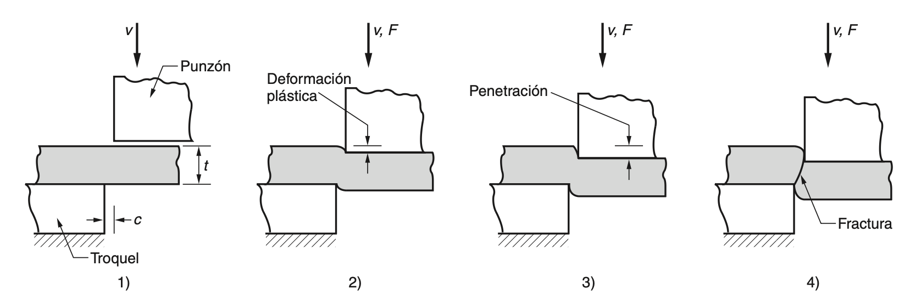{ width="600" }
    <figcaption>Foto de Fundamentos de la manufactura moderna</figcaption>
</figure>

La vora superior de tall (el punxó) es mou cap avall sobrepassant la vora estacionària inferior de tall (l'encuny). Quan el punxó comença a empènyer el treball, ocorre una deformació plàstica en les superfícies de la làmina; conforme aquest es mou cap avall, ocorre la penetració, en la qual comprimeix la làmina i tala el metall. Aquesta zona de penetració és generalment una tercera part del gruix  de la làmina. A mesura que el punxó continua el seu viatge dins del treball, s'inicia la fractura en aquest entre les dues vores de tall. Si l'espai entre el punxó i l'encuny és correcte, les dues línies de fractura es troben i el resultat és una separació neta de treball en dues peces.

<figure markdown="span">
    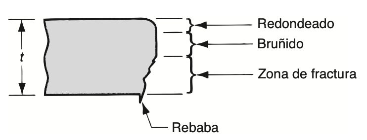{ width="600" }
    <figcaption>Foto de Fundamentos de la manufactura moderna</figcaption>
</figure>

Damunt de la superfície de tall hi ha una regió que es diu arrodonit. Aquest correspon a la depressió feta pel punxó en el treball abans de començar el tall. Aquí és on comença la deformació plàstica del treball: just a baix de l'arrodonit hi ha una regió relativament llisa anomenat brunyit. Aquesta resulta de la penetració del punxó en el material abans de començar la fractura. Sota el brunyit està la zona de fractura, una superfície relativament tosca de la vora de tall on el moviment continu del punxó cap avall causa la fractura del metall. Finalment, al fons de la vora està la rebava, un tall causat per l'elongació del metall durant la separació final de les dues peces.

Hi ha tres operacions principals en el treball de premsa que tallen el metall pel mecanisme de cisalla.

- El cisallat és l'operació de tall d'una làmina de metall al llarg d'una línia recta entre dues vores de tall. El cisallat s'usa típicament per a reduir grans làmines a seccions més petites per a operacions posteriors de premsatge.

<figure markdown="span">
    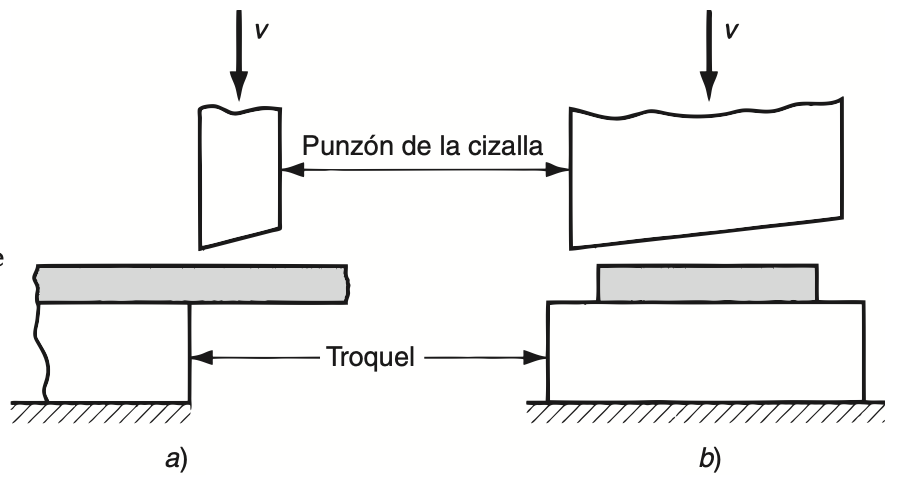{ width="600" }
    <figcaption>Foto de Fundamentos de la manufactura moderna</figcaption>
</figure>

- El punxonament implica el tall d'una làmina de metall al llarg d'una línia tancada en un sol pas per a separar la peça del material circumdant. La peça que es talla és el producte desitjat en l'operació i es designa com la part o peça desitjada.

- El perforat és molt similar al punxonament, excepte perquè la peça que es talla es rebutja i es diu trossaria. El material romanent és la peça desitjada.

<figure markdown="span">
    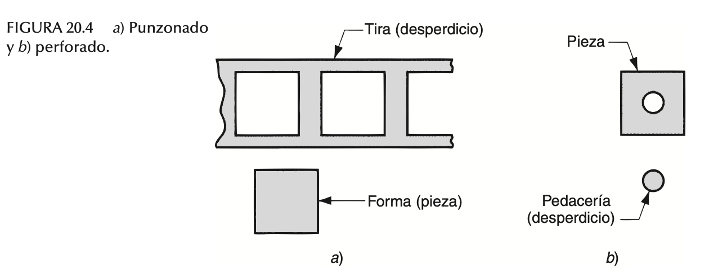{ width="600" }
    <figcaption>Foto de Fundamentos de la manufactura moderna</figcaption>
</figure>

<figure markdown="span">
    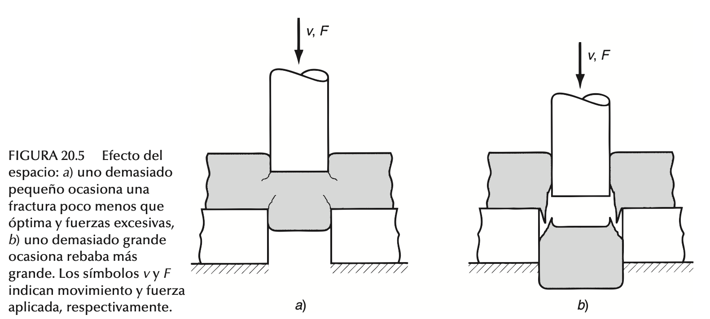{ width="600" }
    <figcaption>Foto de Fundamentos de la manufactura moderna</figcaption>
</figure>

### Encunyat

L'encunyat és una aplicació especial del forjat sense rebava mitjançant el qual s'imprimeixen els fins detalls de l'encuny en la superfície superior i en el fons de la peça de treball. En l'encunyat hi ha poc flux de metall; no obstant això, les pressions requerides per a reproduir els detalls superficials de la cavitat de l'encuny són altes.

<figure markdown="span">
    { width="600" }
    <figcaption>Foto de Fundamentos de la manufactura moderna</figcaption>
</figure>

A més del cisallat, punxonament i perforat, hi ha algunes altres operacions de tall en el premsatge.

El ***tall en trossos*** és una operació de tall en el qual les peces se separen d'una tira de làmina metàl·lica tallant els encunys oposats de la peça en seqüència. Les característiques que distingeixen l'operació de tall en trossos del tall convencional són: 1) les vores de tall no són necessàriament rectes, i 2) les peces es poden empalmar en la tira de tal manera que s'evite el desaprofitament.

La ***partició*** involucra el tall d'una tira de làmina de metall per un punxó amb dues vores de tall que coincideixen amb els costats oposats de la peça. Això pot requerir-se quan els contorns de la peça tenen forma irregular que impedeixen el seu entroncament perfecte en la tira.

<figure markdown="span">
    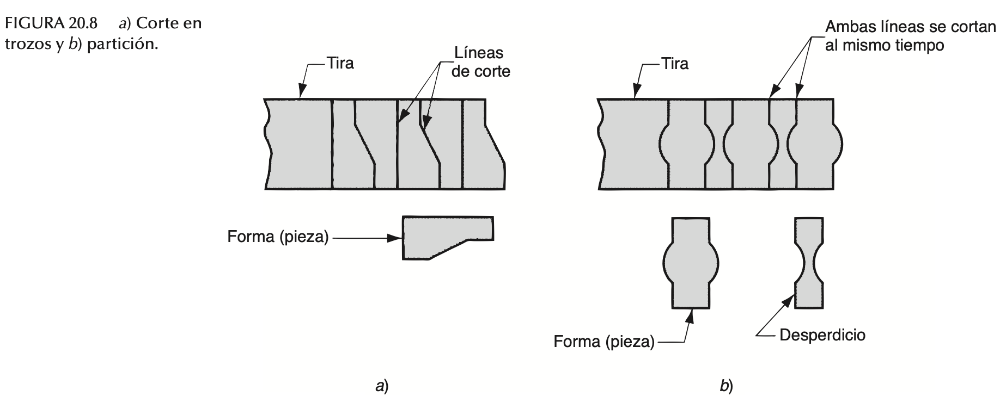{ width="600" }
    <figcaption>Foto de Fundamentos de la manufactura moderna</figcaption>
</figure>

El terme ***ranurat*** s'usa algunes vegades per a l'operació de punxonament en la qual es talla un forat rectangular o allargat. El ***perforat múltiple*** involucra la perforació simultània de diversos forats en una làmina de metall.

Per a obtindre el contorn desitjat d'una forma, es tallen sovint porcions de làmina per ***oscat*** o ***semioscat***. El oscat és el tall d'una porció de l'metall en un costat de la làmina o tira. El semioscat retalla una porció del metall de l'interior de la làmina. La diferència respecte al perforat o ranurat és que el metall remogut pel semioscat crea part del contorn de la peça, mentre que el perforat i el ranurat genera forats en la forma o peça.

<figure markdown="span">
    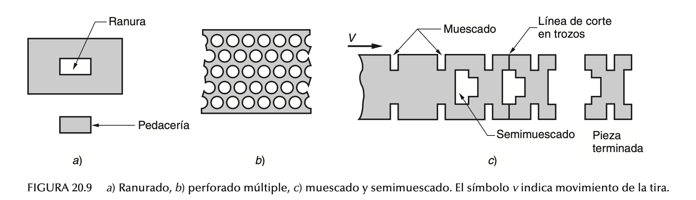{ width="600" }
    <figcaption>Foto de Fundamentos de la manufactura moderna</figcaption>
</figure>

La retallada és una operació de tall que es realitza en una peça ja formada per a remoure l'excés de metall i fixar la seua grandària. El rasurat és una operació de tall realitzat amb un espai molt xicotet destinada a obtindre dimensions precises i vores llises i rectes. El punxonament fi és una operació de cisallat que s'usa per a tallar peces amb toleràncies molt estretes i obtindre vores rectes i llises en un sol pas.

<figure markdown="span">
    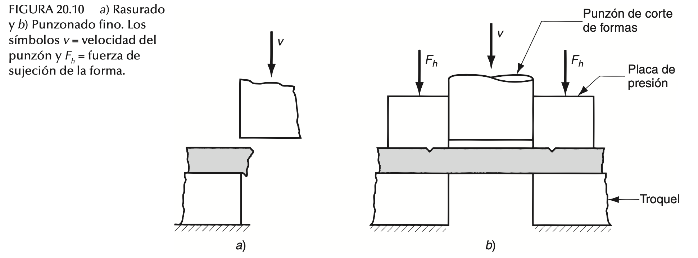{ width="600" }
    <figcaption>Foto de Fundamentos de la manufactura moderna</figcaption>
</figure>

### Doblat

<figure markdown="span">
    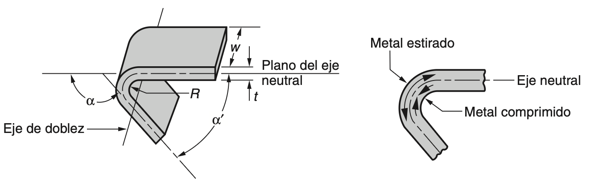{ width="600" }
    <figcaption>Foto de Fundamentos de la manufactura moderna</figcaption>
</figure>

El doblegat es defineix com la deformació del metall al voltant d'un eix recte. Durant l'operació de doblegat, el metall dins del pla neutral es comprimeix, mentre que el metall per fora del pla neutral s'estira. El metall es deforma plàsticament, així que el plec pren una forma permanent en remoure els esforços que el van causar. El doblegat produeix poc o cap canvi en la grossària de la làmina metàl·lica.

Els dos mètodes de doblegat més comuns i les seues eines associades són el doblegat en V, executat amb un encuny en V; i el doblegat de vores, executat amb un encuny lliscant.

En el doblegat en V, la làmina de metall es doblega entre un punxó i un encuny en forma de V. Els angles inclosos, que fluctuen des dels molt obtusos fins als molt aguts, es poden fer amb encunys en forma de V. 

El doblegat de vores involucra una càrrega voladissa sobre la làmina de metall. S'usa una placa de pressió que aplica una força de subjecció per a sostindre la base de la peça contra l'encuny, mentre el punxó força la peça volada per a doblegar-la sobre la vora d'un encuny.

<figure markdown="span">
    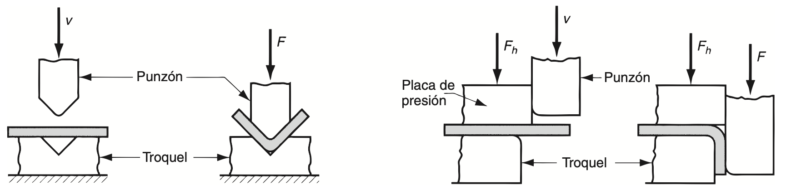{ width="600" }
    <figcaption>Foto de Fundamentos de la manufactura moderna</figcaption>
</figure>

Es disposa d'altres operacions de doblegat addicional, a més de les de doblegat en V i doblegat de vores. Algunes d'aquestes involucren el doblegat sobre eixos corbs en lloc d'eixos rectes, o tenen altres característiques. El format de brides és una operació en la qual el tall de la làmina de metall es doblegue en un angle de 90° per a formar una vora. S'usa sovint per a reforçar o donar rigidesa a la peça de làmina metàl·lica.

<figure markdown="span">
    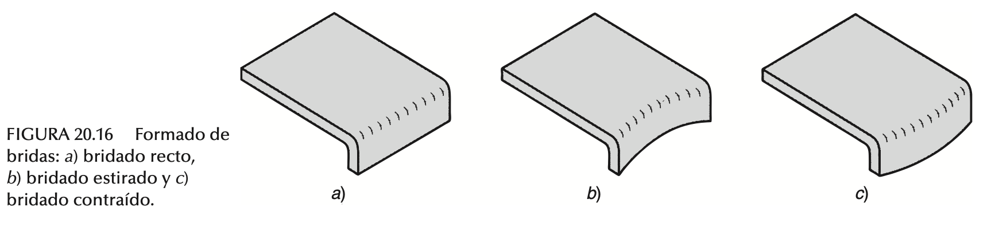{ width="600" }
    <figcaption>Foto de Fundamentos de la manufactura moderna</figcaption>
</figure>

El plec involucra el doblegat de la vora de la làmina sobre si mateixa en més d'un pas de doblegat. Això es fa sovint per a eliminar la vora aguda de la peça, a fi d'incrementar la rigidesa i millorar la seua aparença. L'engalzat o empat és una operació relacionada en la qual s'acoblen dues vores de làmines metàl·liques.

En el revorejat, també anomenat format de motlures, les vores de la peça es produeixen en forma de rínxol o rotllo. Tant aquesta operació com el plec es fan amb finalitats de seguretat, resistència i estètica.

<figure markdown="span">
    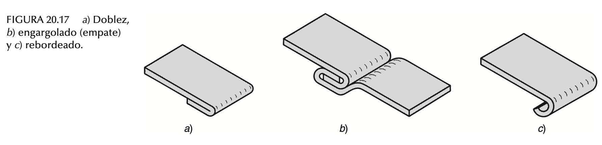{ width="600" }
    <figcaption>Foto de Fundamentos de la manufactura moderna</figcaption>
</figure>

### Embotit

L'embotit és una operació de format de làmines metàl·liques que s'usa per a fer peces de forma acopada, de caixa i altres formes buides més complexes. Es realitza col·locant una làmina de metall sobre la cavitat d'un encuny i espentant el metall cap a la cavitat d'aquest amb un punxó.

<figure markdown="span">
    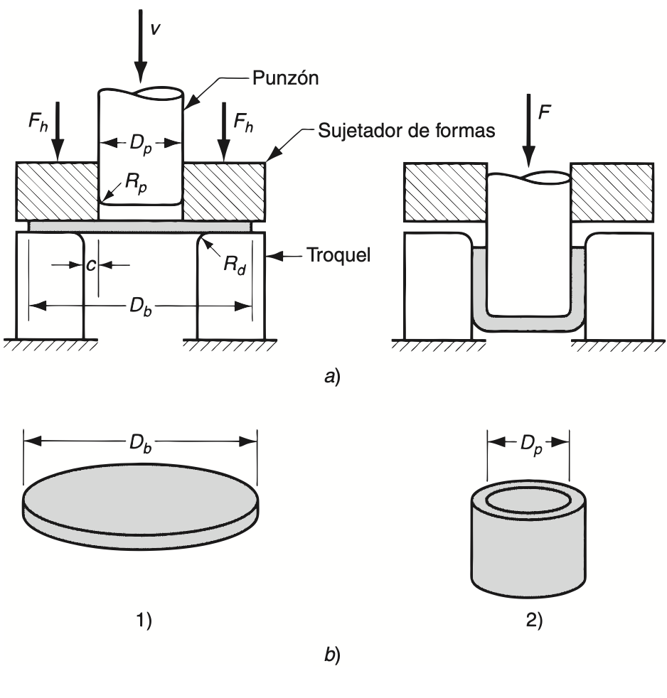{ width="600" }
    <figcaption>Foto de Fundamentos de la manufactura moderna</figcaption>
</figure>

El punxó aplica una força cap avall F per a realitzar la deformació del metall, i el
sostenidor de peces o de formes aplica una força de subjecció cap avall. Quan el punxó comença a espentar el treball, subjecta al metall a una operació de doblegat. La làmina és doblegada simplement sobre la cantonada del punxó i la cantonada de l'encuny. A mesura que el punxó avança, ocorre una acció de redreçat del metall que va ser prèviament doblegat sobre el radi de l'encuny. En aquest punt es necessita més metall per a reemplaçar al que ara forma la paret del cilindre. Aquest nou metall ve de la vora exterior de la forma original. El metall en la porció exterior de la forma s'emboteix cap a l'obertura de l'encuny per a substituir al metall prèviament doblegat i redreçat que ara forma la paret del cilindre.

 Durant aquesta etapa del procés, la fricció i la compressió juguen papers importants en la brida de la peça. Perquè el material de la brida es moga cap a l'obertura de l'encuny, ha de superar la fricció entre la làmina de metall i les superfícies del sostenidor i de l'encuny.

<figure markdown="span">
    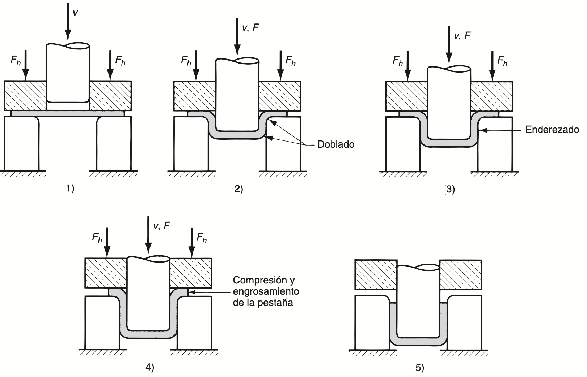{ width="600" }
    <figcaption>Foto de Fundamentos de la manufactura moderna</figcaption>
</figure>

Generalment s'usen lubrificants o compostos per a reduir les forces de fricció durant l'embotit. A més de la fricció, ocorre també la compressió en les pestanyes exteriors de la forma. A mesura que el metall d'aquesta porció de la forma s'estira cap al centre, el perímetre exterior es fa menor. Pel fet que el volum del metall roman constant, el metall es comprimeix i es fa més gruixut en reduir-se el perímetre.

La força de subjecció aplicada sobre la forma es veu ara com un factor crític en l'embotit profund. Si aquesta és molt xicoteta, ocorre l'arrugat; si és molt gran, evita que el metall fluïsca adequadament cap a la cavitat de l'encuny, ocasionant estirament i possible esquinçada de la làmina de metall.

El moviment progressiu del punxó cap avall ocasiona la continuació del flux de metall, causat per l'estiratge i la compressió que s'han descrit prèviament. Ocorre a més cert aprimament de les parets del cilindre.

Si el canvi de manera que requereix el disseny de la peça és massa sever (la relació d'embotit és massa alta), el format complet de la peça pot requerir més d'un pas d'embotit. Al segon pas d'embotit i a qualsevol altre posterior, si es necessita, se'n diu reembotit.

<figure markdown="span">
    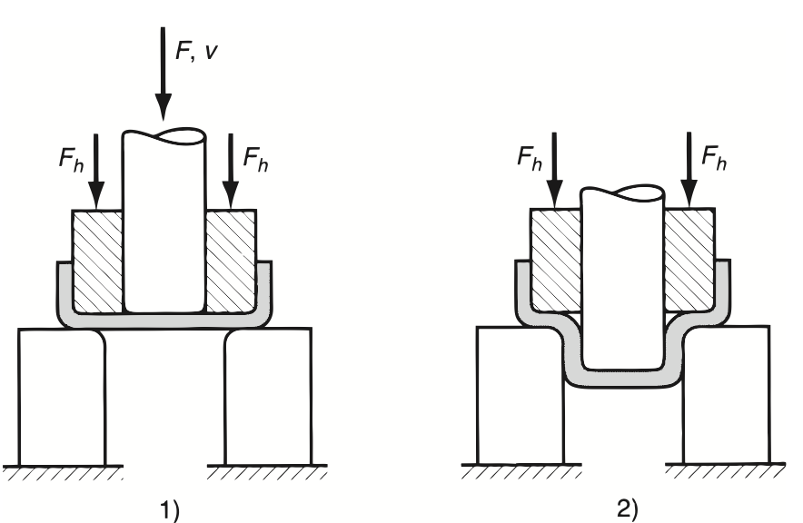{ width="600" }
    <figcaption>Foto de Fundamentos de la manufactura moderna</figcaption>
</figure>

Una operació relacionada és l'embotit invers, en el qual es col·loca una peça embotida cap avall en l'encuny i una segona operació d'embotit produeix una configuració com la següent. Encara que pot semblar que l'embotit invers podria produir una deformació més severa que el reembotit, en realitat és més fàcil en el metall. La raó és que en l'embotit invers la làmina de metall es doblega en la mateixa direcció a les cantonades exteriors i interiors de l'encuny, mentre que en el reembotit el metall es doblega en direccions oposades en les dues cantonades. A causa d'aquesta diferència, el metall experimenta menys enduriment per deformació.

<figure markdown="span">
    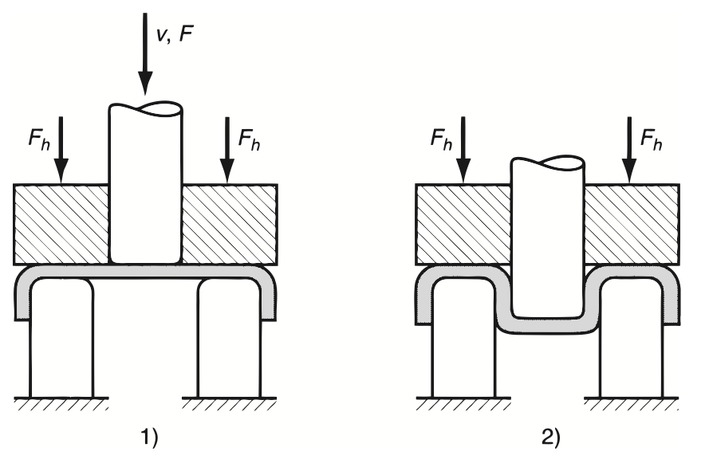{ width="600" }
    <figcaption>Foto de Fundamentos de la manufactura moderna</figcaption>
</figure>

Una de les funcions principals del sostenidor consisteix a previndre l'arrugat de la brida mentre s'emboteix la peça. La tendència a l'arrugat es redueix en augmentar la relació entre la grossària i el diàmetre de la forma inicial. Si la relació t/Db és prou gran, es pot aconseguir l'embotit sense necessitat d'un sostenidor.

<figure markdown="span">
    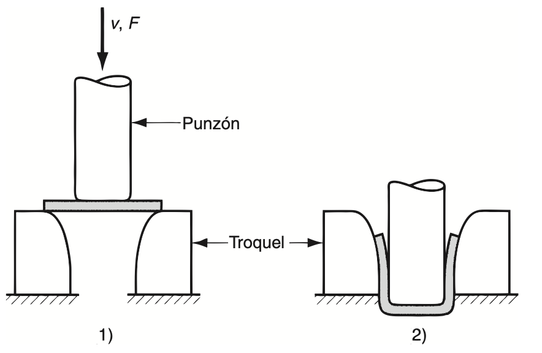{ width="600" }
    <figcaption>Foto de Fundamentos de la manufactura moderna</figcaption>
</figure>

Entre els defectes de l'embotit es poden destacar els següents:

a - Arrugat en la brida o pestanya. L'arrugat en una peça embotida consisteix en una sèrie de plecs que es formen radialment en la brida no embotida de la peça de treball, a causa del vinclament per compressió.

b - Arrugat en la paret. Si la brida arrugada s'emboteix en el cilindre, aquests plecs apareixen en la paret vertical del cilindre.

c - Esquinçada. Aquest defecte consisteix en una clivella que s'obri en la paret vertical, usualment prop de la base de la copa embotida, a causa d'alts esforços a la tensió que causen aprimament i trencament del metall en aquesta regió. Aquest tipus de falla pot també ocórrer quan el metall s'estira sobre una cantonada esmolada de l'encuny.

d - Orejeado. Aquesta és la formació d'irregularitats (anomenades orelles) en la vora superior de la peça embotida, causada per anisotropia en la làmina de metall. Si el material és perfectament isotròpic no es formen les orelles.

e - Ratllats superficials. Poden ocórrer ratllats en la superfície de la peça embotida si el punxó i l'encuny no són llisos o si la lubricació és insuficient.

<figure markdown="span">
    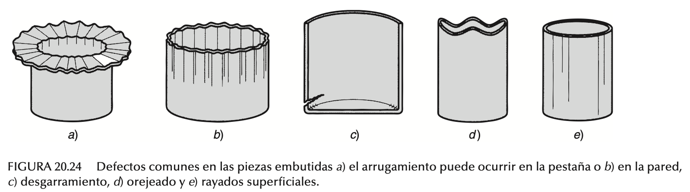{ width="600" }
    <figcaption>Foto de Fundamentos de la manufactura moderna</figcaption>
</figure>

### Repujat

    <iframe src="https://www.youtube.com/embed/JaDQATyt-b8?si=fQOrlaVib-2vcra4" title="YouTube video player" frameborder="0" allow="accelerometer; autoplay; clipboard-write; encrypted-media; gyroscope; picture-in-picture; web-share" referrerpolicy="strict-origin-when-cross-origin" allowfullscreen style="position: absolute; top: 0; left: 0; width: 100%; height: 100%;"></iframe>

## Processos de conformació de materials polimèrics i compostos

els dos tipus de plàstics són els termoplàstics i els termoestables. La diferència està en el fet que els termoestables passen per un procés de capellà durant el calfament i la conformació, la qual cosa ocasiona un canvi químic permanent (enllaços creuats) en la seua estructura molecular. Una vegada curats, no poden fondre's si es tornen a calfar. Per contra, els termoplàstics no es curen, i la seua estructura química roman en el bàsic sense canvis si es recalfen, encara que es transformen de sòlid a fluid.

Per a donar forma a un polímer termoplàstic aquest ha de calfar-se de manera que se suavitze fins a adquirir la consistència d'un líquid. Aquesta forma es denomina polímer fos. Debido a su alto peso molecular, un polímero fundido es un fluido espeso con viscosidad elevada. La viscositat és important en el processament de polímers perquè la majoria de mètodes per a donar forma involucren el flux del polímer fos a través de canals xicotets o obertures d'encunys.

Una altra propietat que posseeixen els polímers fosos és la viscoelasticitat, aquesta provoca que els esforços de compressió que actuen sobre el material conforme ingressa a l'obertura xicoteta de l'encuny no es relaxen immediatament. Quan el material ix després de l'orifici i la restricció desapareix, els esforços no alliberats fan que la secció transversal s'expandisca.

<figure markdown="span">
    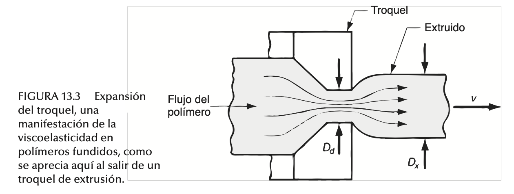{ width="600" }
    <figcaption>Foto de Fundamentos de la manufactura moderna</figcaption>
</figure>

### Extrusió

L'extrusió és un procés de compressió en el qual es força al material a fluir a través d'un orifici practicat en un encuny a fi d'obtindre un producte llarg i continu, la secció transversal del qual adquireix la forma determinada per la de l'orifici. Com a procés per a donar forma a polímers, s'empra molt per a termoplàstics i elastòmers (rares vegades per a termoestables)

En l'extrusió de polímers, s'alimenta material en forma de pèl·lets o pols cap a dins d'un barril d'extrusió, on es calfa i fon i se li força perquè fluïsca a través de l'obertura d'un encuny per mitjà d'un caragol rotatori.

<figure markdown="span">
    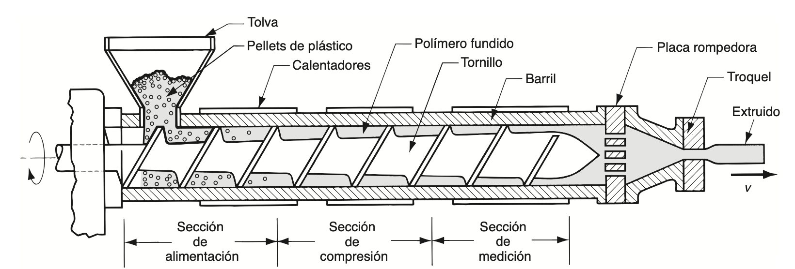{ width="600" }
    <figcaption>Foto de Fundamentos de la manufactura moderna</figcaption>
</figure>

En l'extrem del barril oposat a l'encuny es localitza una tremuja que conté el material que s'alimenta. Els pèl·lets s'alimenten per gravetat al caragol rotatori, la rosca del qual mou al material al llarg del barril. S'utilitzen calfadors elèctrics per a fondre a l'inici els pèl·lets sòlids; després, la mescla i el treball mecànic del material generarà calor addicional, la qual cosa manté fos al material.

El caragol té diverses funcions i es divideix en seccions que són: 1) secció d'alimentació, en la qual el material es mou del port de la tremuja i rep precalfament; 2) secció de compressió, en la qual  el polímer es transforma per a adquirir consistència líquida, s'extrau del fos l'aire  atrapat entre els pèl·lets i es comprimeix el material; i 3) secció de mesurament, en la qual  es fa homogeni al fos i es genera pressió suficient per a bombar-lo a través de l'obertura de l'encuny.

Abans d'arribar a l'encuny, el fos passa a través del paquet de la pantalla, una sèrie de malles de filferro sostingudes per una placa rígida (anomenada placa trencadora) que conté forats axials xicotets. El paquet de la pantalla serveix per a 1) filtrar els contaminants i grumolls durs del fos, 2) generar pressió en la secció de mesurament i 3) forçar al flux del polímer fos i esborrar de la seua “memòria” el moviment circular impost pel caragol. Aquesta última funció té a veure amb la propietat viscoelàstica del polímer; si el flux no es forçara, el polímer repetiria la seua història de girar dins de la cambra d'extrusió, i tendiria a girar i distorsionar l'extruït

Per a compensar l'expansió de l'encuny, l'obertura d'aquest es fa prou llarga per a eliminar alguna cosa de la memòria del polímer fos. A més, és freqüent que es faça que l'extruït s'extraga (estire) per a evitar l'expansió de l'encuny.

<figure markdown="span">
    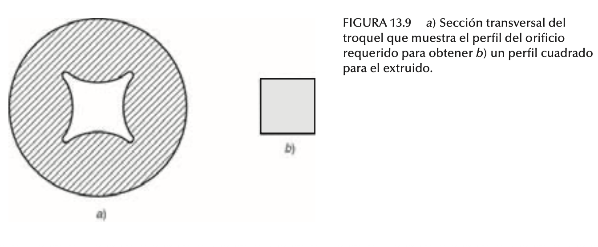{ width="600" }
    <figcaption>Foto de Fundamentos de la manufactura moderna</figcaption>
</figure>

Un dels pitjors defectes és la fractura del fos, en la qual les tensions que actuen sobre el fos immediatament abans i durant el seu pas a través de l'encuny són tan grans que ocasionen una falla, que es manifesta en forma de la superfície molt irregular de l'extruït, aquesta pot ser ocasionada per una reducció brusca de l'entrada de l'encuny, la qual cosa provoca un flux turbulent que trenca el fos. 
El defecte més comú de l'extrusió és la pell de tauró, en la qual la superfície del producte s'arruga en eixir de l'encuny. Conforme el fos flueix a través de l'obertura de l'encuny, la fricció en la interfície ocasiona un perfil de velocitat a través de la secció transversal. Aquests esforços ocasionen ruptures menors que arruguen la superfície. Si el gradient de velocitat es torna extrem, apareixen marques prominents en la superfície, la qual cosa li dona l'aspecte d'un tronc de bambú

<figure markdown="span">
    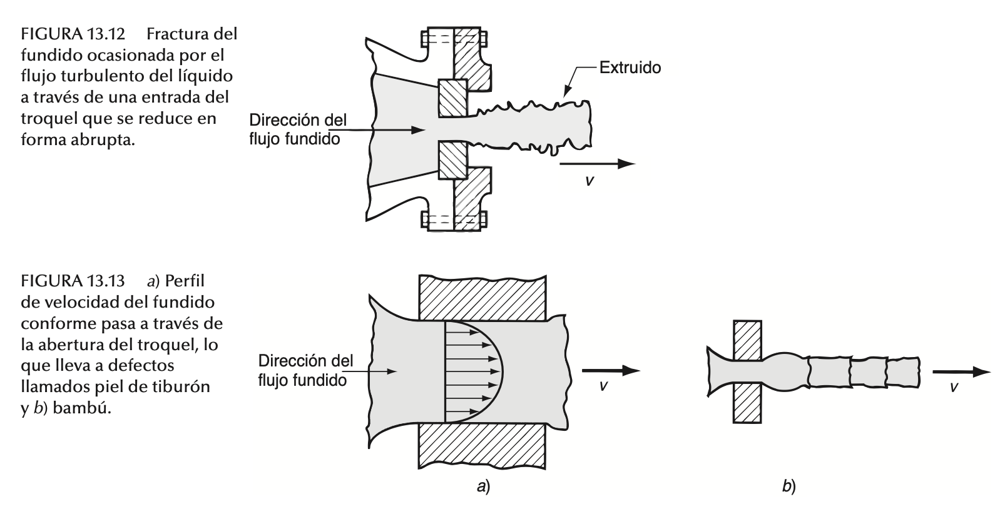{ width="600" }
    <figcaption>Foto de Fundamentos de la manufactura moderna</figcaption>
</figure>

### Injecció

L'emotlament per injecció és un procés amb el qual es calfa un polímer fins que aconsegueix un estat molt plàstic i se li força al fet que fluïsca a alta pressió cap a la cavitat d'un motle, on se solidifica. Llavors, la peça modelada, anomenada emotlament.

És possible obtindre formes complexes i intricades amb l'emotlament per injecció. El repte en eixos casos és fabricar un motle la cavitat del qual tinga la mateixa forma que la peça, i que també permeta el retir d'aquesta.

L'emotlament per injecció és el procés que més s'usa per als termoplàstics. Alguns termoestables i elastòmers es modelen per injecció, amb modificacions en l'equip i paràmetres d'operació, a fi de permetre l'entrecreuament d'aquests materials.

La màquina d'emotlament per injecció consta de dos components principals: 1) la unitat d'injecció de plàstic i 2) la unitat de subjecció del motle. La unitat d'injecció és molt semblant a un extrusor. Consisteix en un barril al qual s'alimenta des d'un extrem per una tremuja que conté un subministrament de pèl·lets de plàstic. Dins del barril hi ha un caragol l'operació del qual sobrepassa la del caragol extrusor en el següent aspecte: a més de girar per a mesclar i calfar el polímer, també actua com a martinet de nit que es mou amb rapidesa cap avant per a injectar plàstic fos al motle.

La unitat de subjecció es relaciona amb l'operació del motle. Les seues funcions són 1) mantindre les dues meitats del motle alineades en forma correcta l'una amb l'altra, 2) mantindre tancat al motle durant la injecció, per mitjà de l'aplicació d'una força que el subjecta prou per a resistir la força d'injecció i 3) obrir i tancar el motle en els moments apropiats del cicle d'injecció.

<figure markdown="span">
    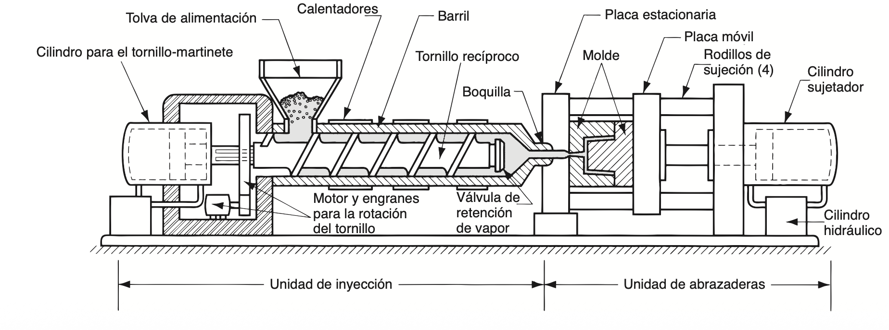{ width="600" }
    <figcaption>Foto de Fundamentos de la manufactura moderna</figcaption>
</figure>

<figure markdown="span">
    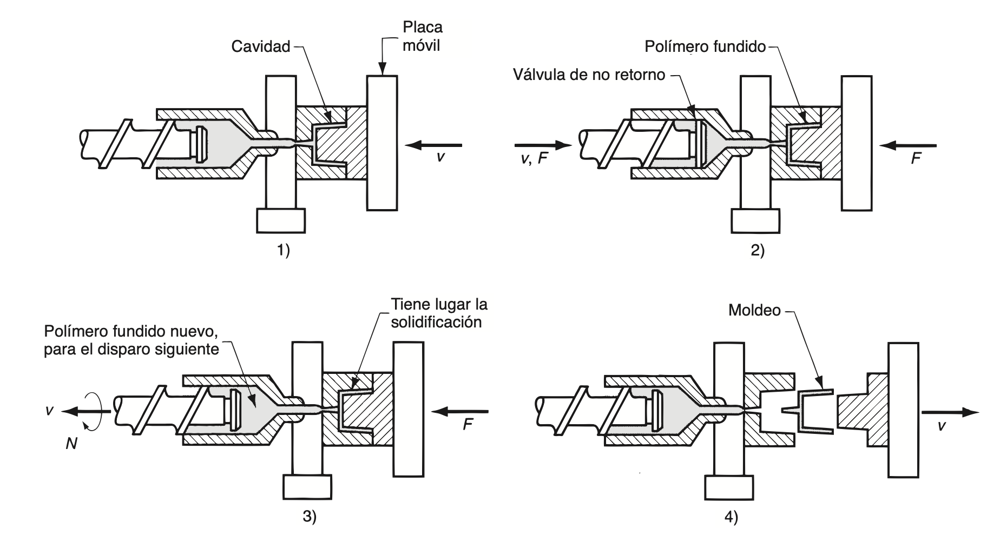{ width="600" }
    <figcaption>Foto de Fundamentos de la manufactura moderna</figcaption>
</figure>

Per al motle es requereix un sistema de refredament per al motle. Aquest consisteix en una bomba externa connectada a passatges en el motle, a través dels quals circula aigua per a eliminar calor del plàstic calent. Ha d'evacuar-se aire de la cavitat del motle conforme el polímer avança.

Els polímers tenen coeficients d'expansió tèrmica elevats, i durant el refredament del plàstic en el motle ocorre una contracció significativa. Alguns termoplàstics pateixen una contracció volumètrica d'al voltant de 10% després de la injecció en el motle. La contracció de plàstics cristal·lins tendeix a ser major que per als polímers amorfs. La contracció s'expressa en general com la reducció en la grandària lineal que ocorre durant el refredament a temperatura ambient a partir de la temperatura del motle per al polímer donat.

A continuació s'esmenten defectes comuns de les peces modelades per injecció:

- Trets curts: Igual que en el fos, un tret curt és un emotlament que se solidifica abans que la cavitat s'òmpliga per complet. El defecte es corregeix si s'incrementa la temperatura i/o la pressió. El defecte també sorgeix per l'ús d'una màquina amb capacitat de tret insuficient, cas en el qual és necessari un aparell més gran.

- Rebaves: Les esquitxades ocorren quan el polímer fos s'escorre per la superfície de separació, entre les plaques del motle; també succeeix al voltant dels passadors d'injecció. En general, el defecte l'ocasionen 1) conductes i clars massa grans en el motle, 2) pressió d'injecció massa alta en comparació amb la força de subjecció, 3) temperatura de fusió massa elevada o 4) grandària excessiva del tret.

- Marques d'enfonsament i buits: Aquests són defectes que en general es relacionen amb seccions modelades gruixudes. Una marca d'enfonsament ocorre quan la superficie exterior del motle se solidifica, però la contracció del material de l'interior fa que la capa es reduïsca per davall del perfil que es planejava. Un buit és ocasionat pel mateix fenomen bàsic; no obstant això, el material de la superfície conserva la seua forma i la contracció es manifesta com un buit intern a causa de forces de tensió grans sobre el polímer que encara està fos. Aquests defectes s'eliminen amb l'increment de la pressió de compactació posterior a la injecció. Una millor solució consisteix a dissenyar la peça per a tindre grossària uniforme de la secció, i utilitzar seccions més primes.

- Línies de soldadura: Les línies de soldadura ocorren quan el polímer fos flueix al voltant d'un nucli o d'un altre detall convex en la cavitat del motle, i es troba des de direccions oposades; la frontera així formada es denomina línia de soldadura, i té propietats mecàniques inferiors a les de la resta de la peça.

### Emmotlament per bufament i rotacional

Aquests dos processos s'empren per a fabricar peces buides i sense costura de polímers termoplàstics. L'emotlament rotacional també s'utilitza per a termoestables. L'emotlament per bufat és més apropiat per a la producció en massa de contenidors d'un sol ús xicotets, en tant que  el rotacional és propi per a formes més grans i buides.

L'emotlament per bufat és un procés en el qual s'utilitza pressió de l'aire per a unflar plàstic suau dins de la cavitat d'un motle. És un procés industrial important per a fabricar peces de plàstic buides, d'una sola peça i amb parets primes. L'emotlament per bufat es duu a terme en dues etapes: 1) fabricació d'un tub d'inici de plàstic fos, anomenat parison (igual que en el bufat del vidre), i 2) inflació del tub fins que adquireix la forma final que es desitja. El format del parison es duu a terme per qualsevol de dos  rocessos: 1) extrusió o 2) emotlament per injecció.

<figure markdown="span">
    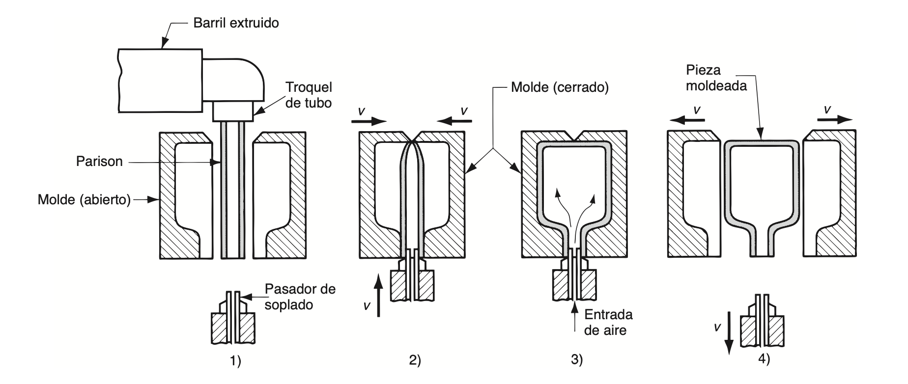{ width="600" }
    <figcaption>Foto de Fundamentos de la manufactura moderna</figcaption>
</figure>

<figure markdown="span">
    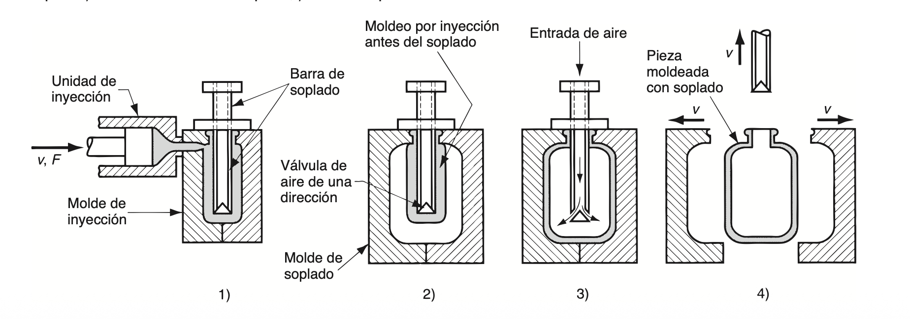{ width="600" }
    <figcaption>Foto de Fundamentos de la manufactura moderna</figcaption>
</figure>

En aquest darrer procés, el parison d'inici es modela per injecció en comptes d'extrusió. En comparació amb el seu procés competidor basat en l'extrusió, el de bufat per injecció té una taxa de producció menor, la qual cosa explica per què s'usa menys.

En una variant de l'emotlament amb bufat per injecció, anomenada emotlament bufat per estirament. la barra de bufat s'estén cap avall dins del parison modelat per injecció durant l'etapa 2, la qual cosa estira el plàstic suau i crea un esforç més favorable del polímer que l'emotlament per injecció convencional o bufat per extrusió. L'estructura resultant és més rígida, amb més transparència i resistència major a l'impacte. El material més utilitzat per a l'emotlament bufat per estirament és el tereftalat de polietilé (PET)

<figure markdown="span">
    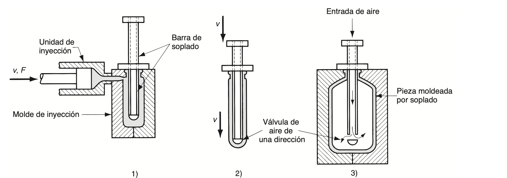{ width="600" }
    <figcaption>Foto de Fundamentos de la manufactura moderna</figcaption>
</figure>

L'emotlament rotacional utilitza la gravetat en lloc d'un motle rotatori, a fi d'aconseguir una forma buida. El també anomenat *rotomoldeo és una alternativa a l'emotlament per bufat a fi de fabricar formes grans i buides. S'empra principalment per a polímers termoplàstics, però cada vegada són més comuns les aplicacions per a termoestables i elastòmers. El *rotomoldeo tendeix a afavorir configuracions geomètriques externes més complexes, peces més grans i quantitats de producció xicotetes, més que l'emotlament per  bufat.

El procés consisteix en les següents etapes: 1) es carrega una quantitat predeterminada de pols de polímer en la cavitat d'un motle lliscant. 2) Després es calfa el motle i es gira en forma simultània sobre dos eixos perpendiculars, de manera que la pols impregna totes les superfícies interiors del motle, i forma gradualment una capa fosa de grossària uniforme. 3) Mentre encara gira, el motle es refreda de manera que la capa exterior de plàstic se solidifica. 4) S'obri el motle i es descarrega la peça.

En l'emotlament rotacional, els motles són simples i barats, en comparació amb l'emotlament per injecció o per bufat, però el cicle de producció és molt més llarg.

<figure markdown="span">
    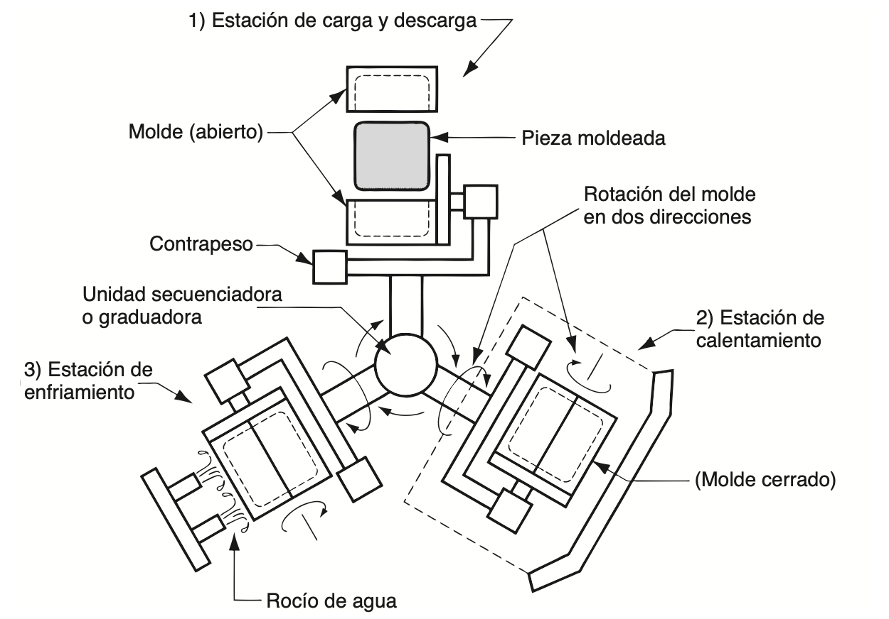{ width="600" }
    <figcaption>Foto de Fundamentos de la manufactura moderna</figcaption>
</figure>

### Termoconformació

El termoformat és un procés en el qual es calfa i deforma una fulla plana termoplàstica per a fer que adquirisca la forma desitjada. El termoformat consisteix en dues etapes principals: 1) calfament i 2) format. En general, el calfament es realitza amb l'ús de calfadors elèctrics radiants, localitzats a banda i banda de la fulla de plàstic inicial. Els mètodes pels quals es duu a terme l'etapa de format es classifiquen en tres categories bàsiques: 1) termoformat al buit, 2) termoformat de pressió i 3) termoformat mecànic.

<figure markdown="span">
    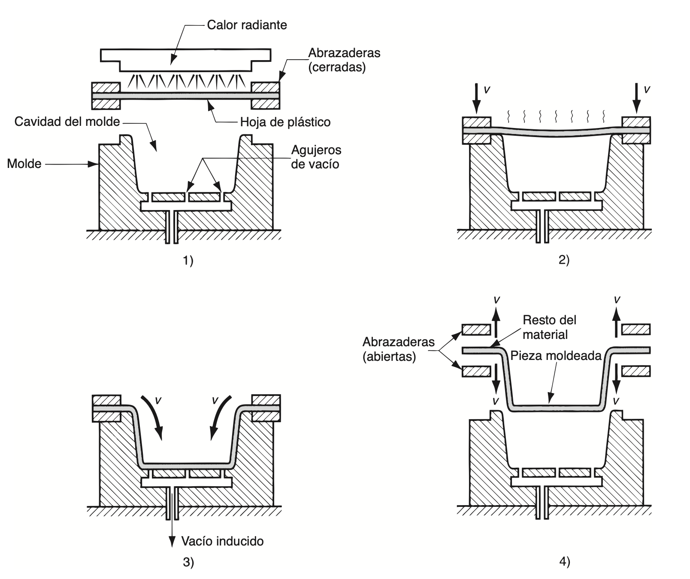{ width="600" }
    <figcaption>Foto de Fundamentos de la manufactura moderna</figcaption>
</figure>

el termoformat al buit utilitza una pressió negativa per a espentar una fulla precalfada contra la cavitat d'un motle. Els forats per a induir el buit en el motle són de l'ordre de 0.8 mm de diàmetre, per la qual cosa el seu efecte sobre la superfície del plàstic és menor.

Una alternativa per a formar al buit involucra a una pressió positiva que força al plàstic calfat cap a la cavitat del motle. Aquesta es diu termoformat de pressió, o format per bufat; el seu avantatge sobre el format al buit és que és possible generar pressions més grans. La seqüència del procés és similar a l'anterior; la diferència consisteix en el fet que la fulla es pressuritza des de dalt de la cavitat del motle. En el motle hi ha forats de conducció per a expulsar l'aire atrapat.

<figure markdown="span">
    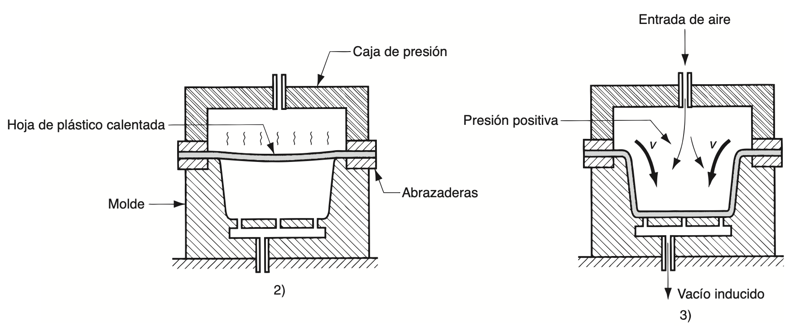{ width="600" }
    <figcaption>Foto de Fundamentos de la manufactura moderna</figcaption>
</figure>

si la peça es pressiona contra un motle negatiu, llavors la seua superfície exterior tindrà el mateix aspecte que la de la cavitat del motle. La superfície interior serà una aproximació del contorn i posseirà un acabat corresponent al de la fulla d'inici. Per contra, si la fulla es pressiona sobre un motle positiu, llavors la seua superfície interior serà igual a la del motle convex i la seua superfície exterior continuarà aproximadament igual. En funció dels requeriments del producte, aquesta diferència pot ser important.

<figure markdown="span">
    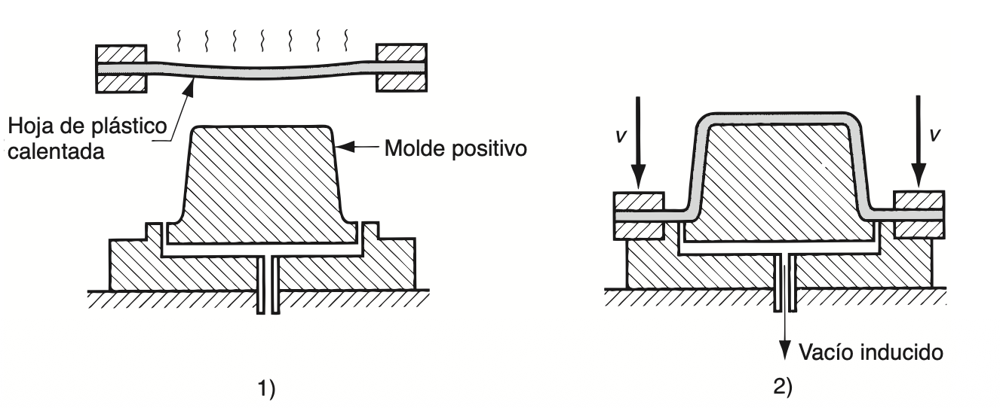{ width="600" }
    <figcaption>Foto de Fundamentos de la manufactura moderna</figcaption>
</figure>

Els motles positiu i negatiu produeixen patrons d'aprimament diferents en una peça donada. En el motle positiu, conforme la fulla es pressiona sobre la forma convexa, la porció en contacte amb la superfície superior se solidifica amb rapidesa i no experimenta virtualment cap estirament. Això dona com a resultat una base gruixuda però un aprimament significatiu de les parets. Per contra, un motle negatiu genera una distribució més parella de l'estirament i aprimament de la fulla abans que faça contacte amb la superfície freda. Una manera de millorar la distribució de l'aprimament amb un motle positiu és preestirar la fulla abans de plegar-la sobre la forma convexa

<figure markdown="span">
    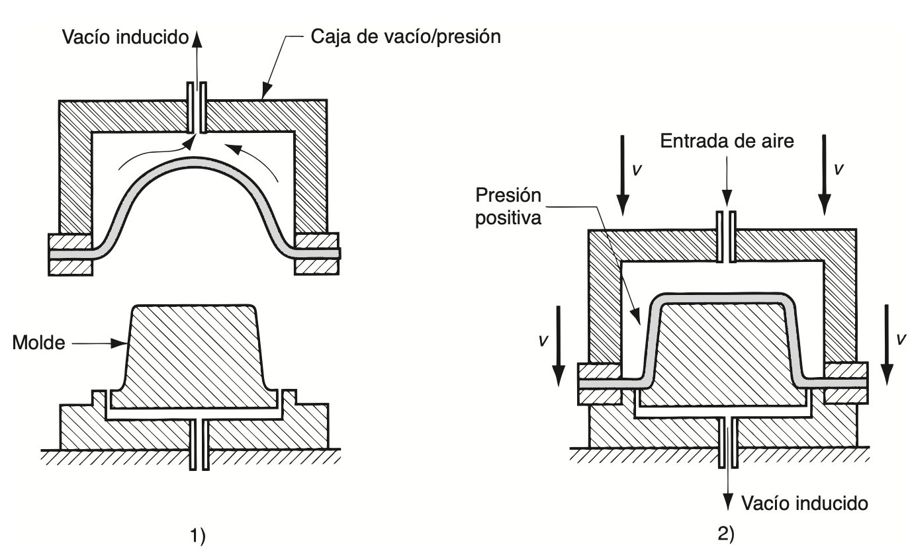{ width="600" }
    <figcaption>Foto de Fundamentos de la manufactura moderna</figcaption>
</figure>

El termoformat mecànic, utilitza motles positius i negatius que s'ajunten contra la fulla de plàstic calfada, la qual cosa la força a adoptar la forma d'ells. En el mètode de format mecànic pur no s'utilitza en absolut la pressió de l'aire (positiva o negativa). Només els termoplàstics poden termoformar-se, ja que les fulles extruïdes de polímers termoestables o elastomèrics ja tenen entrecreuament i no és possible suavitzar-les tornant-les a calfar. Els plàstics comuns per al termoformat són el poliestiré, acetat de cel·lulosa i butirat acetat de cel·lulosa, ABS, PVC, acrílic (polimetilacrilato), polietilé i polipropilé.

<figure markdown="span">
    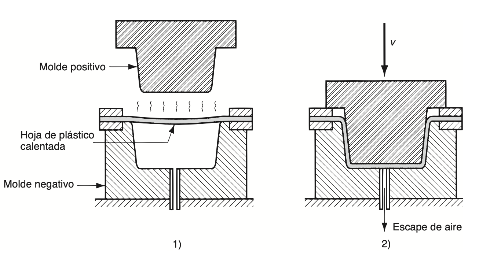{ width="600" }
    <figcaption>Foto de Fundamentos de la manufactura moderna</figcaption>
</figure>

### Laminatge manual

El procés en motle obert també es coneix amb altres noms, com a laminació per contacte i emotlament per contacte. Els materials inicials (resines, fibres, estores i metxes teixides) s'apliquen al motle en capes per a constituir la grossària desitjada.

Després continua el curat i el retir de la peça. Les resines comunes per a aquests processos són polièsters insaturats i epòxics, usant fibra de vidre com a reforç. Les peces modelades generalment són grans. L'avantatge d'usar motles oberts és que el cost del  motle és molt de menor que si s'usaren motles acoblats. El desavantatge és que solament la superfície de la peça en contacte amb el motle és una superfície acabada; l'altre costat queda aspre. El motle en si ha de ser molt llis per a un millor acabat de la superfície de la peça.

L'avantatge d'usar motles oberts és que el cost del motle és molt de menor que si s'usaren motles acoblats. El desavantatge és que solament la superfície de la peça en contacte amb el motle és una superfície acabada; l'altre costat queda aspre. El motle en si ha de ser molt llis per a un millor acabat de la superfície de la peça.

L'aplicat manual és un mètode en el qual s'apliquen manualment capes successives de resina i reforç en un motle obert per a construir l'estructura composta del FRP laminat. La peça acabada s'ha de retallar generalment amb una serra mecànica per a dimensionar les vores exteriors. El procediment bàsic consisteix en cinc passos.

<figure markdown="span">
    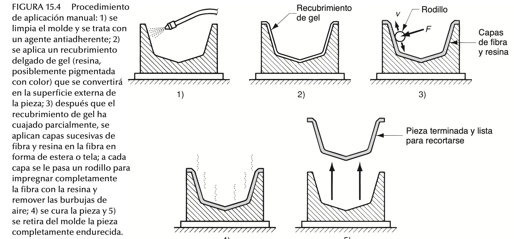{ width="600" }
    <figcaption>Foto de Fundamentos de la manufactura moderna</figcaption>
</figure>

Cada capa de reforç de fibra està seca en el pas 3, quan es col·loca sobre el motle. Es buida llavors la resina líquida (no curada), o s'aplica amb brotxa o per aspersió. L'impregnat de l'estora o tela de fibra es fa amb corrons de mà. A aquesta operació se'l coneix com a aplicació humida. Un procediment alternatiu es realitza mitjançant l'ús de productes preimpregnats on primer es preparen les capes impregnades de reforç de fibra i després es col·loquen en la superfície del motle. Els avantatges que s'atribueixen als productes preimpregnats són un control més estret sobre la mescla de fibra i resina.

Els motles per a laminar per contacte en motle obert es poden fer d'algeps, metall, plàstics reforçats amb fibra de vidre o altres materials.

### Projecció simultània

L'aspersió és un intent de mecanitzar l'aplicació de capes de resina i fibra, així com per a reduir el temps de l'operació. És una alternativa per al pas 3 en el procediment manual. En el mètode per aspersió la resina líquida i les fibres tallades es ruixen sobre un motle obert per a construir capes successives de FRP.

<figure markdown="span">
    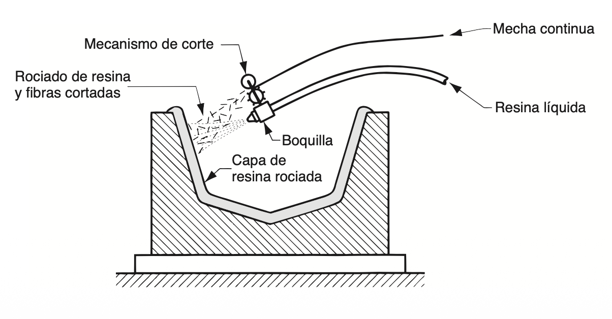{ width="600" }
    <figcaption>Foto de Fundamentos de la manufactura moderna</figcaption>
</figure>

La pistola aspersora està equipada amb un mecanisme de tall alimentat amb una metxa de filaments que curta en fibres les longituds de les quals van de 25 a 75 mm, els quals s'incorporen al corrent de resina a l'eixida del filtre. L'acció mescladora genera una orientació aleatòria de les fibres en la capa, a diferència de l'aplicació manual en la qual els filaments poden orientar-se com es vulga

El procediment automatitzat és avantatjós per a l'eficiència del treball i la protecció ambiental. Les màquines de ruta controlada poden operar en àrees segellades sense la presència d'éssers humans, ja que algunes de les emissions volàtils de les resines líquides són perilloses. No obstant això, generalment es requereix l'impregnat amb corrons per a cada capa, com en el procediment manual. Pel fet que tenen fibres curtes orientades aleatòriament, els productes fets per aspersió no són tan fortes com els fets per aplicació manual de capes les fibres de les quals són contínues i dirigides.

### Emmotlament per injecció de resina

L'emotlament per injecció és notable pel baix cost de producció de les peces de plàstic en quantitats grans. Encara que s'associa més pròximament amb els termoplàstics, el procés pot també adaptar-se als termoestables.

Pràcticament tots els polímers termoplàstics poden reforçar-se amb fibres. S'ha d'usar fibres tallades; si s'usaren fibres contínues, aquestes podrien de qualsevol manera reduir la seua longitud per l'acció del caragol en el cilindre. Durant la injecció de la cambra a la cavitat del motle, les fibres tendeixen a quedar alineades en passar a través del filtre.

Alguns termoestables es curen per reacció química en lloc de calor; aquestes resines es poden modelar per injecció amb reacció (RIM). En el RIM es mesclen els dos ingredients reactius i s'injecten immediatament dins de la cavitat d'un motle on es curen i ocorre ràpidament la solidificació dels components. Un procés estretament relacionat inclou en la mescla fibres de reforç, típicament el vidre. El procés es diu en aquest cas, emotlament per injecció amb reacció reforçada (RRIM). Els seus avantatges són similars a les del RIM, amb el benefici addicional del reforç amb fibra.

### Bobinatge de fils

El bobinatge de filaments és un procés en el qual s'enrotllen fibres contínues impregnades amb resina al voltant d'una claveguera giratòria, que té la forma interna de l'article de FRP que es vol produir. La resina es cura després i la claveguera es retira. Es produeixen components buits de simetria axial (usualment circular en secció transversal), així com formes irregulars.

<figure markdown="span">
    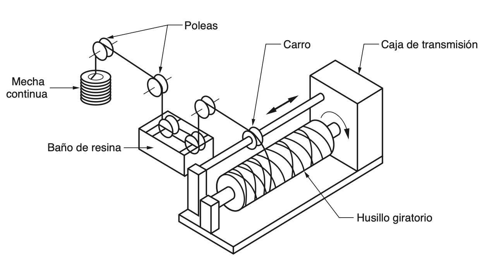{ width="600" }
    <figcaption>Foto de Fundamentos de la manufactura moderna</figcaption>
</figure>

Una banda de metxa de fibres es passa a través d'un bany de resina immediatament abans de ser embullada en forma helicoidal sobre una claveguera cilíndrica. Continuant el patró de bobinatge es completa finalment una capa superficial sobre la claveguera d'un filament gruixut. L'operació es repeteix per a formar capes addicionals, cadascuna d'aquestes amb un patró entrecreuat respecte a l'anterior, fins a obtindre la grossària adequada.

Hi ha diversos mètodes per a impregnar les fibres amb resina: 1) bobinatge humit, en el qual el filament passa a través de la resina líquida solament abans del bobinatge, com en la figura; 2) bobinatge amb productes preimpregnats (també anomenat bobinatge sec), en el qual els filaments preimpregnats amb resina parcialment curada s'enrotllen al voltant d'una claveguera calfada; i 3) postimpregnació, en el qual els filaments s'enrotllen en la claveguera i després s'impregnen amb resina per mitjà de brotxa o alguna altra tècnica.

Se usen dos patrons bàsics de bobinatge del filament: a) helicoidal i b) polar. En el bobinatge helicoidal, la banda de filaments s'aplica en una forma espiral al voltant de la claveguera amb un angle d'hèlice. Si la banda es bobina amb un angle d'hèlice que s'aproxima als 90°, es denomina bobinatge de cércol, ja que els filaments formen cércols quasi circulars al voltant de la claveguera; és un cas especial de bobinatge helicoidal. En el bobinatge polar, el filament s'enrotlla al voltant de l'eix major de la claveguera.

<figure markdown="span">
    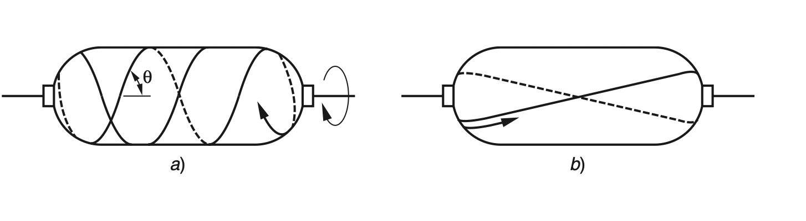{ width="600" }
    <figcaption>Foto de Fundamentos de la manufactura moderna</figcaption>
</figure>

### Pultrusió

El procés és similar a l'extrusió (d'ací la similitud del nom), però implica l'estiratge de la peça de treball (d'ací el prefix anglés pull que s'usa en lloc de ex). Com en l'extrusió, la pultrusió produeix seccions contínues, rectes de secció transversal constant.

La pultrusió és un procés en el qual se submergeix en un bany de resina una metxa contínua de fibres i després es tira d'elles a través d'un encuny formador on es cura la resina impregnada.

<figure markdown="span">
    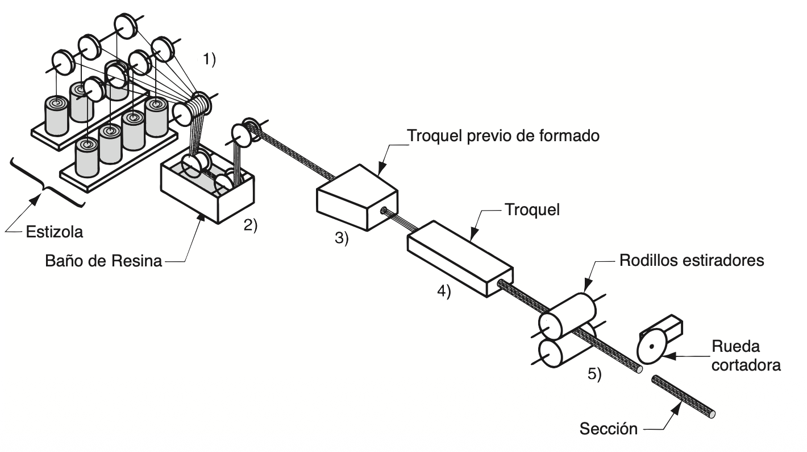{ width="600" }
    <figcaption>Foto de Fundamentos de la manufactura moderna</figcaption>
</figure>

Com en l'extrusió, les peces tenen una secció transversal constant i un perfil determinat per la forma de l'obertura de l'encuny.
El procés consisteix en cinc passos (identificats en l'esquema) que s'executen en una seqüència contínua: 1) alimentació de filaments, les fibres s'assorteixen d'una estizola (relleixos amb clavilles que sostenen bobines de filament); 2) impregnació amb resina, les fibres se submergeixen en la resina líquida no curada; 3) format d'un encuny previ veure, en el qual es dona gradualment la forma aproximada de la secció transversal desitjada a la col·lecció de filaments; 4) format i curat, es tira de les fibres impregnades a través de l'encuny calent la longitud del qual és d'1 a 1.5 m i les superfícies internes del qual estan altament polides; i 5) estiratge i tallat, on s'usen corrons tractors per a extraure de l'encuny la longitud curada, després de la qual cosa es talla mitjançant una roda talladora amb grans de sic o diamant.

### SMC

Els compostos per a l'emotlament de làmines (SMC, per les seues sigles en anglés) són una combinació de resina de polímer termoestable, farcits, fibres de vidre tallades i altres additius (orientades a l'atzar), que es laminen a una grossària típica de 6.5 mm. La resina més comuna és el polièster insaturat.

<figure markdown="span">
    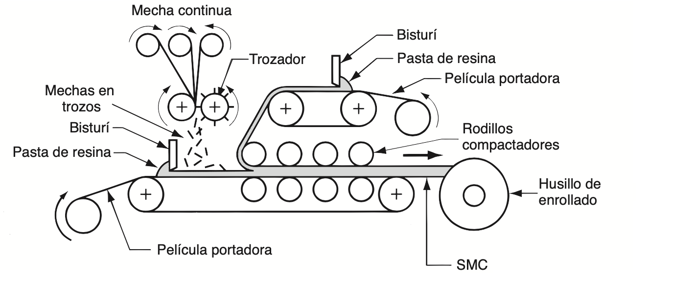{ width="600" }
    <figcaption>Foto de Fundamentos de la manufactura moderna</figcaption>
</figure>

Els compostos d'emotlament per a làmines es produeixen i assorteixen generalment entre càrregues primes de polietilé per a limitar l'evaporació dels ingredients volàtils de la resina termoestable. El recobriment protector millora també l'acabat de la superfície i per consegüent de les peces modelades.

### RTM

En l'emotlament convencional per transferència, es col·loca una càrrega de resina termoestable en un depòsit o cambra, es calfa i es pressiona per mitjà d'un pistó dins d'una o més cavitats del motle. El motle es calfa per a curar la resina. El procés deriva el seu nom de la transferència del polímer fluid des del depòsit al motle. Es pot usar per a modelar resines TS els farciments del qual inclouen fibres curtes per a produir una peça composta de FRP. Una altra forma d'emotlament per transferència per a PMC es diu emotlament per transferència de resina (RTM) es refereix a un procés en motle tancat en el qual es col·loca una estora preformada en la part inferior del motle, el motle es tanca i la resina termoestable (per exemple, una resina de polièster) es transfereix dins de la cavitat a pressió moderada per a impregnar el *preformado. Com a causa de confusions, algunes vegades al RTM se'l coneix com a emotlament per injecció de resina

### Prepeg

El prepreg (de l'anglès pre-impregnated, "pre-impregnat") és un material compost format per fibres de reforç que ja venen impregnades de fàbrica amb una resina, en un estat especial que permet emmagatzemar-lo, tallar-lo i laminar-lo abans de curar-lo definitivament.

Un prepreg té dos components principals:

- Fibra de reforç: pot ser fibra de carboni, fibra de vidre, aramida (Kevlar), etc., en forma de teixit, cinta unidireccional o mat.

- Resina termostable: normalment epoxi, encara que també hi ha prepregs amb fenòlica, bismaleimida (BMI) o cianat èster, segons l'aplicació (temperatura de servei, resistència al foc, etc.).

Una resina termostable normal té tres etapes de curat: A (líquida, sense reaccionar), B (parcialment reaccionada, semisòlida) i C (completament curada, sòlida i rígida). Durant la fabricació del prepreg, les fibres passen per un bany o làmina de resina i després es calenten breument per avançar la reacció química fins a l'estat B, amb un grau de curat molt baix (menys del 5%). En aquest estat, la resina és enganxosa però no líquida (una propietat que s'anomena tack, o adherència) i el material té una certa flexibilitat i capacitat d'adaptar-se a formes (drape), cosa que permet manipular-lo, tallar-lo i col·locar-lo sobre un motlle sense que la resina fluisca ni s'escampe.

Com que la resina en estat B continua reaccionant lentament fins i tot a temperatura ambient, els fabricants especifiquen que cal emmagatzemar-lo normalment entre -18°C i -23°C, per alentir al màxim la reacció. 

Per fabricar-ho les fibres seques (en forma de teixit o cinta) es fan passar per una màquina impregnadora. En aquesta s'aplica la resina, sovint mitjançant un film de resina prèviament calandrat sobre paper siliconat, que després es transfereix a la fibra per calor i pressió (mètode de film, el més habitual actualment; hi ha també el mètode de bany directe). El conjunt passa per rodets calents que activen lleugerament la reacció de curat fins arribar a l'estat B, i darrerament, el material s'enrotlla en bobines, amb un paper protector, i es congela immediatament per aturar l'avenç del curat.

### VARI (Vacuum Assisted Resin Infusion)

    <iframe src="https://www.youtube.com/embed/7cHV4DnalzQ?si=CpX7Rra6hLb83zjS" title="YouTube video player" frameborder="0" allow="accelerometer; autoplay; clipboard-write; encrypted-media; gyroscope; picture-in-picture; web-share" referrerpolicy="strict-origin-when-cross-origin" allowfullscreen style="position: absolute; top: 0; left: 0; width: 100%; height: 100%;"></iframe>

També dit infusió de resina assistida per buit (VARI), emotlament per transferència de resina assistit per buit (VARTM) o procés d'infusió al buit (VIP). És un procés de motle tancat tipus LCM (emotlament de compostos líquids) amb eina d'un sol costat i bossa de buit, on la resina s'extrau a través de la preforma usant buit.

Passos típics del procés

1- Preparació del motle: es col·loca una pel·lícula antiadherent sobre la superfície del motle (o s'usa desmoldant). 

2- Col·locació del reforç (deposició): es col·loca la fibra seca sobre el motle per a formar el laminatge, en l'orientació necessària. 

3- Instal·lació de la bossa de buit: s'aplica cinta segelladora en tot el perímetre del motle i es col·loca una capa despegable sobre el laminatge, estenent-se almenys 2 cm més enllà del seu perímetre, a més de malla de distribució de resina, tubs espirals i ports d'entrada/eixida. 

4- Buit: es connecta la bomba de buit; després d'aconseguir el nivell desitjat, es manté constant durant la infusió i es realitza una prova d'estanquitat. 

5- Infusió de la resina: una vegada creat el buit, s'injecta la resina pel port; l'entorn de buit fa que fluïsca fàcilment i es distribuïsca de manera uniforme per tot el laminatge, ja que no hi ha aire que oferisca resistència, impregnant tota la fibra. 

6- Curat: la resina tarda un temps a endurir completament (a temperatura ambient o amb cicle tèrmic, segons el sistema de resina). 

7- Desmotlament: pas final del procés, on es desemmotla la peça curada.

## Tractaments tèrmics i superficials

Al diagrama de meta estable i ferro carboni es representen les transformacions que pateixen els acers al carboni amb la temperatura considerant que l'escalfament de la mescla es realitza molt lentament de mode tal que els processos de difusió tinguen temps per a completar-se. Utilitzant aquest diagrama es pot determinar a diferents temperatures i percentatges de carboni les fases presents i les seves proporcions relatives la distribució de les fases en la microestructura entre altres coses. No obstant això, en la pràctica de la metal·lúrgia en general existeixen refredaments que no són lents de manera que els processos de difusió i la formació de fases d'equilibri no es produeixen de la manera que indica el diagrama. D'aquesta manera, la velocitat de escalfament i sobretot la de refredament influiran en els paràmetres micro estructurals com ara la grandària del gra i també en les fases presents i la seua distribució, modificant així les propietats mecàniques.

En metal·lúrgia es defineix a un tractament tèrmic com la combinació d'operacions d'escalfament i refredament de temps determinats i aplicats a un aliatge en l'estat sòlid de tal manera que produirà propietats desitjades.

<figure markdown="span">
    { width="600" }
    <figcaption>Foto de Wikimedia: https://es.wikipedia.org/wiki/Diagrama_hierro-carbono#/media/Archivo:Iron_carbon_phase_diagram.svg</figcaption>
</figure>

### Recuita

Recuita per a alleujament de tensions: la temperatura de re cristal·lització del acer de baix carboni és d'aproximadament 500 graus celsius. D'aquesta manera durant un procés de laminació en calent la recristal·lització procedeix simultàniament amb la laminació, aconseguint que les tensions que sorgeixen del procés siguen alleujades a mesura que es van produint. Tot i així, amb freqüència s'ha d'aplicar una quantitat considerable de treball en fred als acers de baix carboni com per exemple en el trefilatge, el qual es produeix a temperatura ambient o en la laminació en fred. En aquests casos, és imperatiu alleujar les tensions per poder realitzar més operacions de conformatge sense que aquest es trenque.

La recuita es duu a terme entre 500 i 700 graus celsius aproximadament. Aquest és el rang és per damunt de la temperatura de cristal·lització, es completarà en qüestió de minuts. Cal anar en compte, però, ja que una recuita prolongada pot causar un deteriorament de les propietats, puix que la ductilitat pot augmentar i causar una pèrdua de resistència a causa del creixement excessiu de grans i una globulització de les capes de cementita en l'estructura ferritica perdent així la microestructura perlítica de capes de ferrita i cementita. 

<figure markdown="span">
    { width="600" }
    <figcaption>Foto de Juan Manuel Vallejos: https://youtu.be/lABq26BapwA?si=fV14PpvQaVdcU4vE</figcaption>
</figure>

Cal aclarir que com la temperatura de recuita d'alleujament de tensions és menor que la d'optimització, no hi ha canvi de fase i els constituents de ferrita i cementita romanen en l'estructura durant tot el procés.

<figure markdown="span">
    { width="600" }
    <figcaption>Foto de Juan Manuel Vallejos: https://youtu.be/lABq26BapwA?si=fV14PpvQaVdcU4vE</figcaption>
</figure>

### Normalitzat

En aquest es realitza un escalfament a una alta temperatura (similar a la recuita) però el refredament és a l'aire, és a dir, més ràpid. Això provoca que el temps per a la formació de perlita siga menor i que aquesta quede més fina, endurint l'aliatge. NO ES REFREDA EN CONDICIONS D'EQUILIBRI

La resistència mecànica serà més alta que en un element recuiut.

### Tempre

En refredaments lents el C pot difondre's fora de l'estructura i formar cementita. Contràriament, si es refreda ràpidament l'aliatge des d'una temperatura per sobre de la austenització el C intersticial de la fase austenita no té temps de difondre durant la transformació, quedant retingut i produint una fase sobresaturada BCT. Aquesta estructura es denomina martensita i la seua xarxa presenta distorsions a causa del C retingut, endurint l'aliatge. A contingut més alt de C, major distorsió i duresa.

<figure markdown="span">
    { width="600" }
    <figcaption>Foto de Juan Manuel Vallejos: https://youtu.be/lABq26BapwA?si=fV14PpvQaVdcU4vE</figcaption>
</figure>

<figure markdown="span">
    { width="600" }
    <figcaption>Foto de Wikimedia: https://en.wikipedia.org/wiki/Martensite#/media/File:Martensite.jpg</figcaption>
</figure>

### Reveniment

L'acer al carboni en fase martensítica després del tremp es troba amb moltes tensions residuals producte de la ràpida transformació de fase. A causa d'això, l'aliatge és molt dur i fràgil. Per a millorar la ductilitat, es realitza un tractament tèrmic de reveniment, aprofitant que la martensita és una fase metaestable, per a descompondre part d'ella en ferrita i cementita i per a alleujar tensions.

<figure markdown="span">
    { width="600" }
    <figcaption>Foto de Juan Manuel Vallejos: https://youtu.be/lABq26BapwA?si=fV14PpvQaVdcU4vE</figcaption>
</figure>

### Nitruració

És un tractament termoquímic que es dona a l'acer a còpia d'afegir nitrogen quan se l'escalfa. El resultat és un increment de la duresa superficial de l'acer obtingut. També augmenta la resistència a la corrosió i a la fatiga dels materials.

La nitruració es pot fer en un forn o per ionització. En el primer cas la peça es fica a un forn ple d'una atmosfera d'amoníac i després s'escalfa fins a uns 500 °C. Amb això l'amoníac es descompon en nitrogen i hidrogen; l'hidrogen se separa del nitrogen per diferència de densitat i el nitrogen, en entrar en contacte amb la superfície de la peça, forma un recobriment de nitrur de ferro.

<figure markdown="span">
    { width="600" }
    <figcaption>Foto de Wikimedia: https://en.wikipedia.org/wiki/Nitriding#/media/File:Computerised_Heat_Treatment_Furnance.jpg</figcaption>
</figure>

En el cas de la nitruració iònica, les molècules d'amoníac es trenquen mitjançant l'aplicació d'un camp elèctric el qual s'aconsegueix sotmetent l'amoníac a diferència de potencial d'entre 300 i 1000 volts. Els ions de nitogen van cap al càtode (que consisteix en la peça a tractar) i reaccionen per a formar nitrur de ferro, Fe₂N.

Cal un posterior temperat del ferro. Les parts del ferro que no es vulguin nitrurar es recobreixen amb un bany d'estany-plom al 50%.

<figure markdown="span">
    { width="600" }
    <figcaption>Foto de Ingeniosos: https://youtu.be/F6tY6y0r-Sw?si=C41F2HX-LqUK3CYB</figcaption>
</figure>

Aquest procés s'utilitza en aliatges que no trempen i és molt car jan que s'han de mantindre al firn durant prou de temps. 

### Cementació

La cementació, és un tractament tèrmic d'enduriment superficial en el qual el ferro o l'acer absorbeixen carboni mentre el metall s'escalfa en presència d'un material que conté carboni, com carbó vegetal o monòxid de carboni. Depenent de la durada del procés i de la seva temperatura, l'àrea afectada pot variar en contingut de carboni. Els temps de cementació més llargs i les temperatures més altes generalment augmenten la profunditat de la difusió del carboni.

<figure markdown="span">
    { width="600" }
    <figcaption>Foto de Ingeniosos: https://youtu.be/F6tY6y0r-Sw?si=C41F2HX-LqUK3CYB</figcaption>
</figure>

<figure markdown="span">
    { width="600" }
    <figcaption>Foto de Ingeniosos: https://youtu.be/F6tY6y0r-Sw?si=C41F2HX-LqUK3CYB</figcaption>
</figure>

Normalment, s'aplica un reveniment posterior per disminuir les tensions superficials de la peça.

### Anodització

Es denomina anodització al procés electrolític de passivació utilitzat per a incrementar el gruix de la capa natural d'òxid en la superfície de peces metàl·liques. Aquesta tècnica sol utilitzar-se sobre l'alumini per a generar una capa de protecció artificial mitjançant l'òxid protector de l'alumini, conegut com a alúmina. La capa s'aconsegueix per mitjà de procediments electroquímics, i proporciona una major resistència i durabilitat de l'alumini.

El nom del procés deriva del fet que la peça a tractar amb aquest material fa d'ànode en el circuit elèctric d'aquest procés electrolític.

<figure markdown="span">
    { width="600" }
    <figcaption>Foto de Wikimedia: https://es.wikipedia.org/wiki/Pasivaci%C3%B3n#/media/Archivo:Mecanisme_passivation_inox_es.svg</figcaption>
</figure>

Els aliatges d'alumini s'anoditzen per a augmentar la resistència a la corrosió i permetre el tenyit, una millor lubricació o una millor adhesió. No obstant això, l'anoditzat no augmenta la resistència de l'objecte d'alumini.

<figure markdown="span">
    { width="600" }
    <figcaption>Foto de Wikimedia: https://es.wikipedia.org/wiki/Pasivaci%C3%B3n#/media/Archivo:Mecanisme_passivation_inox_es.svg</figcaption>
</figure>

Quan s'exposa a l'aire a temperatura ambient o a qualsevol altre gas que continga oxigen, l'alumini pur s'autopassiva formant una capa superficial d'òxid d'alumini amorf de 2 a 3 nm de gruix, que proporciona una protecció molt eficaç contra la corrosió. Els aliatges d'alumini solen formar una capa d'òxid més gruixuda, de 5 a 15 nm de gruix, però tendeixen a ser més susceptibles a la corrosió. Les peces d'aliatge d'alumini estan anoditzades per a augmentar en gran manera el gruix d'aquesta capa per a resistència a la corrosió. La resistència a la corrosió dels aliatges d'alumini disminueix significativament per uns certs elements d'aliatge o impureses: coure, ferro i silici, pel que els aliatges d'Al de les sèries 2000, 4000, 6000 i 7000 tendeixen a ser les més susceptibles.

Encara que l'anoditzat produeix un recobriment molt regular i uniforme, les fissures microscòpiques en el recobriment poden provocar corrosió. A més, el recobriment és susceptible a la dissolució química en presència de productes químics de pH alt i baix, la qual cosa provoca el despreniment del recobriment i la corrosió del substrat.

El procés d'anoditzat es realitza mitjançant l'electròlisi. En aquest, la capa d'alumini anoditzat es crea en passar un corrent continu a través d'una solució electrolítica, on l'objecte d'alumini serveix com a ànode (l'elèctrode positiu en una cel·la electrolítica). El corrent allibera hidrogen en el càtode (l'elèctrode negatiu) i oxigen en la superfície de l'ànode d'alumini, creant una acumulació d'òxid d'alumini

### Galvanització

La galvanització és un procés metal·lúrgic que consisteix a aplicar una capa protectora de zinc sobre la superfície de l'acer o un altre metall.

<figure markdown="span">
    { width="600" }
    <figcaption>Foto de Weerg: https://www.weerg.com/es/guias/galvanizacion</figcaption>
</figure>

El zinc actua com a barrera anticorrosiva i també ofereix protecció electroquímica, evitant que l'acer subjacent s'oxidi.

Hi ha diversos tipus de galvanitzat:

<figure markdown="span">
    { width="600" }
    <figcaption>Foto de Weerg: https://www.weerg.com/es/guias/galvanizacion</figcaption>
</figure>

És important distingir la galvanització electrolítica (ideal per a gruixos controlats i alta precisió) de la galvanització en calenta, que implica la immersió en metall fos.

La galvanització funciona millor amb acer i fosa, ja que el zinc s'adhereix de manera estable i garanteix una protecció molt elevada enfront de la corrosió.

Hi ha metalls, però, que són galvanitzables només amb tècniques específiques com l'alumini (que només pot ser mitjançant galvanització electrolítica en aliatges específics) i el zinc i els seus aliatges.

Per altra banda, també hi ha metalls NO RECOMANATS PER A GALVANITZAR, com l'acer inoxidable, pel fet que ja és resistent a la corrosió, el coure llautó, bronze, per la seua dolenta adherència del zinc o el titani, el qual no es beneficia del zincatge
 

## Bibliografia

- https://youtu.be/lABq26BapwA?si=zvU0XR7eevjxseiD
- https://youtu.be/rEV2b4I0_zQ?si=dff2sY_qutnVIDgw
- https://ca.wikipedia.org/wiki/Nitruraci%C3%B3
- https://www.weerg.com/es/guias/galvanizacion
- https://youtu.be/OgTVh-9pmTQ?si=gF9JCY2jHlsThLZD
- https://youtu.be/5u1yQZHw1iA?si=7NiOe1Rqv9xuxVPP
