# Conformació de materials 

## Fonaments de la conformació per deformació plàstica: fonaments i anàlisis de tensió i deformació

La deformació plàstica consisteix en l'aplicació d'un esforç mecànic mitjançant càrregues sobre el material per aconseguir superanr el límit de fluència del material modificant la geometria i que el canvi de forma siga permanent per obtenir una nova geometria, la qual depenent de les condicions de treball i les propietats del material poden ser distintes respecte a les considerades inicialment

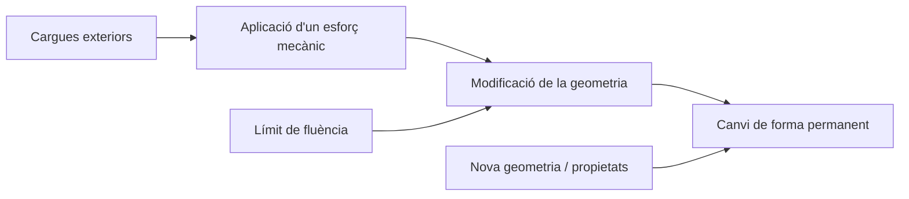
``` mermaid
graph LR
  A[Cargues exteriors] --> B[Aplicació d'un esforç mecànic];
  B --> C[Modificació de la geometria];
  D[Límit de fluència] --> C;
  C -->E[Canvi de forma permanent];
  F[Nova geometria / propietats] -->E;
```

Aquest procés es restrigeix d'acord amb:

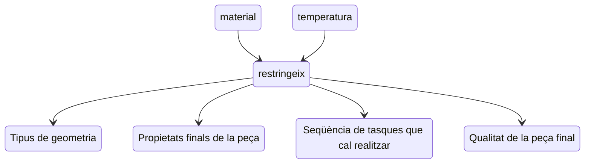
``` mermaid
stateDiagram-v2
  state material
  state temperatura
    material --> restringeix
    temperatura --> restringeix
    restringeix --> S1
    restringeix --> S2
    restringeix --> S3
    restringeix --> S4
    S1: Tipus de geometria
    S2: Propietats finals de la peça
    S3: Seqüència de tasques que cal realitzar
    S4: Qualitat de la peça final
```

La deformació plàstica per tant és la deformació aplicada a un material no recuperable

<figure markdown="span">
    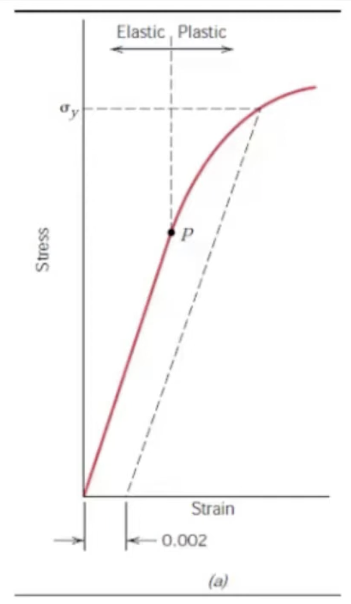{ width="300" }
    <figcaption>Foto de Juan Manuel Vallejos: https://youtu.be/5u1yQZHw1iA?si=0obRAIccrV5Q-MD6</figcaption>
</figure>

La deformació plàstica provoca:

- Canvis de forma significatius respecte a la matèria de partida.
-  Millores en les característiques mecàniques del material.
- En alguns casos s'obtenen peces acabades sense necessitat de processament posterior.
- Toleràncies més ajustades i acabats superficials millors que en peces obtingudes per fosa.
- Possibilitat d'obtenir tant geometries senzilles com complexes.

Els efectes de la temperatura en el procés de deformació plàstica es basen en l'assoliment de la temperatura de recristalització, la qual es pot definir com la meitat de la de fusió. Arribar a aquesta temperatura provoca un creiximent del gra i canvia la localització de la deformació en la estrucutra (a les vores del gra o al gra). Si es treballa per sota de la T s'anomenta conformat en fred i si es treballa per damunt conformat en calent.

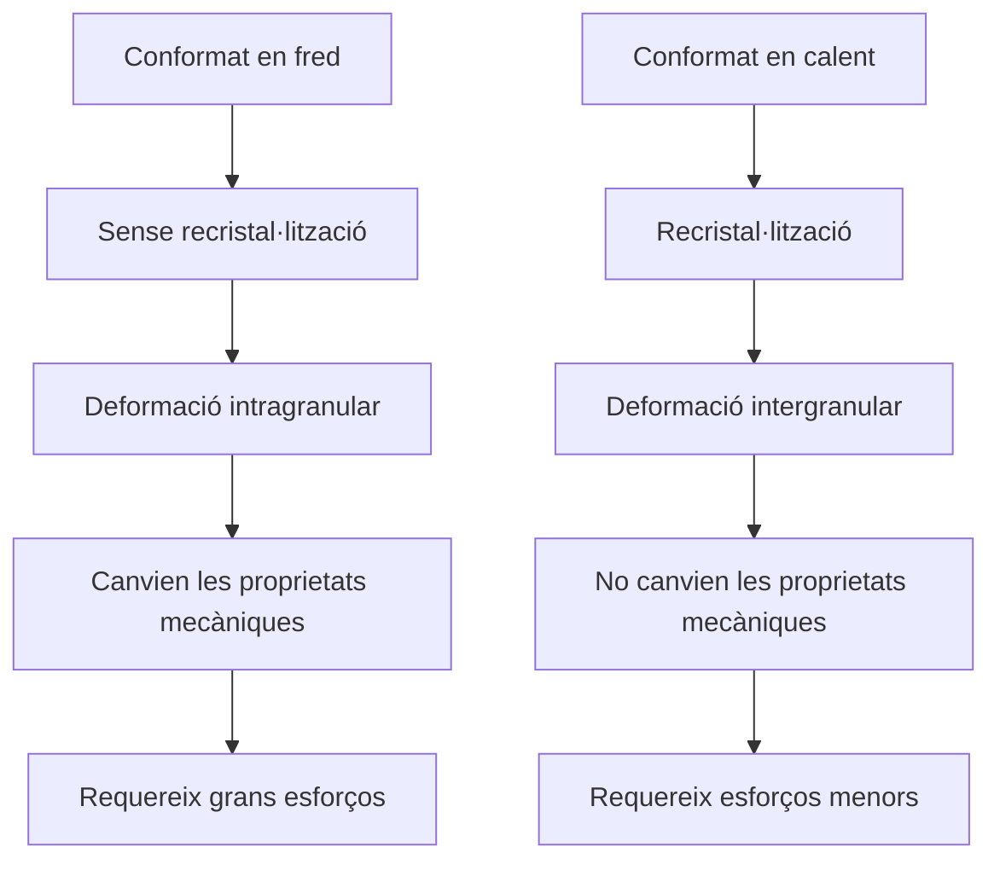
``` mermaid
graph TB
    A["Conformat en fred"]
    A --> B["Sense recristal·lització"]
    B --> C["Deformació intragranular"]
    C --> D["Canvien les proprietats mecàniques"]
    D --> E["Requereix grans esforços"]

    F["Conformat en calent"]
    F --> G["Recristal·lització"]
    G --> H["Deformació intergranular"]
    H --> I["No canvien les proprietats mecàniques"]
    I --> J["Requereix esforços menors"]
```

Les formes inicials inclouen barres, totxos cilíndrics, totxos rectangulars i planxes, així com altres formes similars elementals. Els processos de deformació volumètrica que refinen les formes originals, algunes vegades milloren les propietats mecàniques. El treball dels processos de deformació consisteix a sotmetre el metall a un esforç suficient per a fer que aquest fluisca plàsticament i prenga la forma desitjada.

### Conformat en fred

El treball en fred o sota la temperatura de cristal·lització és apropiat quan el canvi de forma és menys sever i hi ha necessitat de millorar les propietats mecàniques, o aconseguir un bon acabat en la peça final.

<figure markdown="span">
    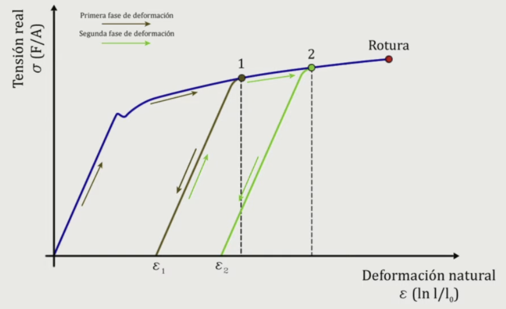{ width="600" }
    <figcaption>Foto de Universitat Politècnica de València: https://www.weerg.com/es/guias/galvanizacion</figcaption>
</figure>

Les operacions de treball en fred es poden usar no solament per a donar forma al producte, sinó també per a incrementar la seva resistència mitjançant l'enduriment per deformació.

Això provoca que el material no estiga homogeneïtzat; tensions residuals als materials; un augment de la duresa, el límit elàstic i la fragilitat; i que l'esforç requerit depenga del grau de deformació.

### Conformat en calent

El treball en calent es requereix generalment quan involucra la deformació volumètrica de grans peces de treball. En aquest cas, ocorre una major homogeneïtat del material, No s'acumulen tensions residuals al material, les proprietats mecàniques no són afectades, i l'esforç que es requereix depen de la velocitat de deformació.

<figure markdown="span">
    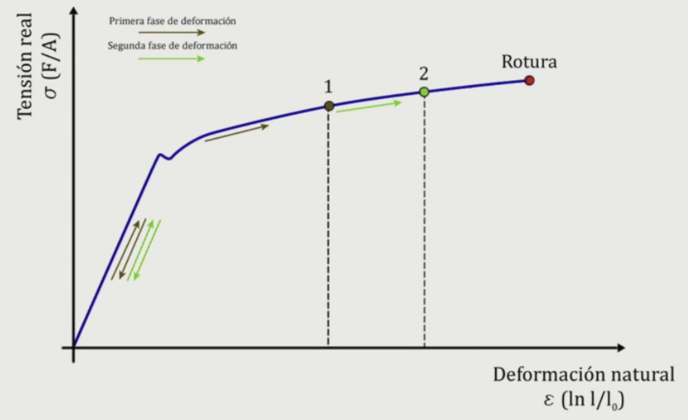{ width="600" }
    <figcaption>Foto de Universitat Politècnica de València: https://www.weerg.com/es/guias/galvanizacion</figcaption>
</figure>

Amb les operacions de treball en calent es poden aconseguir canvis significatius en la forma de les peces de treball.

## Processos de deformació volumètrica

``` mermaid
graph TB
    A["Processos de deformació volumètrica"]
    A --> B["Canvis significatius de forma (3D)"]
    B --> C["Conformat en calent"]
    C --> D["Toleràncies i acabats superficials limitats"]

    E["Processos de conformat de xapa"]
    E --> F["Canvis en forma 2D, mantenint un espessor]
    F --> G["Conformat en fred"]
    G --> H["Toleràncies i acabats superficials bons"]
```

### Laminatge

El laminatge és un procés de deformació en el qual el gruix del material de treball es redueix mitjançant forces de compressió exercides per dos corrons oposats.

<figure markdown="span">
    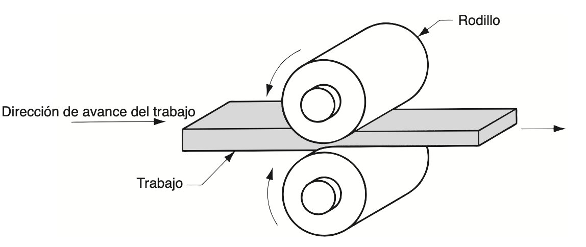{ width="600" }
    <figcaption>Foto de Fundamentos de la manufactura moderna</figcaption>
</figure>

El procés s'usa per a reduir el gruix d'una secció transversal rectangular. Un procés estretament relacionat és el laminatge de perfils, en el qual una secció transversal quadrada es transforma en un perfil, tal com en una biga en I.

La majoria del laminatge es realitza en calent a causa de la gran quantitat de deformació requerida. Els metalls laminats en calent estan generalment lliures d'esforços residuals i les seues propietats són isotròpiques. Els desavantatges són que el producte no pot mantenir-se dins de toleràncies adequades, i la superfície presenta una capa d'òxid característica.

El treball comença amb un lingot d'acer fos recentment solidificat. Encara calent, el lingot es col·loca en un forn on roman durant moltes hores, fins a aconseguir la temperatura uniforme en tota la seua extensió, perquè puga fluir consistentment durant el laminatge.

El lingot reescalfat passa al molí de laminació, on es lamina per a convertir-lo en una de les tres formes intermèdies anomenades lupies, totxos o planxes.

Les lupies es laminen per a generar perfils estructurals i raïls per a ferrocarril. Els totxos es laminen per a produir barres i varetes. Aquestes formes són la matèria primera per al maquinat, estirat de filferro, forjat i altres processos de treball de metalls. Les planxes es laminen per a convertir-les en plaques, làmines i tires.

<figure markdown="span">
    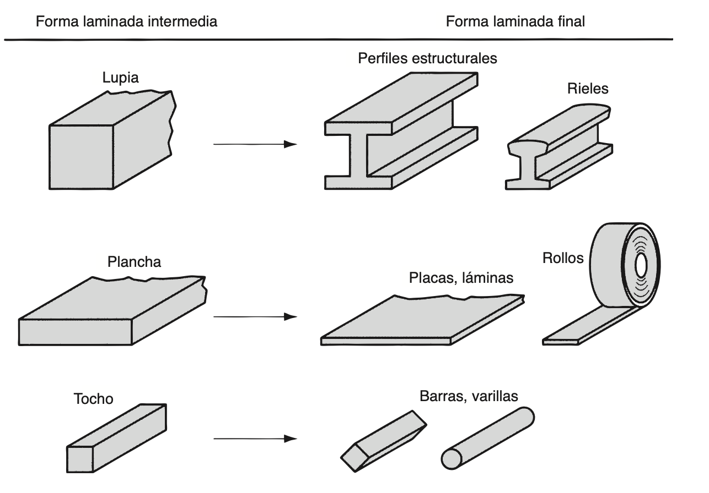{ width="600" }
    <figcaption>Foto de Fundamentos de la manufactura moderna</figcaption>
</figure>

Involucra el laminatge de planxes, tires, làmines i plaques, peces de treball de secció transversal rectangular amb un ample
major que el gruix. En el laminatge pla, es pressiona el treball entre dos corrons de manera que el seu gruix es redueix a una quantitat anomenada *draft*

La fricció es presenta en el laminatge amb un cert coeficient de fricció, i la força de compressió dels corrons, multiplicada per aquest coeficient de fricció, dona per resultat una força de fricció entre els corrons i el treball. En el costat de l'entrada del punt neutre la força de fricció té una direcció; en l'altre costat, té la direcció oposada. No obstant això, les dues forces no són iguals. La força de fricció és major en l'entrada, de manera que la força neta estira el treball a través dels corrons. El laminatge no seria possible sense aquestes diferències. Hi ha un límit per al màxim *draft* possible que pot aconseguir el laminatge pla amb un coeficient de fricció

El laminatge en calent es caracteritza sovint per una condició anomenada adherència, en la qual la superfície calenta del material de treball es pega als corrons sobre l'arc de contacte. Aquesta condició ocorre sovint en el laminat d'acers i aliatges per a alta  temperatura. Quan ocorre l'adherència, el coeficient de fricció pot ser tan alt com 0.7. La conseqüència de l'adherència és que les capes superficials del material de treball no es poden moure a la mateixa velocitat que la velocitat del corró *vr*; i sota la superfície la deformació és més severa a fi de permetre el pas de la peça a través de l'obertura entre els corrons.

<figure markdown="span">
    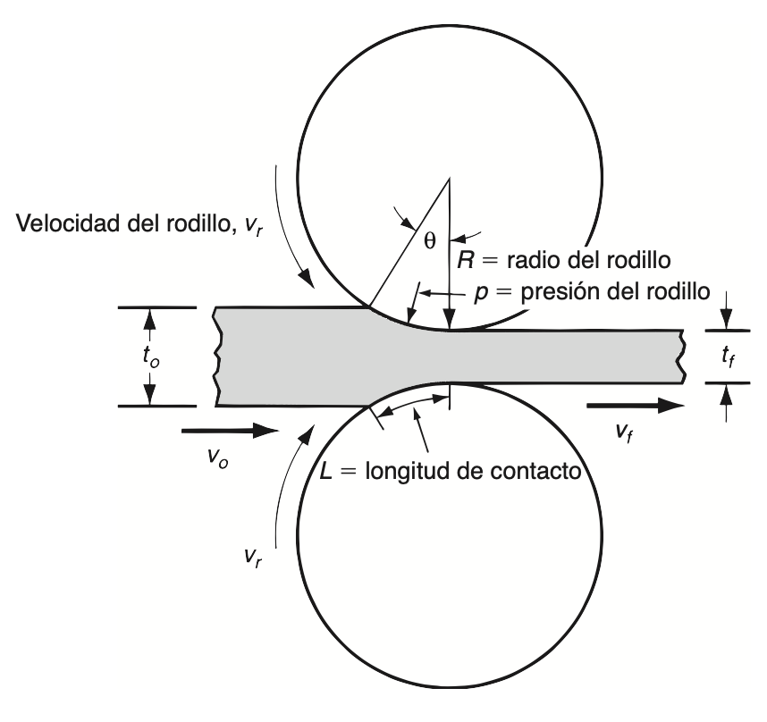{ width="600" }
    <figcaption>Foto de Fundamentos de la manufactura moderna</figcaption>
</figure>

Variació típica de pressió al llarg de la longitud de contacte en el laminatge pla. La pressió pic es localitza en el punt neutre. L'àrea sota la corba, representada per la integral, és la força de laminació F.

<figure markdown="span">
    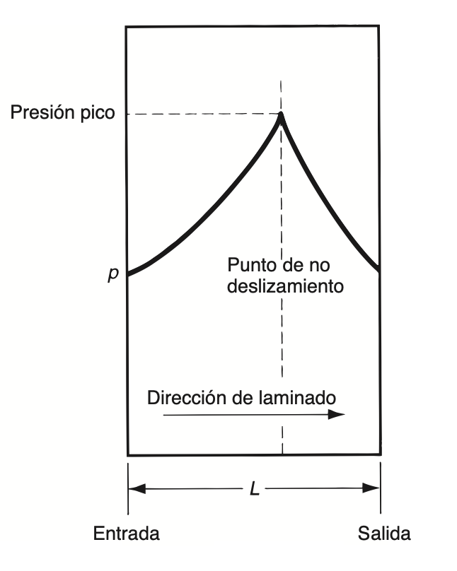{ width="600" }
    <figcaption>Foto de Fundamentos de la manufactura moderna</figcaption>
</figure>

#### Laminatge de perfils

<figure markdown="span">
    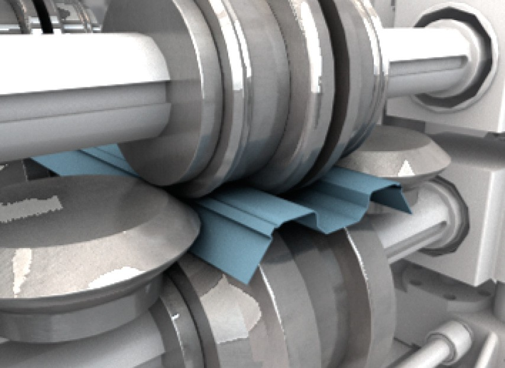{ width="600" }
    <figcaption>Foto de Voestalpine: https://www.voestalpine.com/sadef/es/Laminado-en-frio</figcaption>
</figure>

En el laminatge de perfils, el material de treball es deforma per a generar un contorn en la secció transversal. Els productes fets per aquest procediment inclouen perfils de construcció com a bigues en I, en L i canals en O.

Els corrons formadors són més complicats; i el material inicial, de forma usualment quadrada, requereix una transformació gradual a través de diversos corrons per a aconseguir la secció final. El disseny de la seqüència de les formes intermèdies i els corresponents corrons es diu disseny de passades de laminació. La seva meta és aconseguir una deformació uniforme

#### Molins laminadors

<figure markdown="span">
    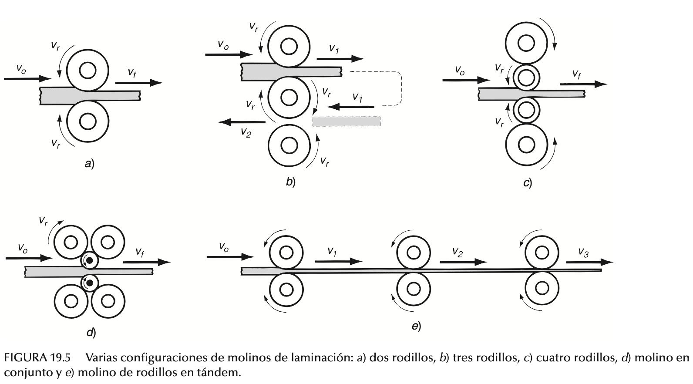{ width="600" }
    <figcaption>Foto de Fundamentos de la manufactura moderna</figcaption>
</figure>

Es disposa de diverses configuracions de molins de laminació:

Dos corrons oposats i es denomina molí de laminació de dos corrons, aquesta, pot ser reversible o no reversible. En el molí no reversible els corrons giren sempre en la mateixa direcció i el treball sempre passa a través del mateix costat. El molí reversible permet la rotació dels corrons en totes dues direccions, de manera que el treball pot passar a través de qualsevol direcció. Això permet una sèrie de reduccions que es fan a través del mateix joc de corrons, passant simplement el treball diverses vegades des de direccions oposades. El desavantatge de la configuració reversible és la quantitat significativa de moviment angular a causa de la rotació de grans corrons

En la configuració de tres corrons, hi ha tres corrons en una columna vertical i la direcció de rotació de cada corró roman sense canvi. Per a aconseguir una sèrie de reduccions es pot passar el material de treball en qualsevol direcció, ja siga elevant o baixant la tira després de cada pas. L'equip en un molí de tres corrons es torna més complicat a causa del mecanisme elevador que es necessita per a elevar o baixar el material de treball.

En els molins de quatre corrons s'usen dos corrons de diàmetre menor per a fer contacte amb el treball i dos corrons darrere com a suport, A causa de les altes forces de laminatge, els corrons menors podrien desviar-se elàsticament amb el pas de la laminació, si no fos pels corrons més grans de suport que els suporten.

Una altra configuració que permet l'ús de corrons menors contra el treball és el molí en conjunt o ram.

Per a aconseguir altes velocitats de rendiment en els productes estàndard s'usa freqüentement un molí de corrons en tàndem. Aquesta configuració consisteix en una sèrie de bastidors de corrons i cadascun realitza una reducció en el gruix o un refinament en la forma del material de treball que passa entre ells. A cada pas de laminació s'incrementa la velocitat, fent significatiu el problema de sincronitzar les velocitats dels corrons en cada etapa.

Els avantatges inclouen: eliminació de fosses de reescalfat, reducció del espai en les instal·lacions i temps de manufactura més  curts. Aquests avantatges tècnics es tradueixen en beneficis econòmics per a aquells molins que poden realitzar la colada contínua i la laminació.

#### Altres processos de laminatge

##### Laminatge de cordes

<figure markdown="span">
    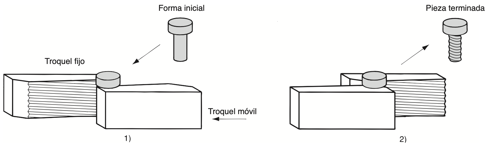{ width="600" }
    <figcaption>Foto de Fundamentos de la manufactura moderna</figcaption>
</figure>

El laminatge de cordes s'usa per a formar cordes en peces cilíndriques mitjançant la seva laminació entre dos encunys. És el procés comercial més important per la producció massiva de components amb cordes externes (perns i caragols)

La majoria de les operacions de laminatge de cordes es realitza per treball en fred, utilitzant màquines laminadores de cordes. Aquestes màquines estan equipades amb encunys especials que determinen la grandària i forma de la corda; els encunys són de dos tipus: encunys plans que es mouen alternadament entre si i encunys rodons, que giren relativament entre si per a aconseguir l'acció de laminatge.

##### Laminatge d'anells

<figure markdown="span">
    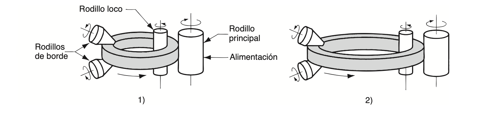{ width="600" }
    <figcaption>Foto de Fundamentos de la manufactura moderna</figcaption>
</figure>

El laminatge d'anells és un procés de deformació que lamina les parets gruixudes d'un anell per a obtenir anells de parets més primes, però d'un diàmetre major.

El laminatge d'anells s'aplica usualment en processos de treball en calent per a anells grans i en processos de treball en fred per a anells petits. Els avantatges del laminatge  d'anells sobre altres mètodes per a fabricar les mateixes peces són: l'estalvi de matèries primeres, l'orientació ideal dels grans per a l'aplicació i l'enduriment a través del treball en fred.

##### Laminat d'engranatges

Aquest és un procés de format en fred que produeix certs engranatges. És similar al laminatge de cordes, excepte perquè les característiques de deformació dels cilindres o discos s'orienten paral·lelament al seu eix (o a un angle en el cas d'engranatges helicoidals), en lloc de l'espiral del laminatge de cordes.

##### Perforat de corrons

<figure markdown="span">
    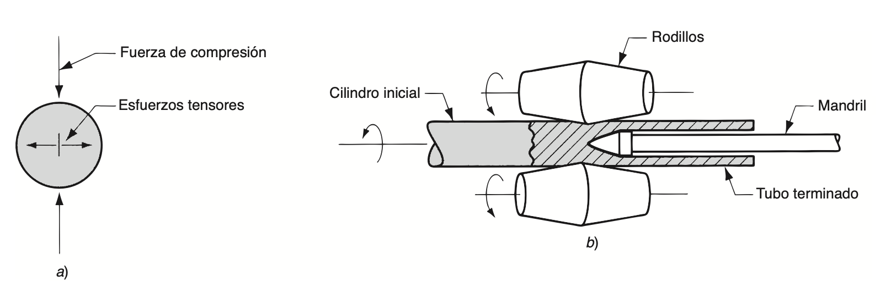{ width="600" }
    <figcaption>Foto de Fundamentos de la manufactura moderna</figcaption>
</figure>

És un procés especialitzat de treball en calent per a fer tubs sense costura de parets gruixudes. Utilitza dos corrons oposats i per tant s'agrupa entre els processos de laminatge. El procés es basa en el principi que en comprimir un sòlid cilíndric sobre la seva circumferència, es generen alts esforços de tensió en el seu centre. Si la compressió és prou alta, es forma
una esquerda interna. Aquest principi s'aprofita en el perforat de corrons. Els esforços de compressió s'apliquen sobre el totxo sòlid cilíndric per dos corrons. Un mandril s'encarrega de controlar la grandària i acabat de la perforació creada per l'acció. S'usen els termes perforat rotatori de tubs i procés *Mannesmann* per a aquesta operació en la fabricació de tubs.

### Forjat

El forjat és un procés de deformació en el qual es comprimeix el material de treball entre dos encunys, usant impacte o pressió gradual per a formar la peça. Aquests components inclouen cigonyals i bieles per a motors de combustió interna, engranis, components estructurals per a aviació i peces per a turbines i motors de propulsió. S'usa el forjat per a fixar la forma bàsica de grans components que després es maquinen per a aconseguir la seva forma final i dimensions definitives.

Una manera de classificar les operacions de forja és mitjançant la temperatura de treball. La majoria de les operacions de forja es realitza en calenta (per dalt o per sota de la temperatura de cristal·lització), donada la deformació que demanda el procés i la necessitat de reduir la resistència i incrementar la ductilitat del metall de treball; no obstant això, el forjat en fred és molt comú per a uns certs productes. L'avantatge del forjat en fred és que incrementa la resistència que resulta de l'enduriment per deformació del component.

En el forjat s'aplica la pressió per impacte o en forma gradual. Una màquina de forjat que aplica càrregues d'impacte es diu martinet de nit de forja, mentre que la que aplica pressió gradual es diu premsa de forjat.

Una altra diferència entre les operacions de forjat és el grau en què els encunys restringeixen el flux del metall de treball. Hi ha tres tipus d'operacions de forjat: a) forjat en encuny obert, b) forjat en encuny impressor i c) forjat sense rebava. En el forjat en encuny obert, el treball es comprimeix entre dos encunys plans (o gairebé plans), permetent que el metall flueixi sense restriccions en una direcció lateral respecte a les superfícies de l'encuny. En el forjat en encuny impressor, les superfícies de l'encuny contenen una forma o impressió que s'imparteix al material de treball durant la compressió, restringint significativament el flux de metall. En aquesta mena d'operació, una part del metall flueix més enllà de l'encuny impressor formant una rebava, com es mostra en la figura.

En el forjat sense rebava, l'encuny restringeix completament el material de treball dins de la cavitat i no es produeix rebava excedent. És necessari controlar estretament el volum de la peça inicial perquè iguali al volum de la cavitat de l'encuny.

<figure markdown="span">
    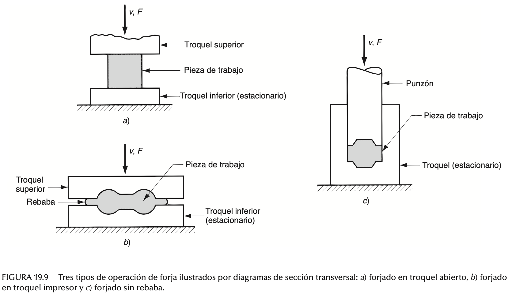{ width="600" }
    <figcaption>Foto de Fundamentos de la manufactura moderna</figcaption>
</figure>

<figure markdown="span">
    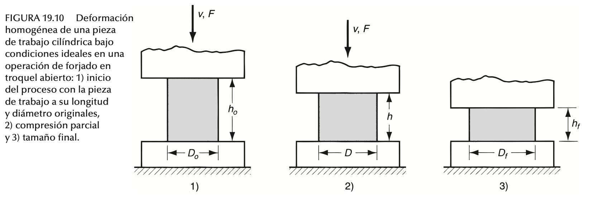{ width="600" }
    <figcaption>Foto de Fundamentos de la manufactura moderna</figcaption>
</figure>

<figure markdown="span">
    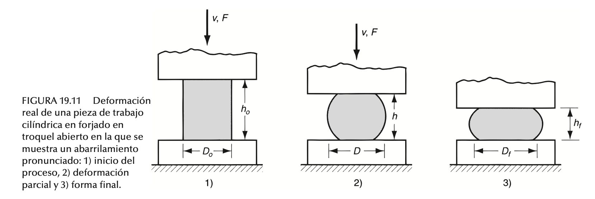{ width="600" }
    <figcaption>Foto de Fundamentos de la manufactura moderna</figcaption>
</figure>

#### Anàlisi del forjat en encuny obert

Si el forjat en encuny obert es duu a terme sota condicions ideals, sense fricció entre el treball i la superfície de l'encuny, ocorre una deformació homogènia i el flux radial de material és uniforme al llarg de la seva altura

Una operació real de recalcat no ocorre com una deformació homogènia, pel fet que la fricció s'oposa al flux de metall en la superfície dels encunys. Això crea un efecte d'inflor en forma de barril, anomenat abarrilament. Quan es fa un treball en calent amb encunys freds, el abarrilament és més pronunciat. Això es deu a un coeficient de fricció més alt, típic del treball en calent, i a la transferència de calor en la superfície de l'encuny i les seues zones properes, la qual cosa refreda el metall i augmenta la seua resistència a la deformació. El metall més calent es troba enmig de la peça i flueix més fàcilment que el material més fred dels extrems. L'efecte s'accentua en augmentar la relació entre el diàmetre i l'altura de la peça, a causa de la major àrea de contacte en la interfície encuny-treball.

Les formes generades per operacions en encuny obert són simples, com a fletxes, discos i anells. Les operacions de forja en encuny obert produeixen formes rudimentàries que necessiten operacions posteriors per a refinar les peces a les seves dimensions i forma final. Una contribució important del forjat en calent en encuny obert és la creació d'un flux de grans i d'una estructura metal·lúrgica favorable en el metall.

Les operacions classificades en la categoria d'encuny obert són operacions relacionades i poden realitzar-se amb encunys convexos, amb encunys còncaus i per seccions. El forjat amb encunys convexos *fullering* és una operació de forja que s'utilitza per a reduir la secció transversal i redistribuir el metall en una peça de treball, com a preparació per a operacions posteriors de format amb forja. Les cavitats de l'encuny per al forjat amb encunys convexos es dissenyen sovint amb múltiples cavitats d'impressió, de manera que la barra inicial pugui formar-se toscament abans del format. El forjat amb encunys còncaus és similar a l'anterior, excepte perquè els encunys tenen superfícies còncaves. Una operació de forjat per seccions consisteix en una seqüència de compressions forjades al llarg d'una peça de treball per a reduir la seva secció transversal i incrementar la seva longitud.

<figure markdown="span">
    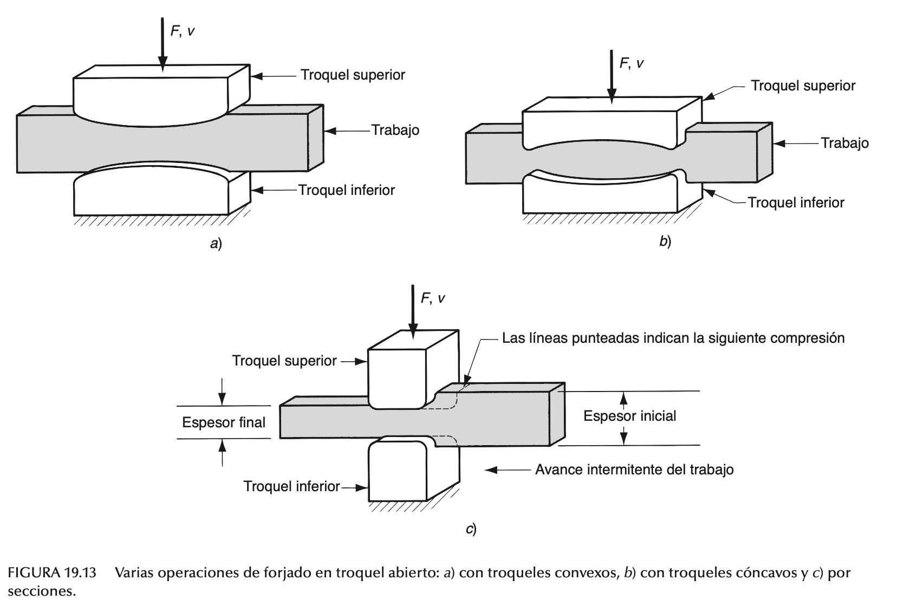{ width="600" }
    <figcaption>Foto de Fundamentos de la manufactura moderna</figcaption>
</figure>

#### Forjat amb encuny impressor

El forjat amb encuny impressor, anomenat algunes vegades forjat en encuny tancat, es realitza amb encuny que té la forma inversa de la requerida per a la peça. La peça de treball inicial es mostra com una peça cilíndrica similar a la de les operacions prèvies en encuny obert. En tancar-se l'encuny i arribar a la seva posició final, el metall flueix més enllà de la cavitat de l'encuny i forma una rebava en la petita obertura entre les plaques de l'encuny. Encara que la rebava s'ha de retallar després, té realment una funció important en el forjat per impressió, ja que quan aquesta comença a formar-se en el buit de l'encuny, la fricció s'oposa al fet que el metall continuï fluint cap a l'obertura, i d'aquesta manera força al material de treball a romandre en la cavitat.

En el forjat en calent, la restricció del flux de metall és major pel fet que la rebava prima es refreda ràpidament contra les plaques de l'encuny, incrementant la resistència a la deformació. La restricció del flux de metall en l'obertura fa que les pressions de compressió s'incrementin significativament, forçant al material a omplir els detalls algunes vegades intricats de la cavitat de l'encuny.

<figure markdown="span">
    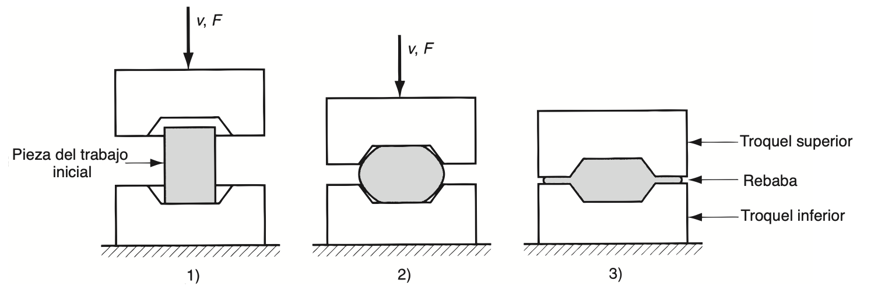{ width="600" }
    <figcaption>Foto de Fundamentos de la manufactura moderna</figcaption>
</figure>

A causa de la formació de rebava en el forjat amb encuny impressor i a les formes més complexes de les peces fetes amb aquests encunys, les forces en aquest procés són considerablement més grans i més difícils d'analitzar que en el forjat en encuny obert.

El forjat amb encuny impressor no té toleràncies estretes de treball i freqüentment es requereix el maquinat per a aconseguir la precisió necessària. El procés de forjat genera la configuració geomètrica bàsica de la peça i el maquinat realitza els acabats de precisió que es requereixen en algunes porcions de la peça (per exemple, perforacions, cordes i superfícies que han de coincidir amb altres components). Els avantatges del forjat sobre el maquinat complet de la peça són: velocitats de producció més altes, conservació del metall, major resistència i orientació més favorable dels grans de metall.

<figure markdown="span">
    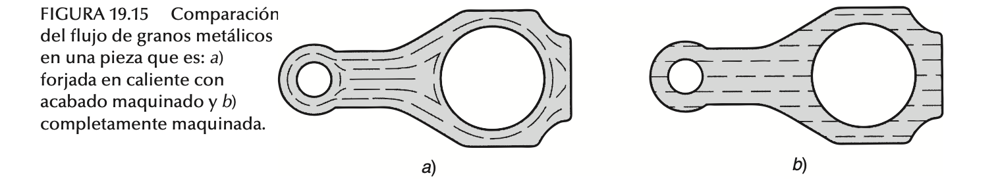{ width="600" }
    <figcaption>Foto de Fundamentos de la manufactura moderna</figcaption>
</figure>

Els processos de forjat amb la capacitat de produir seccions més primes, formes més complexes, toleràncies més estretes i la virtual eliminació de toleràncies al maquinat es coneixen com a forjat de precisió. Els metalls més comuns que s'usen en el forjat de precisió són l'alumini i el titani. En la comparació del forjat de precisió i el forjat convencional amb encuny impressor es pot observar que el forjat de precisió en aquest exemple no elimina les rebaves, encara que sí que les redueix. Algunes operacions de forjat de precisió es realitzen sense produir rebava. El forjat de precisió es classifica pròpiament com un procés de manera neta o quasi neta, depenent de la necessitat del maquinat per a acabar la forma de la peça.

<figure markdown="span">
    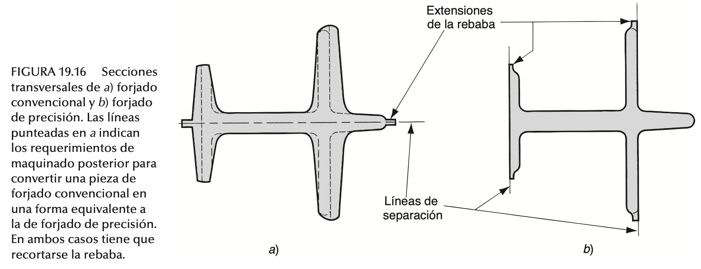{ width="600" }
    <figcaption>Foto de Fundamentos de la manufactura moderna</figcaption>
</figure>

#### Forjat sense rebava

El forjat amb encuny impressor es diu algunes vegades forjat en encuny tancat. No obstant això, hi ha una distinció tècnica entre el forjat amb encuny impressor i forjat amb encuny tancat real. La distinció és que en el forjat amb encuny impressor, la peça de treball original queda continguda completament dins de la cavitat de l'encuny durant la compressió i no es forma rebava. Per a identificar aquest procés és apropiat el terme forjat sense rebava.

El forjat sense rebava imposa uns certs requeriments sobre el control del procés, més exigents que el forjat amb encuny impressor. Més important és que el volum de material de treball ha d'igualar al volum de la cavitat de l'encuny dins de molt estretes toleràncies. Si la peça en blanc inicial és massa gran, la pressió excessiva pot causar mal a l'encuny o a la premsa. Si la peça en blanc és massa petita, no s'omplirà la cavitat. A causa d'aquest requeriment especial, el procés és més adequat en la manufactura de peces geomètriques simples i simètriques, i per a treballar metalls com l'alumini, el magnesi o els seus aliatges. El forjat sense rebava es classifica sovint com un procés de forjat de precisió.

<figure markdown="span">
    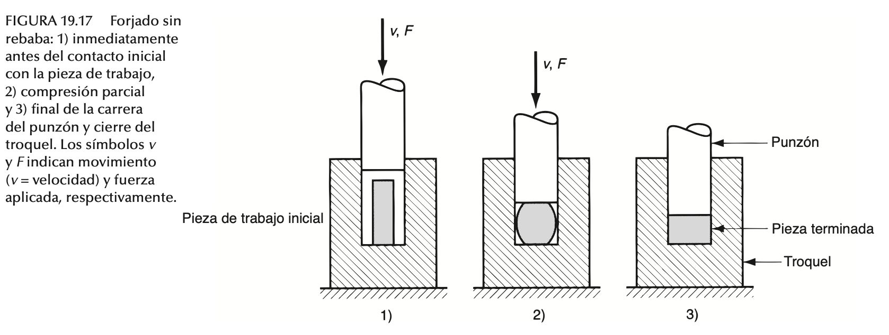{ width="600" }
    <figcaption>Foto de Fundamentos de la manufactura moderna</figcaption>
</figure>

### Extrusió 

<figure markdown="span">
    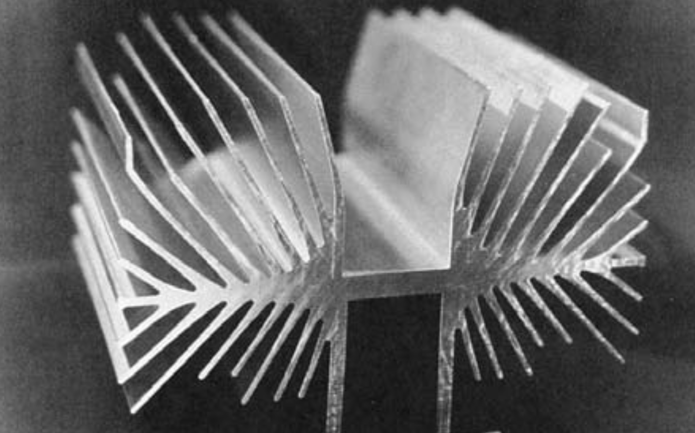{ width="600" }
    <figcaption>Foto de Fundamentos de la manufactura moderna</figcaption>
</figure>

L'extrusió és un procés de format per compressió en el qual el metall de treball és forçat a fluir a través de l'obertura d'un encuny per a donar-li forma a la seva secció transversal.

1- es pot extruir una gran varietat de formes, especialment amb extrusió en calenta; no obstant això, una limitació de la configuració geomètrica és que la secció transversal ha de ser la mateixa al llarg de tota la peça; 
2- l'estructura del gra i les propietats de resistència es milloren amb l'extrusió en fred o en calent; 
3- són possibles toleràncies molt estretes, especialment quan s'usa extrusió en fred; 
4- en algunes operacions d'extrusió es genera poc o cap material de desaprofitament.

Una manera de classificar les operacions és atenent la seva configuració física; es distingeixen dos tipus principals: extrusió directa i extrusió indirecta.

A l'extrusió directa (també anomenada extrusió cap endavant) un totxo de metall es carrega en un recipient, i un pistó comprimeix el material forçant-lo a fluir a través d'una o més obertures en un encuny a l'extrem oposat del recipient. En aproximar-se el pistó a l'encuny, una petita porció del totxo roman i no pot forçar-se a través de l'obertura de l'encuny. Aquesta porció extra, anomenada topall o cap, se separa del producte, tallant-la justament després de la sortida de l'encuny.

<figure markdown="span">
    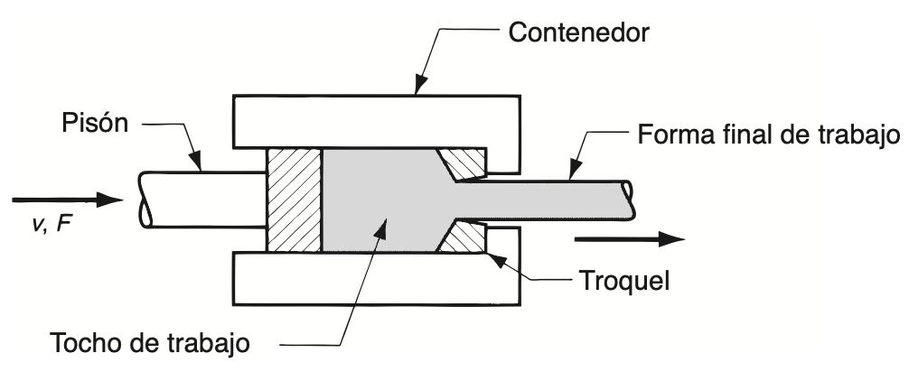{ width="600" }
    <figcaption>Foto de Fundamentos de la manufactura moderna</figcaption>
</figure>

Un problema en l'extrusió directa és la gran fricció que existeix entre la superfície del treball i les parets del recipient en forçar el lliscament del totxo cap a l'obertura de l'encuny. Aquesta fricció ocasiona un increment substancial de la força requerida en el pistó per a l'extrusió directa. En l'extrusió en calenta aquest problema s'agreuja per la presència d'una capa d'òxid en la superfície del totxo que pot ocasionar defectes en els productes extruïts.

Per a resoldre aquest problema s'usa un bloc simulat entre el pistó i el totxo de treball; el diàmetre del bloc és lleugerament menor que el diàmetre del totxo, de manera que en el recipient queda un anell estret de metall de treball (capes d'òxid en la seva majoria), deixant el producte final lliure d'òxids.

En l'extrusió directa es poden fer seccions buides. El totxo inicial es prepara amb una perforació paral·lela al seu eix. Això permet el pas d'un mandril que es fixa en el bloc simulat.

<figure markdown="span">
    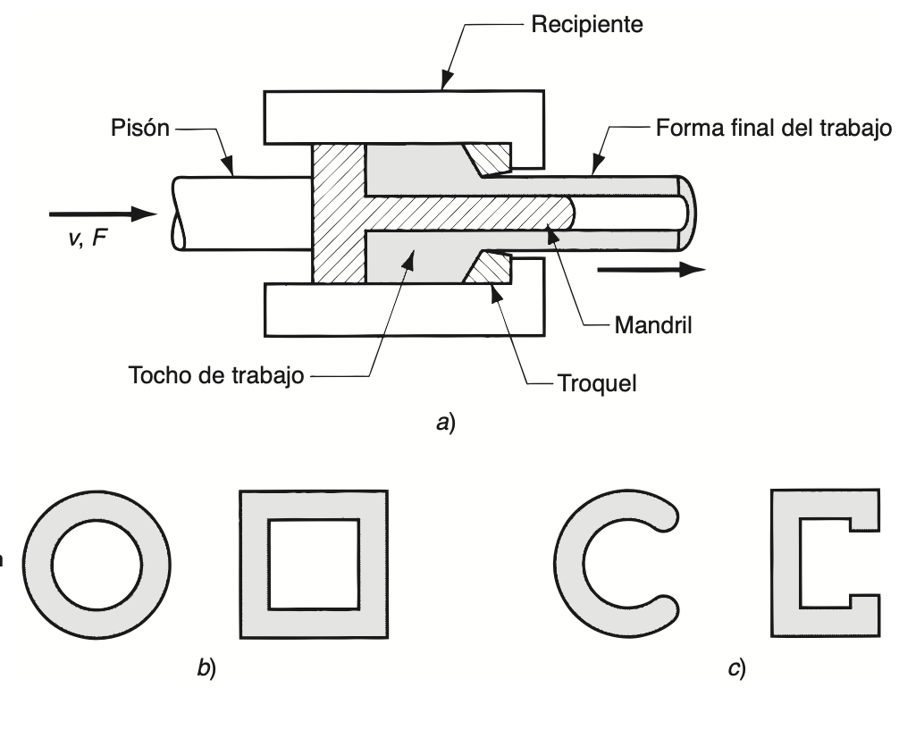{ width="600" }
    <figcaption>Foto de Fundamentos de la manufactura moderna</figcaption>
</figure>

En l'extrusió indirecta, també anomenada extrusió cap enrere i extrusió inversa, l'encuny està muntat sobre el pistó, en lloc d'estar en l'extrem oposat del recipient. En penetrar el pistó en el treball, força al metall a fluir a través del clar en una direcció oposada a la del pistó. Com el totxo no es mou respecte al recipient, no hi ha fricció en les parets del recipient. Per consegüent, la força del pistó és menor que en l'extrusió directa. Les limitacions de l'extrusió en directe es deuen a la menor rigidesa del pistó buit i a la dificultat de sostenir el producte extruït tal com surt de l'encuny.

<figure markdown="span">
    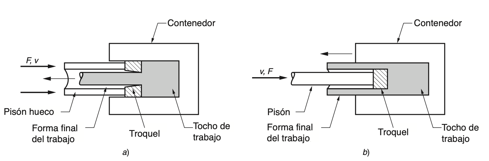{ width="600" }
    <figcaption>Foto de Fundamentos de la manufactura moderna</figcaption>
</figure>

Hi ha limitacions pràctiques en la longitud de la peça extruïda que poden resoldre's per aquest mètode. El sosteniment del pistó es converteix en un problema a mesura que la longitud de treball augmenta.

Extrusió en fred versus extrusió en calenta L'extrusió es pot realitzar ja siga en fred o en calent, depenent del metall de treball i de la magnitud de la deformació al fet que se subjecte el material durant el procés. Els metalls típics que s'extrueixen en calent són: alumini, coure, magnesi, zinc, estany i els seus aliatges. Aquests mateixos materials s'extrueixen algunes vegades en fred. Els aliatges d'acer s'extrueixen usualment en calent, encara que els graus més suaus i més dúctils s'extrueixen algunes vegades en fred.

L'extrusió en calenta involucra l'escalfament previ del totxo a una temperatura per sobre de la seva temperatura de cristal·lització.Això redueix la resistència i augmenta la ductilitat del metall, permetent majors reduccions de grandària i l'assoliment de formes més complexes amb aquest procés

Quan el refredament del totxo entra en contacte amb les parets del recipient és un problema; per a superar-lo s'usa algunes vegades l'extrusió isotèrmica. La lubricació és un aspecte crític de l'extrusió en calenta d'uns certs metalls (per exemple, acer), i s'han desenvolupat lubrificants especials que són efectius sota les condicions agressives de l'extrusió en calenta. Algunes vegades s'usa el vidre com a lubrificant de l'extrusió en calenta; a més de reduir la fricció, proporciona aïllament tèrmic efectiu entre el totxo i el recipient d'extrusió.

En general, l'extrusió en fred i l'extrusió per sota de la seva temperatura de cristal·lització s'usen per a produir peces discretes, habitualment en forma acabada (o en forma gairebé acabada).

<figure markdown="span">
    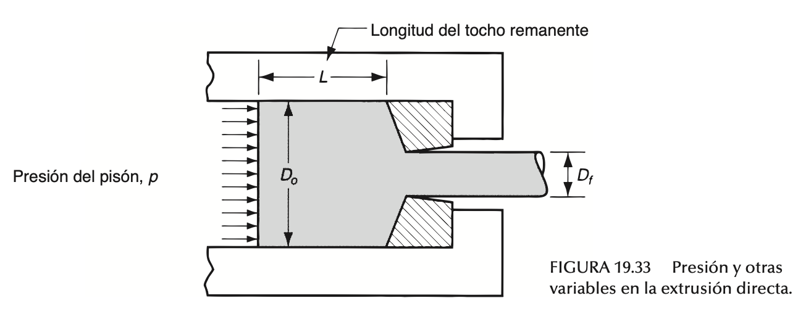{ width="600" }
    <figcaption>Foto de Fundamentos de la manufactura moderna</figcaption>
</figure>

Els factors importants en un encuny d'extrusió són l'angle de l'encuny i la forma de l'orifici. L'angle de l'encuny, més precisament la meitat de l'angle de l'encuny, és l'angle *alpha*. Per a angles menors, l'àrea superficial de l'encuny augmenta, així com també la fricció en la interfície encuny-totxo. Major fricció significa major força en el pistó. D'altra banda, un angle gran de l'encuny ocasiona major turbulència del flux de metall durant la reducció, i també increment en la força requerida del pistó. L'efecte de l'angle de l'encuny sobre la força del pistó és una funció en forma de U.

<figure markdown="span">
    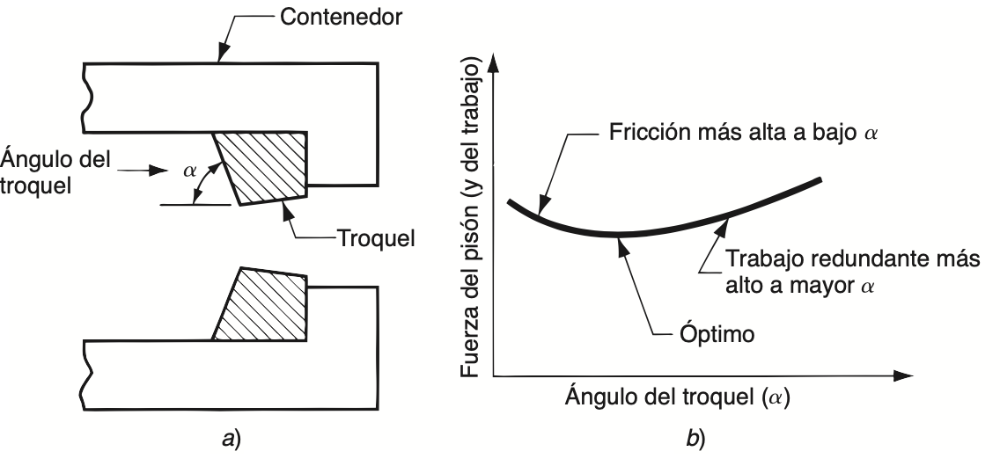{ width="600" }
    <figcaption>Foto de Fundamentos de la manufactura moderna</figcaption>
</figure>

Els materials per a encunys d'extrusió en calenta inclouen acers per a eina i acers aliats. Les propietats més importants d'aquests materials per a encunys són alta resistència al desgast, alta duresa en calenta i alta conductivitat tèrmica per a remoure la calor del procés. Els materials per a encunys d'extrusió en fred inclouen acers per a eina i carburs cimentats. Les seves propietats desitjables són resistència al desgast i bona disposició per a retenir la seva forma baix alts esforços. Els carburs s'usen quan es requereixen altes velocitats de producció, llarga vida en els encunys i bon control dimensional.

#### Defectes d'extrusio

A causa de la considerable deformació associada a les operacions d'extrusió, poden ocórrer nombrosos defectes en els productes extruïts. Els defectes es poden classificar en les següents categories:

a) Rebentat central. Aquest defecte és una esquerda interna que es genera com a resultat dels esforços de tensió al llarg de la línia central de la peça de treball durant l'extrusió. Encara que els esforços de tensió poden semblar improbables en un procés de compressió com l'extrusió, tendeixen a ocórrer baix condicions que ocasionen gran deformació en regions de treball apartades de l'eix central. El moviment de material més gran a les regions exteriors estira el material al llarg del centre de la peça de treball. Si els esforços són prou grans, ocorre el rebentat central.

b) Tubificat (bossa de contracció) La tubificació és un defecte associat amb l'extrusió directa. És un enfonsament en l'extrem del totxo.

c) Esquerdat superficial Aquest defecte és resultat de les altes temperatures de la peça de treball que causen el desenvolupament d'esquerdes en la superfície; ocorre sovint quan la velocitat d'extrusió és massa alta i condueix a altes velocitats de deformació associades amb generació de calor. Altres factors que contribueixen a l'esquerdament superficial són l'alta fricció i el refredament ràpid de la superfície dels totxos a altes temperatures en l'extrusió en calenta.

<figure markdown="span">
    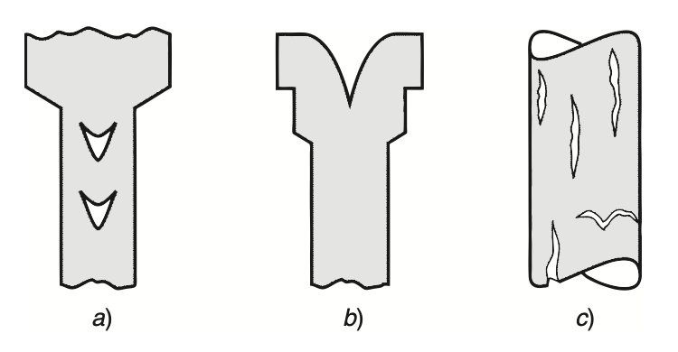{ width="600" }
    <figcaption>Foto de Fundamentos de la manufactura moderna</figcaption>
</figure>

### Trefilatge

<figure markdown="span">
    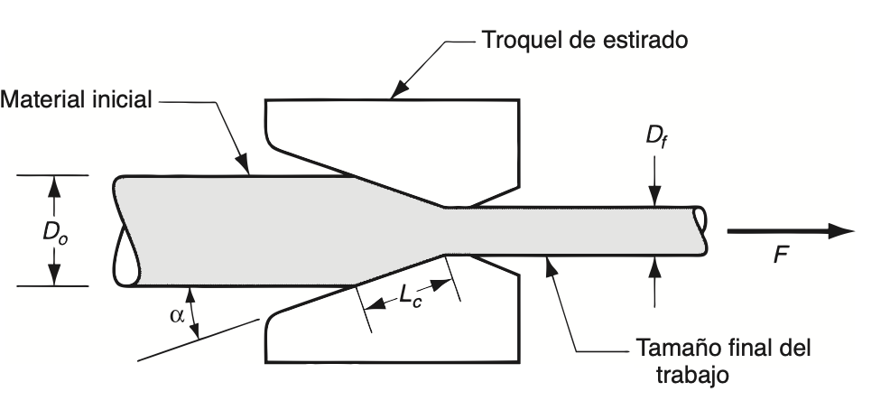{ width="600" }
    <figcaption>Foto de Fundamentos de la manufactura moderna</figcaption>
</figure>

L'estiratge és una operació on la secció transversal d'una barra, vareta o filferro es redueix en tirar del material a través de l'obertura d'un encuny. 

Les característiques generals del procés són similars a les de l'extrusió; la diferència és que en l'estiratge el material de treball s'estira a través de l'encuny, mentre que en l'extrusió s'empeny a través d'ell. Encara que la presència d'esforços de tensió és òbvia en l'estiratge, la compressió també juga un paper important, ja que el metall es comprimeix en passar a través de l'obertura de l'encuny. Per aquesta raó, la deformació que ocorre en l'estiratge es diu algunes vegades compressió indirecta.

<figure markdown="span">
    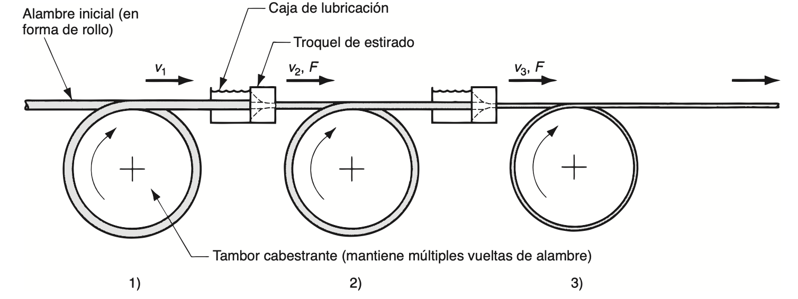{ width="600" }
    <figcaption>Foto de Fundamentos de la manufactura moderna</figcaption>
</figure>

Abans de l'estiratge, el material inicial ha de preparar-se adequadament. Això involucra tres passos: 1) recuit, 2) neteja i 3) esmolat. El propòsit de la recuita és incrementar la ductilitat del material per a acceptar la deformació durant l'estiratge. Com ja es va dir, algunes vegades es necessiten passos de recuita en l'estiratge continu. La neteja del material es requereix per a prevenir danys en la superfície de treball i en l'encuny d'estiratge. Això involucra la remoció dels contaminants de la superfície (per exemple, capes d'òxid i corrosió) per mitjà de banys químics o neteja amb doll de municions. En alguns casos es lubrifica la superfície de treball després de la neteja.
L'esmolat implica la reducció del diàmetre de l'extrem inicial del material, de manera que puga inserir-se a través de l'encuny d'estiratge per a iniciar el procés; això s'aconsegueix generalment mitjançant estampat, laminat o tornejat. L'extrem esmolat del material se subjecta a les mordasses de la corredissa o a altres dispositius per a iniciar el procés d'estiratge.

## Conformació de xapa: processos amb separació de material i sense

### Encunyat

L'encunyat és una aplicació especial del forjat sense rebava mitjançant el qual s'imprimeixen els fins detalls de l'encuny en la superfície superior i en el fons de la peça de treball. En l'encunyat hi ha poc flux de metall; no obstant això, les pressions requerides per a reproduir els detalls superficials de la cavitat de l'encuny són altes.

<figure markdown="span">
    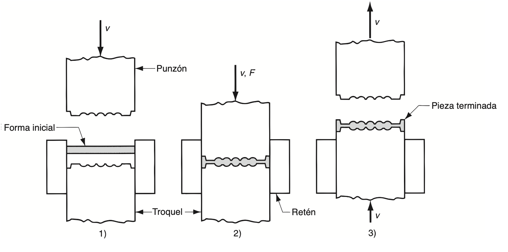{ width="600" }
    <figcaption>Foto de Fundamentos de la manufactura moderna</figcaption>
</figure>

### Embotit

### Doblat

### Repujat

## Processos de conformació de materials polimèrics i compostos

### Injecció

### Extrusió

### Termoconformació

### Bufament

### Emmotlament rotacional

### Laminatge manual

### Projecció simultània

### Emmotlament centrífug

### Bobinatge de fils

### Prepeg, SMC, pultrusió, RTM, VARI

### Emmotlament per injecció de resina

## Tractaments tèrmics i superficials

Al diagrama de meta estable i ferro carboni es representen les transformacions que pateixen els acers al carboni amb la temperatura considerant que l'escalfament de la mescla es realitza molt lentament de mode tal que els processos de difusió tinguen temps per a completar-se. Utilitzant aquest diagrama es pot determinar a diferents temperatures i percentatges de carboni les fases presents i les seves proporcions relatives la distribució de les fases en la microestructura entre altres coses. No obstant això, en la pràctica de la metal·lúrgia en general existeixen refredaments que no són lents de manera que els processos de difusió i la formació de fases d'equilibri no es produeixen de la manera que indica el diagrama. D'aquesta manera, la velocitat de escalfament i sobretot la de refredament influiran en els paràmetres micro estructurals com ara la grandària del gra i també en les fases presents i la seua distribució, modificant així les propietats mecàniques.

En metal·lúrgia es defineix a un tractament tèrmic com la combinació d'operacions d'escalfament i refredament de temps determinats i aplicats a un aliatge en l'estat sòlid de tal manera que produirà propietats desitjades.

<figure markdown="span">
    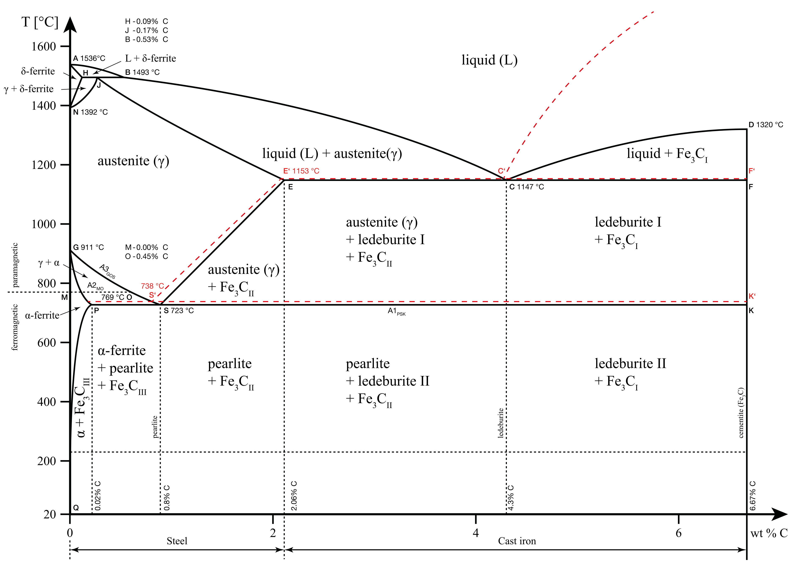{ width="600" }
    <figcaption>Foto de Wikimedia: https://es.wikipedia.org/wiki/Diagrama_hierro-carbono#/media/Archivo:Iron_carbon_phase_diagram.svg</figcaption>
</figure>

### Recuita

Recuita per a alleujament de tensions: la temperatura de re cristal·lització del acer de baix carboni és d'aproximadament 500 graus celsius. D'aquesta manera durant un procés de laminació en calent la recristal·lització procedeix simultàniament amb la laminació, aconseguint que les tensions que sorgeixen del procés siguen alleujades a mesura que es van produint. Tot i així, amb freqüència s'ha d'aplicar una quantitat considerable de treball en fred als acers de baix carboni com per exemple en el trefilatge, el qual es produeix a temperatura ambient o en la laminació en fred. En aquests casos, és imperatiu alleujar les tensions per poder realitzar més operacions de conformatge sense que aquest es trenque.

La recuita es duu a terme entre 500 i 700 graus celsius aproximadament. Aquest és el rang és per damunt de la temperatura de cristal·lització, es completarà en qüestió de minuts. Cal anar en compte, però, ja que una recuita prolongada pot causar un deteriorament de les propietats, puix que la ductilitat pot augmentar i causar una pèrdua de resistència a causa del creixement excessiu de grans i una globulització de les capes de cementita en l'estructura ferritica perdent així la microestructura perlítica de capes de ferrita i cementita. 

<figure markdown="span">
    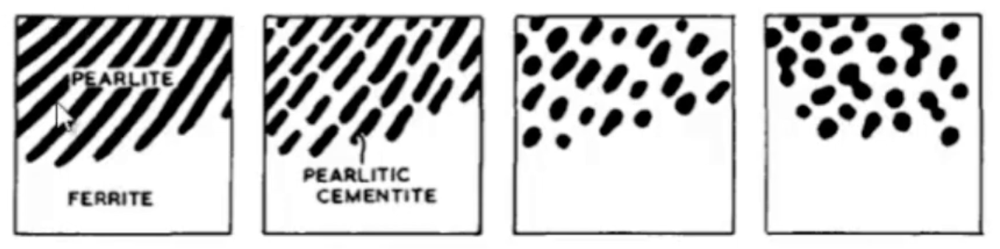{ width="600" }
    <figcaption>Foto de Juan Manuel Vallejos: https://youtu.be/lABq26BapwA?si=fV14PpvQaVdcU4vE</figcaption>
</figure>

Cal aclarir que com la temperatura de recuita d'alleujament de tensions és menor que la d'optimització, no hi ha canvi de fase i els constituents de ferrita i cementita romanen en l'estructura durant tot el procés.

<figure markdown="span">
    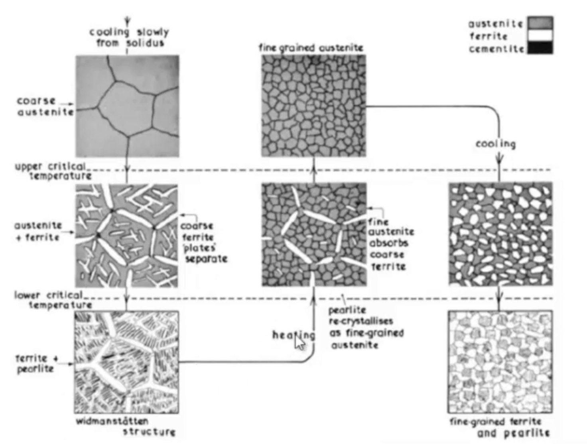{ width="600" }
    <figcaption>Foto de Juan Manuel Vallejos: https://youtu.be/lABq26BapwA?si=fV14PpvQaVdcU4vE</figcaption>
</figure>

### Normalitzat

En aquest es realitza un escalfament a una alta temperatura (similar a la recuita) però el refredament és a l'aire, és a dir, més ràpid. Això provoca que el temps per a la formació de perlita siga menor i que aquesta quede més fina, endurint l'aliatge. NO ES REFREDA EN CONDICIONS D'EQUILIBRI

La resistència mecànica serà més alta que en un element recuiut.

### Tempre

En refredaments lents el C pot difondre's fora de l'estructura i formar cementita. Contràriament, si es refreda ràpidament l'aliatge des d'una temperatura per sobre de la austenització el C intersticial de la fase austenita no té temps de difondre durant la transformació, quedant retingut i produint una fase sobresaturada BCT. Aquesta estructura es denomina martensita i la seua xarxa presenta distorsions a causa del C retingut, endurint l'aliatge. A contingut més alt de C, major distorsió i duresa.

<figure markdown="span">
    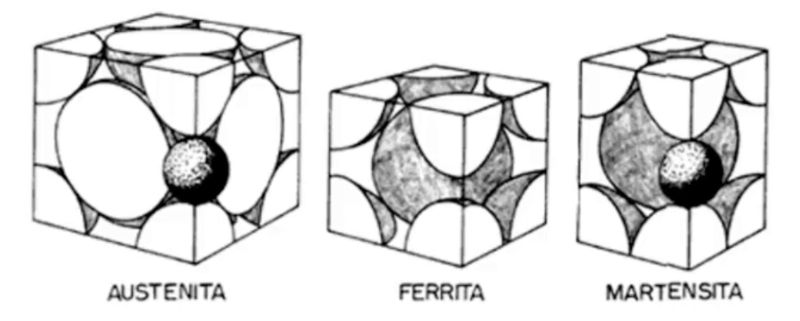{ width="600" }
    <figcaption>Foto de Juan Manuel Vallejos: https://youtu.be/lABq26BapwA?si=fV14PpvQaVdcU4vE</figcaption>
</figure>

<figure markdown="span">
    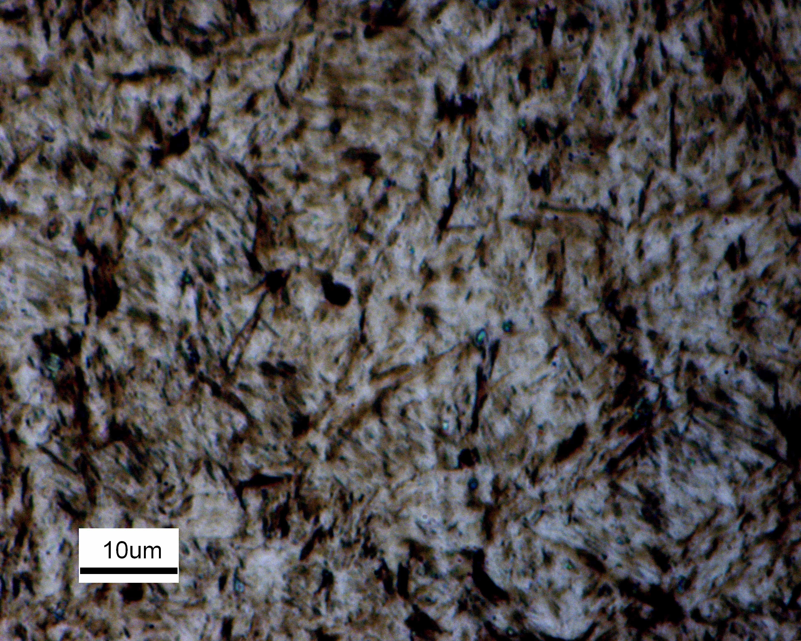{ width="600" }
    <figcaption>Foto de Wikimedia: https://en.wikipedia.org/wiki/Martensite#/media/File:Martensite.jpg</figcaption>
</figure>

### Reveniment

L'acer al carboni en fase martensítica després del tremp es troba amb moltes tensions residuals producte de la ràpida transformació de fase. A causa d'això, l'aliatge és molt dur i fràgil. Per a millorar la ductilitat, es realitza un tractament tèrmic de reveniment, aprofitant que la martensita és una fase metaestable, per a descompondre part d'ella en ferrita i cementita i per a alleujar tensions.

<figure markdown="span">
    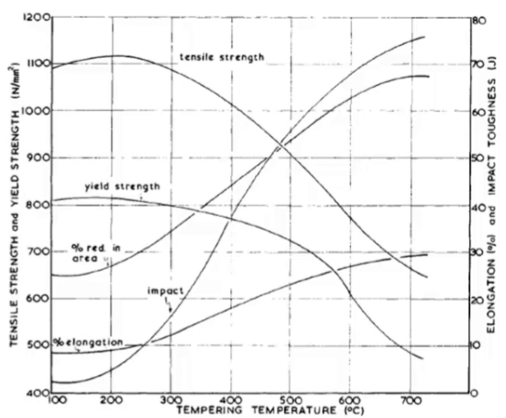{ width="600" }
    <figcaption>Foto de Juan Manuel Vallejos: https://youtu.be/lABq26BapwA?si=fV14PpvQaVdcU4vE</figcaption>
</figure>

### Nitruració

És un tractament termoquímic que es dona a l'acer a còpia d'afegir nitrogen quan se l'escalfa. El resultat és un increment de la duresa superficial de l'acer obtingut. També augmenta la resistència a la corrosió i a la fatiga dels materials.

La nitruració es pot fer en un forn o per ionització. En el primer cas la peça es fica a un forn ple d'una atmosfera d'amoníac i després s'escalfa fins a uns 500 °C. Amb això l'amoníac es descompon en nitrogen i hidrogen; l'hidrogen se separa del nitrogen per diferència de densitat i el nitrogen, en entrar en contacte amb la superfície de la peça, forma un recobriment de nitrur de ferro.

<figure markdown="span">
    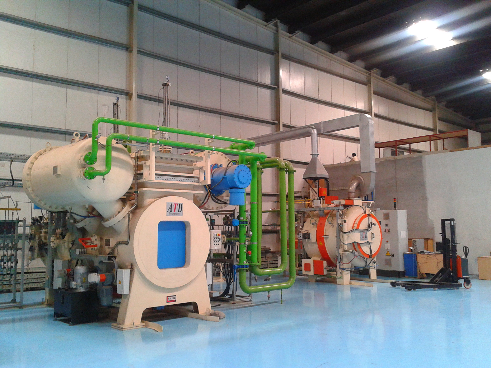{ width="600" }
    <figcaption>Foto de Wikimedia: https://en.wikipedia.org/wiki/Nitriding#/media/File:Computerised_Heat_Treatment_Furnance.jpg</figcaption>
</figure>

En el cas de la nitruració iònica, les molècules d'amoníac es trenquen mitjançant l'aplicació d'un camp elèctric el qual s'aconsegueix sotmetent l'amoníac a diferència de potencial d'entre 300 i 1000 volts. Els ions de nitogen van cap al càtode (que consisteix en la peça a tractar) i reaccionen per a formar nitrur de ferro, Fe₂N.

Cal un posterior temperat del ferro. Les parts del ferro que no es vulguin nitrurar es recobreixen amb un bany d'estany-plom al 50%.

<figure markdown="span">
    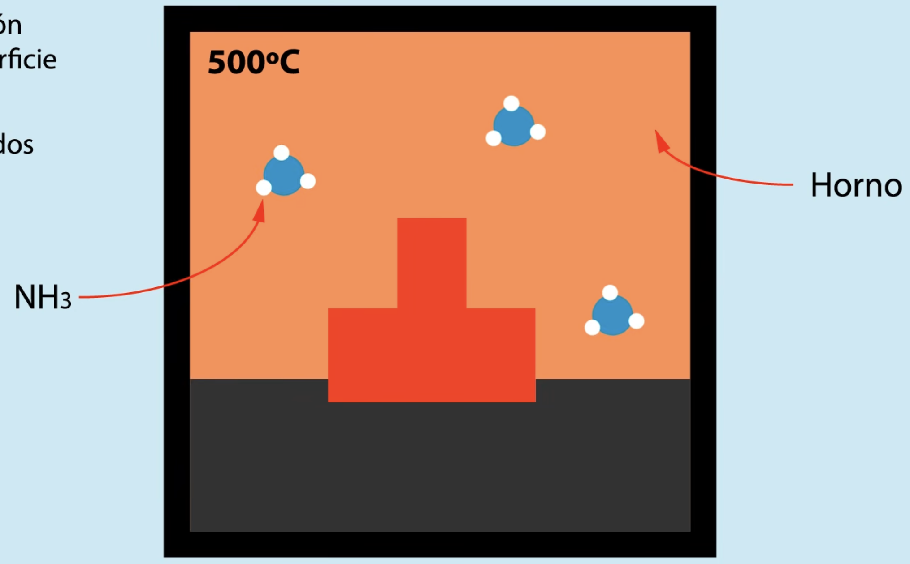{ width="600" }
    <figcaption>Foto de Ingeniosos: https://youtu.be/F6tY6y0r-Sw?si=C41F2HX-LqUK3CYB</figcaption>
</figure>

Aquest procés s'utilitza en aliatges que no trempen i és molt car jan que s'han de mantindre al firn durant prou de temps. 

### Cementació

La cementació, és un tractament tèrmic d'enduriment superficial en el qual el ferro o l'acer absorbeixen carboni mentre el metall s'escalfa en presència d'un material que conté carboni, com carbó vegetal o monòxid de carboni. Depenent de la durada del procés i de la seva temperatura, l'àrea afectada pot variar en contingut de carboni. Els temps de cementació més llargs i les temperatures més altes generalment augmenten la profunditat de la difusió del carboni.

<figure markdown="span">
    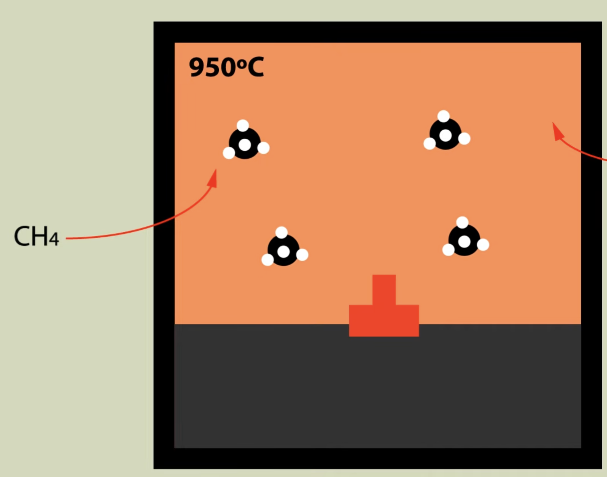{ width="600" }
    <figcaption>Foto de Ingeniosos: https://youtu.be/F6tY6y0r-Sw?si=C41F2HX-LqUK3CYB</figcaption>
</figure>

<figure markdown="span">
    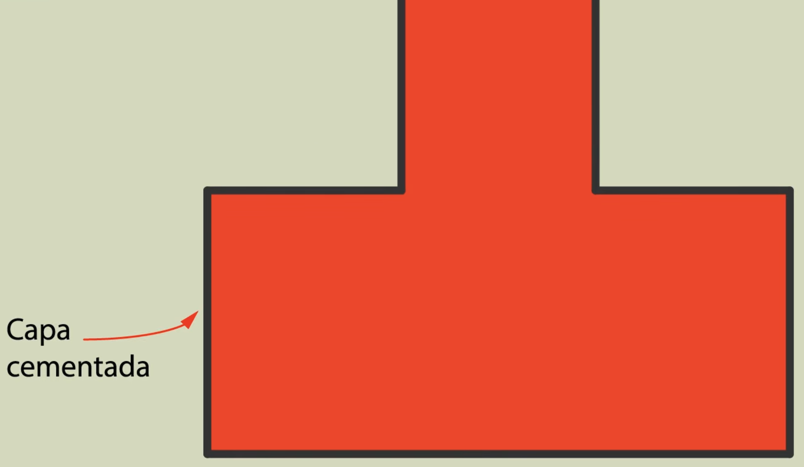{ width="600" }
    <figcaption>Foto de Ingeniosos: https://youtu.be/F6tY6y0r-Sw?si=C41F2HX-LqUK3CYB</figcaption>
</figure>

Normalment, s'aplica un reveniment posterior per disminuir les tensions superficials de la peça.

### Anodització

Es denomina anodització al procés electrolític de passivació utilitzat per a incrementar el gruix de la capa natural d'òxid en la superfície de peces metàl·liques. Aquesta tècnica sol utilitzar-se sobre l'alumini per a generar una capa de protecció artificial mitjançant l'òxid protector de l'alumini, conegut com a alúmina. La capa s'aconsegueix per mitjà de procediments electroquímics, i proporciona una major resistència i durabilitat de l'alumini.

El nom del procés deriva del fet que la peça a tractar amb aquest material fa d'ànode en el circuit elèctric d'aquest procés electrolític.

<figure markdown="span">
    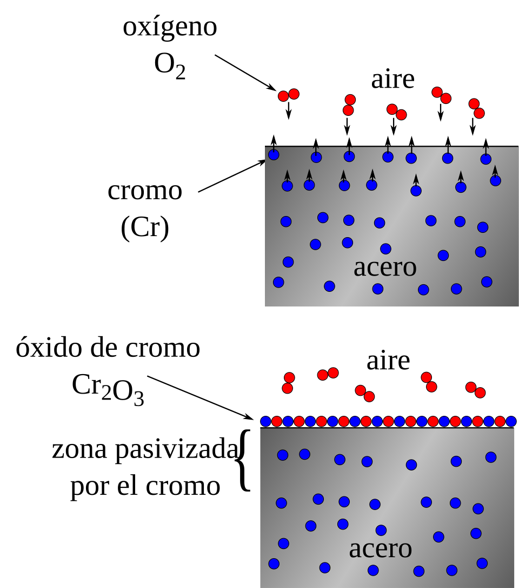{ width="600" }
    <figcaption>Foto de Wikimedia: https://es.wikipedia.org/wiki/Pasivaci%C3%B3n#/media/Archivo:Mecanisme_passivation_inox_es.svg</figcaption>
</figure>

Els aliatges d'alumini s'anoditzen per a augmentar la resistència a la corrosió i permetre el tenyit, una millor lubricació o una millor adhesió. No obstant això, l'anoditzat no augmenta la resistència de l'objecte d'alumini.

<figure markdown="span">
    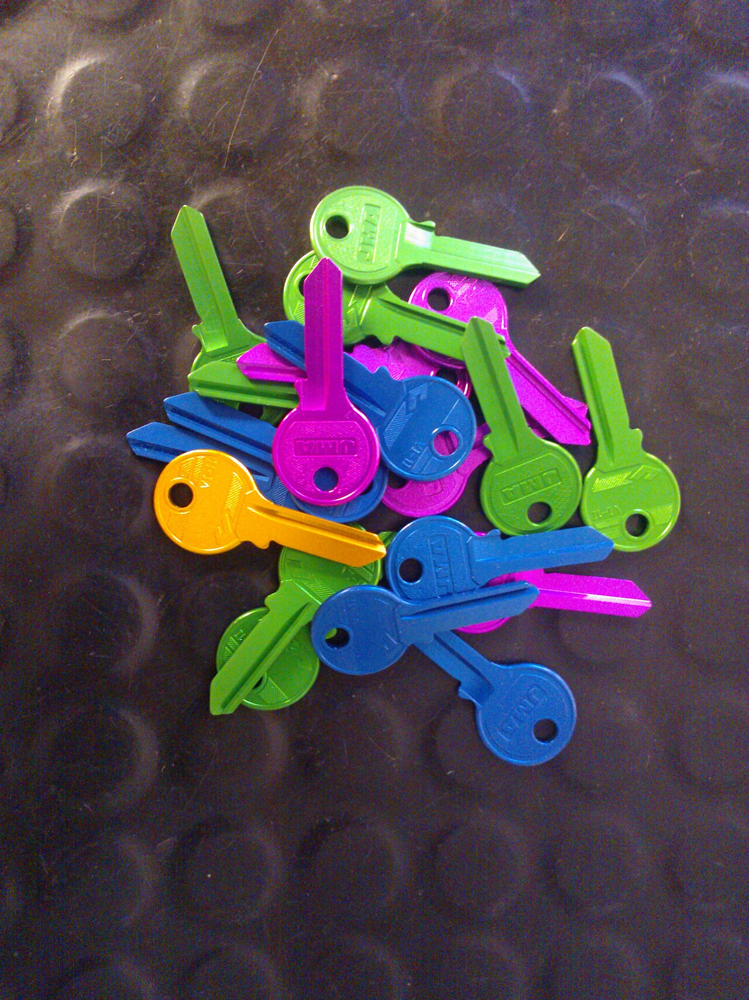{ width="600" }
    <figcaption>Foto de Wikimedia: https://es.wikipedia.org/wiki/Pasivaci%C3%B3n#/media/Archivo:Mecanisme_passivation_inox_es.svg</figcaption>
</figure>

Quan s'exposa a l'aire a temperatura ambient o a qualsevol altre gas que continga oxigen, l'alumini pur s'autopassiva formant una capa superficial d'òxid d'alumini amorf de 2 a 3 nm de gruix, que proporciona una protecció molt eficaç contra la corrosió. Els aliatges d'alumini solen formar una capa d'òxid més gruixuda, de 5 a 15 nm de gruix, però tendeixen a ser més susceptibles a la corrosió. Les peces d'aliatge d'alumini estan anoditzades per a augmentar en gran manera el gruix d'aquesta capa per a resistència a la corrosió. La resistència a la corrosió dels aliatges d'alumini disminueix significativament per uns certs elements d'aliatge o impureses: coure, ferro i silici, pel que els aliatges d'Al de les sèries 2000, 4000, 6000 i 7000 tendeixen a ser les més susceptibles.

Encara que l'anoditzat produeix un recobriment molt regular i uniforme, les fissures microscòpiques en el recobriment poden provocar corrosió. A més, el recobriment és susceptible a la dissolució química en presència de productes químics de pH alt i baix, la qual cosa provoca el despreniment del recobriment i la corrosió del substrat.

El procés d'anoditzat es realitza mitjançant l'electròlisi. En aquest, la capa d'alumini anoditzat es crea en passar un corrent continu a través d'una solució electrolítica, on l'objecte d'alumini serveix com a ànode (l'elèctrode positiu en una cel·la electrolítica). El corrent allibera hidrogen en el càtode (l'elèctrode negatiu) i oxigen en la superfície de l'ànode d'alumini, creant una acumulació d'òxid d'alumini

### Galvanització

La galvanització és un procés metal·lúrgic que consisteix a aplicar una capa protectora de zinc sobre la superfície de l'acer o un altre metall.

<figure markdown="span">
    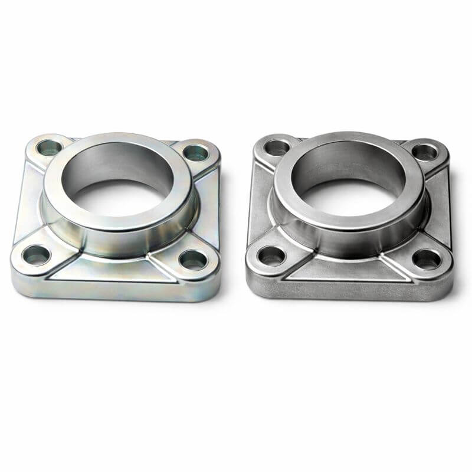{ width="600" }
    <figcaption>Foto de Weerg: https://www.weerg.com/es/guias/galvanizacion</figcaption>
</figure>

El zinc actua com a barrera anticorrosiva i també ofereix protecció electroquímica, evitant que l'acer subjacent s'oxidi.

Hi ha diversos tipus de galvanitzat:

<figure markdown="span">
    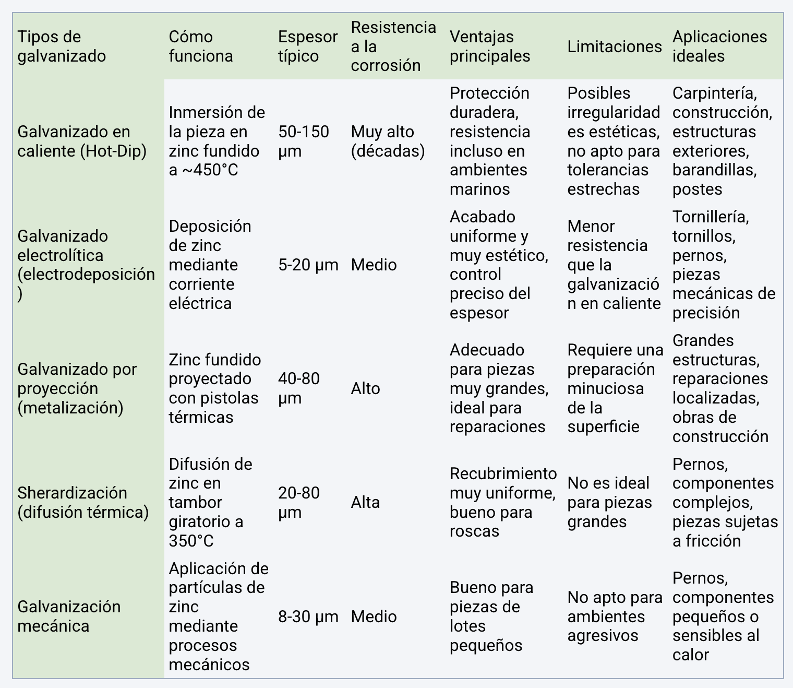{ width="600" }
    <figcaption>Foto de Weerg: https://www.weerg.com/es/guias/galvanizacion</figcaption>
</figure>

És important distingir la galvanització electrolítica (ideal per a gruixos controlats i alta precisió) de la galvanització en calenta, que implica la immersió en metall fos.

La galvanització funciona millor amb acer i fosa, ja que el zinc s'adhereix de manera estable i garanteix una protecció molt elevada enfront de la corrosió.

Hi ha metalls, però, que són galvanitzables només amb tècniques específiques com l'alumini (que només pot ser mitjançant galvanització electrolítica en aliatges específics) i el zinc i els seus aliatges.

Per altra banda, també hi ha metalls NO RECOMANATS PER A GALVANITZAR, com l'acer inoxidable, pel fet que ja és resistent a la corrosió, el coure llautó, bronze, per la seua dolenta adherència del zinc o el titani, el qual no es beneficia del zincatge
 

## Bibliografia

- https://youtu.be/lABq26BapwA?si=zvU0XR7eevjxseiD
- https://youtu.be/rEV2b4I0_zQ?si=dff2sY_qutnVIDgw
- https://ca.wikipedia.org/wiki/Nitruraci%C3%B3
- https://www.weerg.com/es/guias/galvanizacion
- https://youtu.be/OgTVh-9pmTQ?si=gF9JCY2jHlsThLZD
- https://youtu.be/5u1yQZHw1iA?si=7NiOe1Rqv9xuxVPP
