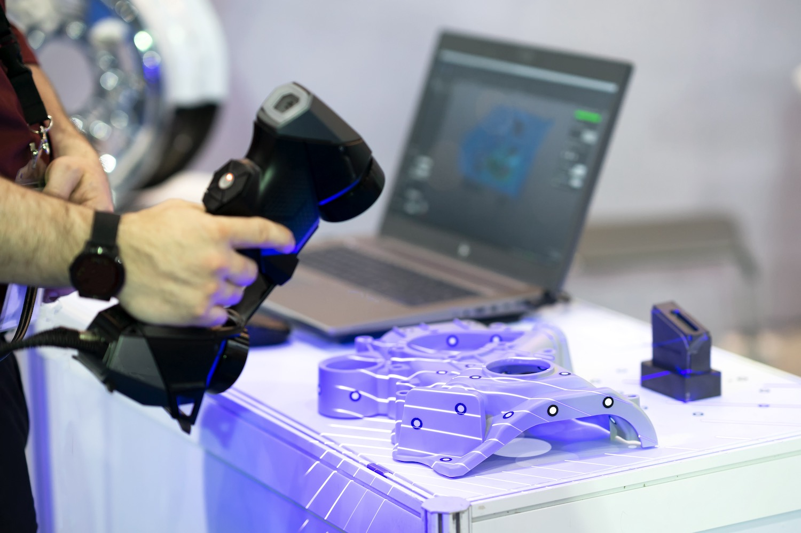
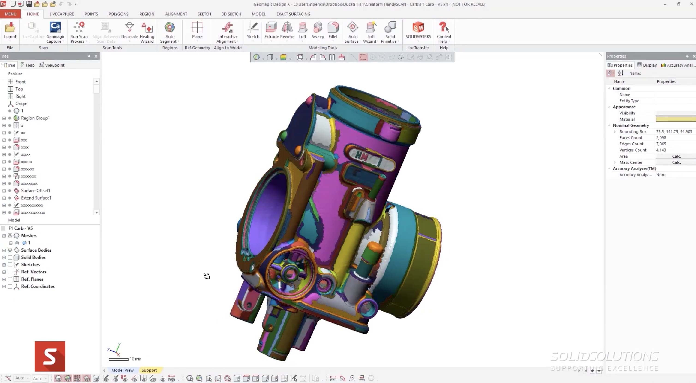
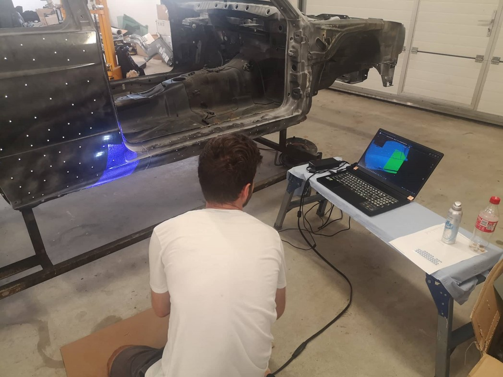
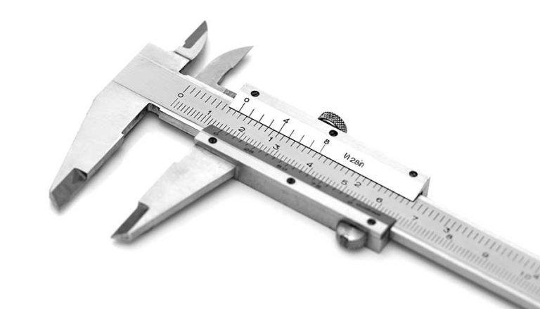
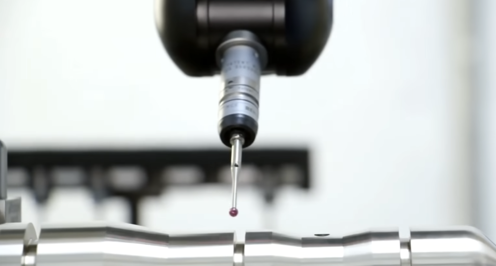
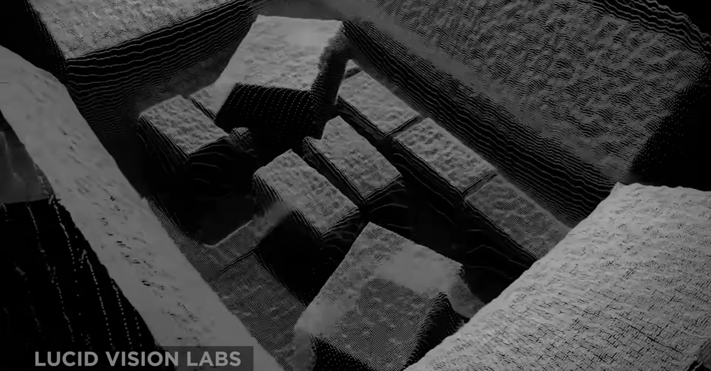
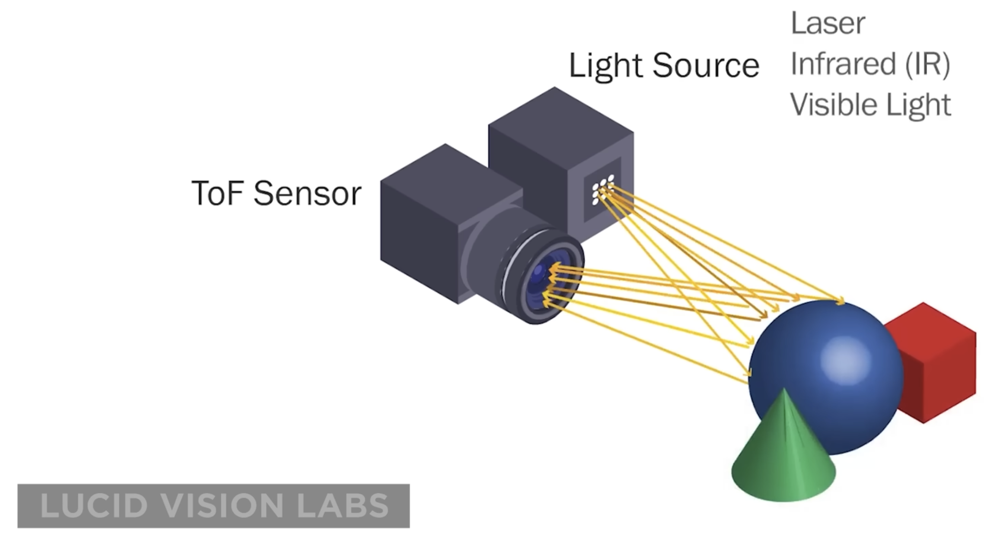
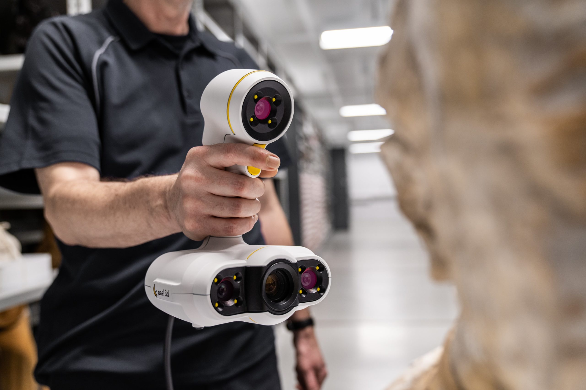
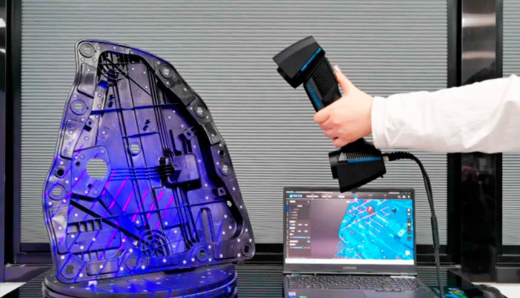
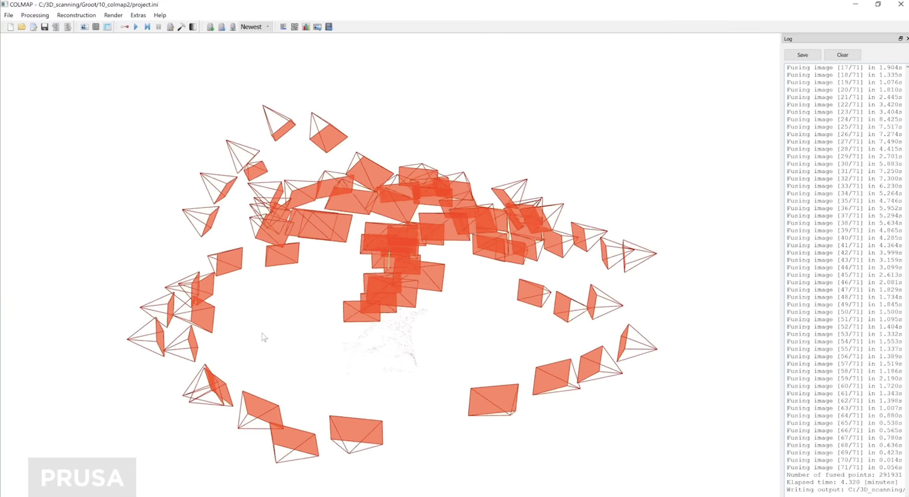

# Enginyeria inversa

## Fonaments d'enginyeria inversa

### Definició
L'enginyeria inversa és el procés d'anàlisi d'un sistema, software o objecte per entendre com està construït i com funciona sense tindre accés a la seua documentació original.

Es pot caracteritzar en tres etapes principals:

- **Desmuntatge**

- **Anàlisi funcional / Documentació**

- **Reproducció**

### Aplicacions
L'enginyeria inversa s'aplica en múltiples contextos industrials:

- **Reproducció de peces**: Copiar un producte existent per a la seua re-fabricació, especialment quan no existeix documentació original ni proveïdor disponible.
- **Peces de geometria complexa**: Capturar formes orgàniques i superfícies corbes (carrosseries de vehicle, peces ergonòmiques, escultures) que serien molt difícils de mesurar manualment.

<figure markdown="span">
    { width="600" }
    <figcaption>Foto de Altertecnia: https://altertecnia.com/ingenieria-inversa-maquinaria-y-procesos/</figcaption>
</figure>

- **Inspecció de qualitat**: Verificar que les peces fabricades s'ajusten al model CAD original, superposant l'escaneig 3D sobre el disseny per detectar desviacions.

<figure markdown="span">
    { width="800" }
    <figcaption>Foto de TriMech Group: https://youtu.be/oxo1FBScEAs?si=Z3MAazifh5AGk2eK</figcaption>
</figure>

- **Reparació i reposició**: Recrear components descatalogats o únics, com ara peces de carrosseria d'edicions limitades.

<figure markdown="span">
    { width="600" }
    <figcaption>Foto de Shining 3D: https://www.einscan.com/applications/como-ayudan-las-tecnologias-de-escaneo-3d-a-la-reparacion-y-restauracion-automotriz/</figcaption>
</figure>

### Beneficis en la indústria

- **Estalvi de temps**: Redueix dràsticament el temps de modelat, especialment en geometries complexes.

- **Major precisió**: El model final s'ajusta millor a la realitat física de la peça.

- **Accessibilitat creixent**: La tecnologia és cada vegada més assequible i fàcil d'usar, amb solucions per a tots els pressupostos.

- **Control de qualitat**: Permet comparar el model CAD amb la peça fabricada i detectar desviacions.

## Digitalització 3D i reconstrucció de models

### Mètodes de mesura i captura de dades
Els principals mètodes per obtenir dades d'un objecte real en dos tipus principals. De contacte i no-contacte.

#### De contacte

- **Mesura manual**: Cinta mètrica i peus de rei. Adequat per a peces senzilles de geometria regular.

<figure markdown="span">
    { width="600" }
    <figcaption>Foto de FMFormación: https://www.fabricacionmecanica.es/que-es-un-pie-de-rey/</figcaption>
</figure>

- **CMM (Màquina de Mesura per Coordenades)**: Alta precisió per a peces industrials.

<figure markdown="span">
    { width="600" }
    <figcaption>Foto de Vision Miner: https://youtu.be/zJTsg6-UGwM?si=K-Q-TzGXltRkeZUe</figcaption>
</figure>

#### No-contacte

- **Time of flight**: Aquest mètode utilitza una llum làser per incidir sobre l'objecte de l'escaneig. Un telèmetre làser aconsegueix la distància d'una superfície mitjançant el cronometratge de la velocitat d'un pols de llum. És habitual utilitzar aquet tipus d'escaneig per a objectes de gran escala, habitacions senceres, o fins i tot edificis sencers. Desafortunadament, no són molt precisos amb els detalls, i la resolució dels escàners no s'acosten als següents tipus d'escàners.

<figure markdown="span">
    { width="600" }
    <figcaption>Foto de Vision Miner: https://youtu.be/zJTsg6-UGwM?si=K-Q-TzGXltRkeZUe</figcaption>
</figure>

<figure markdown="span">
    { width="600" }
    <figcaption>Foto de Vision Miner: https://youtu.be/zJTsg6-UGwM?si=K-Q-TzGXltRkeZUe</figcaption>
</figure>

- **Hand Held**: Aquests utilitzen la triangulació amb un làser real i múltiples sensors. Amb aquest és possible obtenir detalls a 0,05mm o 50 micres. Un altre avantatge és que treballa amb objectes foscos i reflexius.

<figure markdown="span">
    { width="600" }
    <figcaption>Foto de Caffeindicator: https://caffeindicator.com/escaner-para-impresora-3d-comprar-escaner-3d-como-elegir-el-mejor/</figcaption>
</figure>

- **Structured and Modulated light**: La majoria d'escàners 3D utilitzen aquesta tecnologia. Consisteix a projectar estructures de llum modulant barres de llum que canvien d'anada i tornada. A continuació, llegeix aquestes dades i calcula la forma i la mida de la part utilitzant algoritmes.

<figure markdown="span">
    { width="600" }
    <figcaption>Foto de Scan 3D Market: https://scan3dmarket.com/product/freescan-ue-pro/</figcaption>
</figure>

- **Photogrammetry**: Aquest tipus pren moltes fotografies des de diferents angles, calcula totes les diferències, i retalla un sòlid model 3D. Un gran desavantatge d'això és que no mesura mentre s'està escanejant, a diferència de tots els altres mètodes, tot i que pot funcionar molt bé, i depenent de les seves fotografies i estil de fotografia, també pot ser molt precís.

<figure markdown="span">
    { width="600" }
    <figcaption>Foto de Vision Miner: https://youtu.be/zJTsg6-UGwM?si=K-Q-TzGXltRkeZUe</figcaption>
</figure>

### Escaneig 3D

L'escaneig 3D genera principalment dos tipus de dades:

- **Núvol de punts**: Milions de punts en l'espai que representen les superfícies de la peça, formant una imatge 3D dimensionalment precisa.
- **Malla (Mesh)**: Els punts del núvol es connecten per formar triangles. El format més comú és l'**STL**, també utilitzat en impressió 3D.

### Tècniques de reconstrucció 

Existeixen dos fluxos de treball diferenciats:

**1. Disseny intencionat (Design Intent)**  
La peça es modela característica per característica en el programari CAD (com SolidWorks), usant l'escaneig com a referència per garantir la precisió dimensional. Permet control total sobre les cotes i el model resultant.

**2. Autosuperposició de superfícies (Auto Surface)**  
El programari genera la geometria directament a partir de les dades d'escaneig. El procés és molt ràpid, però ofereix menys control dimensional. 

### Programari

## Bibliografia

- https://youtu.be/oxo1FBScEAs?si=Z3MAazifh5AGk2eK
- https://youtu.be/Ac4Rs-tFZOU?si=xmWZRCNiVqTRhCYi
- https://youtu.be/zJTsg6-UGwM?si=XprA9D3j6MM1IoLO
- https://tecnoia.com/tecnologias-de-escaneo-3d-principales-tecnologias-y-sus-ventajas-y-limitaciones/
- https://www.youtube.com/watch?v=tC7jfKrcGYo
- https://www.youtube.com/watch?v=gpKxls6KpZ4