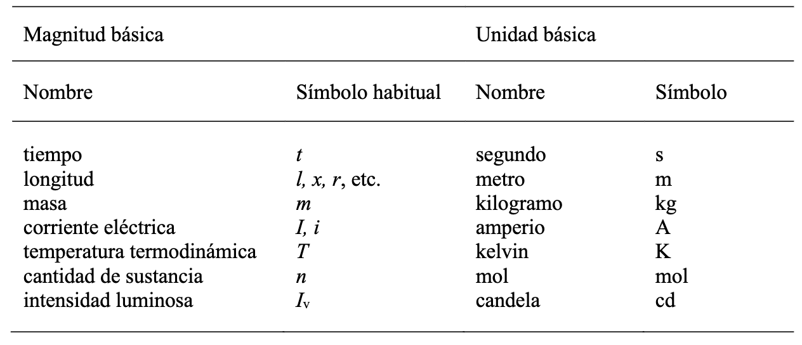
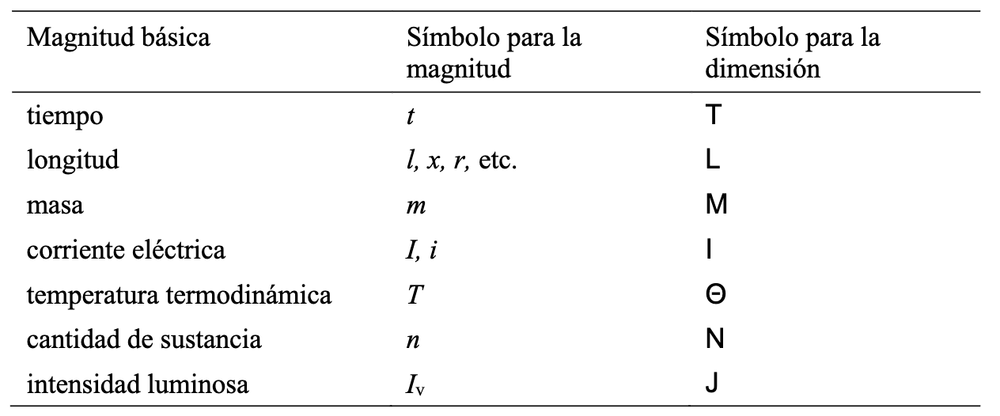
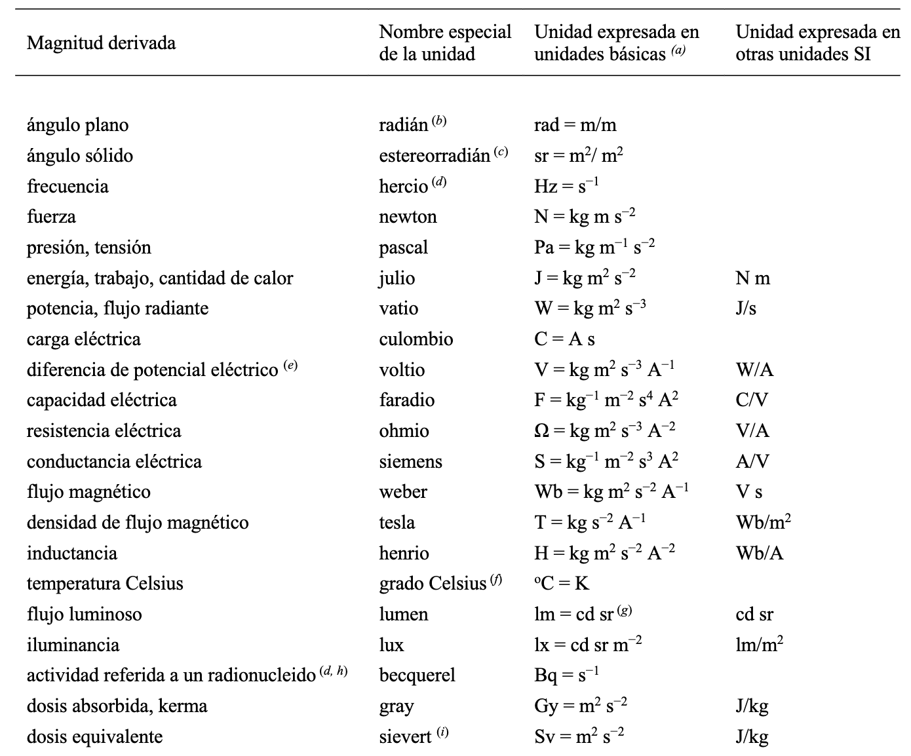

# Metrologia i normalització 

## Fonaments de metrologia dimensional

La metrologia és la ciència dels mesuraments i les seves aplicacions, escurçant la incertesa en les mesures mitjançant un camp de tolerància. Inclou l'estudi, manteniment i aplicació del sistema de pesos i mesures. El seu objectiu fonamental és l'obtenció i expressió del valor de les magnituds emprant per a això instruments, mètodes i mitjans apropiats, amb l'exactitud requerida en cada cas.

### Unitats

Dins del sistema internacional és determinen les següents mesures:

<figure markdown="span">
    { width="600" }
    <figcaption>Foto de Centro Español de Metrologia: https://www.cem.es/sites/default/files/30362_elsistemainternacionaldeunidades_web_0.pdf</figcaption>
</figure>

<figure markdown="span">
    { width="600" }
    <figcaption>Foto de Centro Español de Metrologia: https://www.cem.es/sites/default/files/30362_elsistemainternacionaldeunidades_web_0.pdf</figcaption>
</figure>

<figure markdown="span">
    { width="600" }
    <figcaption>Foto de Centro Español de Metrologia: https://www.cem.es/sites/default/files/30362_elsistemainternacionaldeunidades_web_0.pdf</figcaption>
</figure>

### Patrons

### Precisió

### Traçabilitat i pla de calibratge

## Normalització

<figure markdown="span">
    { width="600" }
    <figcaption>Foto de Universitat Politècnica de València: https://youtu.be/ihi4WZQytV4?si=h21BJFf59DVnpOi4</figcaption>
</figure>

### Toleràncies

### Sistema ISO

### Ajustos

### Simbologia 

### Calibres passa/no passa

## Tècniques de mesurament I

### Instruments de mesura de longituds

### Instruments de mesura micromètrics

### Instruments de mesura nònius

## Tècniques de mesurament II

### Mesura de rugositat superficial

### MMC 

### Toleràncies geomètriques

## Calibratge i verificació d'instruments de mesura

### Mètodes

### Equips 

### Certificació del calibratge

## Bibliografia

- https://youtu.be/9TJF8KQvH2I?si=KfIZ5ZodI-1T1Ti3