# Metrologia i normalització 

## Fonaments de metrologia dimensional

Les dimensions són les grandàries lineals o angulars d'un component, especificades en el pla de la peça. Les dimensions són importants perquè determinen el bé que s'ajusten els components d'un producte durant el seu acobli. En fabricar un component donat, és gairebé impossible i molt costós donar a l'element la dimensió nominal que s'estableix en el pla. En comptes d'això, es permet una variació limitada de la dimensió, i la que és permissible es denomina tolerància.

Una superfície és el límit exterior d'un objecte amb el seu ambient, que pot ser un altre objecte, un fluid, l'espai, o una combinació d'aquests. La superfície tanca el conjunt de propietats mecàniques i físiques.

### Unitats

La ANSI defineix dimensió com el “valor numèric expressat en les unitats apropiades de mesura, que s'indica en un pla i altres documents juntament amb línies, símbols i notes per a definir la grandària o característica geomètrica, o ambdues, d'una peça o característica d'una peça”

Les dimensions d'una peça en un pla o dibuix representen les grandàries nominals o bàsiques de la peça i les seves característiques. Aquests són els valors que el dissenyador voldria que la peça tingués, si pogués fabricar-se amb una grandària exacta, sense errors ni variacions en el procés de fabricació. No obstant això, en el procés de manufactura hi ha variacions que es manifesten com a variacions en la grandària de la peça. Les toleràncies s'utilitzen per a definir els límits de la variació permesa. La tolerància és “la quantitat total que està permès que una dimensió específica variï. La tolerància és la diferència entre els límits màxim i mínim”.

<figure markdown="span">
    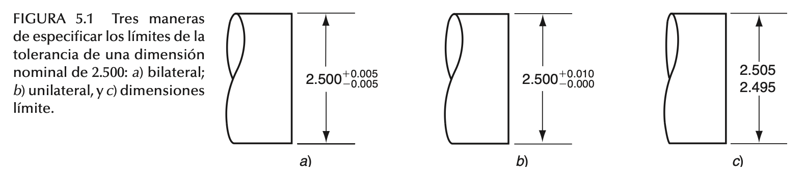{ width="600" }
    <figcaption>Foto de Fundamentos de la manufactura moderna</figcaption>
</figure>

Les toleràncies s'especifiquen de modes diversos. La més comuna és la tolerància bilateral, en la qual es permet que la variació sigui en les direccions positiva i negativa a partir de la dimensió nominal. La dimensió nominal és de 2.500 unitats lineals (per exemple, mm), amb una variació permissible de 0.005 unitats en qualsevol direcció. Les peces que estigen fora d'aquests límits són inacceptables. Una tolerància unilateral és aquella en la qual la variació a partir de la dimensió especificada només es permet en una direcció, positiva o negativa. Les dimensions límit són un mètode alternatiu d'especificar la variació permissible en la grandària d'un element d'una peça; consisteixen en les dimensions màxima i mínima permeses.

Les dimensions i toleràncies normalment s'expressen com a valors lineals (longitud). Hi ha altres atributs geomètrics de les peces que també són importants, com ara la planicitat d'una superfície, la rodonesa d'una fletxa o forat, el paral·lelisme entre dues superfícies, etcètera.

- Angularitat: Grau en què un tret d'una peça, com una superfície o un eix, es troba amb un angle especificat respecte d'una superfície de referència. Si l'angle és de 90°, llavors l'atribut es diu perpendicularitat o quadratura.

- Circularitat: Per a una superfície de revolució com un cilindre, forat o con, la circularitat és el grau en què tots els punts sobre la intersecció de la superfície i un pla perpendicular a l'eix de revolució, es troben equidistants a l'eix. Per a una esfera, la circularitat és el grau en què tots els punts sobre la intersecció de la superfície i un pla que passa pel centre estan equidistants d'aquest.

- Concentricitat: Grau en què dos (o més) trets d'una peça, com una superfície cilíndrica i un forat circular, tenen un eix comú.

- Cilindricitat: Grau en què tots els punts sobre una superfície de revolució, com un cilindre, estan equidistants de l'eix de revolució.

- Planicitat: Grau en què tots els punts d'una superfície es troben en un pla únic.

- Paral·lelisme: Grau en què tots els punts d'un tret d'una peça, com una superfície, una línia o un eix, estan equidistants d'un pla, línia o eix de referència.

- Perpendicularitat: Grau en què tots els punts d'un tret d'una peça, com una superfície, una línia o un eix, estan a 90° d'un pla o línia o eix de referència.

- Rodonesa: Igual que circularitat.

- Quadratura: Igual que perpendicularitat.

- Rectitud: Grau en què un rang d'una peça, com una línia o un eix, és una línia recta.

### Superfícies

Una superfície és allò que té contacte com una barrina que en subjectar-se amb un objecte tal com una peça manufacturada. Les superfícies nominals representen el contorn relacionat amb la superfície de la peça, i estan definides per les línies en el pla d'enginyeria. Les superfícies nominals apareixen com a línies absolutament rectes, cercles ideals, forats rodons, i altres arestes i superfícies que són perfectes en la seva geometria. Les superfícies reals d'una peça manufacturada estan determinades pel procés utilitzat per a fabricar-la. La varietat de processos disponibles en la manufactura dona com a resultat variacions àmplies de les característiques de la superfície, i és important per als enginyers entendre la tecnologia de les superfícies.

Una vista microscòpica de la superfície d'una peça revela les seves irregularitats i imperfeccions.

<figure markdown="span">
    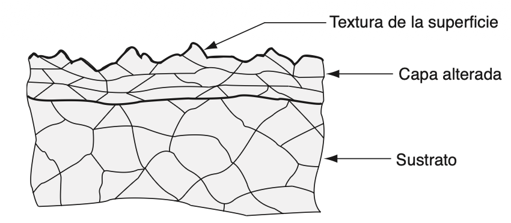{ width="600" }
    <figcaption>Foto de Fundamentos de la manufactura moderna</figcaption>
</figure>

El cos de la peça, coneguda com a substrat, té una estructura granular que depèn del processament previ del metall. L'exterior de la peça és una superfície la topografia de la qual és tot menys recta i llisa. En la secció transversal magnificada, la superfície té rugositat, ondulacions i defectes. Encara que aquí no s'observen, també té un patró o direcció que resulta del procés mecànic que la va produir. Tots aquests trets geomètrics queden inclosos en el terme textura de la superfície.

La capa alterada pot resultar de l'enduriment per treball (energia mecànica), calor (energia tèrmica), tractament químic, o fins i tot energia elèctrica. El metall d'aquesta capa resulta afectat per l'aplicació d'energia, i la seva microestructura s'altera en conseqüència. Aquesta capa alterada cau dins de l'abast de la integritat de la superfície, que té a veure amb la definició, l'especificació i el control de les capes de la superfície d'un material. A més, la majoria de les superfícies metàl·liques estan cobertes per una capa d'òxid, si es dona el temps suficient perquè es formi després del processament.

La textura de la superfície consisteix en les desviacions repetitives o aleatòries de la superfície nominal d'un objecte; la defineixen quatre característiques: rugositat, ondulació, orientació i defectes o falles.

<figure markdown="span">
    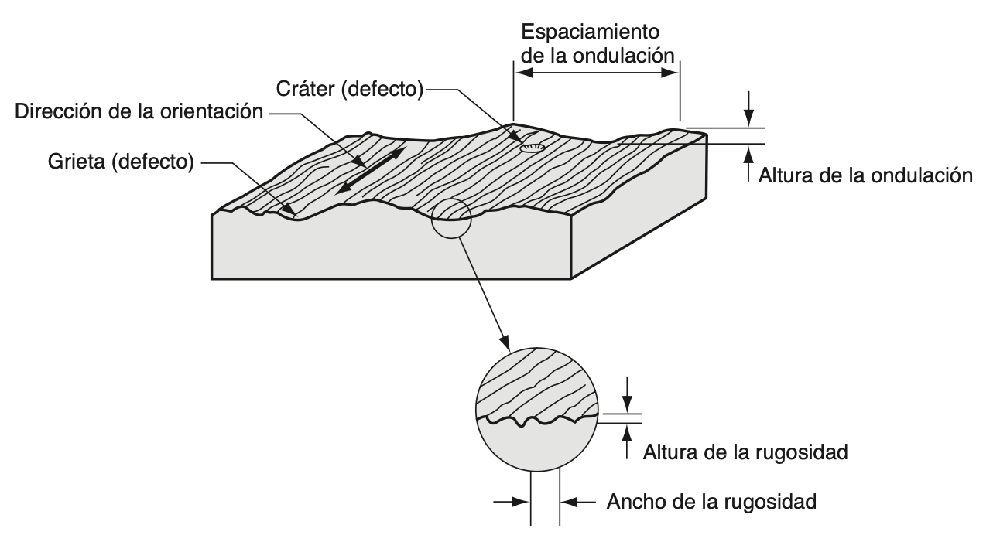{ width="600" }
    <figcaption>Foto de Fundamentos de la manufactura moderna</figcaption>
</figure>

La rugositat es refereix a les desviacions petites, espaiades finament, de la superfície nominal i que estan determinades per les característiques del material i el procés que va formar la superfície. L'ondulació es defineix com les desviacions d'espaiament molt major; ocorren a causa de la deflexió del treball, vibracions, tractament tèrmiques, i factors similars. La rugositat està sobreimposada a l'ondulació. L'orientació és la direcció predominant o patró de la textura de la superfície. Està determinada pel mètode de manufactura utilitzat per a crear a la superfície, en general a partir de l'acció d'una eina de tall. Finalment, els defectes són irregularitats que ocorren en forma ocasional en la superfície; inclouen esquerdes, ratllats, inclusions i altres defectes similars.

<figure markdown="span">
    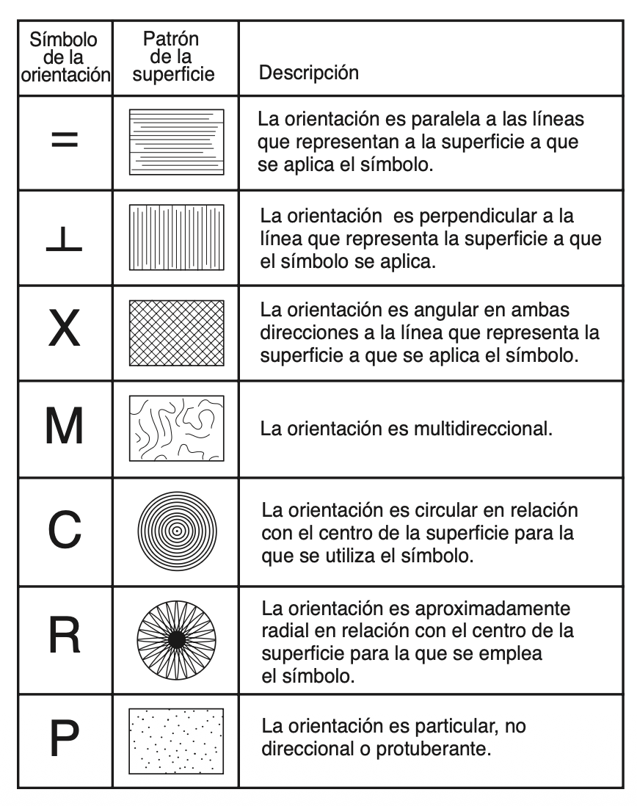{ width="600" }
    <figcaption>Foto de Fundamentos de la manufactura moderna</figcaption>
</figure>

La rugositat d'una superfície és una característica mesurable, amb base en les desviacions de la rugositat. L'acabat de la superfície és un terme més subjectiu que denota la suavitat i qualitat general d'una superfície. En la parla popular, és freqüent utilitzar l'acabat superficial o de la superfície com a sinònim de la seva rugositat. La mesura que s'empra més comunament per a la textura d'una superfície, és la seua rugositat. la rugositat de la superfície es defineix com la mitjana de les desviacions verticals a partir de la superfície nominal, en una longitud especificada de la superfície. En general s'utilitza una mitjana aritmètica (*AA), amb base en els valors absoluts de les desviacions, i aquest valor de la rugositat es coneix amb el nom de rugositat mitjana. 

<figure markdown="span">
    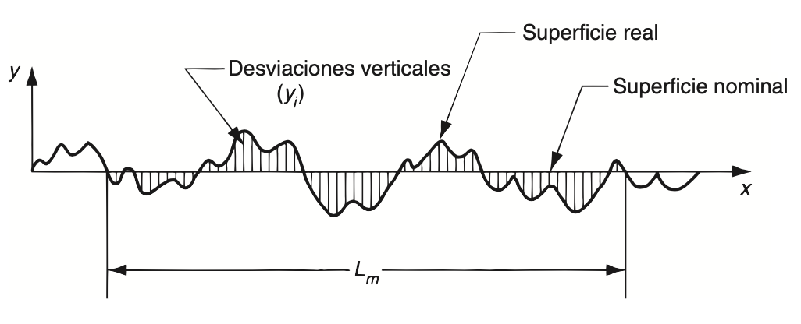{ width="600" }
    <figcaption>Foto de Fundamentos de la manufactura moderna</figcaption>
</figure>

La rugositat de la superfície té la mateixa classe de deficiències que qualsevol mesura que s'usi per a avaluar un atribut físic complex. Per exemple, falla per a tenir en compte les orientacions del patró superficial; així, la rugositat de la superfície varia en forma significativa, en funció de la direcció en què es mesure.

<figure markdown="span">
    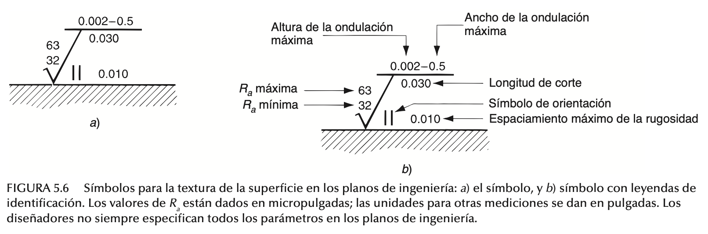{ width="600" }
    <figcaption>Foto de Fundamentos de la manufactura moderna</figcaption>
</figure>

La longitud de tall, que s'usa com un filtre que separa l'ondulació d'una superfície mesurada de les desviacions de la rugositat. En realitat, la longitud de tall és una distància mostral al llarg de la superfície. Una distància mostral més curta que l'ample de l'ondulació eliminarà les desviacions verticals associades amb aquesta i només inclourà aquelles que es relacionen amb la rugositat.

La textura de la superfície per si sola no descriu per complet una superfície. En el material pot haver-hi canvis metal·lúrgics o d'una altra classe immediatament sota la superfície, que poden tenir un efecte significatiu sobre les propietats mecàniques. La integritat de la superfície és l'estudi i control d'aquesta capa subsuperficial i qualssevol canvis a causa del processament que influeixin en l'acompliment de la peça o producte acabat.

<figure markdown="span">
    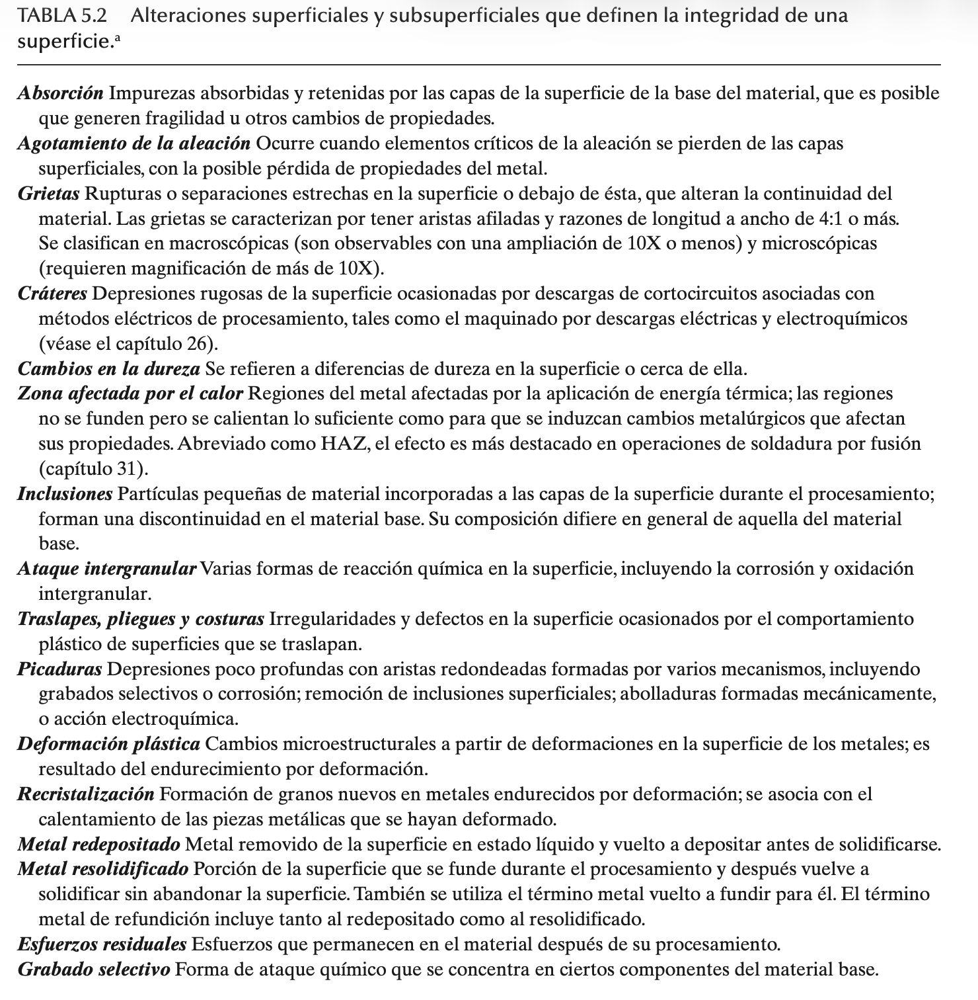{ width="600" }
    <figcaption>Foto de Fundamentos de la manufactura moderna</figcaption>
</figure>

<figure markdown="span">
    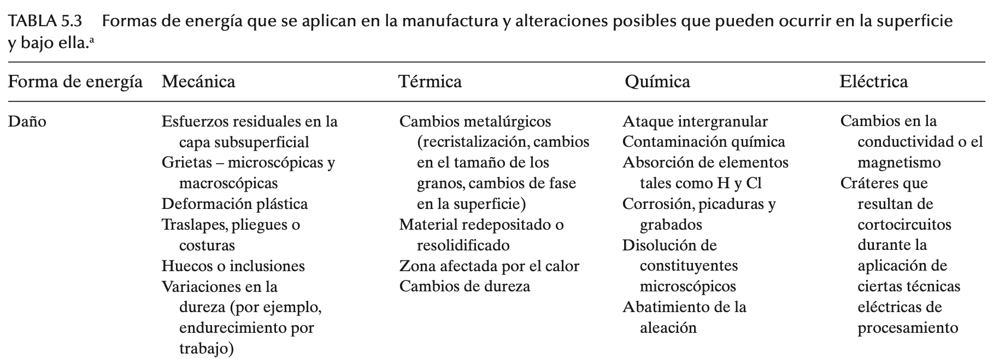{ width="600" }
    <figcaption>Foto de Fundamentos de la manufactura moderna</figcaption>
</figure>

Com més grans siguen les peces, requereixen toleràncies més generoses.

<figure markdown="span">
    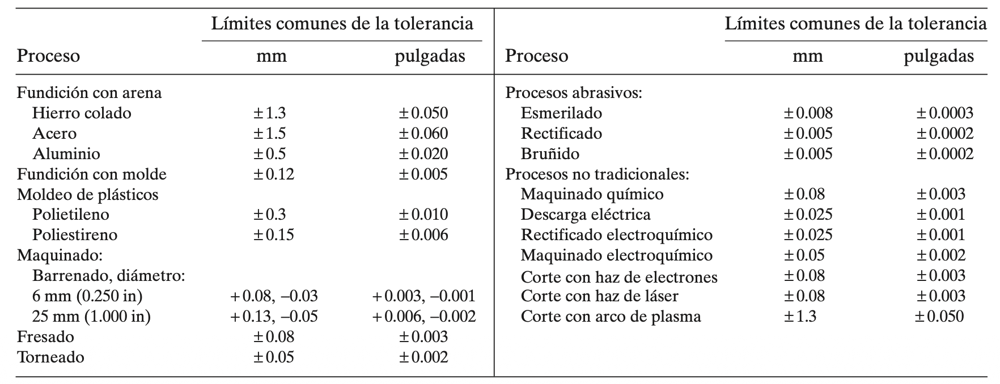{ width="600" }
    <figcaption>Foto de Fundamentos de la manufactura moderna</figcaption>
</figure>

<figure markdown="span">
    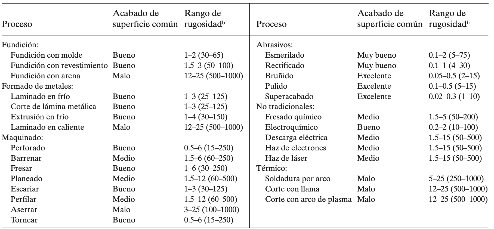{ width="600" }
    <figcaption>Foto de Fundamentos de la manufactura moderna</figcaption>
</figure>

### Patrons

### Precisió

Les variacions en la manufactura es divideixen en dos tipus: aleatòries i assignables. Les variacions aleatòries són causades per molts factors: la variabilitat humana amb cada cicle d'operacions, les variacions en les matèries primeres, la vibració de les màquines, etc. En forma individual, aquests factors tal vegada no representen molt, però col·lectivament els errors poden acumular-se en forma significativa per a provocar problemes, tret que estiguen dins de les toleràncies de la peça.

### Traçabilitat i pla de calibratge

## Normalització

<figure markdown="span">
    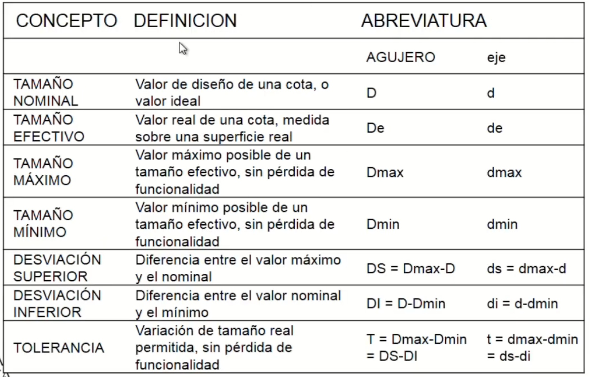{ width="600" }
    <figcaption>Foto de Universitat Politècnica de València: https://youtu.be/ihi4WZQytV4?si=h21BJFf59DVnpOi4</figcaption>
</figure>

### Toleràncies

Les toleràncies de disseny han de ser compatibles amb la capacitat del procés. No hi ha raó per a especificar una tolerància de 0.025 mm en una dimensió si la capacitat del procés és significativament més àmplia que 0.025 mm. Ha d'ampliar-se la tolerància (si la funcionalitat del disseny ho permet) o s'ha de seleccionar una operació de manufactura distinta. L'ideal és que la tolerància especificada ha de ser més gran que la capacitat del procés. Si el funcionament i els processos disponibles ho impedeixen, ha d'incloure's la classificació en la seqüència de manufactura per a inspeccionar cada unitat i separar les que compleixen especificacions de les quals no ho fan.

### Ajustos

### Simbologia 

### Calibres passa/no passa

Un calibrador fix és una rèplica física de la dimensió d'una peça que s'inspeccionarà o mesurar. Existeixen dues categories bàsiques: el calibrador mestre i el calibrador límit. Un calibrador mestre és una rèplica directa de la grandària nominal de la dimensió de la peça. En general, s'usa per a preparar un instrument de mesura comparativa, per exemple un indicador de caràtula; o per a calibrar un dispositiu de mesurament. Un calibrador límit es fabrica per a ser una rèplica inversa de la dimensió de la peça i es dissenya per a verificar la dimensió d'un o més dels seus límits de tolerància. Un calibrador límit amb freqüència té dos calibradors en un, el primer comprova el límit inferior de la tolerància en la dimensió de la peça i l'altre verifica el límit superior. Popularment, aquests calibradors es coneixen com a calibradors passa/no passa, pel fet que un límit del calibrador permet que la peça s'inserisca, mentre que l'altre límit ho impedeix. El límit pansa s'usa per a verificar la dimensió en la seua màxima condició material; aquest és la grandària màxima per a una característica interna, com un orifici i la grandària màxima per a una característica externa com un diàmetre exterior. El límit no passa s'usa per a revisar la mínima condició material de la dimensió en qüestió.

<figure markdown="span">
    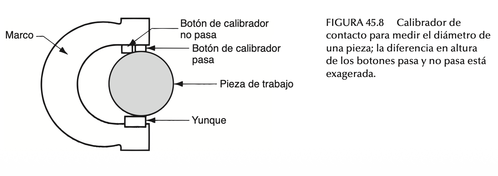{ width="600" }
    <figcaption>Foto de Fundamentos de la manufactura moderna</figcaption>
</figure>

<figure markdown="span">
    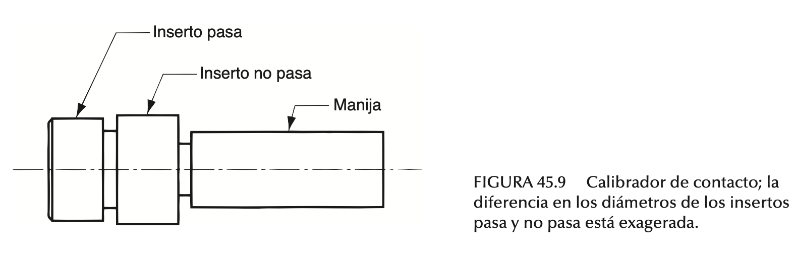{ width="600" }
    <figcaption>Foto de Fundamentos de la manufactura moderna</figcaption>
</figure>

## Tècniques de mesurament I

El mesurament és un procediment en el qual es compara una quantitat desconeguda amb un estàndard conegut, usant un sistema d'unitats acceptat i consistent. El mesurament pot involucrar una simple regla lineal per a establir l'escala de la longitud d'una peça o pot requerir un mesurament complex de força contra deflexió durant una prova de tensió. El mesurament proporciona un valor numèric de la quantitat d'interès, dins d'uns certs límits d'exactitud i precisió.

La inspecció és un procediment en el qual s'examina alguna característica d'una peça o producte, com una dimensió, per a determinar si s'apega o no a l'especificació del disseny. Molts procediments d'inspecció es basen en tècniques de mesurament, mentre que uns altres usen mètodes de calibratge. El calibratge determina simplement si la característica de la peça compleix o no amb l'especificació del disseny, si la peça passa o no la inspecció. En general és més ràpida que el mesurament, però proporciona informació insuficient del valor real de la característica d'interès.

La metrologia és la ciència del mesurament. Es relaciona amb sis quantitats fonamentals: longitud, massa, temps, corrent elèctric, temperatura i radiació lluminosa. A partir d'aquestes, es deriva la majoria de les altres quantitats físiques, com l'àrea, el volum, la velocitat, l'acceleració, la força, el voltatge elèctric, l'energia tèrmica, etc. En la metrologia de manufactura, el principal interès és el mesurament de la longitud i les seves diverses maneres de manifestar-se en una peça o producte.

### Exactitud i precisió

L'exactitud és el grau en el qual un valor mesurat coincideix amb el valor veritable de la quantitat d'interès. Un procediment de mesurament és exacte quan no té errors sistemàtics. Els errors sistemàtics són desviacions positives o negatives del valor veritable que són consistents d'un mesurament a la següent.

La precisió és el grau en el qual es pot repetir el procés de mesurament. Una bona precisió significa que es redueixen al mínim els errors aleatoris en el procediment de mesurament. En general, els errors aleatoris s'associen amb la participació humana en el procés de mesurament. Entre els exemples estan les variacions en la preparació, la lectura imprecisa de l'escala, les aproximacions arrodonides, etc. Entre els components no humans que contribueixen a l'error aleatori estan els canvis de temperatura, el desgast gradual i/o el desajustament en els elements funcionals dels dispositius i altres variants.

La precisió s'obté seleccionant la tecnologia d'instrument adequada per a l'aplicació. Una directriu que s'aplica amb freqüència per a determinar el nivell de precisió correcte és la regla de 10, que estableix que el dispositiu de mesurament ha de ser 10 vegades més precís que la tolerància especificada. Per tant, si la tolerància que es mesurarà és ±0.25 mm, llavors el dispositiu de mesurament ha de tenir una precisió de ±0.025 mm.

Un altre aspecte d'un instrument de mesura és la seva capacitat per a captar diferències molt petites en la quantitat d'interès. La indicació d'aquesta característica és la variació més petita de la quantitat que pot detectar l'instrument. En general s'usen els termes resolució i sensibilitat per a aquest atribut d'un dispositiu de mesurament.

## Tècniques de mesurament II

### Mesura de rugositat superficial

S'usen diversos mètodes per a avaluar la rugositat de la superfície. Es divideixen en tres categories: 1) comparació subjectiva amb superfícies de prova estàndard, 2) instruments electrònics d'agulla i 3) tècniques òptiques.

Existeixen blocs estàndard d'acabat superficial, produïts per a valors de rugositat especificats.1 Per a estimar la rugositat d'un espècimen de prova determinat, la superfície es compara amb l'estàndard tant en forma visual com mitjançant la “prova d'ungla”. En aquesta prova, l'usuari rasca suaument les superfícies de l'espècimen i l'estàndard, i determina quin estàndard s'acosta més a l'espècimen.

El desavantatge de la prova d'ungla és la seua subjectivitat. Existeixen a la venda altres instruments tipus punxó per a mesurar la rugositat superficial, similars a la prova d'ungla, però amb un enfocament més científic. Un exemple és el perfilòmetre. En aquests dispositius electrònics, es mou una agulla de diamant cònica, el radi de punta del qual mesura al voltant de 0.005 mm i l'angle en la punta és de 90°, a través de la superfície de prova a una velocitat lenta constant. Conforme el cap de l'agulla es mou en forma horitzontal, també es desplaça en forma vertical per a seguir les desviacions de la superfície. El moviment vertical es converteix en un senyal electrònic que representa la topografia de la superfície. Això es desplega com: 1) un perfil de la superfície real o 2) un valor de rugositat mitjana. Els dispositius per a perfilar usen un pla separat com la referència nominal contra la qual es mesuren les desviacions. El resultat és una retícula del contorn de la superfície al llarg de la línia que recorre l'agulla.

<figure markdown="span">
    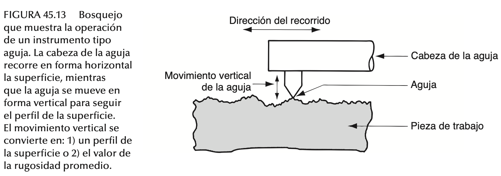{ width="600" }
    <figcaption>Foto de Fundamentos de la manufactura moderna</figcaption>
</figure>

La majoria dels altres instruments de mesura de superfícies empren tècniques òptiques per a valorar la rugositat. Aquestes tècniques es basen en la reflexió de la llum des de la superfície, la dispersió o difusió de la llum i la tecnologia làser. Són útils en aplicacions on no és convenient el contacte del punxó amb la superfície.

### MMC 

<figure markdown="span">
    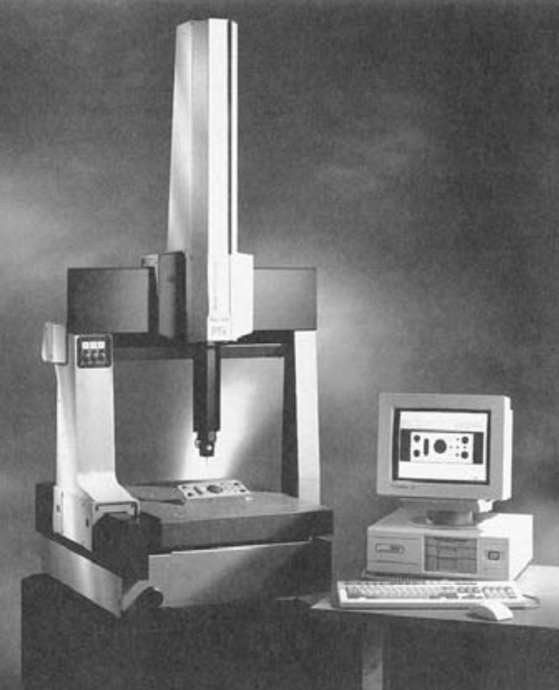{ width="600" }
    <figcaption>Foto de Fundamentos de la manufactura moderna</figcaption>
</figure>

Una màquina de mesurament de coordenades (CMM, per les seues sigles en anglés) consta d'una sonda de contacte (palpador) i un mecanisme per a posicionar la sonda en tres dimensions. En una CMM, la sonda se subjecta a una estructura que permet el seu moviment en relació amb la peça, la qual es fixa en una taula de treball connectada a l'estructura. L'estructura ha de ser rígida per a minimitzar les deflexions que contribueixen als errors de mesurament. S'usen característiques especials en les estructures de les CMM per a aconseguir una alta exactitud i precisió en la màquina de mesurament, incloent-hi l'ús de coixinets d'aire de baixa fricció i aïllament mecànic de la CMM per a reduir vibracions.

### Toleràncies geomètriques

## Calibratge i verificació d'instruments de mesura

Altres característiques desitjables d'un instrument de mesura inclouen la facilitat de calibratge, l'estabilitat, la velocitat de resposta, el rang d'operació ampli, la confiabilitat alta i el cost baix. La majoria dels dispositius de mesurament han de calibrar-se en forma periòdica. El calibratge és un procediment en el qual l'instrument de mesura es verifica contra un estàndard conegut. Per exemple, el calibratge d'un termòmetre implicaria verificar la seva lectura en gel (d'aigua pura). Per conveniència, en usar l'instrument de mesura, el procediment de calibratge ha de ser ràpid i simple. Una vegada que es calibra, l'instrument ha de ser capaç de conservar el seu calibratge i continuar mesurant la quantitat sense desviar-se de l'estàndard. Aquesta capacitat de conservar el calibratge es diu estabilitat i la tendència del dispositiu a perdre gradualment la seva precisió en relació amb l'estàndard es denomina desviació.

### Equips i mètodes

Els blocs de calibradors de precisió són els estàndards contra els quals es comparen altres instruments de mesura i calibradors de dimensió. En general, els blocs de calibratge tenen forma quadrada o rectangular. Les superfícies de mesurament tenen un acabat considerat dimensionalment exacte i paral·lel fins dins de diverses milionèsimes d'una polzada i poliments amb un acabat tipus mirall. Existeixen diversos graus de blocs de calibratge de precisió, amb toleràncies més estretes per a graus de precisió més alts. El grau més alt, l'estàndard mestre de laboratori, està fet a una tolerància de ±0.000 03 mm. Els blocs de calibratge i altres instruments d'alta precisió han d'usar-se en condicions de temperatura estàndard i altres factors que podrien afectar adversament el mesurament. Per acord internacional, s'ha establert que la temperatura estàndard és de 20 °C.

Els instruments de mesura es divideixen en dos punts: graduats i no graduats. Els dispositius de mesurament graduats inclouen un conjunt de marcadors (anomenats graduacions) sobre una escala lineal o angular, contra la qual pot comparar-se la característica d'interès de l'objecte. Els dispositius de mesurament no graduats no posseeixen tal escala i s'usen per a fer comparacions entre les dimensions o per a transferir una dimensió i efectuar el seu mesurament mitjançant un dispositiu graduat.

Existeixen calibradors en estil graduat i no graduat. Un calibrador no graduat (que es coneix simplement com a calibrador) consta de dues potes unides mitjançant un mecanisme articulat. Els extrems de les potes estan fets per a entrar en contacte amb les superfícies de l'objecte que es mesura i l'articulació està dissenyada per a sostenir les potes en posició durant l'ús. Els contactes apunten cap a dins  o cap a fora. Quan apunten cap a dins l'instrument es denomina un calibrador extern i s'usa per a mesurar dimensions externes com un diàmetre. Quan els contactes apunten cap a fora, es denomina un calibrador intern, el qual s'usa per a mesurar la distància entre dues superfícies internes.

<figure markdown="span">
    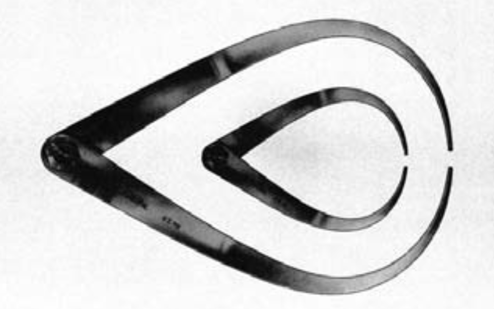{ width="600" }
    <figcaption>Foto de Fundamentos de la manufactura moderna</figcaption>
</figure>

Existeixen diversos calibradors graduats per a diferents propòsits de mesurament. El més simple és el calibrador lliscant, una regla d'acer a la qual se li afegeixen dues maixelles, una fixa en un extrem de la regla i l'altra mòbil.

<figure markdown="span">
    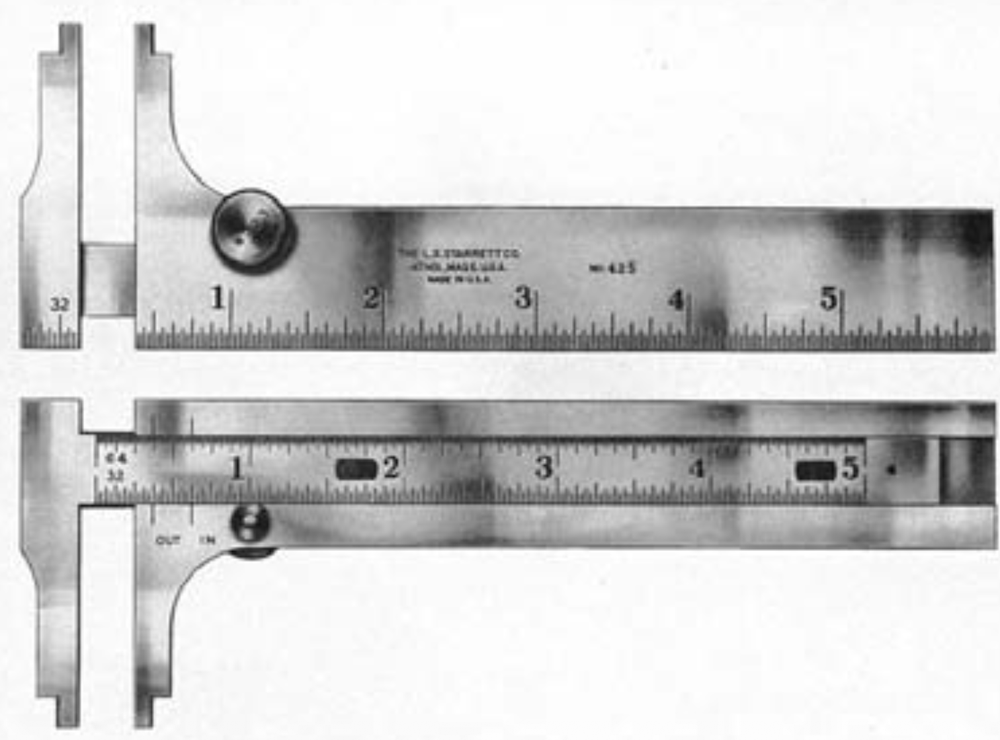{ width="600" }
    <figcaption>Foto de Fundamentos de la manufactura moderna</figcaption>
</figure>

Un refinament del calibrador deslizable és el calibrador vernier. En aquest dispositiu, la maixella mòbil inclou una escala de vernier. El vernier proporciona graduacions de 0.01 mm, molt més precise que el calibrador lliscant. Les variacions del calibrador vernier inclouen el calibrador vernier d'altura, usat per a mesurar l'altura d'un objecte en relació amb una superfície plana, com una placa: i el calibrador vernier de profunditat, per a mesurar la profunditat d'un forat, ranura o una altra cavitat en relació amb una superfície superior.

<figure markdown="span">
    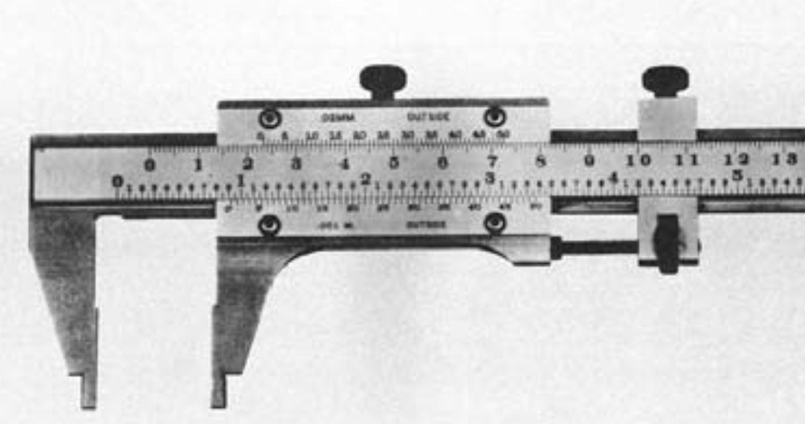{ width="600" }
    <figcaption>Foto de Fundamentos de la manufactura moderna</figcaption>
</figure>

El micròmetre s'usa àmpliament i és un dispositiu de mesurament molt exacte, la seua forma més comuna consisteix en una claveguera i en una enclusa en forma de C. El mànec es mou en relació amb l'enclusa fixa mitjançant una rosca de caragol exacta. En un micròmetre comú en USCS cada rotació del mànec proporciona 0.025 polzades de viatge lineal. A cada eix es connecta un maneguet graduat amb 25 marques al voltant de la seua circumferència; cada marca correspon a 0.001 in. En general, la mànega del micròmetre està equipada amb un vernier, el qual permet resolucions tan estretes com 0.001 in. En un micròmetre amb una escala mètrica, les graduacions són de 0.01 mm.

<figure markdown="span">
    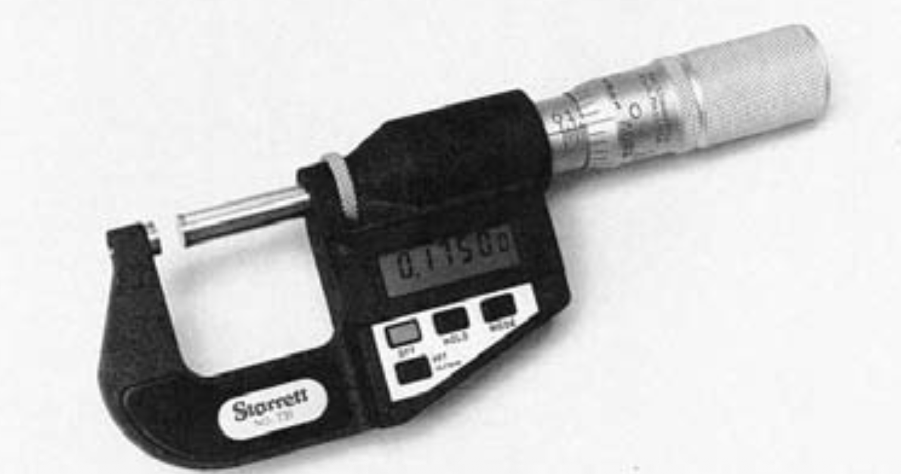{ width="600" }
    <figcaption>Foto de Fundamentos de la manufactura moderna</figcaption>
</figure>

### Certificació del calibratge

Els instruments comparatius s'usen per a confrontar les dimensions entre dos objectes, com una peça de treball i una superfície de referència. En general, no són capaços de proporcionar un mesurament absolut de la quantitat que interessa; en lloc d'això, mesuren la magnitud i direcció de la desviació entre dos objectes. Els calibradors mecànics estan dissenyats per a magnificar en forma mecànica a desviació, per a permetre l'observació. L'instrument més comú en aquesta categoria és l'indicador de caràtula. Converteix i magnifica el moviment lineal d'un apuntador de contacte en la rotació d'una agulla de caràtula. La caràtula es gradua en unitats xicotetes com 0.01 mm. Els calibradors electrònics són una família d'instruments de mesura i calibratge, basats en transductors, capaços de convertir un desplaçament lineal en un senyal elèctric, que s'amplifica i transforma en un format de dades convenient

<figure markdown="span">
    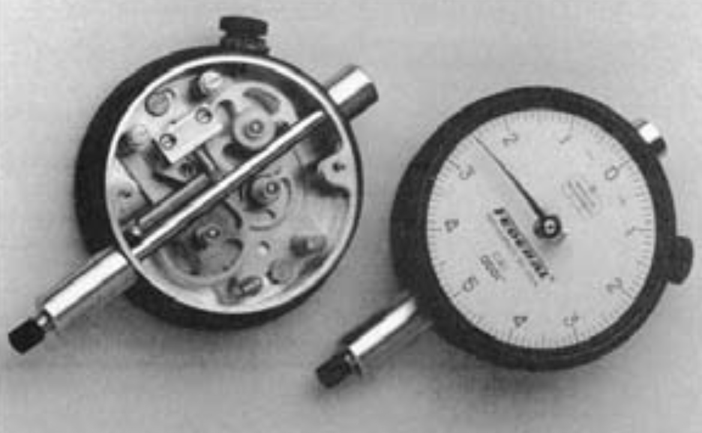{ width="600" }
    <figcaption>Foto de Fundamentos de la manufactura moderna</figcaption>
</figure>

<figure markdown="span">
    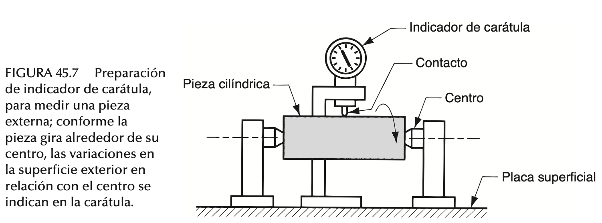{ width="600" }
    <figcaption>Foto de Fundamentos de la manufactura moderna</figcaption>
</figure>

## Bibliografia

- https://youtu.be/9TJF8KQvH2I?si=KfIZ5ZodI-1T1Ti3