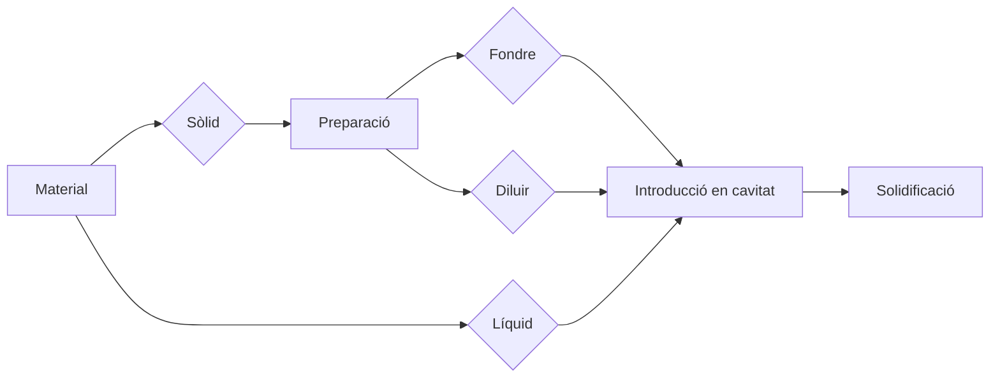
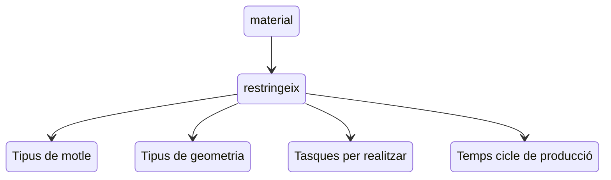
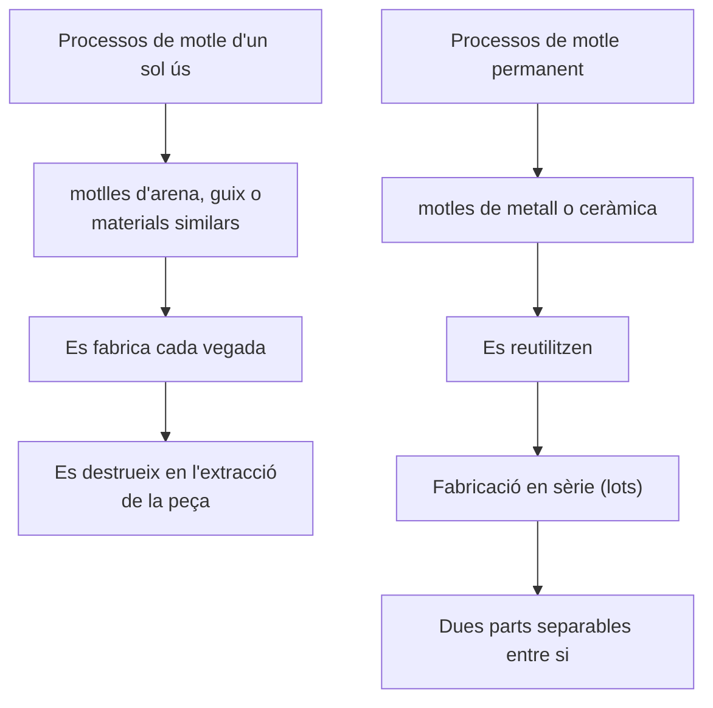

# Processos d'emmotlament i fosa

## Fonaments de la conformació per emmotlament: característiques, materials i disseny de sistemes.

Per tant, al procés d'emmotlament, el material serà clau per entendre quin és el procés que cal seguir:

### Característiques

- Permet assolir una gran complexitat geomètrica
- Alguns processos d'emmotlament permeten assolir peces ja finalitzades, sense haver-hi de processar-les posteriorment
- Abarca qualsevol mida de peça
- Alguns dels processos d'emmotlament poden estar adaptats per la producció en sèrie
- Es requereixen grans mesures de seguretat, ja que es tracta d'un procés amb alts riscos
- Gran part dels processos d'emmotlament tenen una baixa precisió i un deficient acabat superficial, tot i que existeixen els anomenats processos de precisió, els quals milloren aquests aspectes.

### Materials

<figure markdown="span">
    { width="300" }
    <figcaption>Foto de ThisIsEngineering: https://www.pexels.com/ca-es/foto/home-persona-disseny-preparacio-3913008/</figcaption>
</figure>

L'emmotlament permet l'ús de qualsevol metall o aliatge, sempre que aquest puga fondre's sense problema.

### Disseny de sistemes

La part essencial del procés d'emmotlament és el motle. Aquest disposa de les següents característiques:

- Materialitat: El motle pot estar fet de diversitat de materials.
- Geometria: Reprodueix la geometria exterior (i en alguns casos també interior) de la peça.
- Extracció: Permeten extraure la peça sense deteriorar-la

!!! warning "Sobredimensionament"
    El motle està sobredimensionat, ja que alguns materials (sobretot els metàl·lics) es contrauen.

### Classificació segons tipus d'emmotlament

Independentment del tipus de motle, sempre es trobaran els següents elements comuns:

<figure markdown="span">
    { width="700" }
    <figcaption>Foto de IHMC Public Cmaps: https://cursa.ihmc.us/rid=1NQKRY7WS-3M4ZWZ-46VK/Fundici%C3%B3n%20y%20colada%20de%20metales%20en%20molde%20de%20arena</figcaption>
</figure>

<figure markdown="span">
    { width="700" }
    <figcaption>Foto de Universitat Politècnica de València: https://youtu.be/-EuZoQcHX0A</figcaption>
</figure>

**1. Copa d'abocament:** On s'introdueix el material en estat líquid a l'interior del motle

**2. Abeurador:** On es distribueix a la zona dels canals

**3. Pou:** Per filtrar escòries i impureses

**4. Canal d'alimentació:** Regularització del flux

**5. Atac:** On es connectarà el flux amb la peça

**6. Peça:** Peça que s'emmoltlarà

**7. Massalota:** Dipòsits de material que es col·loquen en els llocs del motlle que són crítics, és a dir, que tendeixen a generar xuclets i aporten material per evitar-los

## Tècniques de fosa especials: fosa a pressió, en conquilla i centrífuga. Conformació per emmotlament en arena: tipus d'arena, control i preparació.

## Qualitat en peces foses: classificació de defectes i regles de disseny.

## El guix. Varietats. L'escaiola. Característiques i propietats. Aplicació i usos en models, maquetes i prototips.

## Sistemes de reproducció mitjançant motles. Tipus de motles. Sistemes de separació de peces i normes generals per al traçat de juntes.

## Els materials aïllants i adobadors. Greixos. Desblocadors.

## Motles per a ceràmica. Buidatge pels procediments de barbotina i estreta.

## Motles per a fosa a la cera perduda. Motles per a fosa a l’arena.

## Bibliografia

- Reig Pérez, M. J. [Universitat Politècnica de València - UPV]. (2018, 22 d'octubre). Fundamentos de los Procesos de Fundición de Metales [Vídeo]. YouTube. https://youtu.be/-EuZoQcHX0A
- Reig Pérez, M. J. [Universitat Politècnica de València - UPV]. (2018, 22 d'octubre). Fundición en molde permanente [Vídeo]. YouTube. https://youtu.be/lrIecu0Dz0o
- Reig Pérez, M. J. [Universitat Politècnica de València - UPV]. (2018, 22 d'octubre). Fundición en arena [Vídeo]. YouTube. https://youtu.be/Dj3IjAELAF0
- Boronat Vitoria, T., Ivorra Martínez, J., Quiles Carrillo, L. J., & Torres Giner, S. [Universitat Politècnica de València - UPV]. (2021, 27 de març). Moldeo en arena verde [Vídeo]. YouTube. https://youtu.be/FIgRubIrEnc
- Fab Academy. (2024). Molding and casting. The Center for Bits and Atoms (CBA), MIT. https://academy.cba.mit.edu/classes/molding_casting/index.html
