# Processos d'emmotlament i fosa

## Fonaments de la conformació per emmotlament

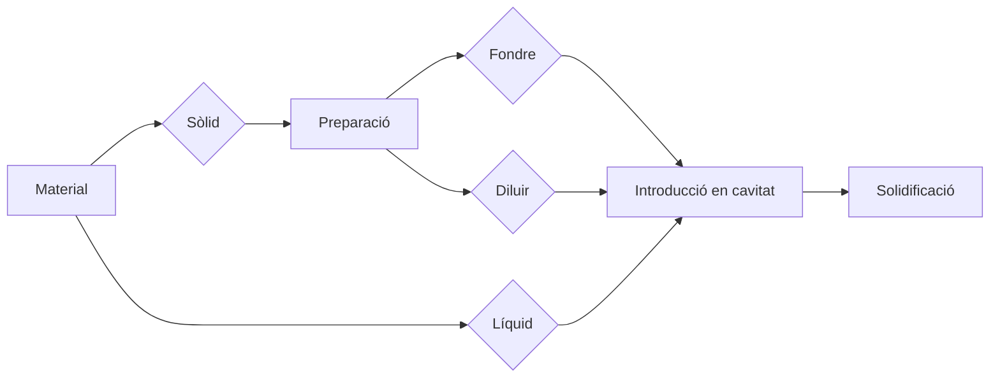
``` mermaid
graph LR
  A[Material] --> B{Sòlid};
  A --> C{Líquid};
  B --> D[Preparació];
  D -->E{Fondre};
  D -->F{Diluir};
  E -->G[Introducció en cavitat];
  F -->G;
  C -->G;
  G --> H[Solidificació];
```

Per tant, al procés d'emmotlament, el material serà clau per entendre quin és el procés que cal seguir:

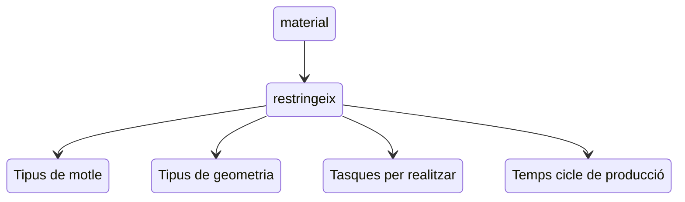
``` mermaid
stateDiagram-v2
  state material 
    material --> restringeix
    restringeix --> S1
    restringeix --> S2
    restringeix --> S3
    restringeix --> S4
    S1: Tipus de motle
    S2: Tipus de geometria
    S3: Tasques per realitzar
    S4: Temps cicle de producció
```

### Característiques

- Permet assolir una gran complexitat geomètrica
- Alguns processos d'emmotlament permeten assolir peces ja finalitzades, sense haver-hi de processar-les posteriorment
- Abarca qualsevol mida de peça
- Alguns dels processos d'emmotlament poden estar adaptats per la producció en sèrie
- Es requereixen grans mesures de seguretat, ja que es tracta d'un procés amb alts riscos
- Gran part dels processos d'emmotlament tenen una baixa precisió i un deficient acabat superficial, tot i que existeixen els anomenats processos de precisió, els quals milloren aquests aspectes.

### Disseny de sistemes

La part essencial del procés d'emmotlament és el motle. Aquest disposa de les següents característiques:

- Materialitat: El motle pot estar fet de diversitat de materials.
- Geometria: Reprodueix la geometria exterior (i en alguns casos també interior) de la peça.
- Extracció: Permeten extraure la peça sense deteriorar-la

!!! warning "Sobredimensionament"
    El motle està sobredimensionat, ja que alguns materials (sobretot els metàl·lics) es contrauen.

## Materials

### El guix. Varietats. L'escaiola. Característiques i propietats. Aplicació i usos en models, maquetes i prototips.

El guix és sulfat de calci hidratat, el qual es calcina a certa temperatura perquè perda part de la seua aigua.

<figure markdown="span">
    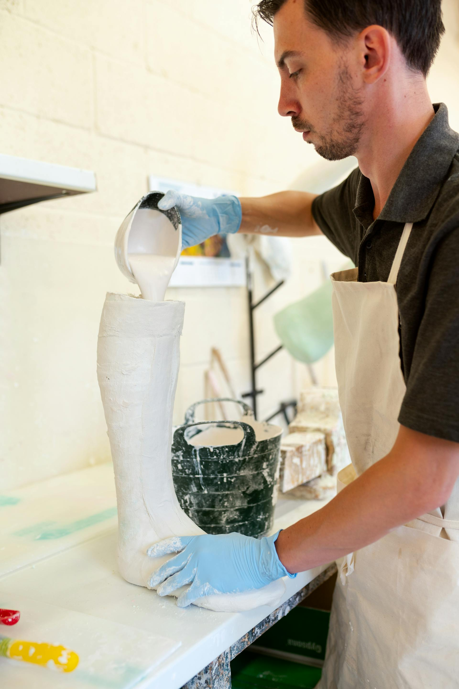{ width="300" }
    <figcaption>Foto de ThisIsEngineering: https://www.pexels.com/ca-es/foto/home-persona-disseny-preparacio-3913008/</figcaption>
</figure>

El guix, cal endurir-lo, per això, cal seguir dos fases. En primer lloc, es barreja el guix amb aigua per obtindre una pasta. A continuació, depenent de la quantitat d'aigua utilitzada, el guix s'assecarà i passarà a comportar-se com rigidament. 

    <iframe src="https://www.youtube.com/embed/eu6X5Azh_WQ?si=jlQUwFZCwQYjfLB1" title="YouTube video player" frameborder="0" allow="accelerometer; autoplay; clipboard-write; encrypted-media; gyroscope; picture-in-picture; web-share" referrerpolicy="strict-origin-when-cross-origin" allowfullscreen style="position: absolute; top: 0; left: 0; width: 100%; height: 100%;"></iframe>

El guix és un material aplicable a gran part dels processos d'emmotlament que es veuran a continuació. Exceptuant els processos propis de metalls i aliatges o els d'injecció de polimers.

Ací disposeu d'un munt de exemples d'emmotlament amb guix: https://recurs.uoc.edu/art-toolkit/tecniques-buidar/

    <iframe src="https://www.youtube.com/embed/y2cV2kMrzCk?si=f0-4MgqpQ5wIMj7J" title="YouTube video player" frameborder="0" allow="accelerometer; autoplay; clipboard-write; encrypted-media; gyroscope; picture-in-picture; web-share" referrerpolicy="strict-origin-when-cross-origin" allowfullscreen style="position: absolute; top: 0; left: 0; width: 100%; height: 100%;"></iframe>

Als motles de guix és possible colar metalls, cal tindre en compte, però que els metalls han de presentar-hi un baix punt de fusió per poder ser colats, per les porositats del guix i l'humitat present. 

### Metalls i aliatges

L'emmotlament permet l'ús de qualsevol metall o aliatge, sempre que aquest puga fondre's sense problema. Els metalls s'emmotlaran principalment mitjançant els processos de: inversió, injecció, buit i centrifugació. 

### Polímers

Els polímers, que representen cadenes de monómers són utilitzats habitualment en processos d'emmotlament. és important fer una distinció principal entre els tipus de polímers. Hi ha dos tipus principals els quals són els termoplàstics i els termoestables. 
Els termoplàstics són materials més ductils els quals mitjançant l'aplicació de calor fonen. Per altra banda, els termoestables són més durs i una vegada conformats ja no fonen, sinó que es cremen. Per la fabricació amb polímers s'aplica principalment el procés d'injecció i extrussió. En ambdos processos, la cambra i el tipus d'injector canvien ja que cal fondre'ls en diferents moments del procés. 

### Compòsits

    <iframe src="https://www.youtube.com/embed/7cHV4DnalzQ?si=CpX7Rra6hLb83zjS" title="YouTube video player" frameborder="0" allow="accelerometer; autoplay; clipboard-write; encrypted-media; gyroscope; picture-in-picture; web-share" referrerpolicy="strict-origin-when-cross-origin" allowfullscreen style="position: absolute; top: 0; left: 0; width: 100%; height: 100%;"></iframe>

### Classificació segons tipus d'emmotlament

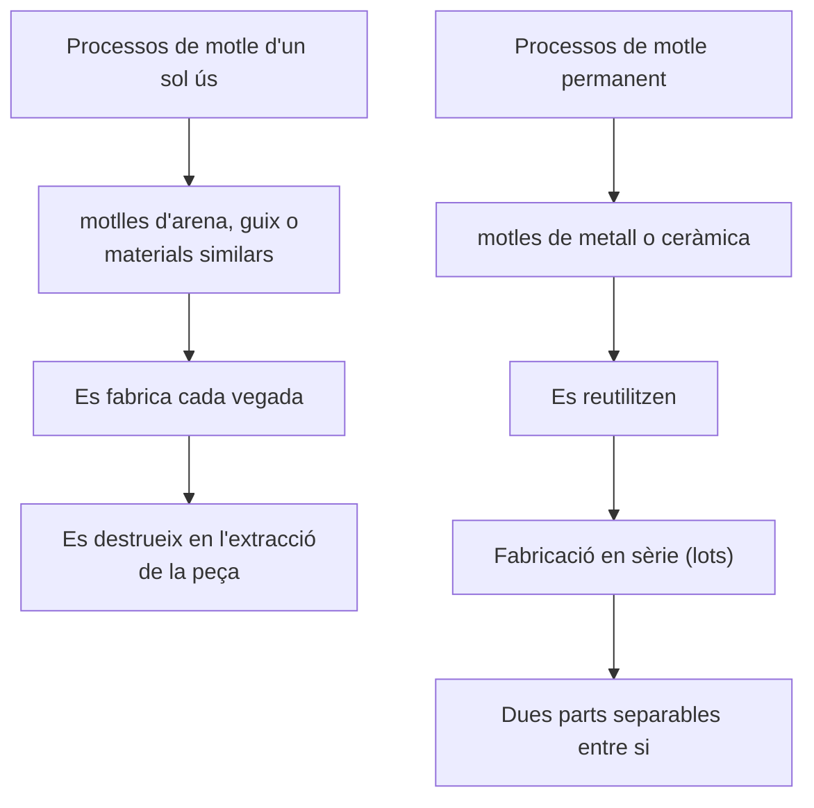
``` mermaid
graph TB
    A["Processos de motle d'un sol ús"]
    A --> B["motlles d'arena, guix o<br>materials similars"]
    B --> C["Es fabrica cada vegada"]
    C --> D["Es destrueix en l'extracció<br>de la peça"]

    E["Processos de motle permanent"]
    E --> F["motles de metall o ceràmica"]
    F --> G["Es reutilitzen"]
    G --> H["Fabricació en sèrie (lots)"]
    H --> I["Dues parts separables entre si"]
```

Independentment del tipus de motle, sempre es trobaran els següents elements comuns:

<figure markdown="span">
    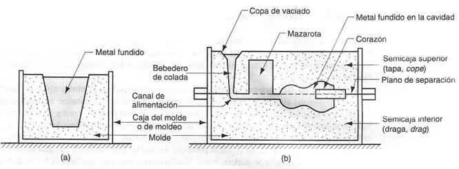{ width="700" }
    <figcaption>Foto de IHMC Public Cmaps: https://cursa.ihmc.us/rid=1NQKRY7WS-3M4ZWZ-46VK/Fundici%C3%B3n%20y%20colada%20de%20metales%20en%20molde%20de%20arena</figcaption>
</figure>

<figure markdown="span">
    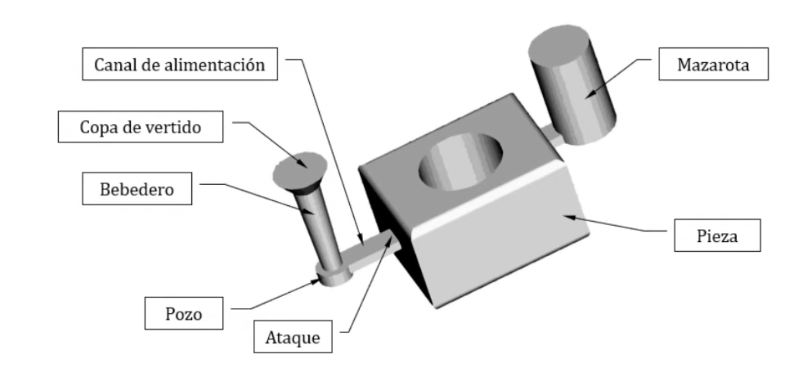{ width="700" }
    <figcaption>Foto de Universitat Politècnica de València: https://youtu.be/-EuZoQcHX0A</figcaption>
</figure>

**1. Copa d'abocament:** On s'introdueix el material en estat líquid a l'interior del motle

**2. Abeurador:** On es distribueix a la zona dels canals

**3. Pou:** Per filtrar escòries i impureses

**4. Canal d'alimentació:** Regularització del flux

**5. Atac:** On es connectarà el flux amb la peça

**6. Peça:** Peça que s'emmoltlarà

**7. Massalota:** Dipòsits de material que es col·loquen en els llocs del motlle que són crítics, és a dir, que tendeixen a generar xuclets i aporten material per evitar-los

***Aleshores, què s'ha de tindre en compte a l'hora de dissenyar un motle?***

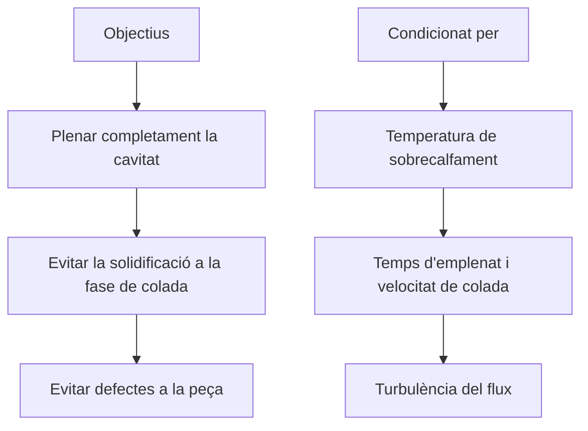
``` mermaid
graph TB
    A["Objectius"]
    A --> B["Plenar completament la cavitat"]
    B --> C["Evitar la solidificació a la fase de colada"]
    C --> D["Evitar defectes a la peça"]

    E["Condicionat per"]
    E --> F["Temperatura de sobrecalfament"]
    F --> G["Temps d'emplenat i velocitat de colada"]
    G --> H["Turbulència del flux"]
```

## Tècniques de fosa

### Emmotlament per inversió de motle

Aquest procés consiteix a l'emplenament total del motle, una posterior espera perquè es solidifique l'exterior del material en contacte amb les parets del motle i un buidat posterior del material no solidificat per obtindre una peça buida a l'interior.

<figure markdown="span">
    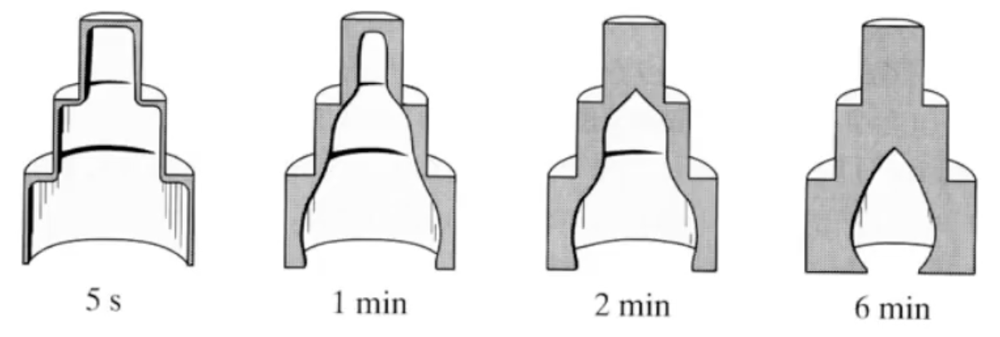{ width="800" }
    <figcaption>Foto de Universitat Politècnica de València: https://youtu.be/lrIecu0Dz0o?si=m8ocvvKotGV6MhnR</figcaption>
</figure>

<figure markdown="span">
    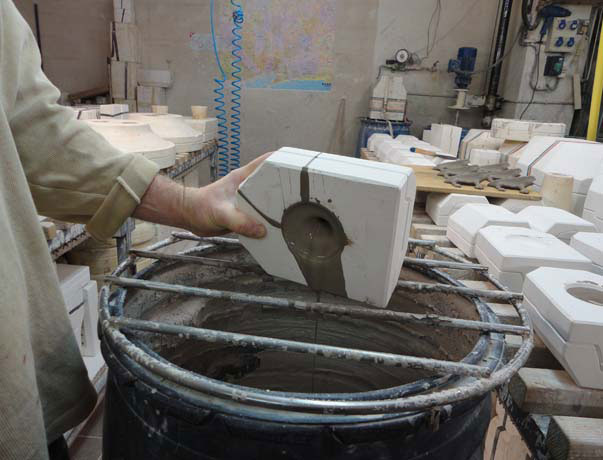{ width="800" }
    <figcaption>Foto de Diccionario de cerámica: http://ceramicdictionary.com/es/v/4027/vaciado-mesas-barbotina-moldes.</figcaption>
</figure>

Ací un exemple fantàstic d'aquest procés amb resina. ***Cal tindre en compte, però que pot ser utilitzat també amb metalls.***

    <iframe src="https://www.youtube.com/embed/HV_zu_jPk88?si=7ybtta6wOBNnNTso" title="YouTube video player" frameborder="0" allow="accelerometer; autoplay; clipboard-write; encrypted-media; gyroscope; picture-in-picture; web-share" referrerpolicy="strict-origin-when-cross-origin" allowfullscreen style="position: absolute; top: 0; left: 0; width: 100%; height: 100%;"></iframe>

I ací un altre exemple. En aquesta es "pinta" el motle diverses vegades fins aconseguir l'espesor desitjat en compte de emplenar-lo sencer i buidar-lo.

    <iframe src="https://www.youtube.com/embed/oUxIkeqJ6ac" title="YouTube video player" frameborder="0" allow="accelerometer; autoplay; clipboard-write; encrypted-media; gyroscope; picture-in-picture; web-share" referrerpolicy="strict-origin-when-cross-origin" allowfullscreen style="position: absolute; top: 0; left: 0; width: 100%; height: 100%;"></iframe>

La inversió permet produir:

- Objectes de gran dimensió
- Objectes amb gran detall geomètric
- Rugositats mitjanes 
- Bones toleràncies

!!! warning "Producció en sèrie"
    Aquest tipus d'emmotlament permet una producció en sèrie limitada. Com que cal esperar un temps de solidificació abans d'extraure les peces, no es podrà realitzar una producció ràpida.

### Emmotlament per injecció 

En aquest procés s'utilitza la pressió per plenar la cavitat. Pot aplicar-se bé amb polímers o bé amb metalls o aliatges (encara que no tots els tipus poden ser utilitzats)

<figure markdown="span">
    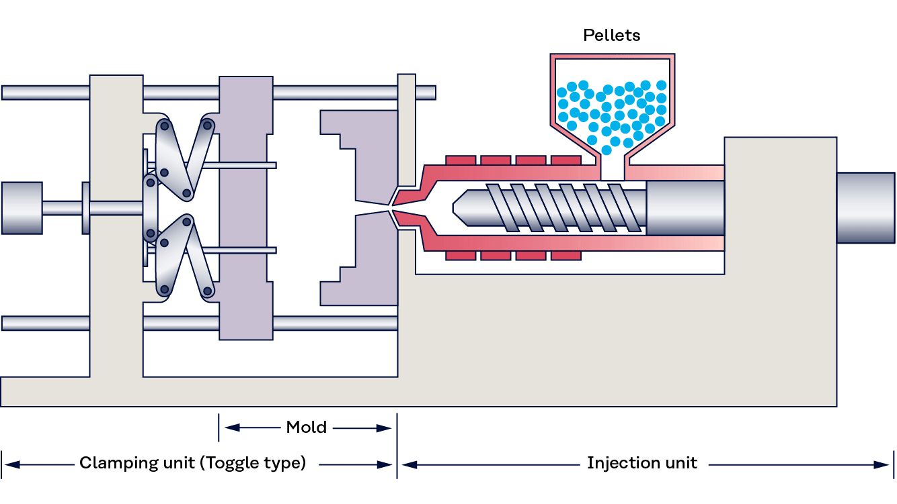{ width="800" }
    <figcaption>Foto de Kuraray: https://www.elastomer.kuraray.com/es/blog/injection-molding/.</figcaption>
</figure>

El procés es fa mitjançant la fusió del material fins aconseguir la viscositat per que fluisca, injecció al motle (mitjançant l'aplicació de pressió) i l'enfredament.

La injecció pot produir-se a cambra calenta o freda.

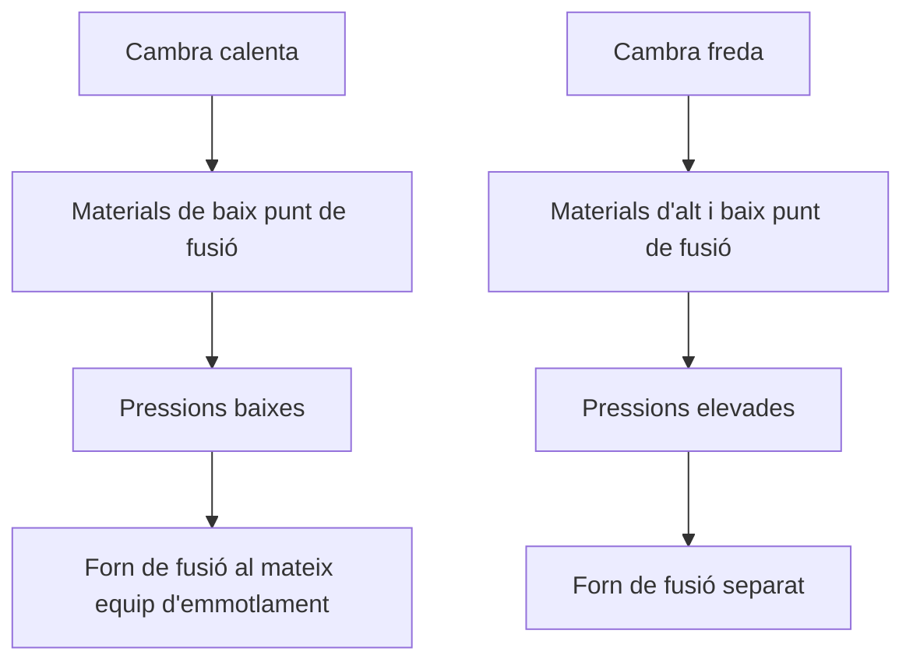
``` mermaid
graph TB
    A["Cambra calenta"]
    A --> B["Materials de baix punt de fusió"]
    B --> C["Pressions baixes"]
    C --> D["Forn de fusió al mateix equip d'emmotlament"]

    E["Cambra freda"]
    E --> F["Materials d'alt i baix punt de fusió"]
    F --> G["Pressions elevades"]
    G --> H["Forn de fusió separat"]
```

<figure markdown="span">
    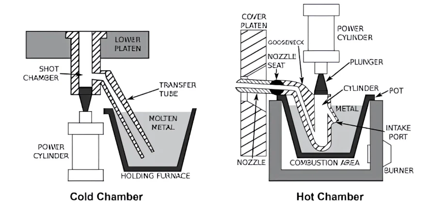{ width="800" }
    <figcaption>Foto de Pro-lean: https://proleantech.com/die-casting-vs-injection-molding/.</figcaption>
</figure>

    <iframe src="https://www.youtube.com/embed/3dXL4LIm2Js?si=plTlUjwN9SqMbTW5" title="YouTube video player" frameborder="0" allow="accelerometer; autoplay; clipboard-write; encrypted-media; gyroscope; picture-in-picture; web-share" referrerpolicy="strict-origin-when-cross-origin" allowfullscreen style="position: absolute; top: 0; left: 0; width: 100%; height: 100%;"></iframe>

La inversió permet produir:

- Un bon detall geomètric
- Molt bones toleràncies
- Rugositats xicotetes
- Una massa limitada

### Emmotlament al buit

Aquest sistema consisteix a utilitzar el buit per emplenar la cavitat del motle. De vegades també pot utilitzar-se la pressió per introduir el material fos. 
Els motles en aquest porcés estan fets principalment de grafit i arena fina i els resultats són peces amb gruixos prims.

<figure markdown="span">
    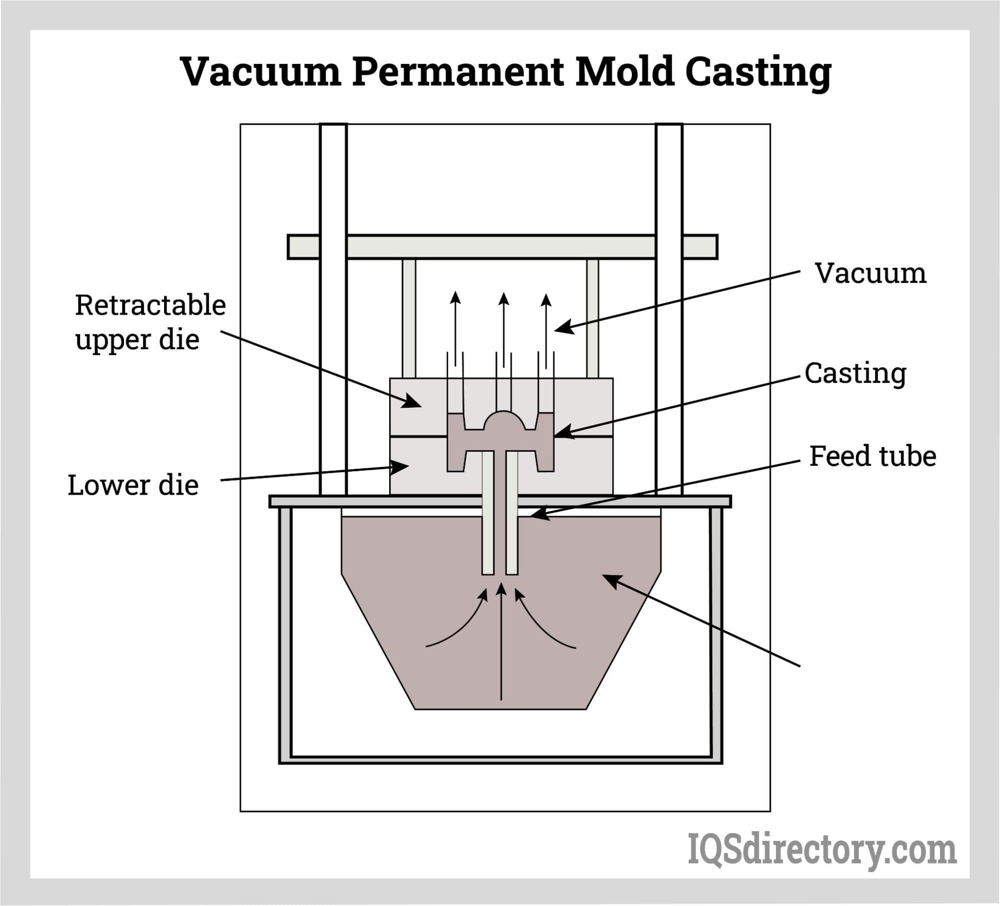{ width="600" }
    <figcaption>Foto de Industrial Quick Search: https://www.iqsdirectory.com/articles/permanent-mold-castings.html.</figcaption>
</figure>

Amb aquest mètode, també s'eviten les reaccions químiques que l'atmòsfera puga tindre amb el metall fos.

El buit permet:

- Un bon detall geomètric
- Molt bones toleràncies
- Rugositats xicotetes
- Una massa limitada
- Producció en sèrie limitada

### Emmotlament per centrifugació

L'emmotlament per centrifugació utilitza la inercia del gir per l'emplenament dels motles. Aquestos generalment són metàl·lics o de grafit. L'emmotlament presenta toleràncies bones, nivell de detall limitat i rugositats altes.

Hi ha diverses classificacions per aquest procés:

#### Centrífuga

<figure markdown="span">
    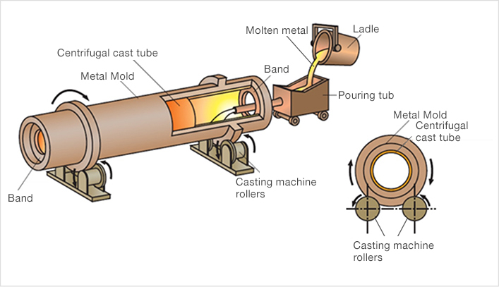{ width="600" }
    <figcaption>Foto de Rapiddirect: https://www.rapiddirect.com/es/blog/centrifugal-casting/.</figcaption>
</figure>

#### Semicentrifuga

Presenta un eix de simetria central per on s'introdueix el metall fos. Tot l'aire i gassos queden atrapats a la zona central.

<figure markdown="span">
    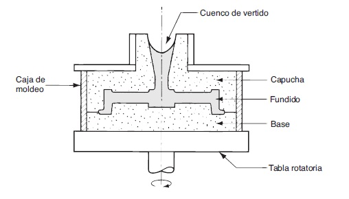{ width="600" }
    <figcaption>Foto de procesosiupsmmm: https://procesosiupsmmm.blogspot.com/2017/02/fundicion-de-metales.html.</figcaption>
</figure>

#### Centrifugada

No genera geometries de revolució. Projecció provoca l'emplenat.

<figure markdown="span">
    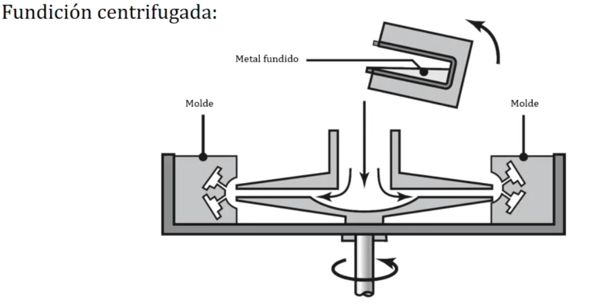{ width="600" }
    <figcaption>Foto de Universitat Politècnica de València: https://youtu.be/lrIecu0Dz0o?si=Y6Qg6EUYf7450H2S.</figcaption>
</figure>

### Emmotlament en conquilla 

La fosa en conquilla és un procés en el qual el metall s'aboca per gravetat en un motle de ferro fos (conquilla). Això permet que un sol motlle es puga reutilitzar moltes vegades. El procés permet obtenir un bon acabat superficial i un control dimensional més precís.

La ràpida solidificació gràcies al motlle metàl·lic dona com a resultat una estructura de gra més fi, per la qual cosa es produeixen peces foses més resistents i de millors propietats mecàniques

<figure markdown="span">
    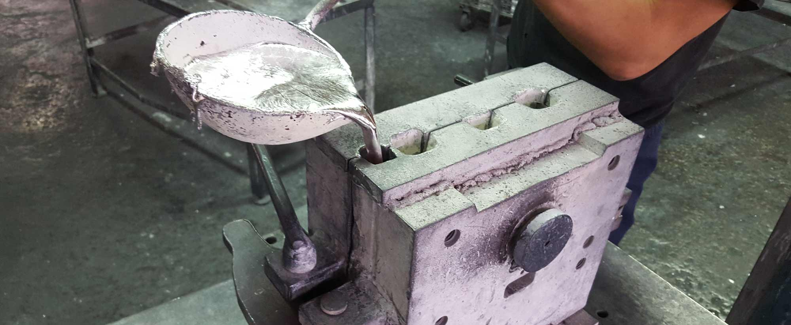{ width="600" }
    <figcaption>Foto de Fundiciones Zabala: https://www.fundicioneszabala.com/es/home/.</figcaption>
</figure>

### Emmotlament en arena

L'emmotlament en arena és un procés d'emmotlament mitjançant la creació d'un motle d'un sol ús, el qual es fabrica amb sorra, aglomerant i aigua.

<figure markdown="span">
    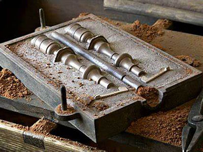{ width="500" }
    <figcaption>Foto de Casting Services: casting-services.com.</figcaption>
</figure>

<figure markdown="span">
    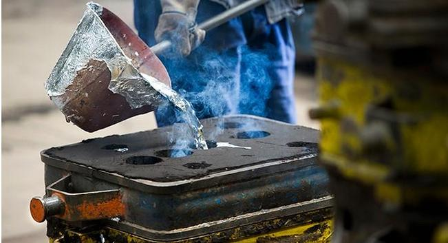{ width="700" }
    <figcaption>Foto de Fundición Metrologia Blogspot: fundicionmetrologia.blogspot.com.</figcaption>
</figure>

L'emmotlament d'arena es pot classificar en dos tipus:

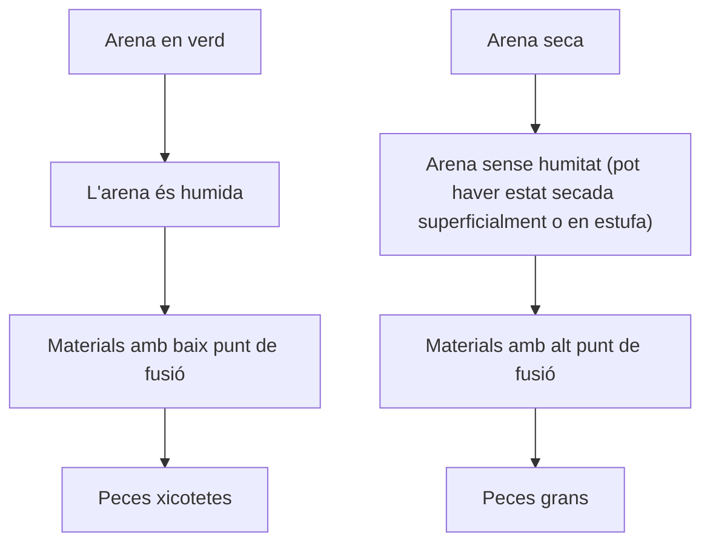
``` mermaid
graph TB
    A["Arena en verd"]
    A --> B["L'arena és humida"]
    B --> C["Materials amb baix punt de fusió"]
    C --> D["Peces xicotetes"]

    E["Arena seca"]
    E --> F["Arena sense humitat (pot haver estat secada superficialment o en estufa)"]
    F --> G["Materials amb alt punt de fusió"]
    G --> H["Peces grans"]
```

Aquest procés és un dels més versàtils, puix que pot ser utilitzar amb qualsevol tipus d'aliatge. Tot i així, el detall geomètric, les toleràncies i rugositats de les peces acabades, no és tan bo com en altres processos. A banda, el fet que es tracte d'un procés detructiu, provoca que la producció en sèrie no és viable.

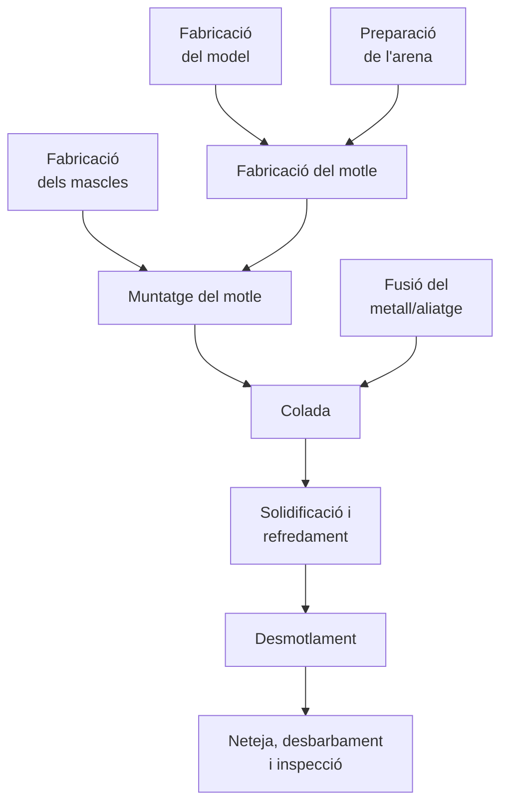
``` mermaid
graph TB
    A["Fabricació<br>del model"] --> C["Fabricació del motle"]
    B["Preparació<br>de l'arena"] --> C
    D["Fabricació<br>dels mascles"] --> E["Muntatge del motle"]
    C --> E
    E --> F["Colada"]
    G["Fusió del<br>metall/aliatge"] --> F
    F --> H["Solidificació i<br>refredament"]
    H --> I["Desmotlament"]
    I --> J["Neteja, desbarbament<br>i inspecció"]
```

Per la realització dels motles es compacta la sorra arreu dels models de les peces. 

<figure markdown="span">
    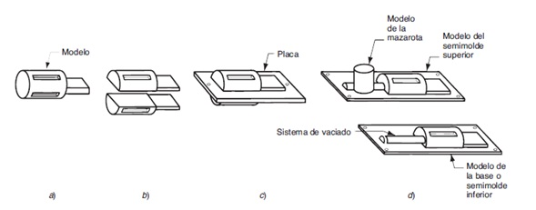{ width="600" }
    <figcaption>Foto de procesosiupsmmm: https://procesosiupsmmm.blogspot.com/2017/02/fundicion-de-metales.html.</figcaption>
</figure>

!!! warning "Important!!"
    Als models, cal incloure els elements necessaris explicats als criteris de creació de motles (massalotes, atacs, pous, abeuradors...) abans de realitzar la compactació de la sorra. 

A l'emmotlament, doncs, el model és la part més important. Aquest ha de reproduir la peça desitjada i ha d'estar fet d'un material resistent (com fusta o plàstics) amb l'objectiu de poder reutilitzar-lo. 
Per realitzar un bon model cal aplicar un sobredimensionat respecte de la peça que es vol assolir, un àngle de desemmotlament per poder extraure el model una vegada compactada la sorra i cal incloure tots els elements característics del motle, a fi d'aconseguir una bona colada i solidificació.

L'altre aspecte important són els mascles. En peces on l'interior és buit, els mascles, fets d'arena, es col·loquen a l'interior del motle abans de fer la colada. Aquests són d'un sol ús, ja que queden atrapats dins la peça produïda, són de sorra i aglomerants i es conformen mitjançant l'ús d'una caixa de mascles.

<figure markdown="span">
    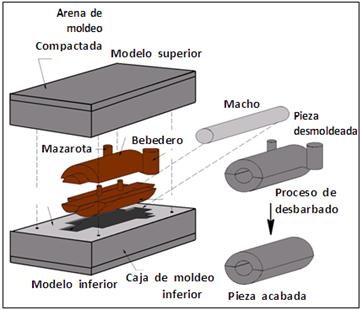{ width="600" }
    <figcaption>Foto de Monografias: https://www.monografias.com/trabajos94/principales-metodos-fundicion-metales/principales-metodos-fundicion-metales.</figcaption>
</figure>

<figure markdown="span">
    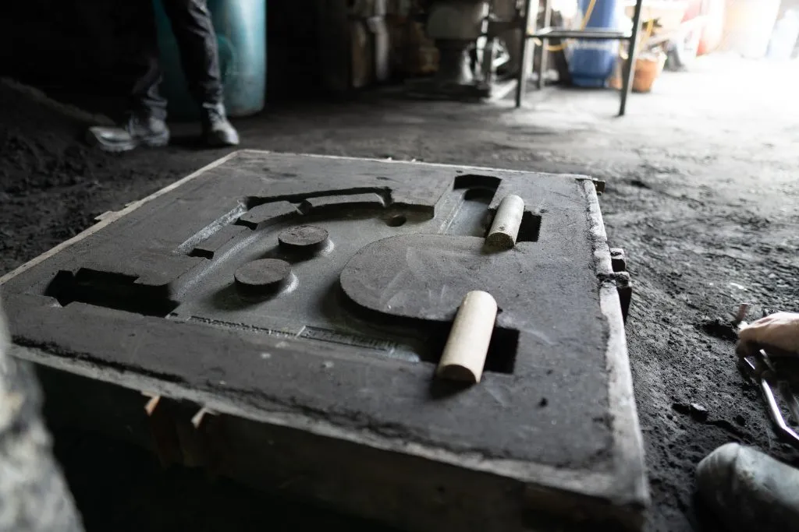{ width="600" }
    <figcaption>Foto de Fundiciones Toro Ramiro: https://www.garruchastoro.com/moldeo-en-arena-verde/.</figcaption>
</figure>

Els mascles han de poder suportar pressions elevades, ser fàcilement disgregables i poder suportar tots els gasos del procés, per aquesta raó deu ser prou porós. 

<figure markdown="span">
    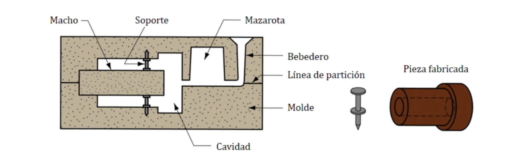{ width="600" }
    <figcaption>Foto de Universitat Politècnica de València: https://youtu.be/Dj3IjAELAF0.</figcaption>
</figure>

    <iframe src="https://www.youtube.com/embed/FIgRubIrEnc" title="YouTube video player" frameborder="0" allow="accelerometer; autoplay; clipboard-write; encrypted-media; gyroscope; picture-in-picture; web-share" referrerpolicy="strict-origin-when-cross-origin" allowfullscreen style="position: absolute; top: 0; left: 0; width: 100%; height: 100%;"></iframe>

#### Tipus de sorres utilitzades en emmotlament

No totes les sorres són iguals. La tria del tipus de sorra condiciona la qualitat de la peça, la precisió dimensional, el cost i la compatibilitat amb els materials a fondre.

**Sorra verda (sorra d'argila humida)**

És la més econòmica i la més utilitzada. Està formada per sorra de sílice (85-95%), argila bentonita (5-10%) i aigua (2-5%). El seu principal avantatge és que és altament reutilitzable i de preparació ràpida. Com a contrapartida, és sensible a la humitat, té una menor precisió dimensional i un acabat superficial més rugós. S'usa en peces generals de metalls fèrrics i no fèrrics (blocs de motor, peces de fontaneria, etc.).

**Sorra de resina (no-bake, furànica o fenòlica)**

La sorra de qualitat es barreja amb resina sintètica i catalitzador. Ofereix una resistència elevada, una precisió dimensional superior i un acabat molt millor que la sorra verda, la qual cosa redueix el mecanitzat posterior. El seu inconvenient és el cost més elevat, el temps de curat controlat i la generació de fums. Ideal per a components d'alta precisió, peces d'automoció i prototips complexos.

**Sorra de vidre soluble (silicat sòdic)**

Barreja de sorra de sílice amb silicat sòdic, endurida amb CO₂. Produeix motles rígids i ofereix una precisió millor que la sorra verda a un cost moderat. El desavantatge és la dificultat de netejar-la dels motles, la seva baixa col·lapsabilitat i la tendència a absorbir humitat. Adequada per a nuclis complexos i peces petites o mitjanes de metalls no fèrrics.

**Sorra seca i sorra de mascles**

La sorra seca és sorra verda cuita al forn per eliminar la humitat, la qual cosa augmenta la resistència i l'estabilitat dimensional. La sorra de mascles és una formulació específica per a cavitats internes, amb alta resistència, porositat i bona col·lapsabilitat un cop extreta la peça.

**Materials base de la sorra**

Més enllà del tipus de procés, el material mineral de la sorra també varia:

| Material | Propietats | Ús recomanat |
|---|---|---|
| Sílice (SiO₂) | El més comú i econòmic, refractarietat moderada | Ús general |
| Xamota | Molt alta refractarietat, baixa expansió tèrmica | Acer i ferro pesat |
| Oliví | Alta refractarietat, lliure de sílice (més segur) | Acer al manganès |
| Cromita | Refractarietat excepcional, evita l'adhesió | Acer d'alt aliatge |
| Zircó | Màxima refractarietat, acabat superior | Peces de precisió i metalls reactius |

La selecció del tipus de sorra depèn del metall o aliatge que es vol fondre, la mida de la peça, la precisió i l'acabat superficial requerits, la complexitat geomètrica i el volum de producció.

### Emmotlament a la cera perduda. 

<figure markdown="span">
    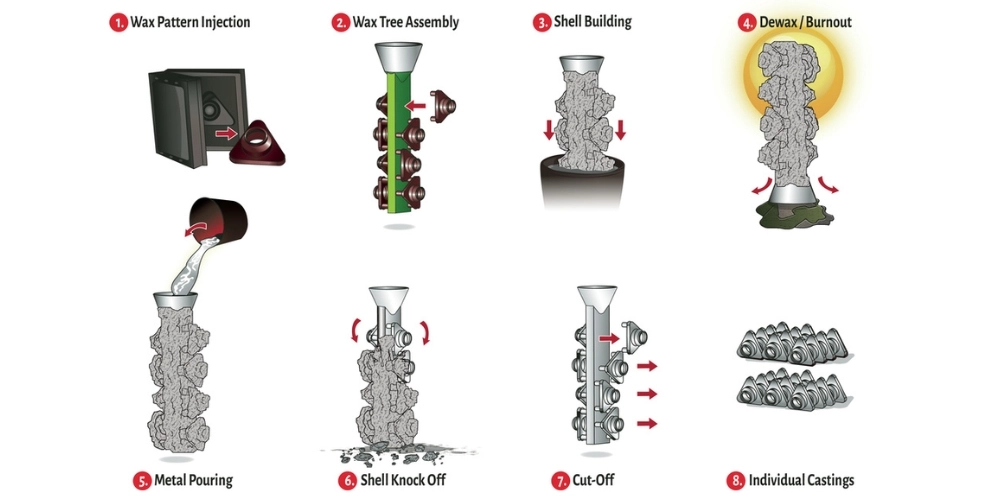{ width="800" }
    <figcaption>Foto de HDC Manufacturing: https://hdcmfg.com/wp-content/uploads/2024/03/Lost-Wax-Casting-2.webp</figcaption>
</figure>

Aquest procés consisteix en l'emmotlament d'un model inicial realitzat amb cera. La reproducció de la peça a "copiar" en cera es combina en un "arbre" de colada. Això es fa, ja que generalment el procés es realitza amb peces xicotetes perquè permet assolir tolerancies i acabats superficials bons. 

<figure markdown="span">
    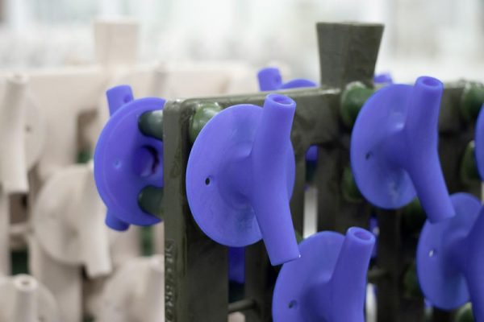{ width="800" }
    <figcaption>Foto de Lestercast: https://lestercast.co.uk/lost-wax-casting/</figcaption>
</figure>

Aquest "arbre", es recobreix amb material refractari, com guix o altre tipus de ceràmic.

<figure markdown="span">
    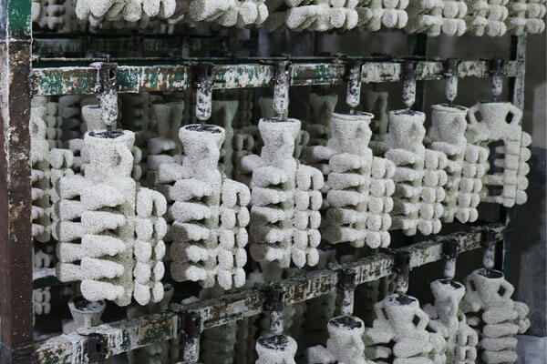{ width="800" }
    <figcaption>Foto de Langhe: https://langhe-industry.com/investment-casting-vs-sand-casting/</figcaption>
</figure>

Tot seguit, es passa pel forn a fi de fondre la cera de l'arbre i aconseguir només la "corfa" exterior del model. 

<figure markdown="span">
    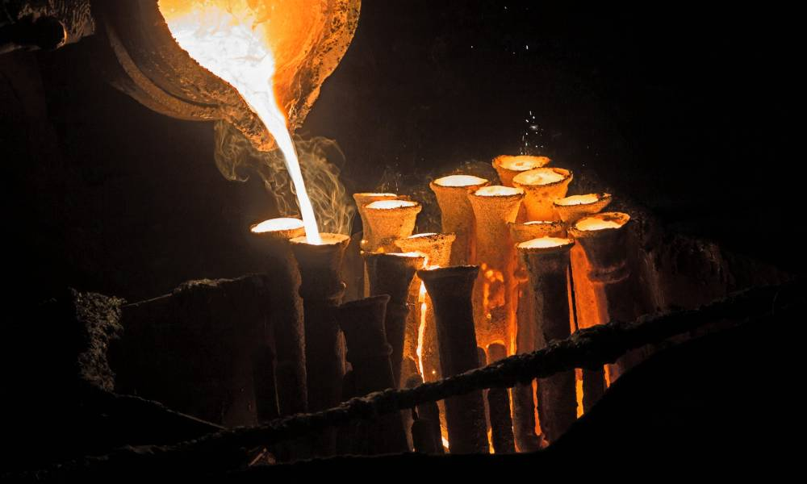{ width="800" }
    <figcaption>Foto de Uni Deritend Ltd: https://unideritend.com/lost-wax-casting-process/</figcaption>
</figure>

Finalment, amb la colada solidificada, es trenca la corfa, i es treballa la reproducció el metall de l'arbre. 

    <iframe src="https://www.youtube.com/embed/bBAkI78--cE?si=Vy898fkm7VIUe_-9" title="YouTube video player" frameborder="0" allow="accelerometer; autoplay; clipboard-write; encrypted-media; gyroscope; picture-in-picture; web-share" referrerpolicy="strict-origin-when-cross-origin" allowfullscreen style="position: absolute; top: 0; left: 0; width: 100%; height: 100%;"></iframe>

    <iframe src="https://www.youtube.com/embed/N2ZUu34i1ac?si=I0ZUWNagxx2d2I1x" title="YouTube video player" frameborder="0" allow="accelerometer; autoplay; clipboard-write; encrypted-media; gyroscope; picture-in-picture; web-share" referrerpolicy="strict-origin-when-cross-origin" allowfullscreen style="position: absolute; top: 0; left: 0; width: 100%; height: 100%;"></iframe>

    <iframe src="https://www.youtube.com/embed/LMeJ6eW4aVI?si=yp8Vw0XGKapdodZJ" title="YouTube video player" frameborder="0" allow="accelerometer; autoplay; clipboard-write; encrypted-media; gyroscope; picture-in-picture; web-share" referrerpolicy="strict-origin-when-cross-origin" allowfullscreen style="position: absolute; top: 0; left: 0; width: 100%; height: 100%;"></iframe>

## Sistemes

### Reproducció mitjançant motles. 

Els motles presenten una oportunitat una gran oportunitat per la reproducció de peces existents, puix que permeten fer sèries xicotetes. Gràcies als diversos tipus de silicona disponibles, la reproducció de peces és prou assolible. 

<figure markdown="span">
    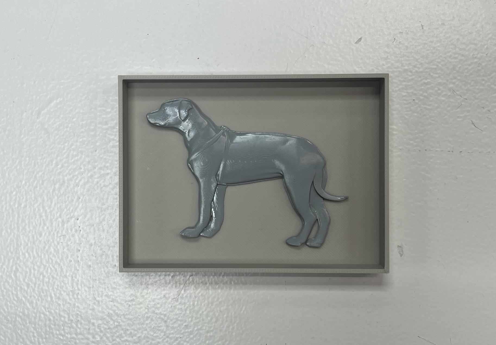{ width="400" }
    <figcaption>Foto de Simsi: https://fabacademy.org/2025/labs/barcelona/students/camila-simsiroglu/assignments/week%2013.html</figcaption>
</figure>

<figure markdown="span">
    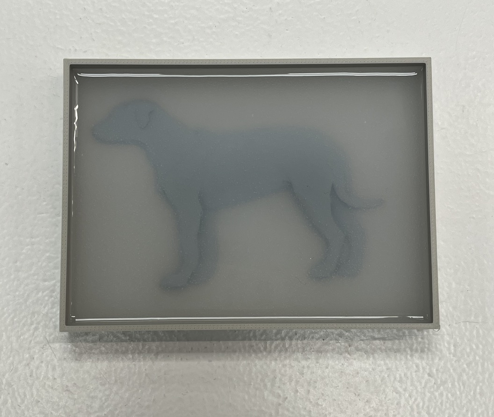{ width="400" }
    <figcaption>Foto de Simsi: https://fabacademy.org/2025/labs/barcelona/students/camila-simsiroglu/assignments/week%2013.html</figcaption>
</figure>

<figure markdown="span">
    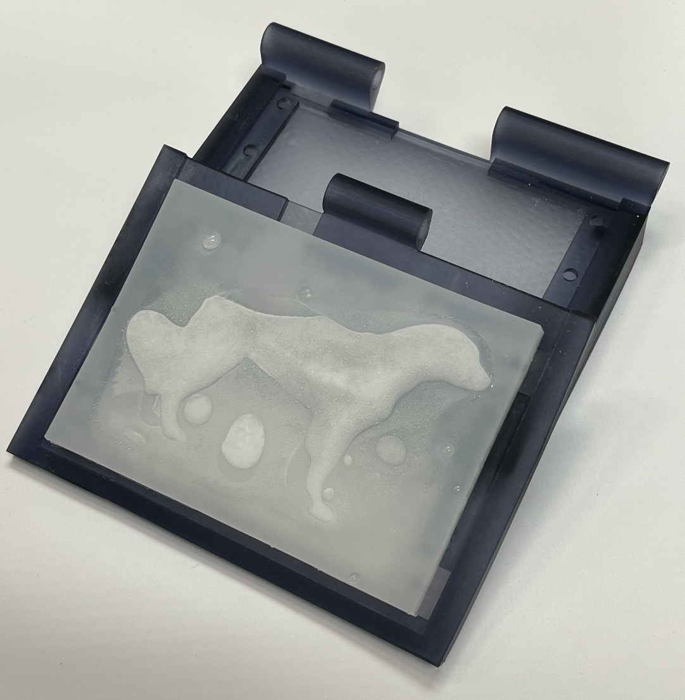{ width="400" }
    <figcaption>Foto de Simsi: https://fabacademy.org/2025/labs/barcelona/students/camila-simsiroglu/assignments/week%2013.html</figcaption>
</figure>

Ací un exemple de l'aplicació de la silicona per reproducció mitjançant colada de bismut.

    <iframe src="https://www.youtube.com/embed/dcGzK9Q7Gkw?si=s7EEA2beDiexv2mr" title="YouTube video player" frameborder="0" allow="accelerometer; autoplay; clipboard-write; encrypted-media; gyroscope; picture-in-picture; web-share" referrerpolicy="strict-origin-when-cross-origin" allowfullscreen style="position: absolute; top: 0; left: 0; width: 100%; height: 100%;"></iframe>

### Sistemes de separació de peces i normes generals per al traçat de juntes.

A l'hora de prototipar un motle, cal fer les següents comprovacions:

- Col·locar la línia al contorn màxim de la peça per facilitar l'extracció.
<figure markdown="span">
    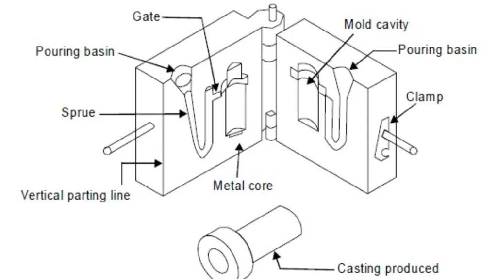{ width="800" }
    <figcaption>Foto de -: https://website-assets.studocu.com/img/document_thumbnails/56828ee1c8b3277aef56d1dbe3082a6a/thumb_1200_1553.png</figcaption>
</figure>
<figure markdown="span">
    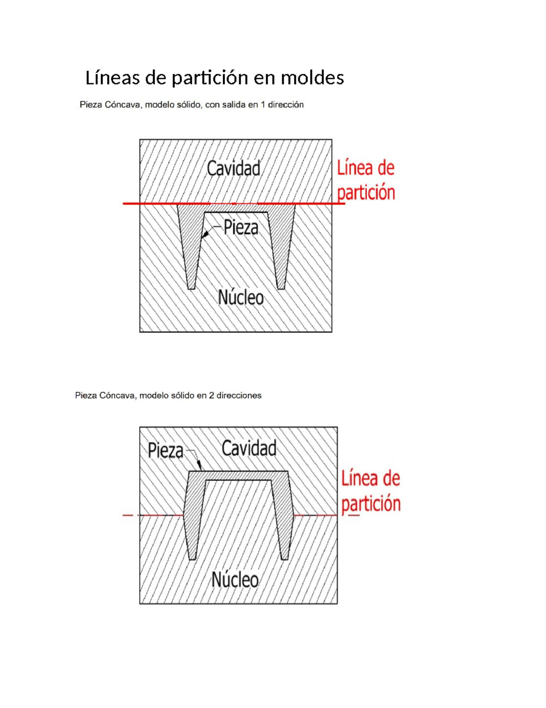{ height="400" }
    <figcaption>Foto de HITOP IND: https://hitopindustrial.com/it/stampaggio-a-iniezione-linea-di-separazione/</figcaption>
</figure>
Si escau, el motle caldrà partir-ho 
- Evitar contra sortides (undercuts) que impedisquen extreure la peça.
<figure markdown="span">
    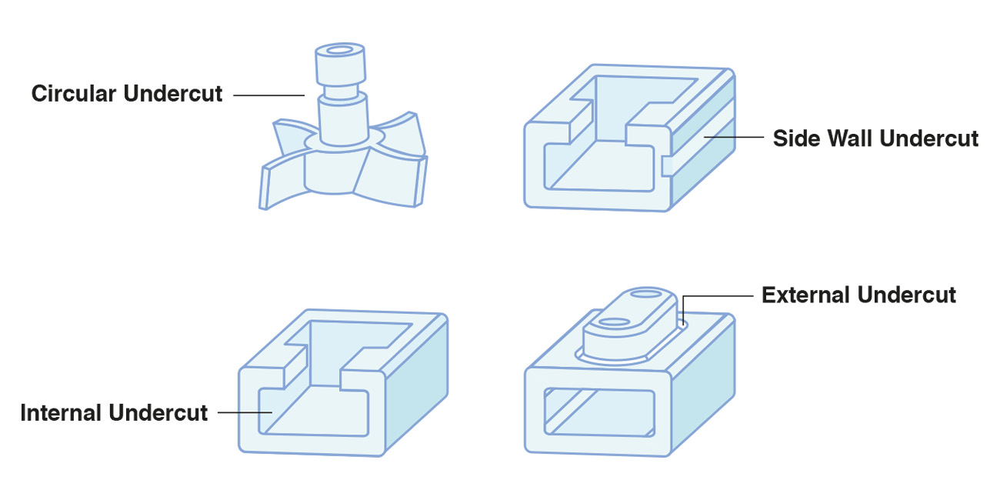{ width="800" }
    <figcaption>Foto de HLH Rapid: https://hlhrapid.com/knowledge/injection-moulding-undercuts/</figcaption>
</figure>
- Minimitzar les marques visibles posant la junta en zones poc importants estèticament. Tot i que aquesta línia pot treballar-se a posteriori.
<figure markdown="span">
    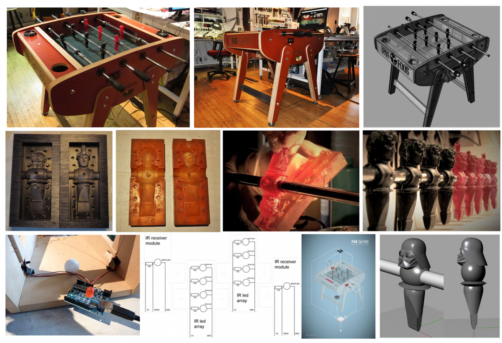{ width="800" }
    <figcaption>Foto de FabAcademy: https://fabacademy.org/2026/classes/molding_casting/foosball.png</figcaption>
</figure>
- Garantir angles de desmotllament adequats (entre 1° i 3° en fosa en arena; 0,5°–5° en injecció de polímers).
<figure style="display: flex; flex-direction: column; align-items: center; gap: 0.5rem;">
  

    
    
  

  <figcaption>Foto de Altair Inspire Cast User Guide: https://help.altair.com/cast/en_us/topics/cast/casting/select_demolding_axis_t.htm</figcaption>
</figure>

- Facilitar el segellat de les dues meitats per evitar rebaves.

Als contorns del motle, resulta interessant afegir algun sistema d'unió, amb l'objectiu d'aliniar les peces i també per intentar evitar les rebaves, uns dels problemes més habituals a l'hora de fer motles.

<figure markdown="span">
    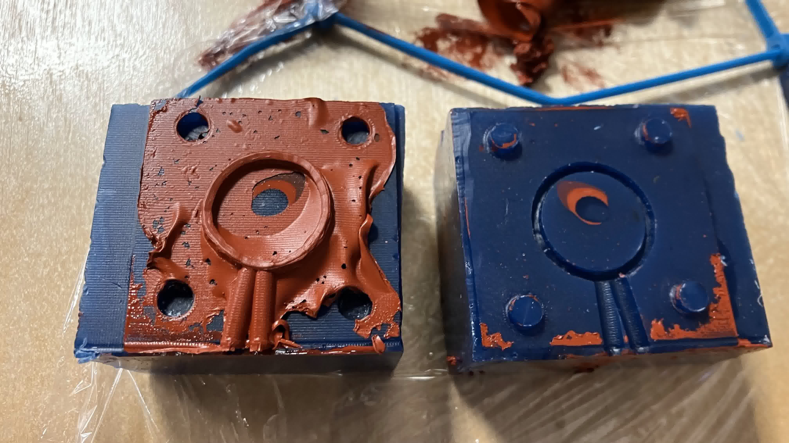{ width="800" }
    <figcaption>Foto de Katya Castellanos: https://fabacademy.org/2025/labs/barcelona/students/katya-castellanos/weeks/week13.html</figcaption>
</figure>

Habitualment es realitzen bé connexions per punts o bé per contorn, l'alineació per contorn és més recomanable per motles "DIY", ja que afavoreix una tanca que bloqueja que el líquid s'escape. Ací uns exemples:

<figure markdown="span">
    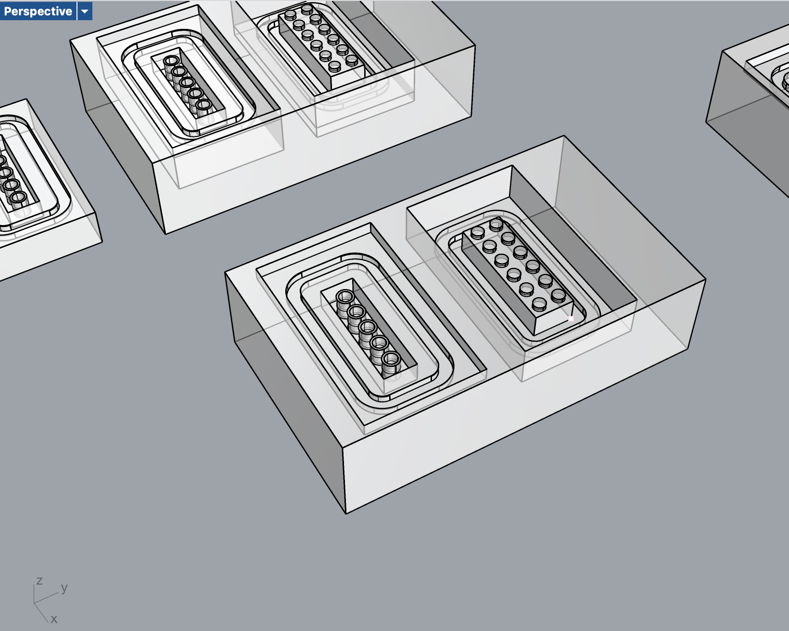{ width="800" }
    <figcaption>Producció propia</figcaption>
</figure>
<figure markdown="span">
    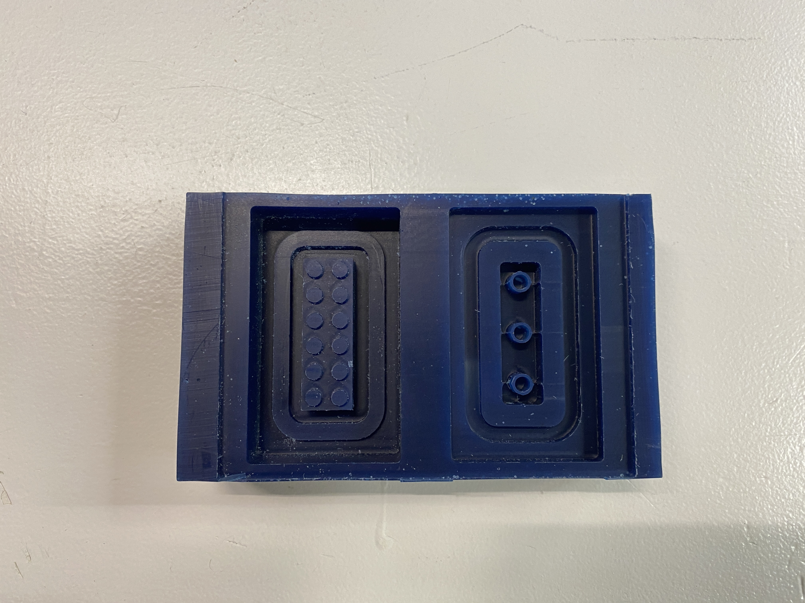{ width="800" }
    <figcaption>Producció propia</figcaption>
</figure>
<figure markdown="span">
    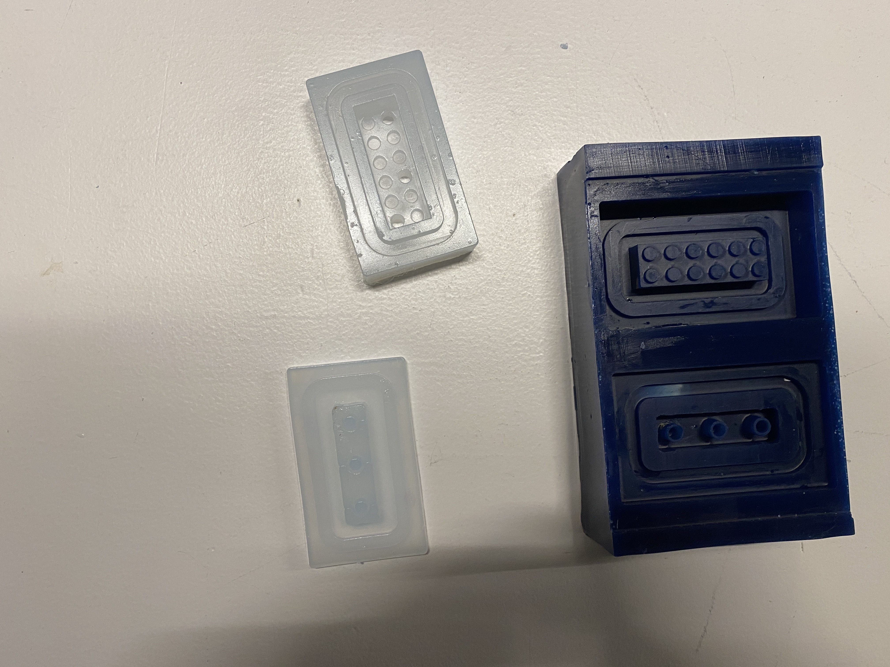{ width="800" }
    <figcaption>Producció propia</figcaption>
</figure>

### Els materials aïllants i adobadors. Greixos. Desblocadors.

### Motles per a ceràmica. Buidatge pels procediments de barbotina i estreta.

### Qualitat en peces foses: classificació de defectes i regles de disseny.

## Bibliografia

- Alianza Metalúrgica. (s.f.). Fundición en coquilla. https://www.alianzametalurgica.com/fundicion-en-coquilla/
- Boronat Vitoria, T., Ivorra Martínez, J., Quiles Carrillo, L. J., & Torres Giner, S. [Universitat Politècnica de València - UPV]. (2021, 27 de març). Moldeo en arena verde [Vídeo]. YouTube. https://youtu.be/FIgRubIrEnc
- Dawang Metals. (s.f.). Sand casting design considerations. https://dawangmetals.com/es/resources/sand-casting-design-considerations/
- Dawang Metals. (s.f.). Types of sand used in casting. https://dawangmetals.com/es/resources/types-of-sand-used-in-casting/
- Fab Academy. (2024). Molding and casting. The Center for Bits and Atoms (CBA), MIT. https://academy.cba.mit.edu/classes/molding_casting/index.html
- FirstMold. (s.f.). What is a parting line? https://firstmold.com/guides/what-is-a-parting-line/
- Instituto Nacional de Tecnología Industrial (INTI). (s.f.). Guía de procesos de fundición. https://www.inti.gob.ar/assets/uploads/files/rafaela/01/Guia-de-procesos-de-fundicion.pdf
- Reig Pérez, M. J. [Universitat Politècnica de València - UPV]. (2018, 22 d'octubre). Fundamentos de los procesos de fundición de metales [Vídeo]. YouTube. https://youtu.be/-EuZoQcHX0A
- Reig Pérez, M. J. [Universitat Politècnica de València - UPV]. (2018, 22 d'octubre). Fundición en arena [Vídeo]. YouTube. https://youtu.be/Dj3IjAELAF0
- Reig Pérez, M. J. [Universitat Politècnica de València - UPV]. (2018, 22 d'octubre). Fundición en molde permanente [Vídeo]. YouTube. https://youtu.be/lrIecu0Dz0o
Masferrer, V. [Universitat Oberta de Catalunya - UOC]. (2020) – Art Toolkit: Tècniques de buidat. https://recurs.uoc.edu/art-toolkit/tecniques-buidar/
- Viquipèdia. (s.f.). Motlle. https://ca.wikipedia.org/wiki/Motlle
- ZWSOFT. (s.f.). Mold design. https://www.zwsoft.com/latam/blog/mold-design