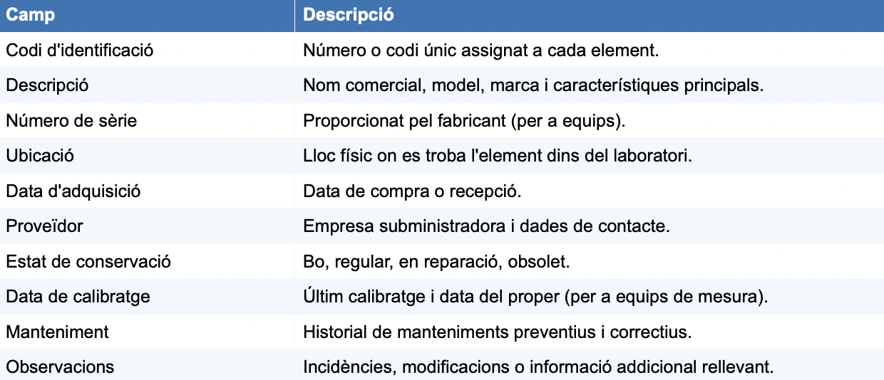
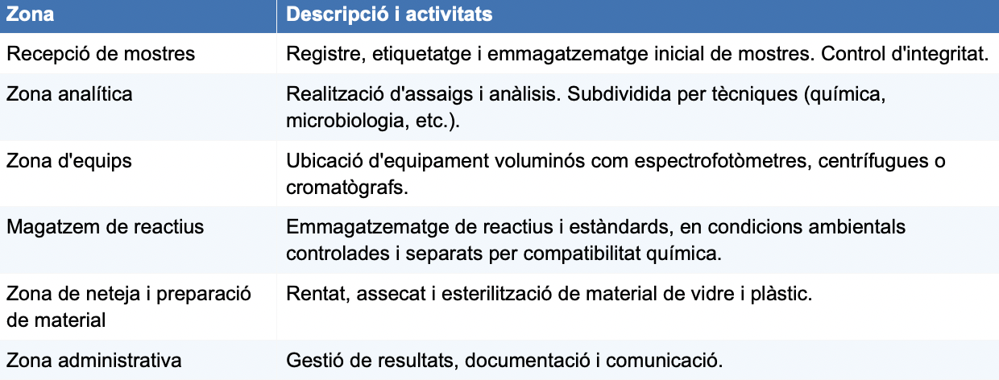
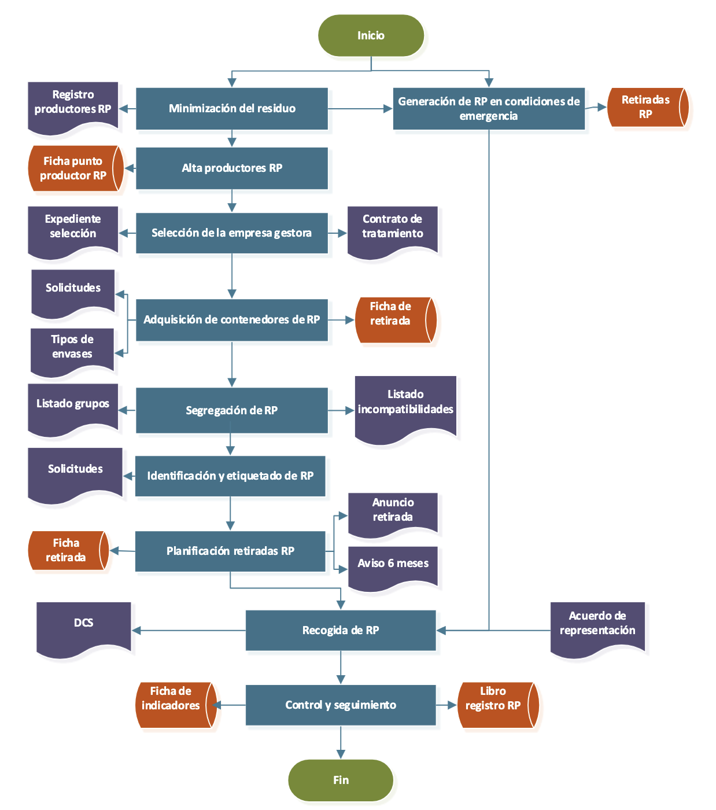

# Control de qualitat i gestió de laboratori

## Control de qualitat en processos de fabricació

L'objectiu dels processos d'inspecció durant la producció és comprobar que la qualitat del producte fabricat compleix els nivells i especificacions establers *a priori*.

Per assegurar que els processos de fabricació es desevolupen de forma controlada i amb l'objectiu de previndre l'aparició de no conformitats respecte de les especificacions inicials, és imperatiu implementar un mètode de control de la producció.

Per crear un mètode, caldrà definir les cracterístiques de la qualitat que es vegen a examinar durant la fabricació. 

Caldrà també, determinar com s'examinaràn les característiques i la freqüencia amb la qual s'extrauran peces de la línia de muntatge per la seua inspecció.

Per cada control definit s'establirà un **Registre de control del procés** on queden registrats els resultats obtinguts.

Es realitzaran mesures en cas que hi haja característiques que puguen ser susceptibles de ser-ho. Per fer-ho s'utilitzaràn peus de rei correctament calibrats. Al plà s'hauran determinat les toleràncies que es busca assolir i posteriorment a la mesura s'afegirà el valor al registre.

### Inspecció i anàlisi de defectes

Caldrà determinar una escala com la següent una vegada es puga comprobar si la producció "quadra" amb els objectius inicials: A (Acceptar), R (Rebutjar) o D (Acceptar amb disconformitat).

Es pararà inmediatament el rpocés de producció en cas que:

- Alguna de les mesures estiguès fora de les toleràncies admeses o no coincidira amb els valors de referència establerts.

- L'aspecte de la peça no fos l'adequat.

- Hi haguès algun defecte en la conformació de la peça.

Una vegada es faça açò, les referències utilitzades per prendre la decisió seràn segregades i identificades.

## Gestió del laboratori

### Inventari

L'inventari del laboratori és el registre sistemàtic i actualitzat de tots els béns materials, instruments, substàncies i equipaments que formen part del laboratori. Constitueix una eina de gestió essencial que permet:

- Conèixer en tot moment la dotació material disponible.

- Planificar les adquisicions i substitucions necessàries.

- Controlar l'ús i l'estat de conservació dels materials.

- Justificar despeses i inversions davant de l'administració o l'empresa.

- Complir amb els requisits legals i normatius (gestió de substàncies perilloses, equips mèdics, etc.).

- Facilitar les auditories internes i externes del sistema de qualitat.

!!! info "Requisit normatiu (ISO 17025:2017)"
    L'apartat 6.4 de la norma ISO 17025:2017 estableix que el laboratori ha de disposar de procediments per al control de tots els equips, inclosos els de mesura i assaig, i ha de mantenir registres que demostrin el seu ús adequat i la seva traçabilitat metrològica.

#### Tipus de material inventariable

Els materials objecte d'inventari en un laboratori es poden classificar en diverses categories:

**A) Material no fungible o inventariable**

Inclou tots els béns d'una certa durabilitat i valor econòmic que no s'esgoten amb l'ús habitual:

- Equipament i instrumentació: balances analítiques, espectrofotòmetres, pH-metres, cromatògrafs, microscopis, autoclaus, centrífugues, etc.

- Material de vidre de precisió: matrins aforats, buretes, pipetes aforades, erlenmeyers.

- Mobiliari de laboratori: taules de treball, vitrines de gasos, armaris de seguretat, neveres i congeladors.

- Equips informàtics: ordinadors, sistemes LIMS (Laboratory Information Management System), impressores d'etiquetes.

**B) Material fungible o de consum**

Inclou els materials que s'esgoten o consumeixen durant l'activitat del laboratori:

- Reactius i productes químics: àcids, bases, dissolvents, indicadors, estàndards.

- Material de plàstic d'un sol ús: tubs d'assaig, Eppendorfs, puntes de pipeta, guants.

- Material de vidre d'un sol ús o de recanvi: vasos de precipitats, pipetes Pasteur.

- Substàncies de referència i patrons: materials certificats per a calibratge i verificació.

- Kits comercials i reactius específics per a determinades anàlisis.

**C) Mostres i material biològic**

En funció del tipus de laboratori, pot ser necessari inventariar les mostres biològiques rebudes o produïdes, amb informació sobre la seva procedència, condicions d'emmagatzematge i data de caducitat.

#### Registre d'inventari

<figure markdown="span">
    { width="600" }
    <figcaption>Producció pròpia</figcaption>
</figure>

### Manteniment 

El manteniment del laboratori comprèn totes les accions encaminades a conservar les instal·lacions, els equips i el material en condicions òptimes de funcionament, seguretat i higiene. Una política de manteniment adequada garanteix la continuïtat de l'activitat, prolonga la vida útil dels equips i contribueix a la qualitat dels resultats analítics.

#### Manteniment preventiu

El manteniment preventiu consisteix en la realització d'intervencions planificades sobre els equips i instal·lacions per previndre avaries i deterioraments. Es du a terme d'acord amb un calendari preestablert, independentment de l'estat aparent dels elements.

Les activitats de manteniment preventiu inclouen:

- Neteja periòdica d'equips i instal·lacions.

- Substitució programada de peces desgastades o consumibles (filtres, làmpades, sals de calibratge, etc.).

- Lubricació i revisió mecànica d'equips amb parts mòbils.

- Verificació del funcionament dels sistemes de seguretat (botons d'emergència).

- Comprovació dels sistemes de ventilació i de les vitrines de gasos.

- Revisió de les instal·lacions elèctriques i de gas.

El manteniment preventiu ha de quedar degudament documentat en fitxes o registres específics, que formin part del sistema de qualitat del laboratori.

#### Manteniment correctiu

El manteniment correctiu és la reparació d'avaries o deficiències detectades durant el funcionament dels equips. Pot ser:

- Immediat: la reparació es realitza en el moment de detectar l'avaria, sense interrompre l'activitat.

- Diferit: la reparació es programa per a un moment posterior, quan es disposa dels recursos necessaris o quan el funcionament del laboratori ho permet.

Tota intervenció correctiva ha de quedar registrada, indicant la data, la naturalesa de l'avaria, les accions realitzades i el responsable de la intervenció. Quan l'avaria afecta un equip de mesura, cal avaluar si els resultats obtinguts durant el període de malfuncionament són vàlids, i, si escau, comunicar-ho als clients o afectats.

#### Calibratge i verificació metrològica

!!! info "Conceptes clau: exactitud i precisió"
    L'exactitud és la proximitat entre el valor mesurat i el valor veritable. La precisió és el grau de concordança entre mesures repetides del mateix mesurament. Un instrument pot ser precís sense ser exacte (error sistemàtic), i exacte sense ser sempre precís (error aleatori).

### Organització

L'organització d'un laboratori engloba la planificació, distribució i coordinació dels recursos espacials, instrumentals i humans per optimitzar l'eficiència i seguretat en el treball.

La distribució física del laboratori ha de satisfer criteris de seguretat, ergonomia i funcionalitat. La Norma UNE-EN ISO 17025 estableix que les condicions ambientals (temperatura, humitat, lluminositat, contaminació acústica i electromagnètica) han d'estar controlades i registrades per garantir la validesa dels resultats.

Els aspectes clau en la distribució espacial inclouen:
- Separació d'àrees incompatibles: les zones on es manipulen substàncies perilloses o mostres infeccioses han d'estar físicament separades de les àrees generals.

- Accessibilitat i circulació: els passadissos han de permetre la circulació segura del personal i l'evacuació en cas d'emergència.

- Il·luminació adequada: natural i artificial, amb nivells suficients per a cada tipus de tasca.

- Ventilació: sistemes de ventilació general i localitzada (vitrines de gasos) per evitar l'acumulació de vapors i gasos nocius.

Un laboratori ben organitzat disposa de zones diferenciades per a cada tipus d'activitat:

<figure markdown="span">
    { width="600" }
    <figcaption>Producció pròpia</figcaption>
</figure>

La gestió del laboratori requereix una estructura organitzativa clara. Les responsabilitats habituals en un laboratori públic o privat s'articulen arran de les figures següents:

- Cap o director de laboratori: responsable de la gestió global, acreditació i representació davant d'organismes externs.

- Responsable tècnic: supervisa els mètodes analítics, la qualitat dels resultats i la formació del personal.

- Tècnics de laboratori: executen els assaigs i anàlisis, mantenen els registres i cuiden els equips.

- Auxiliars de laboratori: preparen el material, gestionen residus i realitzen tasques de suport.

Cada membre del personal ha de tenir una descripció clara de les seves funcions, que ha de recollir-se en els procediments normalitzats de treball (PNT) del sistema de qualitat.

## Gestió ambiental i de residus a la Universitat Politècnica de València. [Normativa aplicable](http://www.upv.es/medioambiente)

### Ambiental

La Universitat Politècnica de València assumeix els compromisos de:

- Conèixer, avaluar i minimitzar tots els impactes ambientals derivats de les seues activitats, a fi de controlar, prevenir i reduir els impactes adversos, potenciant i difonent els impactes positius.

- Complir els requisits legals ambientals i altres requisits d’aplicació a la universitat relacionats amb els aspectes ambientals.
    
- Propiciar una formació ambiental adequada a tot l’alumnat, i promoure la formació i conscienciació sobre el canvi climàtic en tots els nivells educatius obligatoris i no obligatoris, repensant la nostra manera d’organitzar-nos, els nostres models de consum, energia, turisme i mobilitat sostenible, sent conscients que els recursos del planeta són limitats, amb l’objectiu d’enfortir la resiliència humana per a adaptar-nos als riscos relacionats amb el canvi climàtic.
    
- Informar, formar i sensibilitzar ambientalment a totes les persones membres de la comunitat universitària.
    
- Millorar contínuament el sistema de gestió ambiental per a optimitzar el comportament ambiental de la universitat.
    
- Ajudar a millorar les actuacions ambientals de les persones que, alienes a la universitat, desenvolupen activitat en les seues dependències o per als seus centres, com també amb altres entitats públiques i privades.
    
- Vetlar perquè els seus campus siguen climàticament sostenibles, mitjançant el desenvolupament d’una Estratègia de mitigació i adaptació al canvi climàtic, i compartint el seu coneixement amb la societat per a fer front a l’emergència climàtica i els seus efectes.
    
- Contribuir al full de ruta mediambiental de les ciutats o els territoris on la universitat s’assenta mitjançant la transferència de coneixement en matèria mediambiental.

La UPV es compromet a mantenir el seu sistema de gestió ambiental –homologat al Reglament europeu d’ecogestió i ecoauditoria (EMAS)– i la norma UNE EN ISO 14001, i en conseqüència, establir objectius ambientals exigents, accessibles al públic, controlant-ne els progressos de manera contínua, elaborant declaracions ambientals anuals, que seran públiques, i difonent-les tant a la comunitat universitària com a la resta de la societat.

### Residus

Oberón és la base de dades informàtica que emmagatzema tota la informació recollida
com a resultat del funcionamient del Sistema de Gestió Ambiental.

La UMA és la Unitat de Medi Ambient encarregada de les gestions. 

<figure markdown="span">
    { width="600" }
    <figcaption>Foto de Universitat Politècnica de València: https://www.upv.es/entidades/amapuoc/download/20498</figcaption>
</figure>

La generació de RP és conseqüència de l'activitat docent i investigadora que es desenvolupa en la UPV, per la qual cosa cadascun dels campus de la universitat (Alcoi, Gandia i Vera) està inscrit en el registre de petits productors de residus perillosos en la Conselleria amb competències en medi ambient.

Quan algun membre de la comunitat universitària desenvoluparà per primera vegada una activitat el resultat de la qual és la generació de RP, es planteja, la possibilitat de:

– Evitar utilitzar productes nocius per al medi ambient substituint-los per uns altres més respectuosos amb la naturalesa.

– Minimitzar la seva producció reduint la quantitat de productes o reactius adquirits i consumits, o bé reutilitzant (tornar a emprar el producte per al mateix fi per al qual va ser dissenyat).

Abans de generar el RP, el seu productor/a ho ha comunica a l'UMA que el dona d'alta a Oberón.

Per seleccionar l'empresa que retira els RP de la UPV, cada dos anys, el personal tècnic de la UMA realitza el Plec de condicions tècniques. El personal tècnic de la UMA, juntament amb el Servei de contratació, selecciona a l'empresa sent imperatiu que, tant l'empresa gestora com l'empresa transportista de *RP, estiguen autoritzades per l'administració competent. La contractació de l'empresa pot ser prorrogada per dos anys més.

L'empresa gestora de RP és l'encarregada de subministrar els envasos buits a els/les productors/as de RP **el mateix dia** que es realitza la retirada de RP. 

De manera extraordinària, el/la productor/a pot sol·licitar envasos buits realitzant una sol·licitud de bidons a través de la intranet. En aquest cas, o bé, el/la productor/a pansa a recollir els envasos buits en la UMA, o bé, el personal de la UMA, envia per correu electrònic una autorització per a la retirada de bidons

D'altra banda, quan els/les productors/as de RP situats al campus d'Alcoi i de Gandia ho considerin necessari a causa de la seva localització, poden sol·licitar l'enviament d'una determinada quantitat i tipus de contenidors de RP.

La correcta segregació i envasament de RP és responsabilitat del/de la productor/a, per la qual cosa ha de conèixer la classificació en grups de RP de la UPV, així

El/la productor/a de RP és el/la responsable d'identificar els recipients destinats a contenir aquests residus mitjançant una etiqueta subministrada per l'empresa gestora que inclou la informació que estableix la legislació corresponent. A més, les etiquetes presenten un codi de color per a facilitar la seguretat en l'emmagatzematge dels residus (cada família/color s'emmagatzemarà per separat una d'una altra).

El temps d'emmagatzematge dels RP, per part d'els/les productors/as, **no pot excedir de sis mesos**.

**Mensualment**, el personal tècnic de la UMA juntament amb l'empresa gestora autoritzada estableix les dates i lots a retirar i introdueix les retirades en Oberón

En el cas de produir-se una situació d'emergència amb generació de RP l'empresa gestora procedeix a retirar els residus generats. La retirada d'aquests residus es pot realitzar instantàniament (dins de les 24 hores posteriors a l'emergència) o es poden emmagatzemar els RP generats i incloure'ls en la retirada del lot corresponent.

[Guia de residus](https://www.upv.es/entidades/amapuoc/va/guia-de-residus/)

## Bibliografia

- https://youtu.be/pX-0ar_4hBI?si=RYBan0AUhktTESLs
- http://www.upv.es/medioambiente
- https://www.upv.es/entidades/amapuoc/va/guia-de-residus/
- https://www.upv.es/entidades/amapuoc/download/19891
- https://www.upv.es/entidades/amapuoc/download/20498
- https://www.upv.es/entidades/amapuoc/download/20221
- https://www.upv.es/entidades/amapuoc/va/abocaments/