# Seguretat i salut

El risc d'un projecte és qualsevol esdeveniment o condició incerta que en cas de produir-se puga tindre un efecte positiu o negatiu en algun dels objectius del projecte.

La seguretat laboral abasta el conjunt de mesures, procediments i polítiques dissenyades per a protegir els treballadors d'accidents, lesions i malalties relacionades amb les seves activitats professionals. S'inclou des de la identificació de perills fins a la implementació de controls preventius. Un entorn laboral segur compleix amb les normatives de seguretat.

La seguretat i salut dels llocs de treball, són regulades per llei.

<figure markdown="span">
    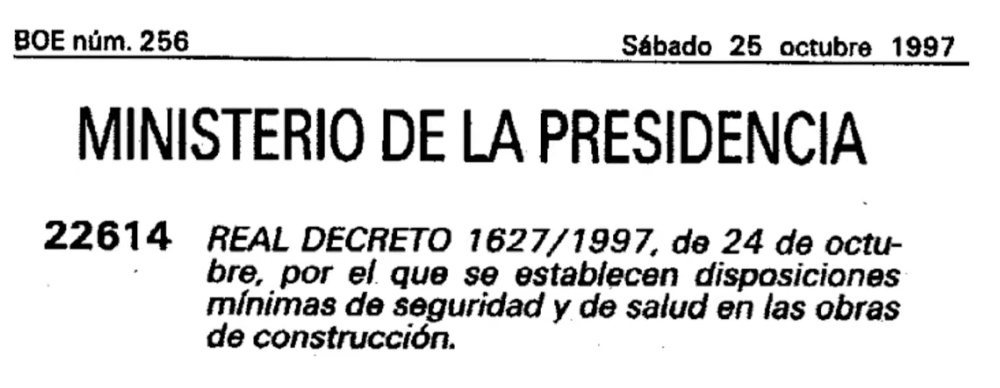{ width="600" }
    <figcaption>Foto de Universitat Politècnica de València: https://youtu.be/FNdyHJaTJeQ?si=qKdm6kIvbklLeXdr</figcaption>
</figure>

La prevenció de riscos laborals es basa en un enfocament que identifica, avalua i controla els perills presents en l'ambient de treball. El procés comença amb l'avaluació de riscos, on s'analitzen les activitats laborals per a detectar factors que puguen causar mal. Una vegada identificats, es classifiquen segons la seva probabilitat d'ocurrència i gravetat potencial. Posteriorment, s'estableixen mesures de control seguint una jerarquia: eliminació del perill, substitució per alternatives més segures, controls d'enginyeria, controls administratius i, com a última opció, l'ús d'equips de protecció personal.

Per la protecció individual es fan servir EPIs.

Els **Equips de Protecció Individual (EPI’s)** són aquells destinats a ser portats o subjectats pel treballador perquè li protegeisca d'un o diversos riscos; queden exclosos d'aquest concepte la roba de treball no dissenyada específicament per a la protecció contra els riscos i alguns equips especials com ara els de socors i salvament o el material esportiu.

La reglamentació en vigor classifica els EPI’s en **tres categories**, segons el nivell de gravetat dels riscos enfront dels quals protegeixen:

- Categoria I. Risc baix o mínim. Quan l'usuari puga jutjar per si mateix la seva eficàcia i puga percebre per si mateix i a temps, sense perill per a l'usuari, els efectes dels regs quan aquests són graduals.

- Categoria II. Risc mitjà o greu. Els que no pertanyen a les altres dues categories.

- Categoria III. Risc alt, molt greu o mortal. Els destinats a protegir de tot risc mortal o que puga danyar greument i de manera irreversible la salut, sense que es pugui descobrir a temps el seu efecte immediat.

Els EPI’s han de disposar del marcatge CE de conformitat, pel qual es garanteix que el fabricant compleix amb els requisits, exàmens de conformitat i controls de qualitat exigibles. Aquest marcat depèn de la categoria del EPI:

- Categoria I. Només marcat: CE

- Categoria II. Marcat i any de col·locació del marcat: CE 96

- Categoria III. Marcat, any de col·locació del marcat i número distintiu de l'Organisme Notificador: CE 96 *YYYY

## Protecció en laboratoris i tallers

Per entendre els riscos associats al taller s'utilitzarà el següent esquema de classificació de les zones d'una màquina:

<figure markdown="span">
    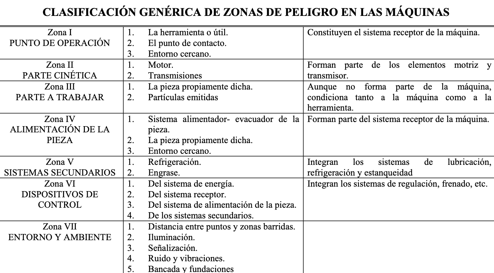{ width="600" }
    <figcaption>Foto de Universitat Politècnica de València: https://www.sprl.upv.es/pdf/Gu%EDa%20pr%E1cticas%20alumnos%20riesgos%20mec%E1nicos.pdf</figcaption>
</figure>

Les eines utilitzades es classificaran de la següent forma:

<figure markdown="span">
    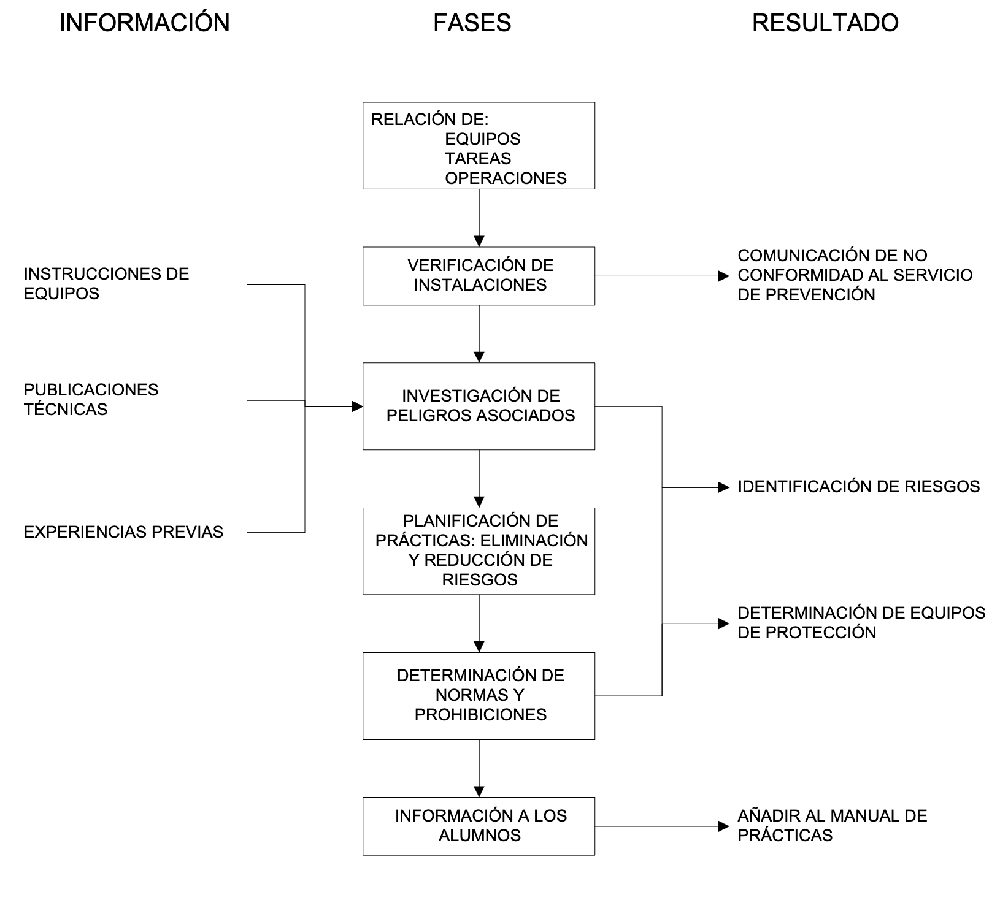{ width="600" }
    <figcaption>Foto de Universitat Politècnica de València: https://www.sprl.upv.es/pdf/Gu%EDa%20pr%E1cticas%20alumnos%20riesgos%20mec%E1nicos.pdf</figcaption>
</figure>

En totes les màquines s'inclouran indicacions per saber quines proteccions cal utilitzar. Ací uns exemples:

<figure markdown="span">
    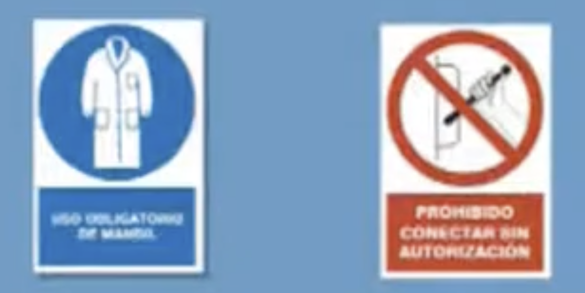{ width="600" }
    <figcaption>Foto de Universitat Politècnica de València: https://youtu.be/9tlZSSQPjGY?si=gO4enXGX0l89eJDC</figcaption>
</figure>

Mentre s'utilitza la serra de disc:

<figure markdown="span">
    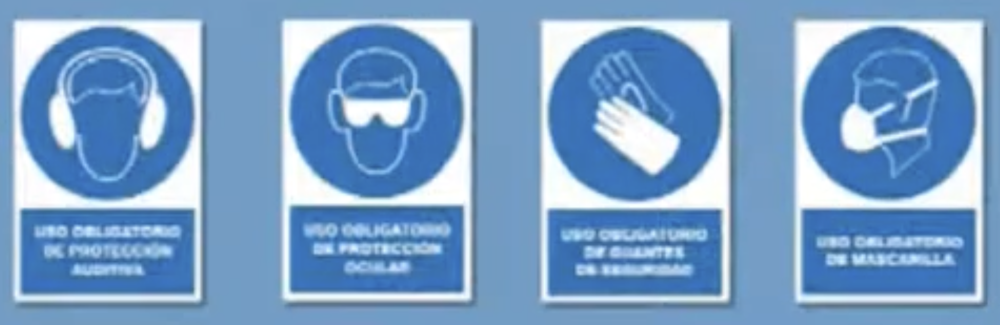{ width="600" }
    <figcaption>Foto de Universitat Politècnica de València: https://youtu.be/9tlZSSQPjGY?si=gO4enXGX0l89eJDC</figcaption>
</figure>

A la fresa de mà:

<figure markdown="span">
    { width="600" }
    <figcaption>Foto de Universitat Politècnica de València: https://youtu.be/9tlZSSQPjGY?si=gO4enXGX0l89eJDC</figcaption>
</figure>

A la radial:

<figure markdown="span">
    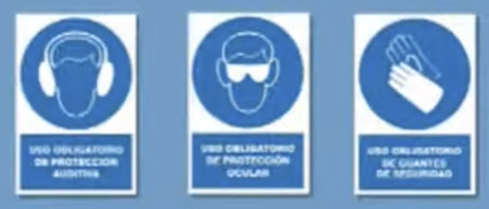{ width="600" }
    <figcaption>Foto de Universitat Politècnica de València: https://youtu.be/9tlZSSQPjGY?si=gO4enXGX0l89eJDC</figcaption>
</figure>

Mentre s'utilitza la caladora:

<figure markdown="span">
    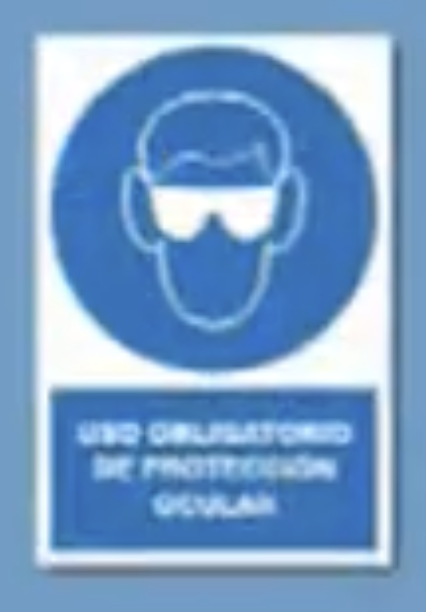{ width="600" }
    <figcaption>Foto de Universitat Politècnica de València: https://youtu.be/9tlZSSQPjGY?si=gO4enXGX0l89eJDC</figcaption>
</figure>

Amb la fregadora de disc:

<figure markdown="span">
    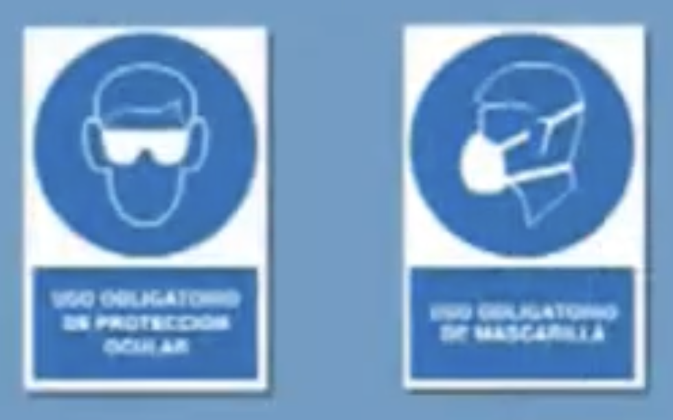{ width="600" }
    <figcaption>Foto de Universitat Politècnica de València: https://youtu.be/9tlZSSQPjGY?si=gO4enXGX0l89eJDC</figcaption>
</figure>

Mentre s'usa el torn mecànic i la fresadora:

<figure markdown="span">
    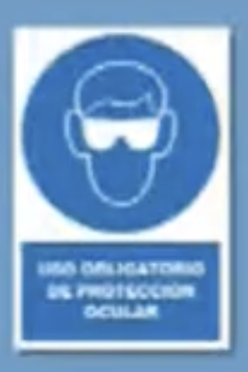{ width="600" }
    <figcaption>Foto de Universitat Politècnica de València: https://youtu.be/9tlZSSQPjGY?si=gO4enXGX0l89eJDC</figcaption>
</figure>

### Riscos mecànics

Els riscos mecànics deriven del contacte amb parts mòbils de màquines, eines o fragments projectats. Es produeixen principalment en zones perilloses de l'equip: la zona de treball (on actua l'eina), les zones de transmissió (corretges, engranatges, eixos) i les zones d'accés o manteniment.
Les formes de materialització més habituals inclouen atrapaments, talls, cops, perforacions i projeccions de fragments. Per minimitzar aquests riscos cal:

- Utilitzar resguards i proteccions fixos o mòbils sobre les parts perilloses de la màquina.

- No retirar mai els elements de protecció durant el funcionament.

- Mantenir les eines en bon estat i utilitzar-les únicament per a la funció prevista.

- Usar els EPIs adequats: ulleres de protecció, guants resistents a talls, calçat de seguretat i casc si escau.

- Seguir les indicacions de protecció específiques de cada màquina (tal com s'indica als pictogrames mostrats en l'apartat anterior).

### Riscos elèctrics 

La major utilització entra dins del camp de les eines elèctriques. Aquestes presenten, a més dels riscos propis de les eines manuals, els propis del corrent elèctric, classificant-se d'acord amb el seu grau de protecció en:

- Eines de Classe I: el seu grau d'aïllament assegura el funcionament de l'eina i la protecció enfront de contactes elèctrics directes, podent portar connexions a terra.

- Eines de Classe II: mitjançant un doble aïllament o un aïllament reforçat s'aconsegueix un aïllament complet, sense connexió a terra. Es distingeixen perquè porten el símbol de doble aïllament en la placa de característiques.

- Eines de Classe III: previstes per a ser alimentades a molt baixa tensió (inferior a 50 V o 24 V).

Les mesures preventives fonamentals inclouen revisar el cablejat i les connexions abans d'usar qualsevol equip elèctric, no manipular instal·lacions amb mans humides ni en superfícies mullades, desconnectar sempre l'eina de la xarxa elèctrica abans de realitzar canvis d'accessoris o tasques de manteniment, i utilitzar protecció diferencial i posada a terra en les instal·lacions del taller.

### Riscos químics

#### Mesures de seguretat bàsica 

1. Localitza els dispositius de seguretat situats en el laboratori.

2. Llegeix les etiquetes de seguretat.

<figure markdown="span">
    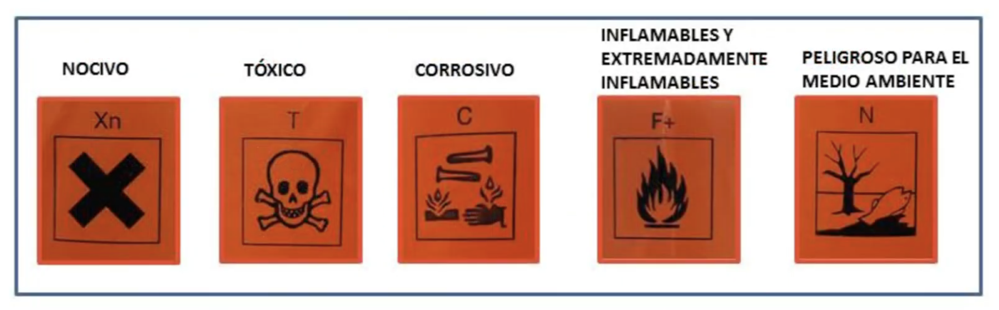{ width="600" }
    <figcaption>Foto de Universitat Politècnica de València: https://youtu.be/ZGp5PcPSMpM?si=29UAn_kUMMMgii7r</figcaption>
</figure>

3. L'ús de la bata és obligatori.

<figure markdown="span">
    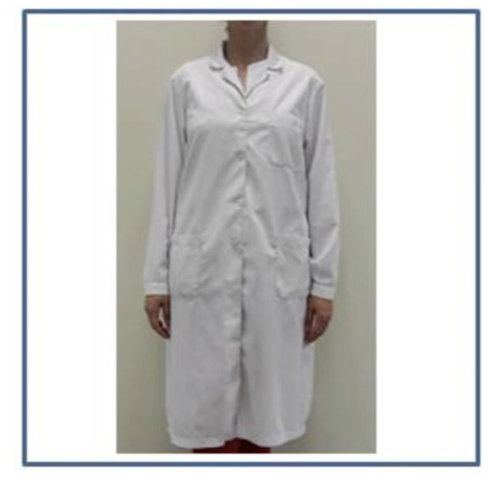{ width="600" }
    <figcaption>Foto de Universitat Politècnica de València: https://youtu.be/ZGp5PcPSMpM?si=29UAn_kUMMMgii7r</figcaption>
</figure>

4. No portar pantalons o faldilla curta.

5.  Portar sabates tancades.

6.  Portar els cabells recollits.

<figure markdown="span">
    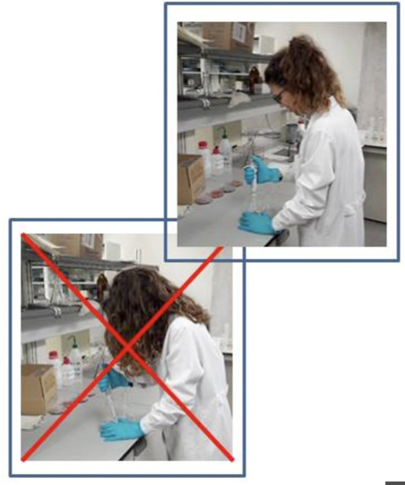{ width="600" }
    <figcaption>Foto de Universitat Politècnica de València: https://youtu.be/ZGp5PcPSMpM?si=29UAn_kUMMMgii7r</figcaption>
</figure>

7. No s'ha d'usar joies.

8. Usar guants adequats (de resistència a esquitxades químiques termoaïllants...).

9. Obligatori usar ulleres de seguretat.

10. No portar mai lents de contacte.

11. Ús de màscares.

12. Mai pipeteges amb la boca.

13. No utilitzar cap flascó de reactiu que hagi perdut la seva etiqueta.

14. Etiquetar apropiadament tots els recipients

15. Mai treballi només en el laboratori.

16. Mai ha de treure substàncies químiques del laboratori sense autorització.

#### Procediment de l'Activitat amb Ordre i Neteja

- L'ordre en la zona de treball és fonamental per a evitar accidents. 

- Cal mantindre les taules i vitrines extractores sempre netes.

- S'han de netejar immediatament tots els productes químics vessats.

- Cal netejar sempre perfectament el material i aparells després del seu ús.

- Quan s'escalfen de líquids, cal dirigir la boca del recipient en direcció contrària a un mateix i a les altres persones.

- No transportes innecessàriament els reactius d'un lloc a un altre del laboratori.

- Les ampolles es transporten sempre agafant-les pel fons, mai del tap.

<figure markdown="span">
    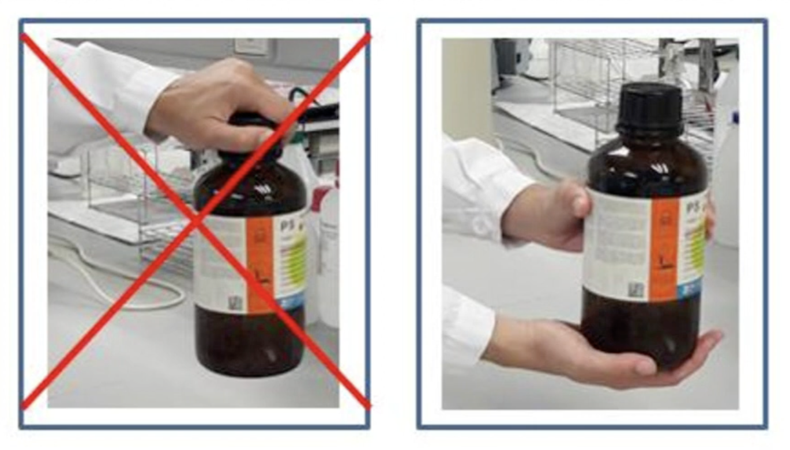{ width="600" }
    <figcaption>Foto de Universitat Politècnica de València: https://youtu.be/ZGp5PcPSMpM?si=29UAn_kUMMMgii7r</figcaption>
</figure>

#### Actuacions Responsables

- Treballa sense presses i amb el material necessari i reactius ordenats.

- S'ha de seguir un comportament responsable mentre s'estigua al laboratori.

- Un comportament irresponsable pot ser motiu d'expulsió immediata del laboratori.

#### Residus

Els eactius i productes de reacció després de finalitzar la pràctica es considerenRESIDUS PERILLOSOS. Per tant:

- Mai rebutges res en la pila o desguàs general

- Has de col·locar el paper contaminat a part del paper sense contaminar

- Diposita el material de vidre trencat en un contenidor per a vidre, no en una paperera

- No tires a l'aigüera productes o residus sòlids que puguen embussar-los

<figure markdown="span">
    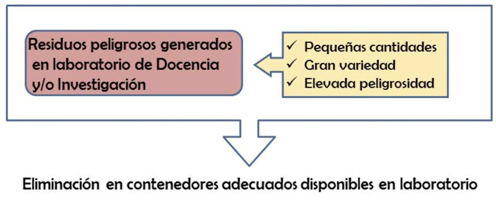{ width="600" }
    <figcaption>Foto de Universitat Politècnica de València: https://youtu.be/ZGp5PcPSMpM?si=29UAn_kUMMMgii7r</figcaption>
</figure>

<figure markdown="span">
    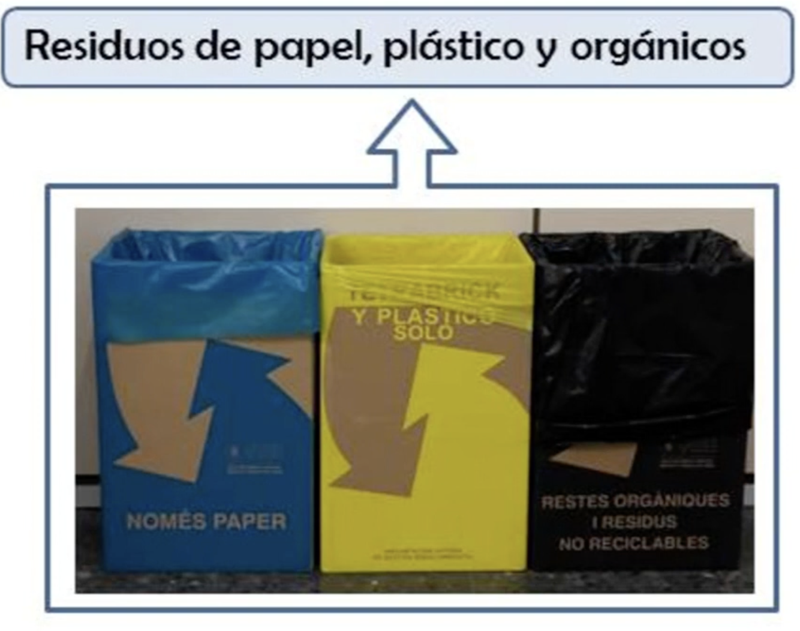{ width="600" }
    <figcaption>Foto de Universitat Politècnica de València: https://youtu.be/ZGp5PcPSMpM?si=29UAn_kUMMMgii7r</figcaption>
</figure>

<figure markdown="span">
    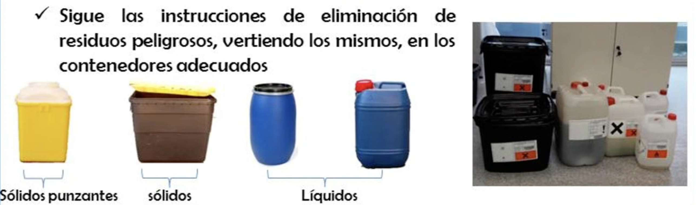{ width="600" }
    <figcaption>Foto de Universitat Politècnica de València: https://youtu.be/ZGp5PcPSMpM?si=29UAn_kUMMMgii7r</figcaption>
</figure>

## Ergonomia del lloc de treball i pantalles de visualització

Els factors ergonòmics relacionen el disseny del treball amb les capacitats físiques humanes. La higiene laboral requereix monitoratge continu mitjançant mesuraments ambientals, avaluacions mèdiques periòdiques i ajustos en els processos de treball. Les mesures de control poden incloure ventilació adequada, substitució de substàncies tòxiques, rotació de tasques i pauses regulars per a reduir la fatiga.

La implementació reeixida de programes de seguretat i higiene laboral requereix compromís organitzacional, recursos adequats i participació activa de tots els involucrats.

### Riscos posturals 

Els riscos posturals apareixen quan el cos adopta posicions inadequades de manera prolongada o repetitiva, provocant sobrecàrrega muscular i lesions de l'aparell locomotor. En llocs de treball amb pantalles, els factors de risc més freqüents són:

- Posició de la cadira: l'altura ha de permetre que els peus reposen completament a terra (o sobre un reposapeus) i que els genolls formin un angle de 90°. El respatller ha de donar suport a la zona lumbar.

- Posició de la pantalla: s'ha de situar a una distància d'entre 50 i 70 cm dels ulls, amb la vora superior a l'altura dels ulls o lleugerament per sota, per evitar la flexió excessiva del coll.

- Posició del teclat i el ratolí: han d'estar a l'altura dels colzes, amb els avantbraços en posició horitzontal i els canells rectes per prevenir la síndrome del túnel carpià.

- Pauses actives: es recomana interrompre el treball estàtic cada 45-60 minuts amb breus exercicis d'estirament de coll, espatlles, mans i esquena.

Les lesions més habituals associades a una mala postura prolongada inclouen la lumbalgia, les cervicàlgies, les tendinitis i els trastorns musculoesquelètics dels membres superiors.

### Riscos visuals

El treball prolongat davant de pantalles pot ocasionar fatiga visual o astenopia, una condició reversible però molesta que es manifesta amb ardor ocular, visió borrosa, cefalea i dificultat per enfocar. Els factors que augmenten el risc visual són:

- Il·luminació inadequada: la llum ambiental ha de ser suficient però sense generar reflexos sobre la pantalla. S'ha d'evitar col·locar el monitor de cara a finestres o fonts de llum directa.

- Contrast i lluminositat de la pantalla: s'han d'ajustar en funció de l'entorn per reduir l'esforç d'adaptació de l'ull.

- Freqüència de parpelleig: davant de pantalles, la freqüència de parpelleig disminueix significativament, cosa que provoca sequedat ocular. Es recomana aplicar la regla 20-20-20: cada 20 minuts, mirar un objecte a 20 peus (uns 6 metres) durant 20 segons.

- Revisió oftalmològica: els treballadors que usen PVD de manera habitual tenen dret a una revisió visual específica a càrrec de l'empresa.

## Planificació de l'activitat preventiva de riscos

La planificació preventiva és el document que concreta les mesures de seguretat que cal adoptar a partir dels resultats de l'avaluació de riscos. Ha de ser sistemàtica, documentada i integrada en la gestió general de l'organització.
Implementació

La implementació de l'activitat preventiva segueix una seqüència estructurada de fases:

1. Avaluació inicial de riscos: identificació i valoració de tots els perills presents als llocs de treball, tenint en compte la probabilitat d'ocurrència i la gravetat potencial de les conseqüències.

2. Establiment de prioritats: les mesures correctives s'ordenen en funció del nivell de risc detectat, actuant primer sobre els riscos més greus i immediats.

3. Assignació de recursos: es defineixen els responsables de cada acció preventiva, els terminis d'execució i els recursos humans i materials necessaris.

4. Execució de les mesures: s'apliquen les accions planificades seguint la jerarquia de controls: eliminació, substitució, controls d'enginyeria, controls administratius i, finalment, EPIs.

5. Formació i informació: tots els treballadors han de rebre formació específica sobre els riscos del seu lloc de treball i les mesures preventives aplicables, tant en el moment de la incorporació com davant de qualsevol canvi significatiu.

6. Seguiment i revisió: l'eficàcia de les mesures implantades s'ha de verificar periòdicament. L'avaluació de riscos s'ha d'actualitzar sempre que hi haja canvis en les condicions de treball, es produeixen accidents o malalties professionals, o ho exigeixen els resultats del seguiment.

La planificació preventiva ha de quedar documentada i estar a disposició de les autoritats laborals i dels representants dels treballadors.

### Control

<figure markdown="span">
    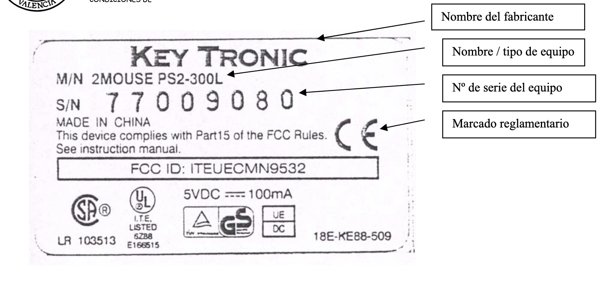{ width="600" }
    <figcaption>Foto de Universitat Politècnica de València: https://www.sprl.upv.es/pdf/Gu%EDa%20pr%E1cticas%20alumnos%20riesgos%20mec%E1nicos.pdf</figcaption>
</figure>

La declaració CE de conformitat és el procediment pel qual el fabricant o el seu representant establert en la Comunitat Europea declara que la màquina comercialitzada satisfà tots els requisits essencials de seguretat i salut corresponents. La signatura de la declaració CE de conformitat autoritza el fabricador o al seu representant en la Comunitat Europea a col·locar en la màquina el marcat.

Per als equips de treball que disposen de marcatge CE és necessari que el fabricant o el seu representant en la Comunitat Europea facilite una declaració CE de conformitat, que ha d'estar redactada en el mateix idioma que el manual d'instruccions facilitat al costat de l'equip.

## [Guia de pràctiques d'alumnes en laboratoris amb riscos mecànics](http://www.sprl.upv.es/guiapracalummecan.htm)

Planificació de les pràctiques de taller. A fi d'eliminar o disminuir els riscos associats a les pràctiques i determinar els riscos residuals que subsisteixen, controlant els mateixos mitjançant l'adopció de les mesures pertinents i la informació i formació dels alumnes sobre els riscos específics existents en cada pràctica.

Per la realització de pràctiques de l'alumnat es seguira el següent esquema:

<figure markdown="span">
    { width="600" }
    <figcaption>Foto de Universitat Politècnica de València: https://www.sprl.upv.es/pdf/Gu%EDa%20pr%E1cticas%20alumnos%20riesgos%20mec%E1nicos.pdf</figcaption>
</figure>

D'acord amb l'esquema es farà el següent:

1. Preparació d'una relació dels productes, equips, eines, instal·lacions, màquines i materials a utilitzar, almenys dels elements que poden portar associat algun tipus de perill.

2. Recerca dels riscos associats a productes, equips, eines, instal·lacions, màquines i materials emprats, basant-se en la consulta de les instruccions dels equips i les experiències prèvies o una altra informació relativa al maneig d'equips o instal·lacions.

3. Determinació, a partir de la mateixa informació utilitzada per a la recerca de riscos, la necessitat d'utilitzar equips de protecció individual (per exemple guants, ulleres o màscares) o col·lectiva, o la necessitat de disposar d'equips d'emergència (per exemple extintors d'algun tipus determinat) i verificar si estan disponibles.

4. Verificació de les condicions dels tallers, instal·lacions i equips utilitzats. Poden verificar-se, entre altres, les següents condicions:
    - Existència de senyalització, sortides d'emergència i equips de protecció contra incendis.
    - Instal·lació adequada dels equips a utilitzar, d'acord amb les seves instruccions.
    - Existència i correcte funcionament dels sistemes de ventilació o extracció de l'aire ambient si són necessaris per al correcte desenvolupament de les pràctiques.

5. Planificació de les pràctiques a fi d'eliminar o disminuir els possibles riscos.

6. Especificació de les normes, precaucions, prohibicions o proteccions necessaris per a eliminar o controlar els riscos.

7. Inclusió en els manuals de pràctiques d'advertiments sobre els riscos detectats, segons l'indicat en l'apartat anterior, i sobre les normes, precaucions, prohibicions i elements de protecció necessaris per al seu control, indicant l'obligatorietat de seguir-los.

8. Comunicació al responsable de prevenció del departament de les deficiències detectades en els locals, instal·lacions, equips, materials, eines o productes utilitzats en les pràctiques, així com deficiències detectades en procediments o normes de treball generals aplicades en el departament.

En general pot ser aconsellable que es limiten les necessitats d'utilització d'equips de protecció individual en pràctiques d'alumnes als de Categories I i II. També és convenient considerar la limitació de recursos existents, no sols pel cost dels equips de protecció individual, sinó per la limitació que puga existir en el nombre d'equips de protecció col·lectiva, que és especialment problemàtica en pràctiques amb un nombre elevat d'alumnes.

En qualsevol cas, pot ser convenient que, bé en alguna de les pràctiques, o en la informació inicial donada a l'alumne, s'instrueisca sobre la utilització dels equips de protecció individual o col·lectiva que es considere interessant incloure com a part de la seva formació en matèria de seguretat.

### Informació inicial

Resulta convenient impartir al principi del curs una classe, xerrada o pràctica inicial sobre seguretat, que hauria de ser obligatòria per a tots els alumnes.

Caldria indicar l'obligatorietat de seguir les normes de seguretat establertes, aclarint que el seu incompliment pot suposar la suspensió de les activitats i la no superació de l'alumne de les pràctiques com a avaluació de l'assignatura impartida.

Seria adequat el preparar un document per escrit que continguéra tota la informació sobre seguretat i que aquest fos lliurat als alumnes perquè ho conegueren i aplicaren en les seves hores de treball en el taller.

### Informació específica

Els guions de les pràctiques haurien d'incloure informació sobre els següents temes:

- Advertiments sobre els riscos associats a les tasques, equips, màquines i eines. A més de ressaltar el risc, hauria d'explicar-se la seua naturalesa i què s'ha de fer o què s'ha d'evitar en relació amb el risc. Hauria d'indicar-se tant el risc o perill existent per incompliment de les normes o prohibicions establertes, o per no utilitzar els mitjans de protecció previstos, com el risc residual que poguera quedar després de complir els requisits anteriors. També hauria d'informar-se dels
riscos presents en cas d'accions inadequades.

- Normes, precaucions i prohibicions necessàries per a evitar els riscos.

- Equips de protecció individual o col·lectiva que és necessari utilitzar.

- Aclariments sobre operacions que estan estrictament prohibides o que hagen de realitzar-se sota la supervisió d'algun responsable.

### Notificació

Per a garantir que els alumnes han estat formats i informats sobre els possibles riscos presents en les pràctiques i sobre les normes, obligacions, prohibicions i equips de protecció a utilitzar, a més de realitzar de manera efectiva les tasques de formació i informació, els alumnes podrien comunicar per escrit que han estat informats sobre aquests aspectes, i que accepten les normes establertes.

## [Els equips de treball](http://www.sprl.upv.es/d7_9_b.htm)

Legalment és considerat com a equip de treball: qualsevol màquina, aparell, instrument o instal·lació utilitzat en el treball. Qualsevol element utilitzat per a desenvolupar una activitat laboral, és un equip de treball. Existeixen una sèrie d'exigències legals que han de ser ateses a l'hora d'utilitzar equips de treball.

**NO ES CONSIDERARÀ** com a equip de treball, als següents elements: instal·lacions sotmeses a reglamentació, vehicles destinats a transport de personal, maquinària agrícola i forestal, maquinària d'elevació, Equips de Protecció Individual, Equips de Protecció Col·lectiva, i qualsevol element destinat directament a prevenir d'un risc.

<figure markdown="span">
    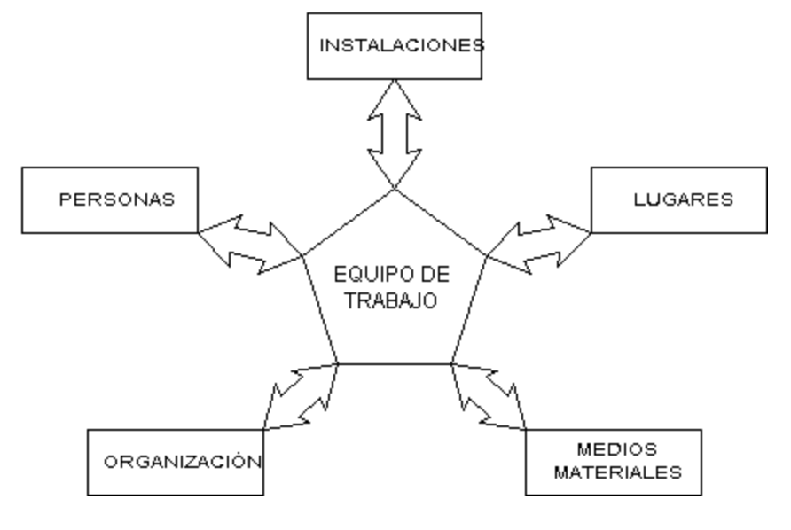{ width="600" }
    <figcaption>Foto de Universitat Politècnica de València: https://www.sprl.upv.es/d7_9_b.htm#p2</figcaption>
</figure>

Cadascun d'aquests tipus d'instal·lacions està sotmès a una reglamentació específica, i qualsevol d'elles solament pot ser duta a terme (o modificada) per instal·ladors autoritzats. Per això, si Vostè precisa d'aquesta mena d'instal·lacions l'ha de tenir en compte, i si disposa d'una d'elles, analitzi si aquesta és capaç de suportar la càrrega de treball extra (molt comunament es presenta aquesta deficiència amb instal·lacions elèctriques de baixa tensió). Haurà de tenir en compte també el cost econòmic extra que pot suposar el generar o adaptar a les necessitats parelles amb l'activitat que pretén dur a terme, les instal·lacions existents, o que calgui incorporar.

Tant mitjans econòmics, com a utensilis i eines necessàries per al manteniment i operativitat dels equips, mitjans de protecció individual (E.P.I.: guants, màscares, pantalles facials, etc… ), mitjans de protecció col·lectiva (sistemes d'extracció i renovació d'aire, apantallaments, resguards, etc…), uns altres. Haurà de tenir en compte també el cost econòmic extra que pot suposar l'adquisició, manteniment i sosteniment en estat d'aptitud dels mitjans materials que precisi per a la tasca que desitgi dur a terme.

<figure markdown="span">
    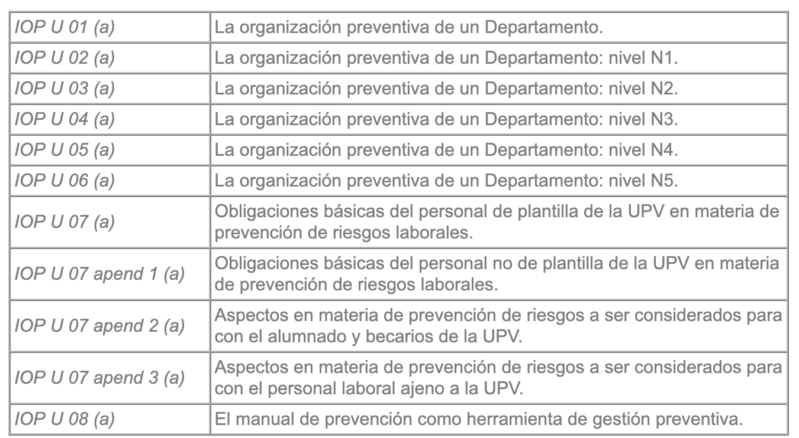{ width="600" }
    <figcaption>Foto de Universitat Politècnica de València: https://www.sprl.upv.es/d7_9_b.htm#p2</figcaption>
</figure>

Els equips de treball de disseny i fabricació propis TAMBÉ han de complir els mateixos requisits que un equip de treball comercialitzat normalment, i quan s'alteri de manera substancial la funció d'aquests, o quan es procedeixi a l'HAURÀ DE Seguir-se les indicacions exposades en les següents Instruccions Operatives: configuració de sistemes per combinació (integració) d'aquests tipus d'elements.

La conservació del manual d'instruccions d'un equip de treball és responsabilitat de les figures de l'organigrama preventiu d'un Departament N3 – responsable de prevenció de lloc de treball, i/o N4 – responsable de prevenció de tasques específiques: és a dir, dels responsables dels llocs i/o de les tasques on l'equip de treball serà utilitzat.

## Bibliografia

- https://youtu.be/KMSfLLGXkf0?si=jNVu1JsUtk7h-VCy
- https://youtu.be/FNdyHJaTJeQ?si=hnYME-f7TEwlSDQz
- https://youtu.be/ZGp5PcPSMpM?si=Fj_dPUp0W2kFABwg
- https://youtu.be/9tlZSSQPjGY?si=Xa75aeGrPp7Or7AL
- https://youtu.be/oacZjMiW6eM?si=D4Q2a-8ng14h-UXh
- https://youtu.be/X8xGeE1ggsc?si=yqmQiQatrHDPQ7a5
- https://www.sprl.upv.es/pdf/Gu%EDa%20pr%E1cticas%20alumnos%20riesgos%20mec%E1nicos.pdf
- https://www.sprl.upv.es/d7_9_b.htm