# Processos d'unió

La conformació per soldadura constitueix un dels procediments de fabricació més utilitzats en la indústria metall- mecànica, però d'ús molt generalitzat pel servei de manteniment de qualsevol tipus d'indústria.

<figure markdown="span">
    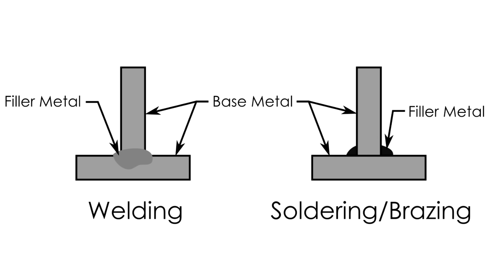{ width="600" }
    <figcaption>Foto de Practical Engineering: https://youtu.be/ZZvMsnSUDqo?si=WVDQsJGMQuJFFMKI</figcaption>
</figure>

Consisteix bàsicament en la unió de peces metàl·liques, d'igual o distinta naturalesa, utilitzant diferents procediments en els quals l'adherència es produeix amb aportació de calor a una temperatura adequada, amb aplicació de pressió o sense ella i amb addició de metall d'aportació o sense ella.

<figure markdown="span">
    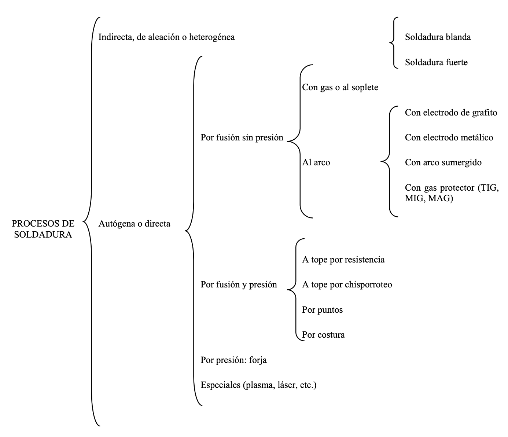{ width="600" }
    <figcaption>Foto de Universitat Politècnica de València: https://www.sprl.upv.es/pdf/Gu%EDa%20pr%E1cticas%20alumnos%20riesgos%20mec%E1nicos.pdf</figcaption>
</figure>

## Fonaments de la soldadura

BUFADOR.
És l'element principal de la instal·lació de soldadura. En ell s'efectua la mescla de gasos. Es classifiquen segons la pressió dels gasos (combustible i comburent), en:

- Bufadors d'alta pressió o de tovera de mescla en els quals la pressió de tots dos gasos és igual.

- Bufadors de baixa pressió o d'injector en els quals el comburent (oxigen) té una pressió major que el combustible.

VÀLVULES ANTIRETROCÉS.
Són dispositius de Seguretat que es col·loquen en les canalitzacions per a assegurar automàticament el pas d'un gas en un solo sentit i detenir el retrocés de flama.
Característiques exigibles a les vàlvules antiretrocés:

- Seguretat contra el retrocés del gas

- Seguretat contra el retrocés de la flama

- Permetre el lliure pas dels gasos en el sentit de l'ocupació

- Tenir vàlvula de Seguretat de sobrepressió

- No necessitar cures de conservació

- Ser lleugeres

### Processos d'unió

<figure markdown="span">
    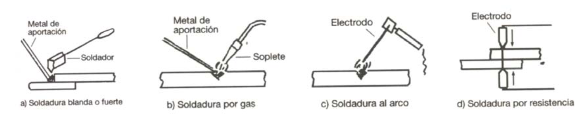{ width="600" }
    <figcaption>Foto de Universitat Politècnica de València: https://www.sprl.upv.es/pdf/Gu%EDa%20pr%E1cticas%20alumnos%20riesgos%20mec%E1nicos.pdf</figcaption>
</figure>

<figure markdown="span">
    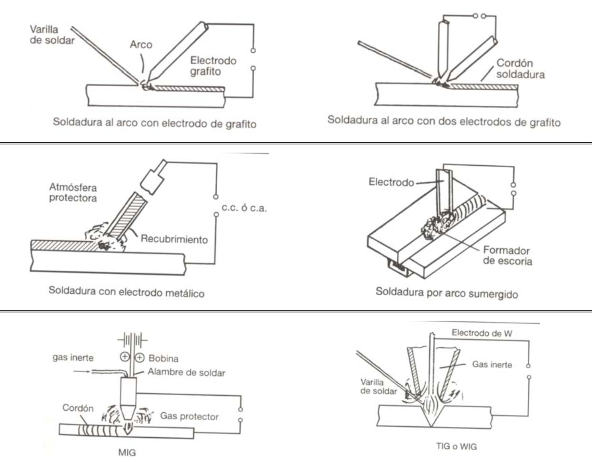{ width="600" }
    <figcaption>Foto de Universitat Politècnica de València: https://www.sprl.upv.es/pdf/Gu%EDa%20pr%E1cticas%20alumnos%20riesgos%20mec%E1nicos.pdf</figcaption>
</figure>

### Soldabilitat 

### Simbologia

    <iframe src="https://www.youtube.com/embed/QqX7lidMNzA?si=LQiT_Zs2FWov3rdz" title="YouTube video player" frameborder="0" allow="accelerometer; autoplay; clipboard-write; encrypted-media; gyroscope; picture-in-picture; web-share" referrerpolicy="strict-origin-when-cross-origin" allowfullscreen style="position: absolute; top: 0; left: 0; width: 100%; height: 100%;"></iframe>

## Tècniques de soldadura elèctrica

### SMAW

<figure markdown="span">
    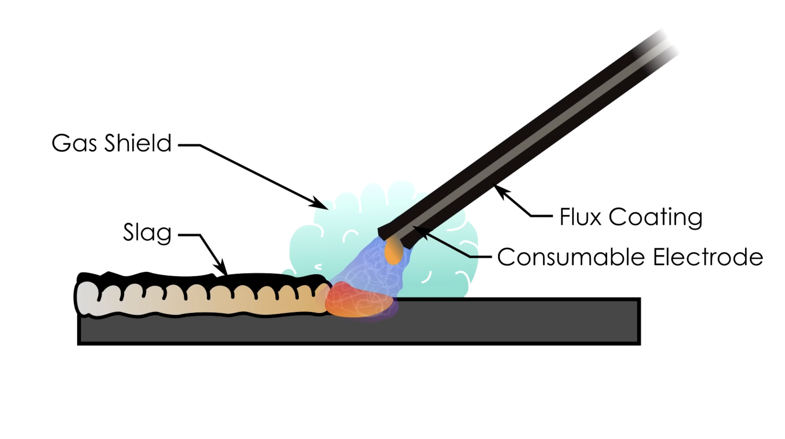{ width="600" }
    <figcaption>Foto de Practical Engineering: https://youtu.be/ZZvMsnSUDqo?si=WVDQsJGMQuJFFMKI</figcaption>
</figure>

<figure markdown="span">
    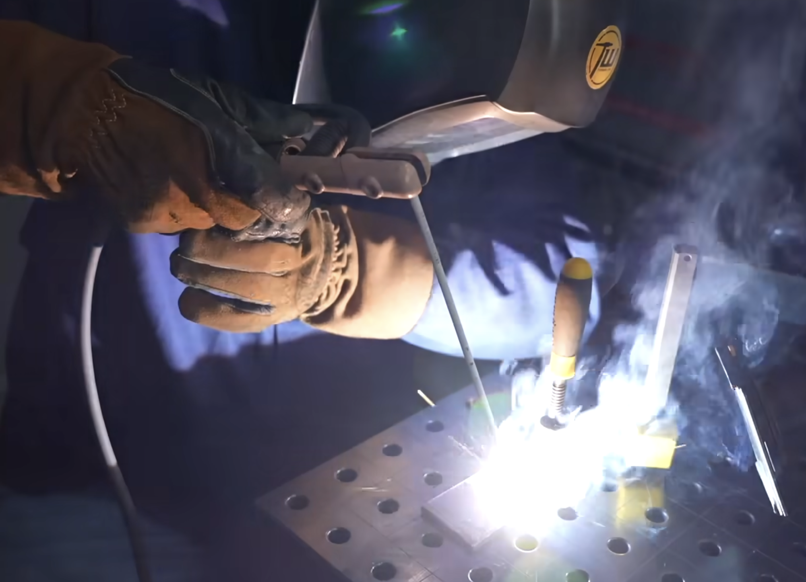{ width="600" }
    <figcaption>Foto de TimWelds: https://youtu.be/5M9I_bBrnZ0?si=5MInlLsA0-4e0KQe</figcaption>
</figure>

<figure markdown="span">
    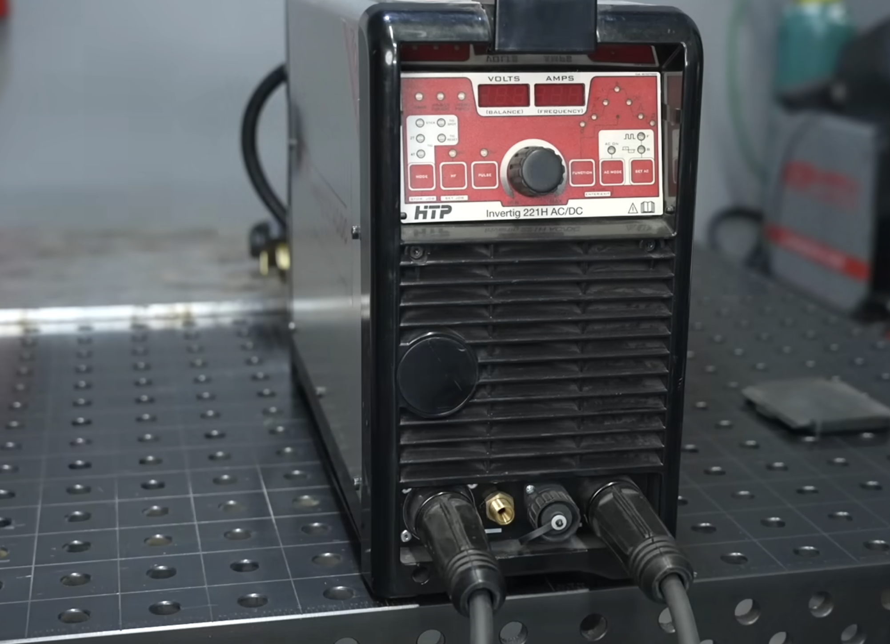{ width="600" }
    <figcaption>Foto de TimWelds: https://youtu.be/5M9I_bBrnZ0?si=5MInlLsA0-4e0KQe</figcaption>
</figure>

<figure markdown="span">
    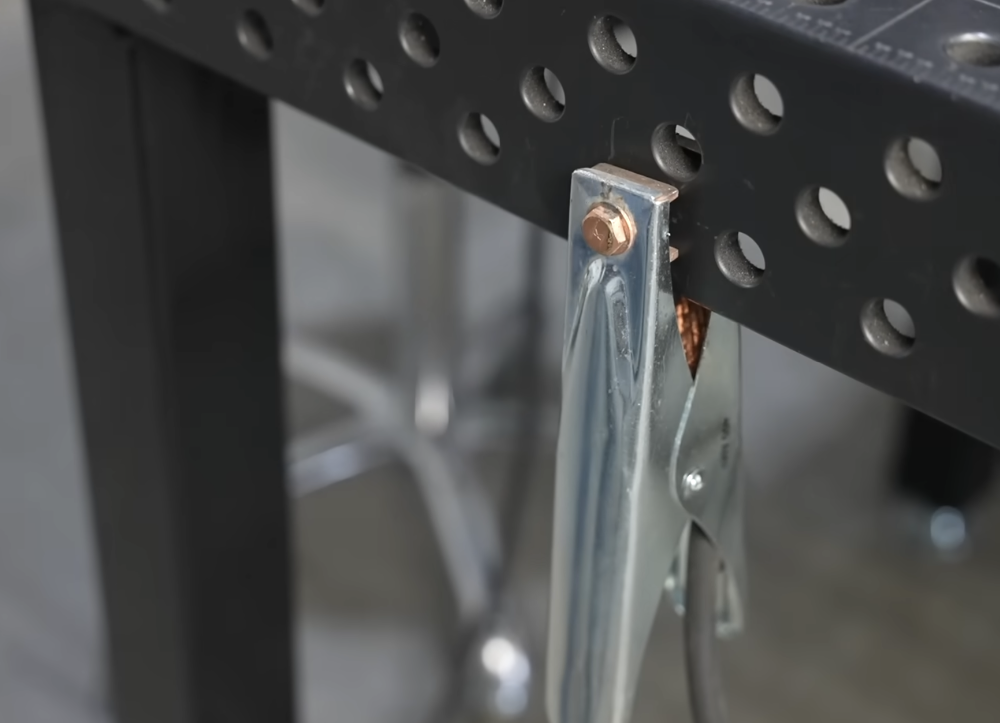{ width="600" }
    <figcaption>Foto de TimWelds: https://youtu.be/5M9I_bBrnZ0?si=5MInlLsA0-4e0KQe</figcaption>
</figure>

<figure markdown="span">
    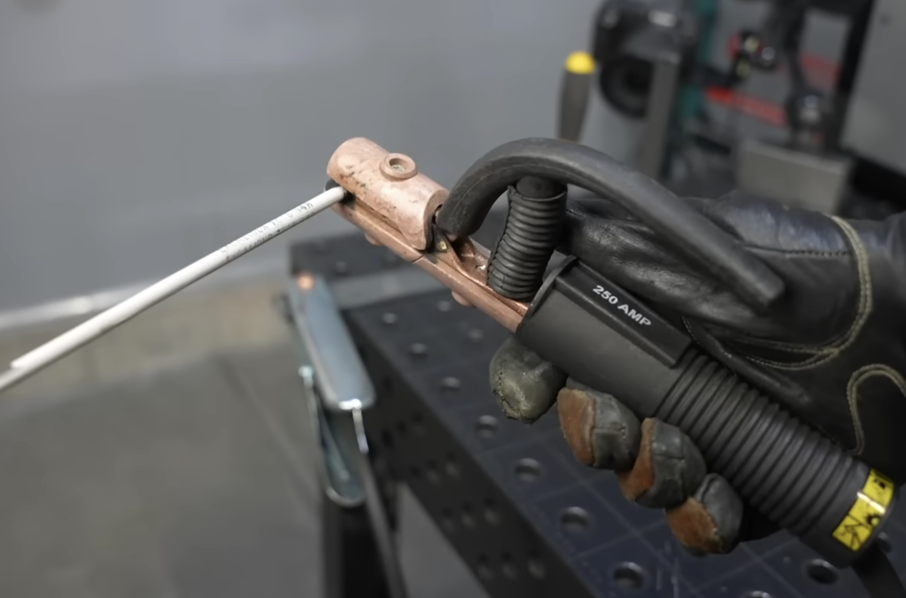{ width="600" }
    <figcaption>Foto de TimWelds: https://youtu.be/5M9I_bBrnZ0?si=5MInlLsA0-4e0KQe</figcaption>
</figure>

<figure markdown="span">
    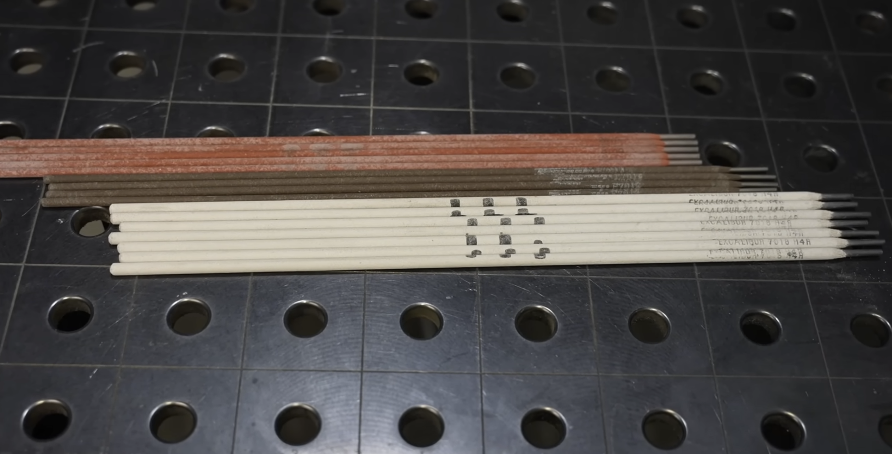{ width="600" }
    <figcaption>Foto de TimWelds: https://youtu.be/5M9I_bBrnZ0?si=5MInlLsA0-4e0KQe</figcaption>
</figure>

Els electrodes estan fets d'acer a l'interior i són recoberts per flux. Una vegada es tanca el circuit elèctric (quan l'electrode s'apropa a la peça) el recobriment combustiona i protegeix l'ambient mentre que l'acer de l'interior es fon.

<figure markdown="span">
    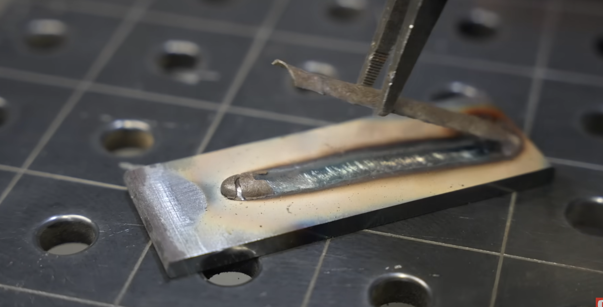{ width="600" }
    <figcaption>Foto de TimWelds: https://youtu.be/5M9I_bBrnZ0?si=5MInlLsA0-4e0KQe</figcaption>
</figure>

La combustió del flux queda com una "costra" que s'elimina després del procés. 
Aquest mètode és barat i sencill d'aprendre. No és recomanable per materials no massa gorssos, ja que genera massa calor.

### FCAW

També anomenada soldadura amb nucli fundent. En aquesta, l'electrode pren la forma de bobina.

<figure markdown="span">
    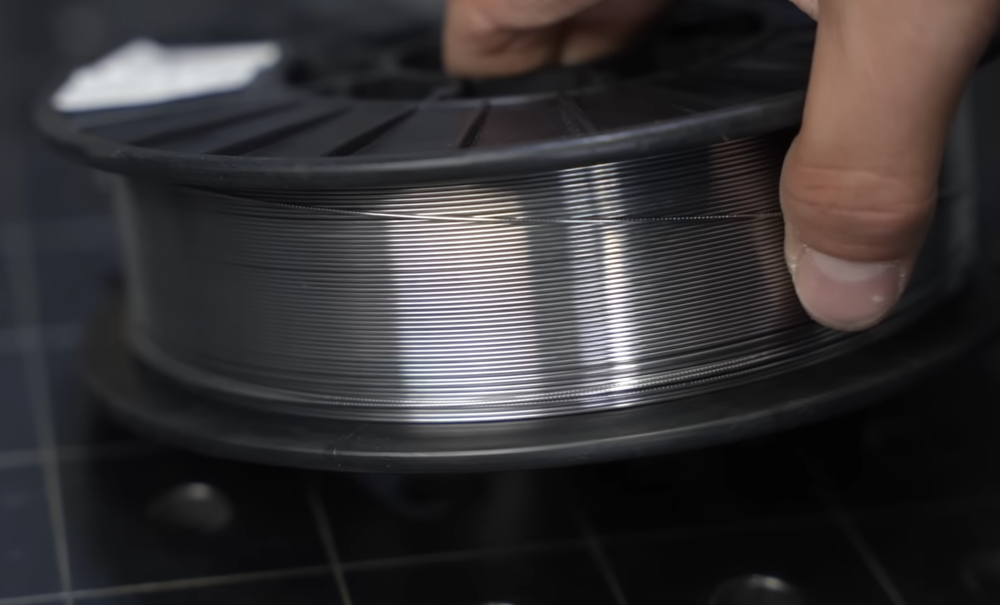{ width="600" }
    <figcaption>Foto de TimWelds: https://youtu.be/5M9I_bBrnZ0?si=5MInlLsA0-4e0KQe</figcaption>
</figure>

<figure markdown="span">
    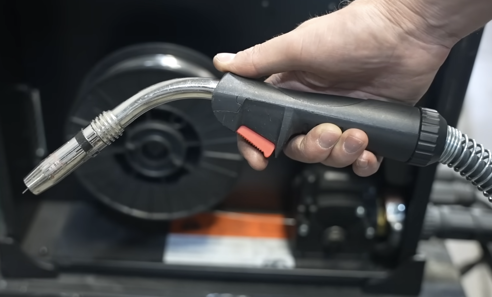{ width="600" }
    <figcaption>Foto de TimWelds: https://youtu.be/5M9I_bBrnZ0?si=5MInlLsA0-4e0KQe</figcaption>
</figure>

L'electrode s'alimenta automàticament amb l'actuador. 

<figure markdown="span">
    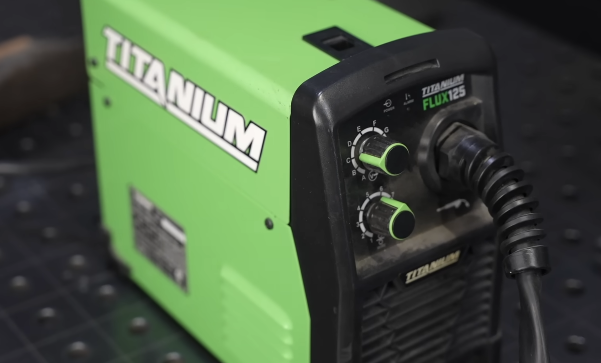{ width="600" }
    <figcaption>Foto de TimWelds: https://youtu.be/5M9I_bBrnZ0?si=5MInlLsA0-4e0KQe</figcaption>
</figure>

<figure markdown="span">
    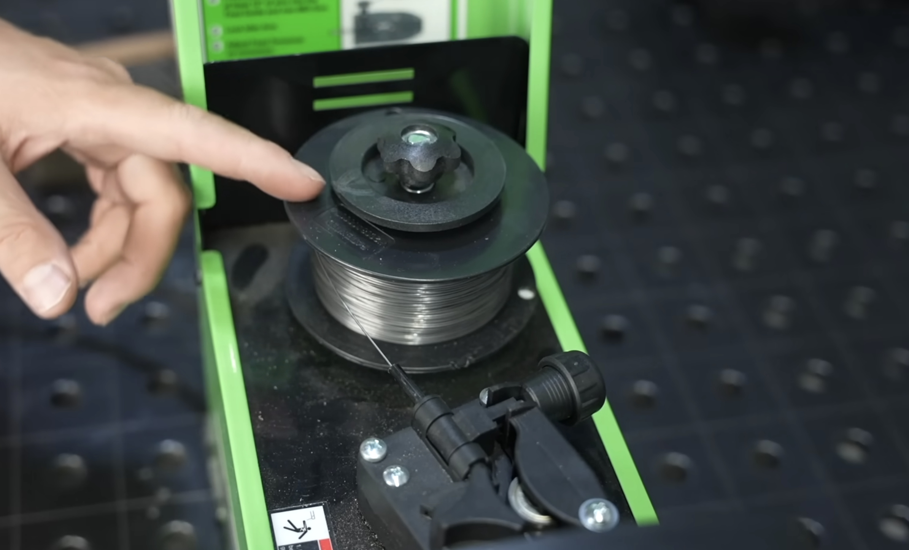{ width="600" }
    <figcaption>Foto de TimWelds: https://youtu.be/5M9I_bBrnZ0?si=5MInlLsA0-4e0KQe</figcaption>
</figure>

### MIG/MAG

<figure markdown="span">
    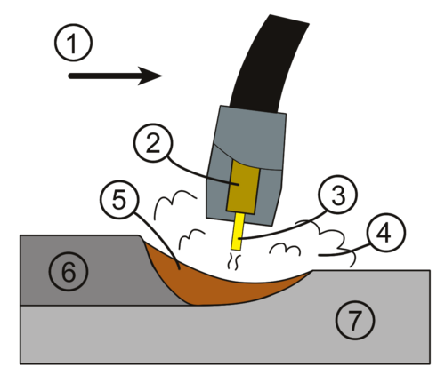{ width="600" }
    <figcaption>Foto de Wikimedia: https://commons.wikimedia.org/wiki/File:GMAW_weld_area.png</figcaption>
</figure>

La soldadura GMAW (Gas Metal Arc Welding) sovint coneguda amb el nom de soldadura MIG/MAG, és un procés semiautomàtic, automàtic o robotitzat de soldadura que utilitza un elèctrode consumible i continu, allotjat en una bobina, el qual és alimentat cap a la pistola juntament amb un gas inert en la soldadura MIG o gas actiu en la soldadura MAG.

En el cas de MIG el gas crea una atmosfera protectora lliure d'oxigen i, en el MAG, a més de protegir, el gas participa en la millora de la soldadura.

Si l'atmosfera tingués oxigen, aquest gas, juntament amb altes temperatures, produiria una ràpida oxidació dels metalls que es volen soldar.

El mètode MIG (Metal Inert Gas welding) utilitza un gas inert (argó, heli o una barreja d'ambdós) mentre que la soldadura MAG (Metal Active Gas welding) és un tipus de soldadura que utilitza un gas protector químicament actiu (diòxid de carboni, argó més diòxid de carboni o argó més oxigen).

<figure markdown="span">
    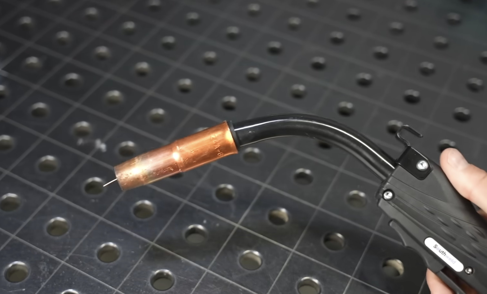{ width="600" }
    <figcaption>Foto de TimWelds: https://youtu.be/5M9I_bBrnZ0?si=5MInlLsA0-4e0KQe</figcaption>
</figure>

La pistola d'actuació és molt pareguda a la que s'utilitza al mètode FCAW, però en aquesta també expulsa el gas.

<figure markdown="span">
    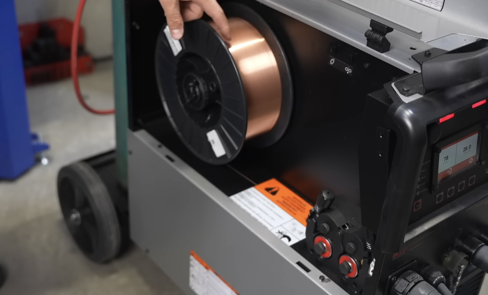{ width="600" }
    <figcaption>Foto de TimWelds: https://youtu.be/5M9I_bBrnZ0?si=5MInlLsA0-4e0KQe</figcaption>
</figure>

### TIG

En contraposició al mètode MIG/MAG, TIG (Tugusten Inert Gas) ofereix la precisió de la soldadura oxiacetilènica combinada amb MIG. El material no s'afegeix alhora que la pistola amb el calor i el gas i per tant permet un major control. L'electrode no es fon.

<figure markdown="span">
    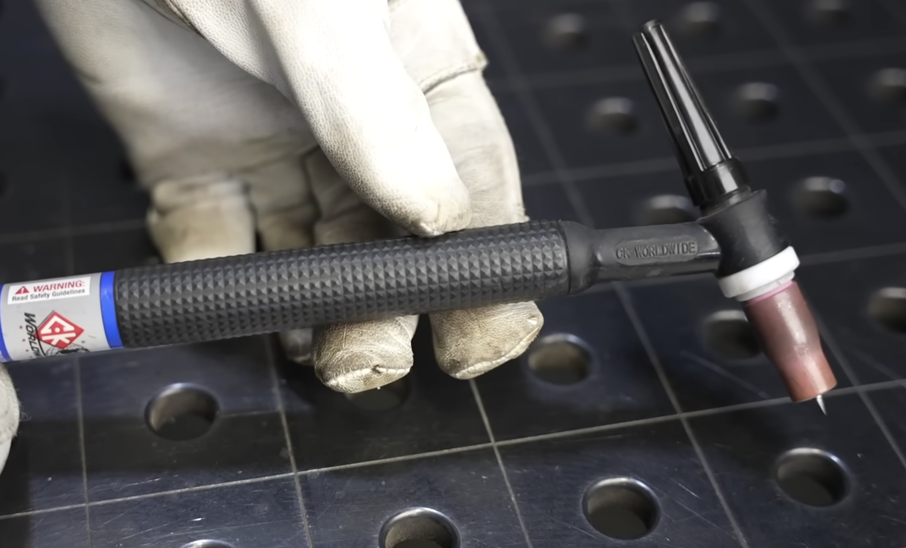{ width="600" }
    <figcaption>Foto de TimWelds: https://youtu.be/5M9I_bBrnZ0?si=5MInlLsA0-4e0KQe</figcaption>
</figure>

<figure markdown="span">
    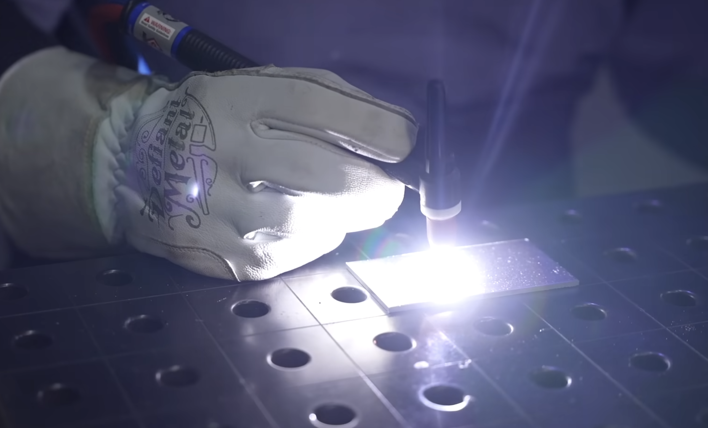{ width="600" }
    <figcaption>Foto de TimWelds: https://youtu.be/5M9I_bBrnZ0?si=5MInlLsA0-4e0KQe</figcaption>
</figure>

<figure markdown="span">
    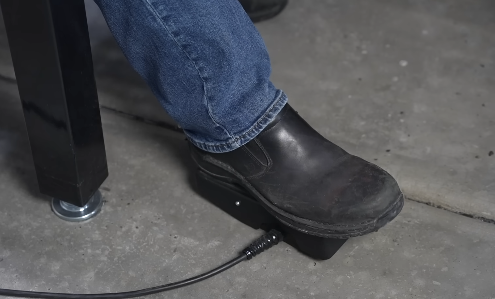{ width="600" }
    <figcaption>Foto de TimWelds: https://youtu.be/5M9I_bBrnZ0?si=5MInlLsA0-4e0KQe</figcaption>
</figure>

Aquest mètode funciona per quasi qualsevol material.

### Soldadura per plasma

### Soldadura per resistència 

### Soldadura làser

## Altres processos d'unió

### Soldadura oxiacetilènica 

<figure markdown="span">
    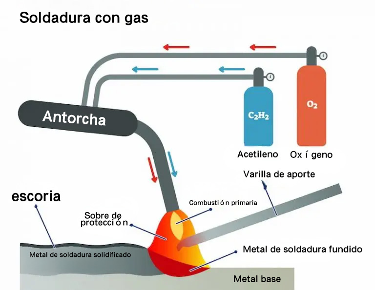{ width="600" }
    <figcaption>Foto de ADH Machine Tool: https://adhmt.mx/soldadura-oxiacetilenica-explicada/</figcaption>
</figure>

<figure markdown="span">
    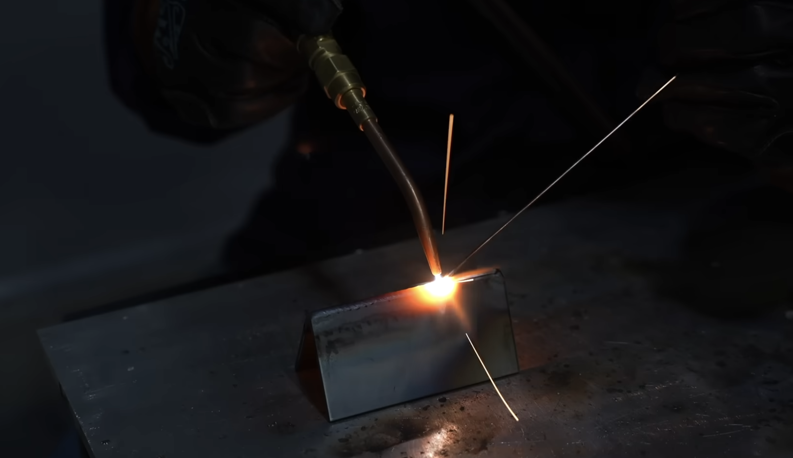{ width="600" }
    <figcaption>Foto de TimWelds: https://youtu.be/5M9I_bBrnZ0?si=5MInlLsA0-4e0KQe</figcaption>
</figure>

<figure markdown="span">
    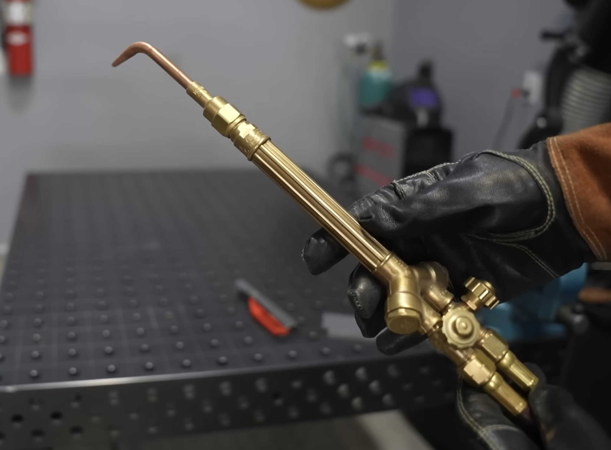{ width="600" }
    <figcaption>Foto de TimWelds: https://youtu.be/5M9I_bBrnZ0?si=5MInlLsA0-4e0KQe</figcaption>
</figure>

<figure markdown="span">
    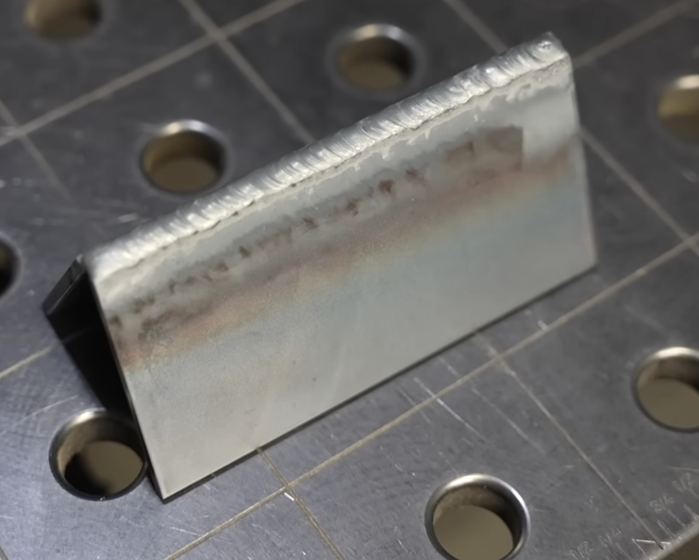{ width="600" }
    <figcaption>Foto de TimWelds: https://youtu.be/5M9I_bBrnZ0?si=5MInlLsA0-4e0KQe</figcaption>
</figure>

Hui dia aquest procés ja no és tan habitual, ha estat substituït per altres.

### Adhesius

## Bibliografia

- https://youtu.be/5M9I_bBrnZ0?si=nrbbF-MKMz5OU-3N
- https://youtu.be/ZZvMsnSUDqo?si=CHVBQsC1OAjgmLcd
- https://www.youtube.com/watch?v=taSQK9XzKEU&list=PLOkJoxb9fUxNSXN09Ftaw6PnZTKtFT_m2
