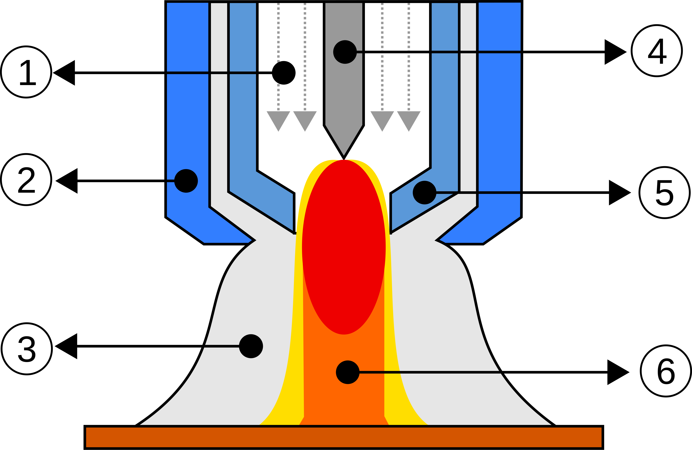
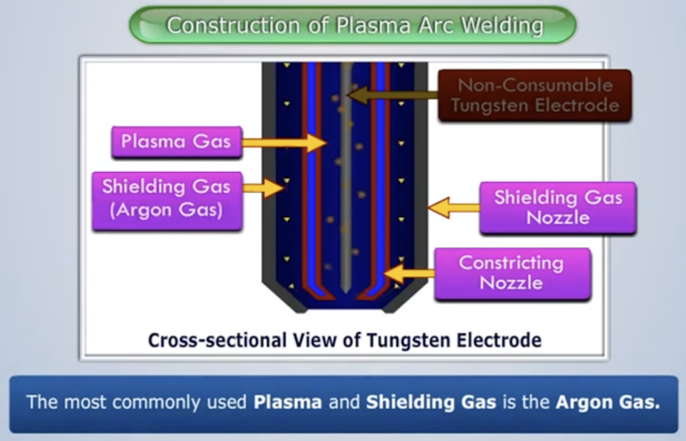
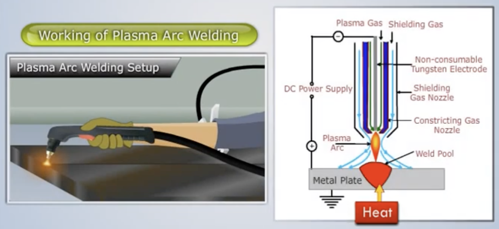
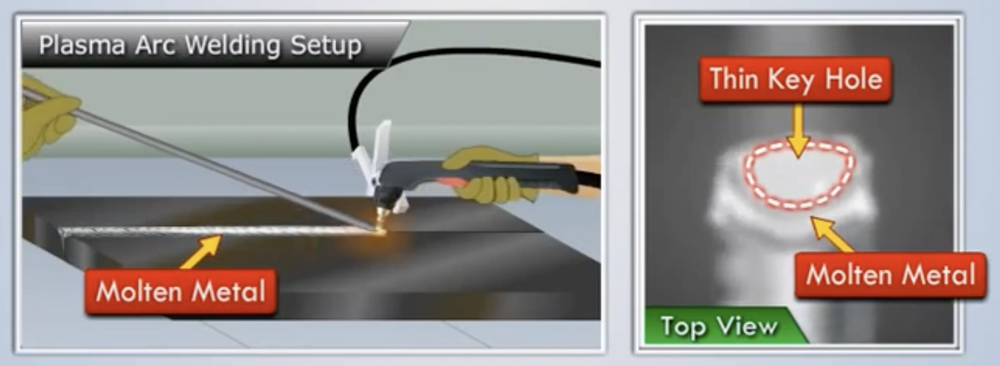
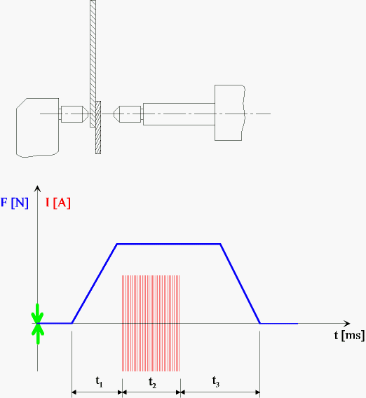
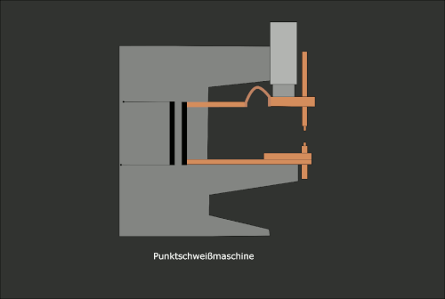
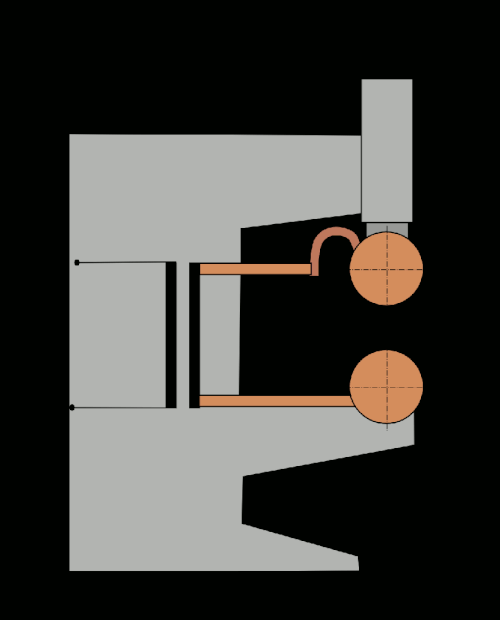
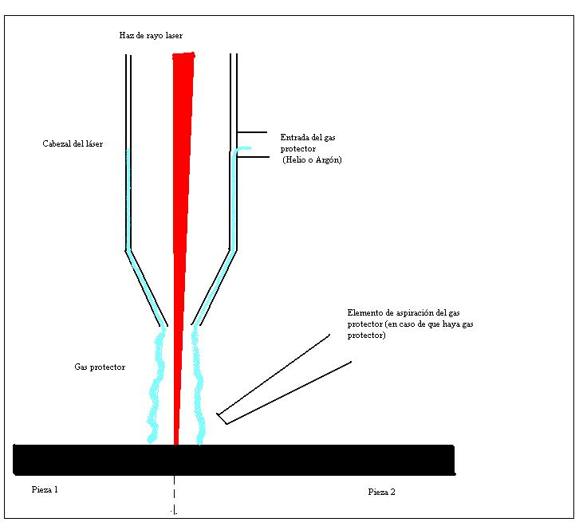

# Processos d'unió

La conformació per soldadura constitueix un dels procediments de fabricació més utilitzats en la indústria metall- mecànica, però d'ús molt generalitzat pel servei de manteniment de qualsevol tipus d'indústria.

<figure markdown="span">
    { width="600" }
    <figcaption>Foto de Practical Engineering: https://youtu.be/ZZvMsnSUDqo?si=WVDQsJGMQuJFFMKI</figcaption>
</figure>

Consisteix bàsicament en la unió de peces metàl·liques, d'igual o distinta naturalesa, utilitzant diferents procediments en els quals l'adherència es produeix amb aportació de calor a una temperatura adequada, amb aplicació de pressió o sense ella i amb addició de metall d'aportació o sense ella.

<figure markdown="span">
    { width="600" }
    <figcaption>Foto de Universitat Politècnica de València: https://www.sprl.upv.es/pdf/Gu%EDa%20pr%E1cticas%20alumnos%20riesgos%20mec%E1nicos.pdf</figcaption>
</figure>

## Fonaments de la soldadura

BUFADOR.
És l'element principal de la instal·lació de soldadura. En ell s'efectua la mescla de gasos. Es classifiquen segons la pressió dels gasos (combustible i comburent), en:

- Bufadors d'alta pressió o de tovera de mescla en els quals la pressió de tots dos gasos és igual.

- Bufadors de baixa pressió o d'injector en els quals el comburent (oxigen) té una pressió major que el combustible.

VÀLVULES ANTIRETROCÉS.
Són dispositius de Seguretat que es col·loquen en les canalitzacions per a assegurar automàticament el pas d'un gas en un solo sentit i detenir el retrocés de flama.
Característiques exigibles a les vàlvules antiretrocés:

- Seguretat contra el retrocés del gas

- Seguretat contra el retrocés de la flama

- Permetre el lliure pas dels gasos en el sentit de l'ocupació

- Tenir vàlvula de Seguretat de sobrepressió

- No necessitar cures de conservació

- Ser lleugeres

### Processos d'unió

<figure markdown="span">
    { width="600" }
    <figcaption>Foto de Universitat Politècnica de València: https://www.sprl.upv.es/pdf/Gu%EDa%20pr%E1cticas%20alumnos%20riesgos%20mec%E1nicos.pdf</figcaption>
</figure>

<figure markdown="span">
    { width="600" }
    <figcaption>Foto de Universitat Politècnica de València: https://www.sprl.upv.es/pdf/Gu%EDa%20pr%E1cticas%20alumnos%20riesgos%20mec%E1nicos.pdf</figcaption>
</figure>

### Soldabilitat 

La qualitat d'una soldadura també depèn de la combinació dels materials usats per al material base i el material de farciment. No tots els metalls són adequats per a la soldadura, i no tots els metalls de farciment treballen bé amb materials base acceptables. Cal tenir en compte el 60% del gruix base menor de les plaques a unir per a ús d'un dels catets de la soldadura.

#### Acers

La soldabilitat d'acers és inversament proporcional a una propietat coneguda com la *templabilidad de l'acer, que mesura la probabilitat de formar la *martensita durant el tractament de soldadura o calor. La *templabilidad de l'acer depèn de la seva composició química, amb majors quantitats de carboni i d'altres elements d'aliatge resultant en major *templabilidad i per tant una soldabilitat menor.

S'usa una mesura coneguda com el contingut equivalent de carboni per a comparar les soldabilitats relatives de diferents aliatges comparant les seves propietats a un acer al carboni simple.

L'efecte sobre la soldabilitat d'elements com el crom i el vanadi, mentre que no és tan gran com la del carboni, és per exemple més significativa que la del coure i el níquel. A mesura que s'eleva el contingut equivalent de carboni, la soldabilitat de l'aliatge decreix. El desavantatge d'usar simple carboni i els acers de baix aliatge és la seva menor resistència hi ha una compensació entre la resistència del material i la soldabilitat. Els acers d'alta resistència i baix aliatge van ser desenvolupats especialment per als usos en la soldadura.

A causa del seu alt contingut de crom, els acers inoxidables tendeixen a comportar-se d'una manera diferent d'altres acers respecte a la soldabilitat. Els graus austenítics dels acers inoxidables tendeixen a ser més soldables, però són especialment susceptibles a la distorsió a causa del seu alt coeficient d'expansió tèrmica.

#### Alumini

La soldabilitat dels aliatges d'alumini varia significativament depenent de la composició química de l'aliatge usat. Els aliatges d'alumini són susceptibles a l'esquerdament calent, i per a combatre el problema els soldadors augmenten la velocitat de la soldadura per a reduir l'aportació de calor. El preescalfament redueix el gradient de temperatura a través de la zona de soldadura i per tant ajuda a reduir l'esquerdament calent, però pot reduir les característiques mecàniques del material base i no ha de ser usat quan el material base està restringit.

Els aliatges d'alumini també han de ser netejades abans de la soldadura, a fi de llevar tots els òxids, olis, i partícules soltes de la superfície a ser soldada. Això és especialment important a causa de la susceptibilitat d'una soldadura d'alumini a la porositat a causa de l'hidrogen i a l'escòria a causa de l'oxigen.

#### 

### Simbologia

    <iframe src="https://www.youtube.com/embed/QqX7lidMNzA?si=LQiT_Zs2FWov3rdz" title="YouTube video player" frameborder="0" allow="accelerometer; autoplay; clipboard-write; encrypted-media; gyroscope; picture-in-picture; web-share" referrerpolicy="strict-origin-when-cross-origin" allowfullscreen style="position: absolute; top: 0; left: 0; width: 100%; height: 100%;"></iframe>

## Tècniques de soldadura elèctrica

### SMAW

<figure markdown="span">
    { width="600" }
    <figcaption>Foto de Practical Engineering: https://youtu.be/ZZvMsnSUDqo?si=WVDQsJGMQuJFFMKI</figcaption>
</figure>

<figure markdown="span">
    { width="600" }
    <figcaption>Foto de TimWelds: https://youtu.be/5M9I_bBrnZ0?si=5MInlLsA0-4e0KQe</figcaption>
</figure>

<figure markdown="span">
    { width="600" }
    <figcaption>Foto de TimWelds: https://youtu.be/5M9I_bBrnZ0?si=5MInlLsA0-4e0KQe</figcaption>
</figure>

<figure markdown="span">
    { width="600" }
    <figcaption>Foto de TimWelds: https://youtu.be/5M9I_bBrnZ0?si=5MInlLsA0-4e0KQe</figcaption>
</figure>

<figure markdown="span">
    { width="600" }
    <figcaption>Foto de TimWelds: https://youtu.be/5M9I_bBrnZ0?si=5MInlLsA0-4e0KQe</figcaption>
</figure>

<figure markdown="span">
    { width="600" }
    <figcaption>Foto de TimWelds: https://youtu.be/5M9I_bBrnZ0?si=5MInlLsA0-4e0KQe</figcaption>
</figure>

Els electrodes estan fets d'acer a l'interior i són recoberts per flux. Una vegada es tanca el circuit elèctric (quan l'electrode s'apropa a la peça) el recobriment combustiona i protegeix l'ambient mentre que l'acer de l'interior es fon.

<figure markdown="span">
    { width="600" }
    <figcaption>Foto de TimWelds: https://youtu.be/5M9I_bBrnZ0?si=5MInlLsA0-4e0KQe</figcaption>
</figure>

La combustió del flux queda com una "costra" que s'elimina després del procés. 
Aquest mètode és barat i sencill d'aprendre. No és recomanable per materials no massa gorssos, ja que genera massa calor.

### FCAW

També anomenada soldadura amb nucli fundent. En aquesta, l'electrode pren la forma de bobina.

<figure markdown="span">
    { width="600" }
    <figcaption>Foto de TimWelds: https://youtu.be/5M9I_bBrnZ0?si=5MInlLsA0-4e0KQe</figcaption>
</figure>

<figure markdown="span">
    { width="600" }
    <figcaption>Foto de TimWelds: https://youtu.be/5M9I_bBrnZ0?si=5MInlLsA0-4e0KQe</figcaption>
</figure>

L'electrode s'alimenta automàticament amb l'actuador. 

<figure markdown="span">
    { width="600" }
    <figcaption>Foto de TimWelds: https://youtu.be/5M9I_bBrnZ0?si=5MInlLsA0-4e0KQe</figcaption>
</figure>

<figure markdown="span">
    { width="600" }
    <figcaption>Foto de TimWelds: https://youtu.be/5M9I_bBrnZ0?si=5MInlLsA0-4e0KQe</figcaption>
</figure>

### MIG/MAG

<figure markdown="span">
    { width="600" }
    <figcaption>Foto de Wikimedia: https://commons.wikimedia.org/wiki/File:GMAW_weld_area.png</figcaption>
</figure>

La soldadura GMAW (Gas Metal Arc Welding) sovint coneguda amb el nom de soldadura MIG/MAG, és un procés semiautomàtic, automàtic o robotitzat de soldadura que utilitza un elèctrode consumible i continu, allotjat en una bobina, el qual és alimentat cap a la pistola juntament amb un gas inert en la soldadura MIG o gas actiu en la soldadura MAG.

En el cas de MIG el gas crea una atmosfera protectora lliure d'oxigen i, en el MAG, a més de protegir, el gas participa en la millora de la soldadura.

Si l'atmosfera tingués oxigen, aquest gas, juntament amb altes temperatures, produiria una ràpida oxidació dels metalls que es volen soldar.

El mètode MIG (Metal Inert Gas welding) utilitza un gas inert (argó, heli o una barreja d'ambdós) mentre que la soldadura MAG (Metal Active Gas welding) és un tipus de soldadura que utilitza un gas protector químicament actiu (diòxid de carboni, argó més diòxid de carboni o argó més oxigen).

<figure markdown="span">
    { width="600" }
    <figcaption>Foto de TimWelds: https://youtu.be/5M9I_bBrnZ0?si=5MInlLsA0-4e0KQe</figcaption>
</figure>

La pistola d'actuació és molt pareguda a la que s'utilitza al mètode FCAW, però en aquesta també expulsa el gas.

<figure markdown="span">
    { width="600" }
    <figcaption>Foto de TimWelds: https://youtu.be/5M9I_bBrnZ0?si=5MInlLsA0-4e0KQe</figcaption>
</figure>

### TIG

En contraposició al mètode MIG/MAG, TIG (Tugusten Inert Gas) ofereix la precisió de la soldadura oxiacetilènica combinada amb MIG. El material no s'afegeix alhora que la pistola amb el calor i el gas i per tant permet un major control. L'electrode no es fon.

<figure markdown="span">
    { width="600" }
    <figcaption>Foto de TimWelds: https://youtu.be/5M9I_bBrnZ0?si=5MInlLsA0-4e0KQe</figcaption>
</figure>

<figure markdown="span">
    { width="600" }
    <figcaption>Foto de TimWelds: https://youtu.be/5M9I_bBrnZ0?si=5MInlLsA0-4e0KQe</figcaption>
</figure>

<figure markdown="span">
    { width="600" }
    <figcaption>Foto de TimWelds: https://youtu.be/5M9I_bBrnZ0?si=5MInlLsA0-4e0KQe</figcaption>
</figure>

Aquest mètode funciona per quasi qualsevol material.

### Soldadura per plasma

<figure markdown="span">
    { width="600" }
    <figcaption>Foto de Wikimedia: https://commons.wikimedia.org/wiki/File:Plasma_Welding_Torch.svg</figcaption>
</figure>

La soldadura per arc plasma és coneguda tècnicament com a PAW (Plasma Arc Welding), i utilitza els mateixos principis que la soldadura TIG, pel que pot considerar-se com un desenvolupament d'aquest últim procés. Però, tant la densitat energètica com les temperatures són en aquest procés molt més elevades, ja que l'estat plasmàtic s'aconsegueix quan un gas és escalfat a una temperatura suficient per aconseguir la seva ionització, separant així l'element en ions i electrons. El major avantatge del procés PAW és que la seva zona d'impacte és dues o tres vegades inferior en comparació a la soldadura TIG

<figure markdown="span">
    { width="600" }
    <figcaption>Foto de The Welder: https://www.thefabricator.com/thewelder/article/assembly/what-is-plasma-welding</figcaption>
</figure>

<figure markdown="span">
    { width="600" }
    <figcaption>Foto de Magic Marks: https://youtu.be/pWDw7ogX4pI?si=TrwIaiyoot9qE-CA</figcaption>
</figure>

<figure markdown="span">
    { width="600" }
    <figcaption>Foto de Magic Marks: https://youtu.be/pWDw7ogX4pI?si=TrwIaiyoot9qE-CA</figcaption>
</figure>

<figure markdown="span">
    { width="600" }
    <figcaption>Foto de Magic Marks: https://youtu.be/pWDw7ogX4pI?si=TrwIaiyoot9qE-CA</figcaption>
</figure>

Entre els avantatges d'aquest mètode es pot destacar:

- L'entrada de calor es pot controlar adequadament a causa de la seva concentració
- Ofereix una penetració uniforme
- Les ràtios de dipòsit metàl·lic són més altes.
- La zona afectada per la calor és petita a causa de la concentració d'arc

Malgrat que també té desavantatges:

- L'equip de soldadura és car
- El filtre que envolta l'elèctrode necessita ser freqüentment substituït

### Soldadura per resistència 

La soldadura per resistència és considerada un procés de fabricació, termoelèctric, es realitza per l'escalfament que experimenten els metalls, fins a la temperatura de forja o de fusió a causa de la seva resistència al flux d'un corrent elèctric, és una soldadura tipus autògena que no intervé material d'aportació. Els elèctrodes s'apliquen als extrems de les peces a soldar, es col·loquen juntes a pressió i es fa passar per elles un corrent elèctric intens durant un instant. La zona d'unió de les dues peces, com és la que major resistència elèctrica ofereix, s'escalfa i fon els metalls

<figure markdown="span">
    { width="600" }
    <figcaption>Foto de Wikimedia: https://commons.wikimedia.org/wiki/File:Spot_welding_1anim.gif</figcaption>
</figure>

Entre els tipus de soldadura per resistència es poden destacar dos:

Per una banda la soldadura per punts on els electrodes fan pressió en un punt i s'aplica el voltatge per fondre'ls.

<figure markdown="span">
    { width="600" }
    <figcaption>Foto de Wikimedia: https://commons.wikimedia.org/wiki/File:Widerstandsschwei%C3%9Fmaschine_in_Betrieb1.gif</figcaption>
</figure>

I per l'altra de cordonada on els electrodes són dos rodets que pressionen i giren al voltant seguint les xapes unides, aconseguint una cordó de soldadura pel recorregut

<figure markdown="span">
    { width="600" }
    <figcaption>Foto de Wikimedia: https://commons.wikimedia.org/wiki/File:Rollennahtschwei%C3%9Fen1.gif</figcaption>
</figure>   

Aquests mètodes destaquen per la seua automatització i pel fet que no fa falta afegir material. Malgrat això, estan prou limitats pel gruix de les xapes que cal soldar.

### Soldadura làser

La soldadura per raig làser és un procés de soldadura per fusió que utilitza l'energia aportada per un feix làser per fondre i recristal·litzacions el material o els materials a unir, obtenint la corresponent unió entre els elements involucrats. En la soldadura làser normalment no hi ha aportació de cap material extern i la soldadura es realitza per l'escalfament de la zona a soldar

    <iframe src="https://www.youtube.com/embed/TkPQqryr1FM?si=QZIDWJgBBUwBHsxs" title="YouTube video player" frameborder="0" allow="accelerometer; autoplay; clipboard-write; encrypted-media; gyroscope; picture-in-picture; web-share" referrerpolicy="strict-origin-when-cross-origin" allowfullscreen style="position: absolute; top: 0; left: 0; width: 100%; height: 100%;"></iframe>

<figure markdown="span">
    { width="600" }
    <figcaption>Foto de Wikimedia: https://es.wikipedia.org/wiki/Soldadura_por_rayo_l%C3%A1ser#/media/Archivo:Soldadura_por_rayo_laser_-_Dibujo.JPG</figcaption>
</figure>   

Mitjançant miralls es focalitza tota l'energia del làser en una zona molt reduïda del material. Quan s'arriba a la temperatura de fusió, es produeix la ionització de la mescla entre el material vaporitzat i el gas protector (formació de plasma). La capacitat d'absorció energètica del plasma és major fins i tot que la del material fos, per la qual cosa pràcticament tota l'energia del làser es transmet directament i sense pèrdues al material a soldar.

## Altres processos d'unió

### Soldadura oxiacetilènica 

Aquest procés consisteix a fondre el material aportat mitjançant flama. Similar a la soldadura TIG el material aportat no és automàtic.

<figure markdown="span">
    { width="600" }
    <figcaption>Foto de ADH Machine Tool: https://adhmt.mx/soldadura-oxiacetilenica-explicada/</figcaption>
</figure>

<figure markdown="span">
    { width="600" }
    <figcaption>Foto de TimWelds: https://youtu.be/5M9I_bBrnZ0?si=5MInlLsA0-4e0KQe</figcaption>
</figure>

<figure markdown="span">
    { width="600" }
    <figcaption>Foto de TimWelds: https://youtu.be/5M9I_bBrnZ0?si=5MInlLsA0-4e0KQe</figcaption>
</figure>

<figure markdown="span">
    { width="600" }
    <figcaption>Foto de TimWelds: https://youtu.be/5M9I_bBrnZ0?si=5MInlLsA0-4e0KQe</figcaption>
</figure>

Hui dia aquest procés ja no és tan habitual, ha estat substituït per altres.

### Adhesius

Classificació d'adhesius:

- Naturals: Són materials derivats de fonts com a plantes i animals i inclouen les gomes, almidò, dextrina, fluor i col·lagen. Aquest tipus d'adhesius es limita aplicacions de baixa tensió.

- Inorgànics: Els adhesius inorgànics es basen principalment en el silici de sodi i el oxiclorur de magnesi, encara que el cost d'aquests és relativament baix, la seva resistència és similar als naturals.

- Sintètics: Els adhesius sintètics constitueixen la categoria més important en la manufactura; inclouen diversos polímers termoplàstics i duroplástics

Altre tipus de classificació dels sintètics pot ser la següent:

- Base aquosa
- Base solvent
- Reactius
- Termofusibles

#### Disseny d'unions.

Generalment, les unions amb adhesius no són tan forts com les que es fan amb soldadura, i per a això es tenen en compte alguns principis:

- Maximitzar l'àrea de contacte de la unió.
- Les unions amb millor adherència són les tipus empalmades o de cantonada
- Els pegats són febles en esquerdes o despreniments per tal motiu cal dissenyar unions tipus T

Cal tindre en compte al unir que les superfícies adherides han d'estar netes i lliures de partícules de brutícia, que l'adhesiu en la seua forma líquida inicial ha d'aconseguir una humidificació completa de la superfície de la part adherida i que és útil que les superfícies no estiguin perfectament llises.

#### Avantatges

- És un procés aplicable a una àmplia gamma de materials.

- Es poden unir parts de grandàries diferents i seccions diferents.

- L'adhesió ocorre sobre a l'àrea completa de la unió i no en punts separats.

- Alguns adhesius són flexibles després de la unió pel que tolera càrregues i expansió tèrmica de les parts.

- El vulcanitzat a baixa temperatura evita danys a les parts que s'uneixen.

- És possible obtenir un segellament al mateix temps que l'adhesió. 

- Es simplifica el disseny de les unions.

#### Desavantatges

- Les unions no són tan fortes com en altres mètodes.

- L'adhesiu ha de ser compatible amb els materials que s'uniran.

- La seva temperatura de servei és limitada.

- La neteja i preparació de les superfícies abans de l'aplicació de l'adhesiu és molt important.

- Els temps de vulcanització poden imposar un límit sobre les velocitats de producció.

- La inspecció de la unió adherida és difícil de realitzar.

Una resina epoxi o poliepòxid és un polímer orgànic termoestable que s'endureix quan es barreja amb un agent catalitzador.

## Bibliografia

- https://youtu.be/5M9I_bBrnZ0?si=nrbbF-MKMz5OU-3N
- https://youtu.be/ZZvMsnSUDqo?si=CHVBQsC1OAjgmLcd
- https://www.youtube.com/watch?v=taSQK9XzKEU&list=PLOkJoxb9fUxNSXN09Ftaw6PnZTKtFT_m2
- https://www.thefabricator.com/thewelder/article/assembly/what-is-plasma-welding
