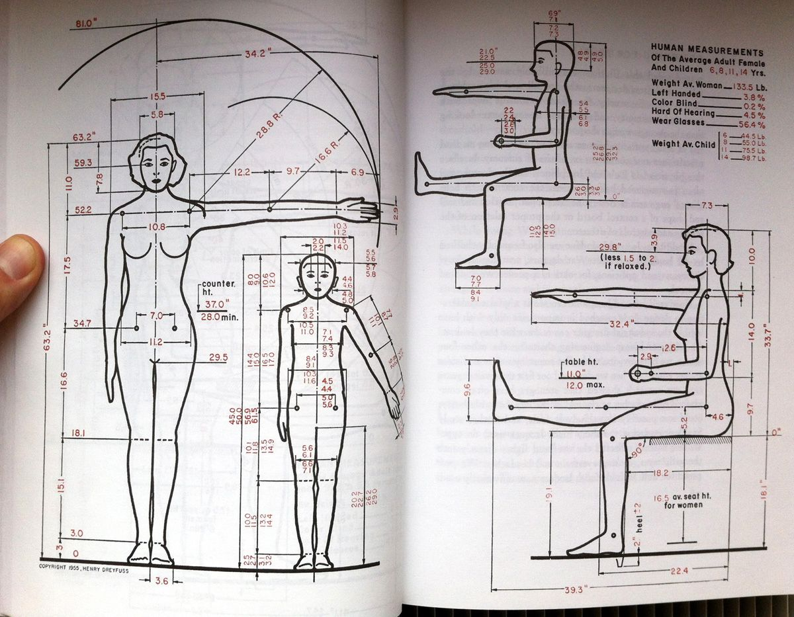

Ergonomia. Disciplines que intervenen en ergonomia. Antropometria. Presentació de fonts i
tipus de dades. Percentils. Recomanacions per a l'aplicació de les dades.

L'"ergonomia" és una manera de mesurar la funció dels dissenyadors industrials. És la recerca d'un ajust ideal entre les màquines i els seus usuaris. Les eines s'han d'escalar convenientment, controls fàcils de manejar, perfectament equilibrats i contornejats per adaptar-se a l'usuari.

<small>*Font: Le Funambule — Human Engineering.*</small>

Aquest diagrama de Henry Dreyfuss va decorar moltes oficines de disseny industrial. Suggereix que els productes, com els vestits espacials, poden ajustar-se perfectament al cos humà. També, però, ens recorda que tots els cossos no són iguals ("6 anys d'edat," "típic," "mitjana"). I mostra una gamma de moviment molt restringida.

Tot i que és una idea atractiva, l'ergonomia mai es va convertir en una ciència. Un ajust perfecte requereix una selecció de mides, que no ho faran per a productes d'oficina o mobles. 

El bon disseny no és simplement una qüestió d'adaptar-se a les limitacions de les persones. També es tracta de saber què pot aprendre la gent.
Els telèfons només s'assemblen en la mesura en què el disseny de telèfon ha abandonat completament l'ergonomia.

## Bibliografia

**Smock, William.** *The Bauhaus ideal then and now: An illustrated guide to modern design.* Academy Chicago Publishers, 1993.

**Le Funambule**. *"Human Engineering": The Constraining Mensurations of Joe and Josephine.* thefunambulist.net. https://thefunambulist.net/
