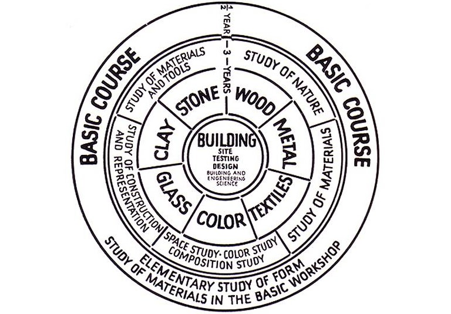
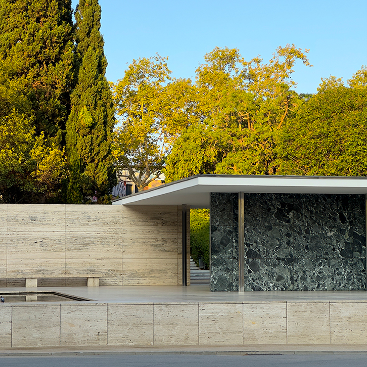
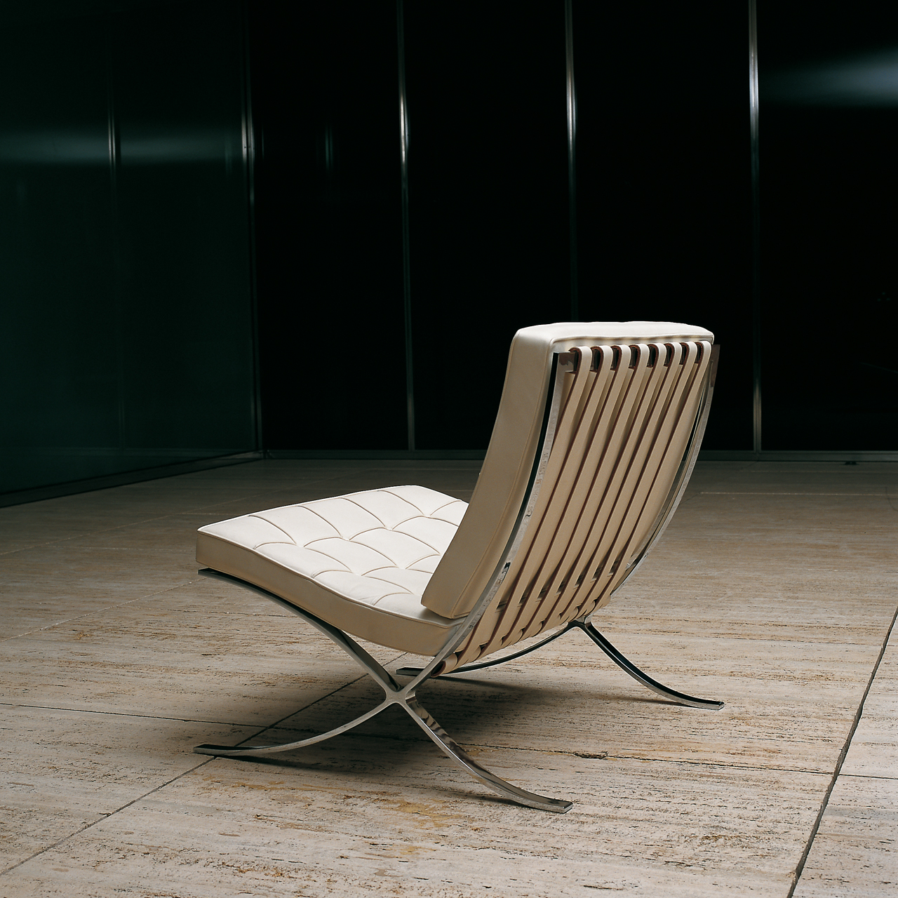

# El Deutscher Werkbund. La seua influència en el disseny industrial, arquitectònic i gràfic.

# La Bauhaus

# La Bauhaus

La Bauhaus va ser una escola de disseny fundada a Alemanya després de la Primera Guerra Mundial. El seu nom significa "casa de la construcció". El fundador, l'arquitecte Walter Gropius, volia trencar completament amb el passat, tant en el disseny com en l'educació, i va concebre l'escola per unir artistes i artesans, trencant les barreres professionals entre disciplines.

La Bauhaus va ser un producte en un temps i lloc determinat, l'Alemanya d'entreguerres. El seu objectiu era substituir l'estètica victoriana per un estil senzill adaptat a l'era de la màquina. La majoria d'idees del disseny modern (la tipografia sense serifa, els mobles "esquelètics", les teulades planes) ja existien abans de la Bauhaus; el que va fer l'escola va ser presentar-les de manera convincent i coherent, defensant el disseny d'interès públic: economia, simplicitat i utilitat.

Gropius va contractar professors de talent, que alhora reclutaven els seus millors alumnes com a futurs docents. Per exemple, Johannes Itten va dissenyar el curs introductori on els estudiants aprenien a treballar amb colors, formes i materials. Abans de triar un ofici concret, tots els alumnes havien de passar un any sencer aprenent aquests principis bàsics del disseny, considerats l'equivalent a les paraules i la gramàtica en el llenguatge.

L'escola va néixer quan Gropius va assumir la direcció d'un centre d'art a Weimar. Després de la derrota alemanya a la Primera Guerra Mundial, el poder de la província havia passat d'un gran duc a un parlament electe, i tant aquest parlament com Gropius volien que Alemanya prengués un nou rumb. Gropius va començar fusionant l'escola provincial d'art amb l'escola d'arts i oficis, abolint la distinció entre art pur i art aplicat: si "Bau" vol dir "construcció", tots els oficis i totes les arts quedaven unificats sota aquest objectiu comú i podien ensenyar-se sota un mateix sostre.

El 1922, el parlament provincial de Weimar va canviar de mans i el règim de Gropius a l'escola d'art estatal va acabar. Gropius va trobar un nou amfitrió per a la Bauhaus a Dessau, una ciutat manufacturera. L'èmfasi de l'escola va passar d'integrar arts i oficis a humanitzar el disseny industrial.

El professorat es dividia entre "mestres de la forma" (artistes) i "mestres de la tècnica" (artesans), que ensenyaven junts en tallers dedicats a un material concret: fusta, metall, vidre. A més de treballar a les taules de dibuix, els estudiants havien de qualificar-se com a oficials en un ofici. La meitat de la promoció d'ingrés eren dones, tot i que la majoria es van decantar cap a especialitats considerades "femenines", com el teixit.

<small>*Font: Barnhart — Linearity.*</small>

Entre les figures clau, es destaquen les següents:

- Walter Gropius: fundador, va portar artesans i artistes a treballar junts
- Ludwig Mies van der Rohe, arquitecte, va dirigir l'escola de 1930 a 1933; les seves obres es consideren de les més pures i elegants del disseny modern
- Wassily Kandinsky, pintor rus, pioner de l'abstracció, creia que color i forma transmeten missatges independents de la representació física
- Marcel Breuer, Anni Albers, Josef Albers, Marianne Brandt, Gunta Stöltzl, entre d'altres, van desenvolupar mobiliari, tèxtils i objectes que encara avui es consideren icones del disseny

Els visionaris de la Bauhaus esperaven que, abraçant les restriccions econòmiques, podrien magnificar el paper del dissenyador i les seves idees senzilles i sensates servirien per resistir els impulsos "de retallada" dels qui prioritzaven només el cost.

## Els principis estètics: "la forma segueix la funció"

L'apogeu del disseny modern als Estats Units va ser entre els anys quaranta i els setanta del segle XX. 

El mandat més conegut és "la forma segueix la funció", una màxima pronunciada per primer cop al segle XIX, però que Mies van der Rohe va portar a l'extrem lògic. Els seus gratacels de vidre no porten cap signatura d'autor ni cap ornament afegit: simplement fan allò que han de fer, que és allotjar oficines o habitatges. Paraules com "net" i "honest" van entrar al vocabulari de la crítica arquitectònica gràcies a ell. El Seagram Building de Nova York (1958) n'és l'exemple paradigmàtic: l'edifici es manté dret gràcies a un esquelet d'acer, no gràcies als seus murs, i una planta baixa transparent dramatitza aquesta idea. Mies practicava un disseny "de dins cap enfora", que donava la benvinguda als avanços de l'enginyeria perquè hi veia noves possibilitats estructurals.

Abans que aquest principi es popularitzara, els dissenyadors miraven cap al passat a la recerca de formes que pogueren manllevar. Un cop es va imposar, els productes i els edificis van deixar de voler semblar una altra cosa: el material i el tractament de la superfície es van reduir al mínim, la mecànica es va deixar veure, i forma i contingut es van fer idèntics.

Un exponent d'aquesta idea és el principi de "veritat als materials": que cada material siga ell mateix, sense plàstic disfressat de fusta, cromat, tela o cuir, sense fusta aglomerada fent-se passar per roure. Real, no fals: fer aparéixer la bellesa de la cosa en si mateixa. Els modernistes rebutjaven el simbolisme argumentant que fins i tot els temples grecs havien estat funcionals en el seu moment: les columnes de pedra sostenien un sostre de fusta i teules perquè aquella era la manera lògica de construir amb aquell material, de la mateixa manera que un aqüeducte romà fa servir blocs i morter, o un graner és una estructura funcional de fusta. 

Mies va formular encara un tercer mandat, potser el més cèlebre: "menys és més". Es tracta d'una idea vinculada a les anteriors. Mies va agafar un principi d'enginyeria (l'economia) i el va convertir en un principi estètic. En enginyeria, "econòmic" vol dir eficient en costos; per a Mies volia dir eficient visualment. Segons ell, un bon disseny mostra com funciona un edifici: cal despullar-lo d'ornament, simbolisme i gest, i el que en queda són els ossos nus (textura i color, pes, proporció, silueta). El Pavelló de Barcelona (1929) n'és un gran exemple; un edifici reduït al mínim indispensable (part de dalt, una de baix i alguns laterals). La cadira Barcelona que Mies va dissenyar per al mateix pavelló segueix la mateixa estratègia, no fa servir més material del que exigeix la comoditat, amb cintes metàl·liques brillants formant l'estructura, tires de tela unint seient i respatller, i coixins prims de cuir que reparteixen el pes.

<small>*Font: Fundació Mies Van der Rohe — The Pavilion: Image Gallery.*</small>

<small>*Font: Fundació Mies Van der Rohe — The Pavilion: Image Gallery.*</small>

El disseny gràfic modernista va aplicar el mateix principi d'economia a les lletres romanes antigues, sota la creença que la solució més mínima és també la més ben resolta: net, endreçat, directe, sense excuses. La composició de pàgina es basava en una graella rectangular i en tipografies despullades. 

Els dissenyadors de producte moderns, rebutjant l'antiguitat com a font d'inspiració, van buscar-la en cultures no occidentals i en llocs on es fa feina de veritat com tallers, laboratoris i cuines.

## L'herència que el modernisme volia deixar enrere

Abans de Mies i els seus contemporanis, els edificis justificaven la seva existència en termes simbòlics. Les universitats nord-americanes construïen campus que volien semblar universitats angleses, i enganxaven façanes gòtiques sobre gimnasos i centrals elèctriques descomunals. Fins i tot els gratacels rebien el tractament gòtic (mausolis d'acer que fingien ser piles de pedra). L'Empire State Building, durant dècades l'edifici més alt del món, va quedar revestit de pedra. 
En el disseny industrial, el malson que perseguia els dissenyadors moderns era el saló de finals del segle XIX: fosc, pesant i atapeït. Les pantalles de làmpada, en lloc de difuminar la llum, simplement la bloquejaven. Les butaques eren sobrecarregades de coixins però no necessàriament còmodes. El patró estampat sobre mobles, parets i terres no feia més que camuflar-ne la funció.

Amb el modernisme, el fet a mà va cedir el lloc al fet a màquina; "bo" i "elegant" van deixar de ser sinònims, les làmpades van començar a semblar fanals de carrer i no gerros; es va dir adéu al vidre tallat, a les puntes i a les cortines pesants, i al mobiliari de menjador de caoba amb vitrines plenes de porcellana de família. Els cotxes van deixar de mimetitzar els carruatges per mirar de semblar avions.

## Ideologia i política darrere de "menys és més"

Tractar un edifici com una màquina, i no com un niu de símbols, era per als dissenyadors un gest racional; deixar que els avanços de l'enginyeria, i no el costum, dictessin la forma d'un edifici era vist com un tribut a la raó humana.

"Menys és més" tenia també un vessant internacionalista i transcultural: en despullar el disseny d'història i substituir-la per principis universals i atemporals, el modernisme pretenia crear formes que parlaren a tothom. 

"Menys és más" tenia també un costat democràtic i igualitari. Pioners com Walter Gropius rebutjaven la monumentalitat en arquitectura: Gropius va fer inscriure les dimensions humanes (l'alçada de cada planta, en la majoria dels casos) a l'exterior de l'edifici de la Bauhaus. Aquesta "escala humana" afirmava que els edificis eren màquines al servei de les persones, no cartells del poder estatal o religiós. 

## La relació ambigua entre l'art modern i el disseny de la Bauhaus

L'escultura i la pintura mural, formes d'art subordinades a la "construcció", tenien els seus propis tallers a la Bauhaus. La pintura de cavallet, en canvi, no. Gropius denunciava "l'art per l'art" com una indulgència estèril: seguint l'exemple d'artistes russos com El Lissitzky i Alexander Ròdtxenko, que després de la Revolució Russa es van posar a dissenyar cartells i anuncis, es volia que l'art servira les persones i no només els connoisseurs adinerats. Gropius va escriure el 1923 que l'error pedagògic fonamental de les acadèmies venia de la seva preocupació pel geni individual i el menyspreu del valor de l'assoliment digne a un nivell menys exaltat, ja que l'acadèmia formava una multitud de talents menors dels quals a penes un d'entre mil arribava a ser un veritable arquitecte o pintor, condemnant la resta a una vida d'activitat artística infructuosa.

Gropius no creia que l'art es pogués ensenyar. En Les senyoretes d'Avinyó (1907), Picasso es va esforçar a no comunicar cap pensament ni relatar cap experiència: la imatge no es pot resumir ni explicar, ni tan sols pel mateix Picasso; no és artesanal i no té cap valor social redemptor. Amb poques excepcions, com Guernica, la pintura de Picasso és art per l'art. 

## El declivi: la reacció postmoderna

Un moviment per abandonar l'estètica de la màquina va començar als anys setanta. Els arquitectes van enviar senyals que la seva professió s'havia tornat massa seriosa, massa aleccionadora, massa lligada a les regles; volien més espai per a l'expressió personal, per allò inesperat i fantasiós. Robert Venturi va disparar el primer tret: el 1966 va publicar Complexity and Contradiction in Architecture, seguit d'un estudi entusiasta sobre Las Vegas, on idees com "honestedat", "veritat als materials" i "escala humana" mai havien arrelat. La seva pròpia arquitectura d'aquella època fa concessions exagerades al gust popular i al·lusions exagerades a edificis del passat; ell i la seva sòcia, Denise Scott Brown, volien restaurar allò que l'arquitectura havia perdut, la memòria històrica, l'expressivitat de la metàfora i un to de veu que és difícil de captar, però que mai no coincideix amb la freda superioritat de Mies van der Rohe.

La reacció postmoderna va transformar molt més que l'arquitectura. En disseny gràfic van reaparèixer estils tipogràfics ornamentats, per acabar desapareixent de nou; els ordinadors van facilitar distorsionar i difuminar la lletra, i els dissenyadors van fer servir aquests recursos per combatre la pompositat de la paraula impresa. Les composicions es van tornar més laberíntiques i menys clares, i les eleccions de color (pastels, colors de còmic dominical, tintes fluorescents i metàl·liques) violaven expressament els tabús modernistes. En disseny industrial, la contrarevolució va començar a Itàlia, Ettore Sottsass i Memphis, l'estudi de disseny de Milà que ell va ajudar a fundar, van ser una font d'irreverència, color i originalitat en el disseny de producte; la seva contrarevolució va arribar a les botigues de mobles nord-americanes en una versió molt diluïda (ferro forjat, estampats de pell de lleopard, butaques de cuir farcit, làmpades aerodinàmiques). Els postmodernistes volien una anarquia perpètua, no un altre sistema únic vàlid per a tothom. 

Les formes geomètriques apel·laven als dissenyadors de Bauhaus perquè semblaven noves, impersonals i assenyades, en sintonia amb una era tecnològica.

L'aspecte més sorprenentment nou del seu edifici Bauhaus a Dessau és una paret de vidre de tres pisos. Mies van der Rohe va anar encara més enllà amb el vidre. El vidre ha estat la marca de l'arquitectura moderna des de llavors. És honest, no amaga res. És nou; els edificis més antics tenien grans finestres, però mai semblaven estar fets de vidre. És saludable, portant llum solar a l'interior.

Al final de la seua carrera, Mies van der Rohe va capgirar la fórmula funcionalista. Va decretar que la funció havia de seguir la forma.

El funcionalisme mai va ser la resposta de propòsit general que va afirmar ser. Era menys racional del que li agradava pretendre, sovint. Un altre aspecte, com Art Deco o Arts and Crafts.

## Bibliografia

**Campi i Valls, Isabel.** *Iniciació a la història del disseny industrial.* Edicions 62, 1994.

**Dormer, Peter.** *El diseño desde 1945.* Ediciones Destino, 1993.

**Smock, William.** *The Bauhaus ideal then and now: An illustrated guide to modern design.* Academy Chicago Publishers, 1993.

**Barnhart, Ben.** *The graphic designer’s guide to Bauhaus design.* Linearity, 02 gen 2024. https://www.linearity.io/blog/bauhaus-design/

**Fundació Mies van der Rohe.** *The Pavilion: Image Gallery.* Fundació Mies van der Rohe, miesbcn.com. https://miesbcn.com/the-pavilion/images/