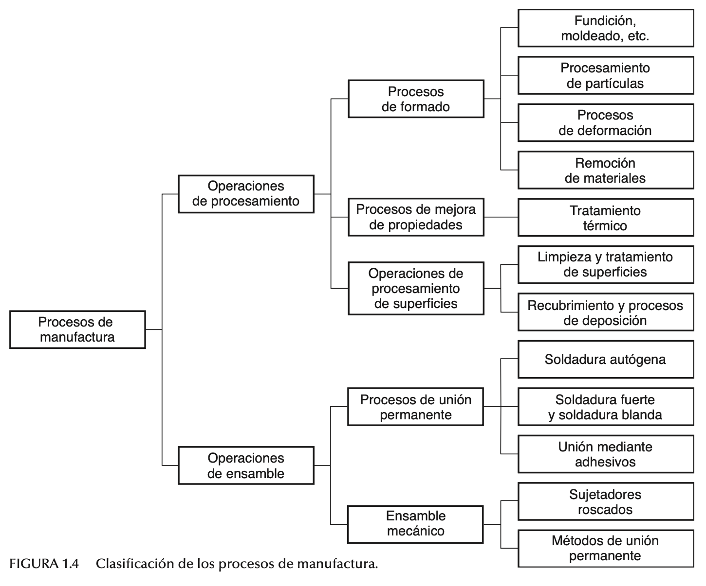

# Origen i evolució de les màquines i els procediments industrials

## La revolució industrial conseqüències

<small>*Font: Groover — Fundamentos de manufactura moderna.*</small>

## Bibliografia

**P. Groover, Mikell.** *Fundamentos de manufactura moderna.* McGrawHill, 2007.

**Campi i Valls, Isabel.** *Iniciació a la història del disseny industrial.* Edicions 62, 1994.

**Dormer, Peter.** *El diseño desde 1945.* Ediciones Destino, 1993.

**Smock, William.** *The Bauhaus ideal then and now: An illustrated guide to modern design.* Academy Chicago Publishers, 1993.

**Morris, William.** *Arte y artesania.* Langre, 2017.

**Navarro Lizandra, Jose Luís.** *Maquetas, modelos y moldes: materiales para dar forma a las ideas.* Publicacions Universitat Jaume I, 2011.