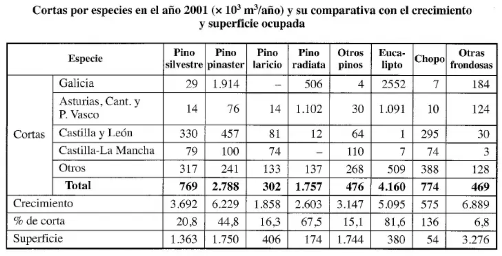
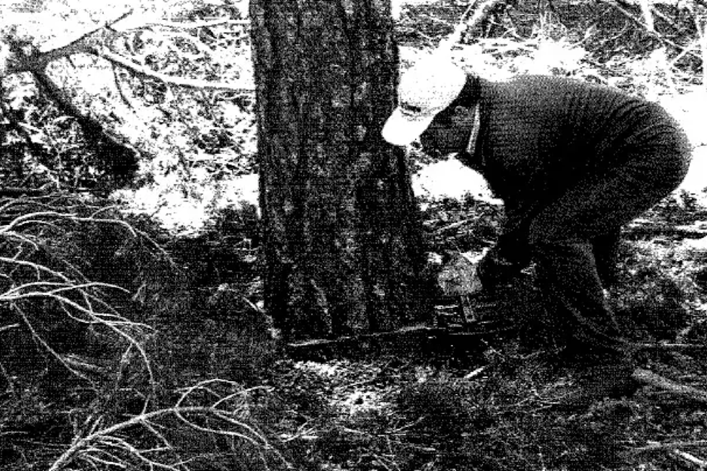
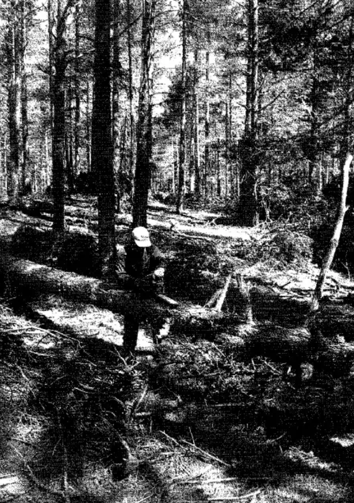
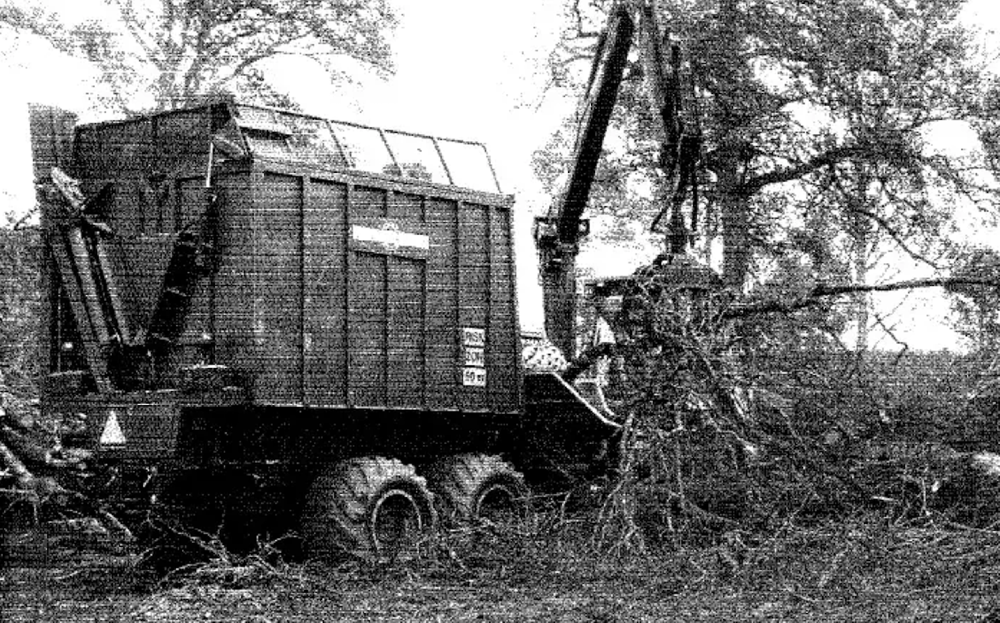

# Fusta

La producció forestal espanyola es caracteritza per una notable concentració, tant pel que fa a les espècies aprofitades com a la seua distribució geogràfica. Malgrat la gran diversitat d'espècies arbòries presents al país, l'activitat extractiva se centra pràcticament en un grapat d'elles: només sis espècies arriben a representar més del 90% de tota la fusta extreta. Destaquen especialment els pins (pinastre i radiata) i l'eucaliptus, que junts sumen més del 75% del volum total, tot i que la superfície que ocupen aquestes espècies és relativament reduïda, al voltant d'una quarta part del total.

Pel que fa a la distribució territorial, l'extracció també es mostra fortament concentrada en unes poques zones. Galícia lidera clarament la producció, aportant gairebé la meitat del total estatal (al voltant del 45%). La resta de la Cornisa Cantàbrica hi suma un altre 20% aproximadament, mentre que Castella i Lleó i Castella-la Manxa hi contribueixen en proporcions molt més modestes (entorn de l'11% i el 4%, respectivament). En conjunt, la resta del territori espanyol tot just aporta una cinquena part de la fusta extreta al país. Aquestes dades posen de manifest que Galícia i la Cornisa Cantàbrica, entre totes dues, generen més de dos terços de la producció fustera espanyola.

<small>*Font: Vignote & Martínez — Tecnología de la madera*</small>

## Varietats

## Anatomia de la fusta

## Talada, serrada i assecatge

### Operacions prèvies a la tala

**Escatat (descalçat)**: operació poc freqüent que consisteix a eliminar l'escorça del tronc a la zona on es farà el tall transversal. Avantatges: aprofita més centímetres de fusta (la zona de més valor) i facilita la tala (menys temps i menys desgast de la motoserra). Es fa sobretot en eucaliptus grans, ja que la seva escorça sovint embussa la cadena. Sempre es fa amb destral.

### Tala (abatiment)

Consisteix a tallar transversalment l'arbre el més a prop possible del terra i fer-lo caure. És l'única operació que sempre es fa, i sempre a peu de soca.

- Cal fer-ho al ras del terra: aprofita més volum, evita plagues de perforadors (*Hylobius abietis*) i no obstaculitza el pas del tractor.
- La caiguda ha d'estar **dirigida**: si un arbre madur cau sobre un altre, provoca ferides que poden ser porta d'entrada de fongs de podridura i debiliten l'arbre davant perforadors.
- Quan es força la direcció de caiguda: tala **dirigida**. Quan es marca la direcció general per a tot l'aprofitament: tala **planificada**.
- Eina principal: motoserra (cada cop més la cosechadora). Amb arbres prims (<15 cm de base) pot sortir més a compte la destral o la motodesbrossadora.
- **Límits d'actuació**: motoserra i destral no en tenen; les motodesbrossadores tenen límit de gruix; les taladoras/cosechadores tenen límit de gruix del tronc (45-50 cm) i de pendent (difícil per sobre del 25-30%).
- Inversió i manteniment: motoserra/destral/motodesbrossadora són barates i fàcils de manejar; les màquines grans són molt cares i necessiten mà d'obra especialitzada.
- Productivitat: en general més alta amb màquines.
- Duresa i seguretat: la destral és extremadament dura i insegura (exposició a la intempèrie); la motoserra redueix l'esforç però és més perillosa (soroll, gasos, vibracions → sordesa, dits blancs); la motodesbrossadora és similar però amb arbres petits és menys perillosa; les màquines amb cabina són molt més segures i confortables.

<small>*Font: Vignote & Martínez — Tecnología de la madera*</small>

### Esbrancat

Consisteix a eliminar les branques de l'arbre abatut per deixar el fust net, tallant arran del tronc. Es fa gairebé sempre (excepte en fusta prima per a energia, ja que l'extracció resulta poc rendible).

Es recomana fer-ho al ras del fust (facilita el descortiçat, l'arrossegament i l'apilat) i el més a prop possible de la soca, per evitar l'empobriment del sòl (perdre fulles i branques allà on van créixer). Si es fa al carregador, és difícil d'organitzar (arbres entrellaçats pel transport) i suposa perdre nutrients del sòl. Es fa gairebé sempre amb motoserra (la mateixa de la tala, o una de més lleugera).

<small>*Font: Vignote & Martínez — Tecnología de la madera*</small>

### Escapçat

Tallar la punta prima de l'arbre (diàmetre mínim aprofitable), segons la destinació de la fusta. Es fa amb la mateixa màquina i al mateix lloc que l'esbrancat.

### Trossejat

Dividir el fust en trossos (troces) d'una longitud fixada, segons la destinació i el mitjà de transport. Cal fer un tall net i perpendicular a l'eix de l'arbre per facilitar el transport i l'aprofitament industrial. Ecològicament convé fer trossos curts per reduir la compactació del sòl. Es fa sovint al mateix lloc i amb la mateixa maquinària que l'esbrancat.

### Altres operacions

**Descortiçat**: eliminar l'escorça del fust ja esbrancat. Ecològicament convé fer-ho a peu de soca (evita empobrir el sòl), però normalment es fa a fàbrica, amb destral/peladores manuals al mont, o descortiçadores anulars/de martells o tambors a fàbrica.

**Tractament de la fusta**: la fusta exposada al mont pateix atacs xilòfags i pèrdua d'humitat (esquerdes). El tractament amb insecticides/fungicides al mont té l'inconvenient de la incorporació incontrolada de productes químics. El millor tractament és una bona organització que porti la fusta a fàbrica ràpid. El tractament contra agents biòtics es fa sobretot a fàbrica.

**Estellat**: consisteix a triturar la fusta amb estelladores (de disc o tambor). Es pot fer a peu de soca, a zones de reunió, al carregador o a fàbrica (el més habitual).

<small>*Font: Vignote & Martínez — Tecnología de la madera*</small>

**Neteja i condicionament final de la zona de tala**: cal gestionar els residus generats (tala, esbrancat, trossejat, descortiçat, escapçat). Avantatges: retornar nutrients al sòl (com a residus sense elaborar, estelles o cendres). Segons Malkonen (1976), les acícules, branques i escorça concentren una part important dels nutrients de l'arbre. Inconvenients de deixar els residus al mont: augmenten el risc d'incendis, poden propagar plagues i malalties, dificulten la regeneració natural, redueixen el valor paisatgístic i l'hàbitat de la fauna, i deterioren les conques torrencials. Per això s'acostumen a eliminar per crema, estellat o aprofitament industrial/energètic.

**Cubicació**: mesurar el volum o pes de la fusta per confirmar el volum real de l'explotació i liquidar segons els valors obtinguts. Es pot fer a peu de soca, al carregador, en camió o a fàbrica.

**Classificació**: separar la fusta per qualitats segons les exigències de cada destinació industrial (serrat, desenrotllament, xapa, postes, etc.). És una operació complexa que requereix un especialista; per això es sol fer al carregador o a fàbrica.

**Apilat**: emmagatzemar la fusta abans del transport, sobretot per coordinar la saca i el transport (si falla un element, no s'atura tota l'explotació). Si l'objectiu és coordinació, l'apilat és petit i a peu de pista; si és mantenir estoc o reduir pes, és gran i al carregador. Molt habitual amb eucaliptus (redueix pes i asseca la capa de càmbium, lliscosa i perillosa).

### Transport (saca/desembosc)

- **Tractor d'arrossegament (skidder)**: tractors petits amb cable de +50 m; enganxen la fusta i l'extreuen semi-suspesa des de la part posterior.
- **Tractor autocarregador**: porta un remolc carregat amb una grua amb pinça; la fusta prèviament apilada es carrega i es transporta en suspensió, sense contacte amb el terra.
- **Cable aeri**: infraestructura mòbil similar a un telecadira, pràcticament sense limitacions de pendent.

## Propietats físiques i mecàniques

## Defectes més freqüents de la fusta

## El treball de la fusta

## Patologies i tractaments

## Bibliografia

**Vignote Peña, Santiago & Martínez Rojas Isaac.** *Tecnología de la madera.* Mundi-Prensa, 2005.
