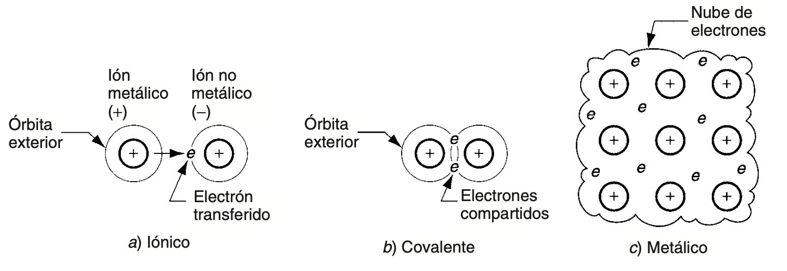
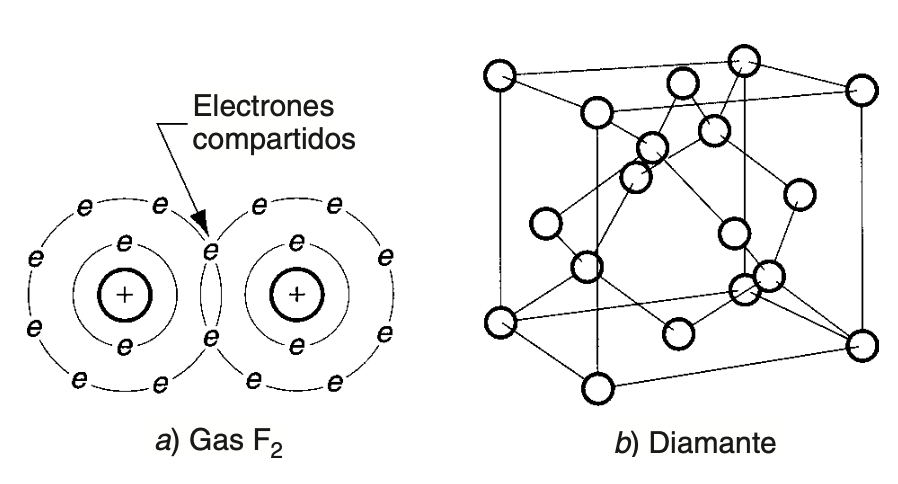
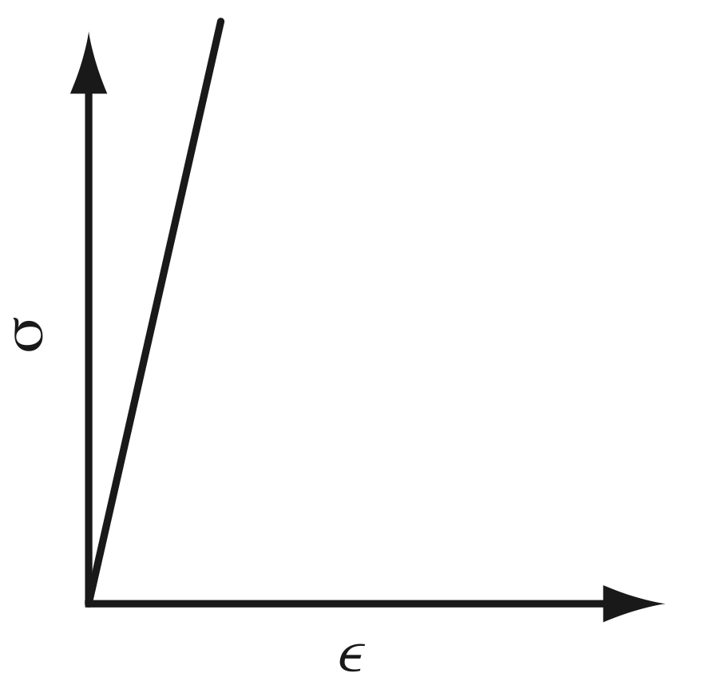

# Materials ceràmics

Habitualment es considera que els metalls constitueixen la classe més important de materials de l'enginyeria. Ara bé, resulta interessant advertir que, en realitat, els materials ceràmics són encara més abundants i s'utilitzen amb més freqüència. Dins d'aquesta categoria hi trobem els productes d'argila (per exemple, maons i vaixelles), el vidre, el ciment i altres materials ceràmics més moderns, com el carbur de tungsté o el nitrur cúbic de bor.
La rellevància dels ceràmics com a materials de l'enginyeria prové tant de la seua abundància a la natura com de les seues propietats mecàniques i físiques, força diferents de les dels metalls. Un material ceràmic és un compost inorgànic format per un metall (o semimetall) combinat amb un o més elements no-metàl·lics. El terme ceràmica deriva del grec ***<a>keramos</a>***, que fa referència a l'argila utilitzada en vasos o objectes fets de fang cuit.

Entre els exemples més destacats de materials ceràmics trobem la *sílice*, o diòxid de silici <a>(SiO₂)</a>, que constitueix l'ingredient principal de la majoria dels productes de vidre; l'*alúmina*, o òxid d'alumini <a>(Al₂O₃)</a>, emprada en aplicacions que van des dels abrasius fins als ossos artificials; i compostos més complexos, com el silicat d'alumini hidratat <a>(Al₂Si₂O₅(OH)₄)</a>, conegut com a *caolinita*, ingredient principal de la major part dels productes d'argila.

Les propietats generals que caracteritzen els materials ceràmics són l'***<a>elevada duresa</a>***, unes bones característiques d'***<a>aïllament tèrmic i elèctric</a>***, l'***<a>estabilitat química</a>*** i unes ***<a>temperatures de fusió altes</a>***. Alguns ceràmics són translúcids; l'exemple més clar és el vidre. A més, són ***<a>fràgils i pràcticament no tenen ductilitat</a>***, la qual cosa provoca problemes tant durant el seu processament com en el seu comportament en ús.

Els materials ceràmics es classifiquen en tres tipus bàsics. En primer lloc, hi ha els ***<a><u>ceràmics tradicionals</u></a>***, *<a>silicats</a>* utilitzats en productes d'argila com ara vaixelles i maons, com també abrasius comuns i ciment. En segon lloc, es poden trobar els ***<a><u>nous ceràmics</u></a>***, desenvolupats més recentment a partir de materials que *<a>no són silicats</a>*, com òxids i carburs, i que solen presentar *<a>propietats mecàniques o físiques que els fan superiors</a>* als ceràmics tradicionals. Finalment, hi ha els ***<a><u>vidres</u></a>***, *<a>basats principalment en la sílice</a>*, que es distingeixen de la resta de ceràmics per la seua *<a>estructura no cristal·lina</a>*.

Els compostos ceràmics es caracteritzen per presentar enllaços covalents i iònics. Aquests són més forts que els enllaços metàl·lics dels metalls, la qual cosa contribueix a l'elevada duresa i rigidesa, però també a la baixa ductilitat, dels materials ceràmics. De la mateixa manera que la presència d'electrons lliures en l'enllaç metàl·lic explica per què els metalls són bons conductors de la calor i l'electricitat, la presència d'electrons fortament empaquetats a les molècules dels ceràmics explica per què aquests materials són mals conductors. L'enllaç fort també proporciona a aquests materials temperatures de fusió elevades, tot i que, en alguns casos, certs ceràmics es descomponen en lloc de fondre's.

*L'enllaç covalent és aquell en què els àtoms comparteixen electrons (a diferència d'aquells en què hi ha una transferència) de les seves capes externes, amb la finalitat d'assolir un conjunt estable de vuit electrons.*

<small>*Font: Groover, M. P. — vegeu bibliografia.*</small>

La major part dels materials ceràmics adopten una estructura cristal·lina, la qual, en general, resulta més complexa que la de la majoria dels metalls. Diverses raons expliquen aquest fet. En primer lloc, les molècules dels ceràmics solen estar formades per àtoms de mides notablement diferents entre si. En segon lloc, és habitual que les càrregues dels ions siguin molt diverses, com passa en molts ceràmics comuns com ara el <a>SiO₂</a> i l'<a>Al₂O₃</a>. Aquests dos factors tendeixen a imposar una disposició física més complicada dels àtoms dins la molècula, i, per tant, també en l'estructura cristal·lina resultant. A més, molts materials ceràmics estan formats per més de dos elements, com és el cas de l'<a>Al₂Si₂O₅(OH)₄</a>, fet que igualment contribueix a una major complexitat de l'estructura molecular. Els ceràmics cristal·lins es presenten com a cristalls aïllats o com a substàncies policristal·lines. En aquest segon cas, més freqüent, les propietats físiques i mecàniques queden condicionades per la mida del gra: els materials de gra fi assoleixen una resistència i una rigidesa més elevades.

{ width="50%" }

<small>*Font: Groover, M. P. — vegeu bibliografia.*</small>

Els materials ceràmics són ***<a>rígids i fràgils, i mostren un comportament esforç-deformació perfectament elàstic</a>***. Els mòduls de duresa i elasticitat de molts dels nous materials ceràmics superen els dels metalls.

En teoria, la resistència dels materials ceràmics hauria de ser superior a la dels metalls a causa del seu enllaç atòmic, ja que els enllaços covalents i iònics són més forts que el metàl·lic. Ara bé, l'***<a>enllaç metàl·lic té l'avantatge de permetre el lliscament</a>***, mecanisme bàsic pel qual els metalls es deformen plàsticament quan se'ls sotmet a esforços elevats. Els ***<a>enllaços dels materials ceràmics, en canvi, són més rígids i no permeten aquest lliscament davant dels esforços</a>***. Aquesta incapacitat de lliscar dificulta molt més que els ceràmics puguen absorbir esforços. Tanmateix, els materials ceràmics contenen les mateixes imperfeccions en la seua estructura cristal·lina que els metalls: buits, intersticis, àtoms desplaçats i esquerdes microscòpiques. Aquests defectes interns tendeixen a concentrar els esforços, especialment quan hi intervé una càrrega per tensió, flexió o impacte.

A conseqüència d'aquests factors, ***<a>els ceràmics fallen amb molta més facilitat que els metalls per fractura fràgil quan se'ls aplica una força</a>***. La seua resistència a la tensió i la seua tenacitat són relativament baixes. Igualment, ***<a>el seu comportament és molt menys previsible a causa de la naturalesa atzarosa de les imperfeccions</a>*** i de la influència de les variacions en el processament, especialment en els productes fabricats amb ceràmics tradicionals. D'altra banda, els materials ceràmics ***<a>resisteixen substancialment millor la compressió que la tensió</a>***.

S'han desenvolupat diversos mètodes per millorar la resistència dels materials ceràmics, la majoria dels quals se centren fonamentalment a minimitzar la superfície, els defectes interns i els seus efectes. Entre aquests mètodes hi ha sis: 1) fer que els <a>materials de partida siguen més uniformes</a>; 2) <a>reduir la mida del gra</a> en els productes ceràmics policristal·lins; 3) <a>minimitzar la porositat</a>; 4) introduir <a>esforços superficials de compressió</a>, per exemple mitjançant l'aplicació d'un vidriat amb expansions tèrmiques baixes, de manera que el cos del producte es contraga després de la cocció més que el vidriat, cosa que fa que aquest actue a compressió; 5) <a>utilitzar fibres de reforç</a>; i 6) <a>aplicar tractaments tèrmics</a>.

## El guix 

## Varietats 

El guix natural és el mineral format per sulfat de calci amb dues molècules d'aigua de cristal·lització, és a dir, sulfat de calci hidratat. A la natura es presenta sota diverses formes, cadascuna amb el seu propi nom. Així, la selenita, la rosa del desert i l'alabastrina (o alabastre guixós), tot i tenir aspectes molt diferents entre si, són en realitat la mateixa substància.

## Transformació del guix natural o sulfat de calci hidratat (CaSO₄·2H₂O)

### 1. Calcinat entre 130° C i 170° C s'obté: Sulfat de calci semihidratat (CaSO₄·½H₂O)

| Característiques principals | Triturat | Denominació tècnica | Denominació comuna |
|---|---|---|---|
| Procedent d'una varietat de mineral pur conegut com ALABASTRE | Molt fi | Guix d'alabastre | Guix especial per a ceràmica |
| Procedent de mineral pur | Molt fi | Guix de dentista | |
| Procedent de mineral pur | Fi | Guix per a modelar | |
| Procedent de mineral comú | Molt fi | Guix per a motlles | Escaiola |
| Procedent de mineral comú | Fi | Guix per a estucs | |
| Procedent de mineral comú | Gruixut | Guix per a ornamentació | |
| Procedent de mineral comú | Gruixut | Guix per a revocs | |
| Mesclat amb substàncies que modifiquen l'enduriment i després es torna a calcinar a 1.200 °C | Amb alum | Guix alumbrat | Ciment anglès |
| Mesclat amb substàncies que modifiquen l'enduriment i després es torna a calcinar a 1.200 °C | Amb bòrax | Guix al bòrax | Ciment de París |
| Mesclat amb substàncies que modifiquen l'enduriment i després es torna a calcinar a 1.200 °C | Amb calç hidratada | Guix a la calç | Anhidrita o ciment de Scott |
| Mesclat amb substàncies que modifiquen l'enduriment i després es torna a calcinar a 1.200 °C | Amb silicat de potassi | Guix al silicat | Ciment de guix |

### 2. Calcinat entre 170° C i 250° C s'obté: Anhidrita soluble i anhidrita alfa (CaSO₄)

| Característiques principals | Triturat | Denominació tècnica | Denominació comuna |
|---|---|---|---|
| D'enduriment molt ràpid | Molt fi | Guix de fàbrica | Guix comú |
| D'enduriment molt ràpid | Molt fi | Guix per a construcció | Guix de paret |

### 3. Calcinat entre 400° C i 600° C s'obté: Anhidrita beta

| Característiques principals | Denominació tècnica | Denominació comuna |
|---|---|---|
| No es pot hidratar | Guix mort | |

### 4. Calcinat entre 900° C i 1.200° C s'obté: Sulfat de calci bàsic

| Característiques principals | Tipus d'enduriment | Denominació tècnica | Denominació comuna |
|---|---|---|---|
| Sense afegir substàncies que modifiquin l'enduriment | Enduriment lent | Guix hidràulic | |
| Sense afegir substàncies que modifiquin l'enduriment | Enduriment lent | Guix d'alta resistència | |
| Sense afegir substàncies que modifiquin l'enduriment | Enduriment molt lent | Guix per a paviments | |
| Mesclat amb substàncies que modifiquen l'enduriment després de la calcinació completa | Amb alum | Guix Keen | Ciment Keen / Guix per a estuc |
| Mesclat amb substàncies que modifiquen l'enduriment després de la calcinació completa | Amb bòrax | Guix Parian | Ciment Parian |

*Taula extreta del llibre "Maquetas, modelos y moldes. Materiales y técnicas para dar forma a las ideas" de Jose Luis Navarro Lizandra.*

D'entre totes elles, la varietat més utilitzada, gràcies a la seua fàcil adquisició, el baix cost i les nombroses possibilitats que ofereix en els treballs de modelatge, emmotllament i reproducció, és el guix escaiola. És cert que el guix de dentista o l'escaiola extradura són més resistents, de gra molt fi, i permeten treballs més precisos. Ara bé, aquests avantatges també es poden convertir en inconvenients, ja que, en ser molt més durs, el treball resulta més complicat.

## L'escaiola 

Resulta interessant remarcar els termes guix i escaiola, amb la finalitat de no generar confusions. La paraula *guix* serveix per anomenar qualsevol varietat de sulfat de calci (CaSO₄) entre les quals es pot trobar l'escaiola. 

## Característiques i propietats 

## Aplicació i usos en models, maquetes i prototips

## Bibliografia

**P. Groover, Mikell.** *Fundamentos de manufactura moderna.* McGrawHill, 2007.

**Navarro Lizandra, Jose Luís.** *Maquetas, modelos y moldes: materiales para dar forma a las ideas.* Publicacions Universitat Jaume I, 2011.

**Kojima, T.** *Models & Prototypes.* Graphic-Sha Publishing, 2000.

**Garcia Cuevas, Diego; Pugliese, Gianluca.** *Advanced 3D Printing with Grasshopper®: Clay and FDM.* Independently published, 2020.

