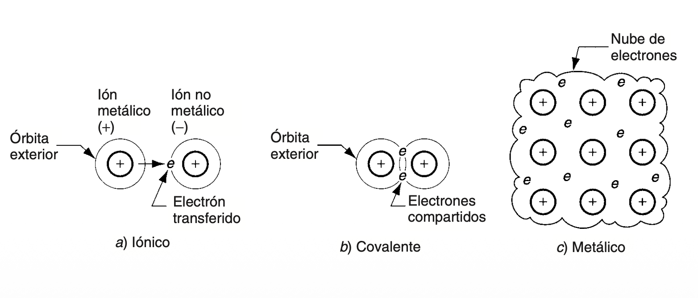
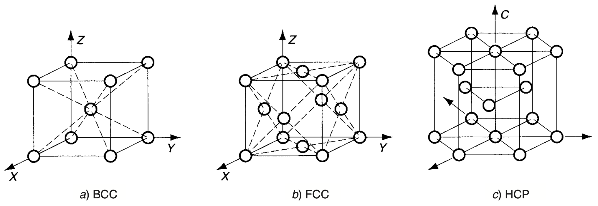
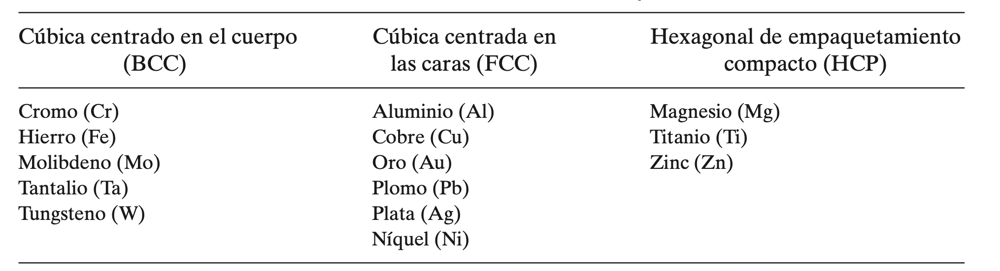
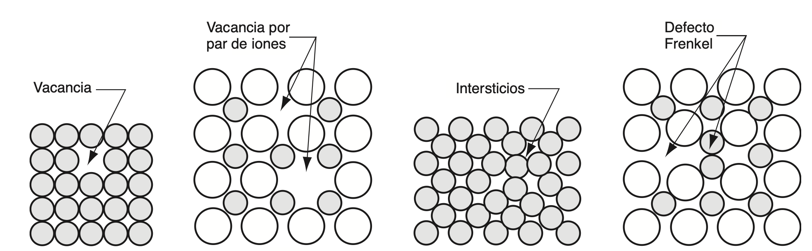
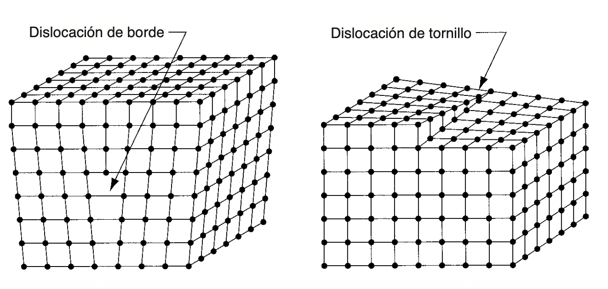
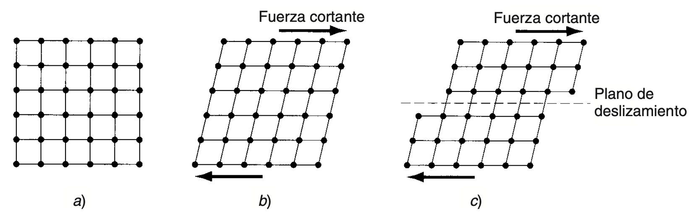
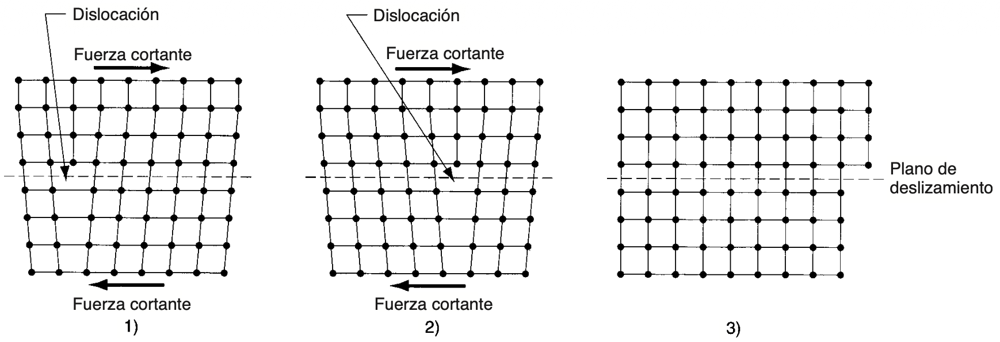
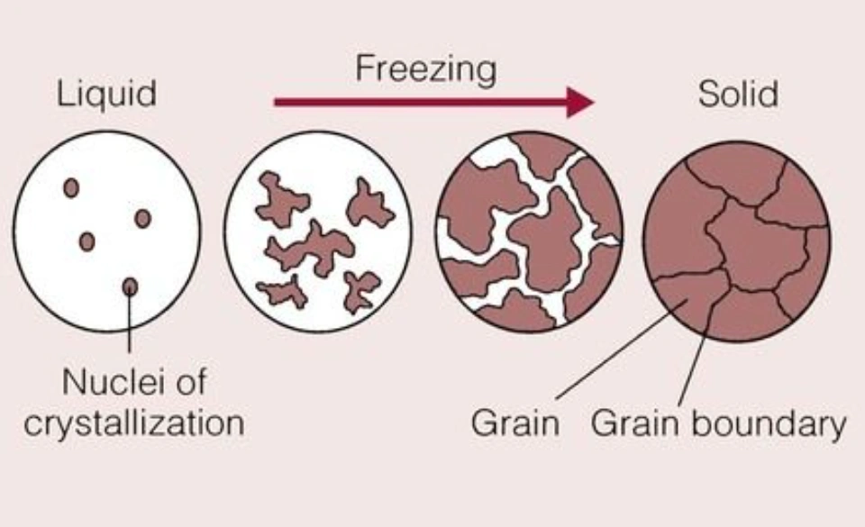
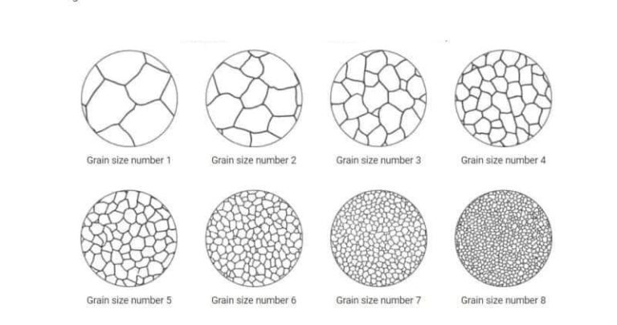

# Metalls 

## Característiques fisicoquímiques

L'enllaç metàl·lic és el tipus d'unió atòmica característic dels metalls purs i dels seus aliatges. Els àtoms dels elements metàl·lics solen tindre molt pocs electrons a la seua capa més externa, insuficients perquè cada àtom, individualment, arribe a completar-la. Per això, en lloc d'establir-se enllaços concrets entre parelles d'àtoms, el que passa és que els electrons més externs es posen en comú entre tots els àtoms del material, generant una mena de "núvol" d'electrons que envolta tot el conjunt. Aquest núvol és el que genera l'atracció necessària per a mantindre units els àtoms i donar lloc, en la majoria dels casos, a estructures fortes i rígides.

Com que els electrons es comparteixen d'esta manera col·lectiva i poden desplaçar-se lliurement pel metall, este tipus d'enllaç fa que els materials metàl·lics siguen bons conductors de l'electricitat. Açò contrasta amb la resta d'enllaços primaris, en què els electrons només es comparteixen de forma local entre àtoms pròxims, cosa que fa que eixos materials siguen mals conductors elèctrics. A més de la conductivitat elèctrica, els materials amb enllaç metàl·lic solen destacar també per una bona conducció de la calor i per una ductilitat notable.

<small>*Font: Groover — Fundamentos de manufactura moderna.*</small>

Una vegada explicat com s'uneixen els àtoms entre si mitjançant l'enllaç metàl·lic, cal veure com s'organitzen eixos àtoms dins del material. La raó és que el tipus d'enllaç no és l'únic factor que determina les propietats d'un metall: també hi influeix de manera decisiva la manera en què els seus àtoms es disposen en l'espai, és a dir, la seua estructura cristal·lina.

Una estructura cristal·lina és aquella en què els àtoms se situen en posicions ordenades i que es repeteixen en les tres dimensions de l'espai. Este patró d'ordenació pot repetir-se milions de vegades al llarg d'un mateix cristall. Per a representar-la, s'utilitza el concepte de cel·la unitària, que és l'agrupament geomètric bàsic d'àtoms que, en repetir-se contínuament, dona lloc a tota l'estructura.

En el cas dels metalls, hi ha tres tipus de xarxes cristal·lines que apareixen amb més freqüència: 1) la cúbica centrada en el cos (BCC), 2) la cúbica centrada en les cares (FCC), i 3) l'hexagonal compacta (HCP).

<small>*Font: Groover — Fundamentos de manufactura moderna.*</small>

Quan un metall, o qualsevol altre material, experimenta canvis d'estructura en funció de la temperatura, es diu que és <a>al·lotròpic</a>.

Hi ha diverses raons per les quals una xarxa cristal·lina pot no ser totalment perfecta. Habitualment apareixen imperfeccions de manera espontània, ja que el material, en solidificar-se, no sempre és capaç de mantindre la repetició de la cel·la unitària de forma contínua i indefinida. Els límits de gra dels metalls en són un bon exemple. En altres casos, estes imperfeccions s'introdueixen de manera intencionada durant el procés de fabricació, com quan s'afig un element d'aliatge a un metall amb l'objectiu d'augmentar-ne la resistència.

Les diverses imperfeccions que poden trobar-se en els sòlids cristal·lins també reben el nom de defectes. Tant "imperfecció" com "defecte" fan referència, en definitiva, a qualsevol desviació respecte al patró regular propi de l'estructura de la xarxa cristal·lina. Estos es classifiquen en tres grans grups: 1) defectes puntuals, 2) defectes lineals, i 3) defectes superficials.

Els defectes puntuals són aquelles imperfeccions de l'estructura cristal·lina que afecten un únic àtom o, com a molt, un grapat d'ells. Poden presentar-se de diverses formes, entre les quals destaquen les següents:

<a>**a) La vacant**</a>, que és el defecte més senzill de tots i consisteix, simplement, en l'absència d'un àtom en un dels punts de la xarxa on hauria d'haver-n'hi un.

<a>**b) La vacant per parell d'ions**</a>, coneguda també com a defecte Schottky, que es dona quan, en un compost que ha de mantindre l'equilibri de càrregues, falta un parell d'ions de signe contrari.

<a>**c) Els intersticis**</a>, que suposen una distorsió de la xarxa provocada per la presència d'un àtom "de més", situat en un lloc que normalment no ocuparia cap àtom.

<a>**d) El desplaçament iònic, o defecte Frenkel**</a>, que té lloc quan un ió abandona la seua posició habitual dins de la xarxa i acaba col·locant-se en un espai intersticial que, en condicions normals, no seria ocupat per este tipus d'ió.

<small>*Font: Groover — Fundamentos de manufactura moderna.*</small>

Un defecte lineal és, en essència, un conjunt de defectes puntuals que es troben connectats entre si i que formen, com el seu nom indica, una línia dins de l'estructura de la xarxa cristal·lina. D'entre tots els defectes lineals, el més rellevant és, sens dubte, la dislocació, la qual pot presentar-se sota dues formes diferents: a) la dislocació de vora i b) la dislocació helicoidal.

La dislocació de vora consisteix en l'existència d'un pla addicional dins de la xarxa, la vora del qual queda inserida enmig de l'estructura. Per la seua banda, la dislocació helicoidal es caracteritza per formar una espècie d'espiral al voltant d'una línia d'imperfecció, d'una manera semblant a com les rosques d'un caragol s'enrosquen al voltant del seu propi eix.

Tots dos tipus de dislocacions poden originar-se durant el procés de solidificació del material, o bé poden generar-se posteriorment a conseqüència d'un procés de deformació aplicat sobre el material ja en estat sòlid.

<small>*Font: Groover — Fundamentos de manufactura moderna.*</small>

Els defectes superficials són aquelles imperfeccions que s'estenen en dos direccions, formant així una mena de frontera dins del material. L'exemple més evident d'este tipus de defecte és la mateixa superfície externa de l'objecte cristal·lí, la qual defineix, precisament, la seua forma. Esta superfície suposa, en definitiva, una interrupció de l'estructura de la xarxa.

Ara bé, estes fronteres no apareixen només a l'exterior del material, sinó que també poden trobar-se dins. El millor exemple d'este tipus d'interrupcions superficials internes són els límits de gra.

Quan un cristall es veu sotmés a forces mecàniques que van augmentant progressivament, la seua primera resposta és deformar-se de manera elàstica. Açò es tradueix, bàsicament, en un cert allargament de l'estructura de la xarxa, sense que la posició dels àtoms dins d'esta arribe a canviar realment. Si en algun moment s'elimina la força aplicada, l'estructura de la xarxa torna a recuperar la seua forma original.

Ara bé, si l'esforç aplicat arriba a ser prou elevat en comparació amb les forces electroestàtiques que mantenen els àtoms fixos en la seua posició dins de la xarxa, aleshores es produeix un canvi ja permanent en la forma, conegut com a deformació plàstica. En este cas, el que ha passat és que els àtoms de la xarxa s'han desplaçat de manera definitiva respecte a la posició que ocupaven abans, i s'ha arribat a un nou equilibri dins de l'estructura.

Este procés de desplaçament, conegut com a lliscament, implica el moviment relatiu dels àtoms situats a banda i banda d'un determinat pla de la xarxa, anomenat per això pla de lliscament. Este pla ha d'estar més o menys alineat amb l'estructura de la xarxa, la qual cosa fa que hi haja unes direccions concretes al llarg de les quals és més probable que es produïsca el lliscament. El nombre d'estes direccions preferents de lliscament varia en funció del tipus de xarxa cristal·lina de què es tracte.

En este sentit, l'estructura HCP és la que compta amb menys direccions de lliscament, mentre que la BCC és la que en presenta més, i la FCC quedaria en una posició intermèdia entre totes dues. Per este motiu, els metalls amb estructura HCP solen tindre una ductilitat baixa i, en general, resulten difícils de deformar a temperatura ambient.

Si l'únic criteri que es tinguera en compte fora el nombre de direccions de lliscament, els metalls amb estructura BCC haurien de ser els que mostraren millor ductilitat. Tanmateix, la realitat no és tan senzilla: estos metalls solen ser, al mateix temps, més resistents que la resta, la qual cosa complica les coses, ja que requereixen esforços més elevats perquè es produïsca el lliscament. De fet, alguns metalls BCC arriben a presentar una ductilitat bastant pobra.

Els metalls amb estructura FCC, en canvi, solen ser els més dúctils de les tres estructures cristal·lines, perquè combinen un nombre elevat de direccions de lliscament amb una resistència que, generalment, és relativament baixa.

<small>*Font: Groover — Fundamentos de manufactura moderna.*</small>

Les dislocacions exerceixen un paper molt important a l'hora de facilitar el lliscament dins dels metalls. Quan una xarxa cristal·lina que conté una dislocació de vora es veu sotmesa a una força tallant, el material es deforma amb molta més facilitat que si es tractara d'una estructura perfecta, sense cap tipus de dislocació. Açò s'explica pel fet que, en presència d'esta força, la dislocació comença a desplaçar-se dins de la mateixa xarxa cristal·lina.

Ara bé, cal preguntar-se per què resulta més senzill moure una dislocació a través de la xarxa que no pas deformar directament la xarxa en si mateixa. La resposta té a veure amb el fet que els àtoms que formen part de la dislocació de vora necessiten desplaçar-se molt menys, dins de l'estructura ja distorsionada, per a arribar a una nova posició d'equilibri. Per este motiu, es requereix un nivell d'energia menor per a tornar a col·locar els àtoms en les seues noves posicions que no pas si la xarxa no tinguera cap dislocació. En conseqüència, també és necessari un nivell de força inferior per a produir la deformació.

Les dislocacions representen, doncs, una situació que resulta alhora beneficiosa i perjudicial. D'una banda, gràcies a elles el metall es torna més dúctil i pot arribar amb més facilitat a la deformació plàstica durant el seu procés de fabricació. D'altra banda, tanmateix, des del punt de vista del disseny del producte final, el metall resulta menys resistent del que seria si no existiren estes dislocacions.

<small>*Font: Groover — Fundamentos de manufactura moderna.*</small>

El maclat és l'altra manera en què els cristalls metàl·lics poden arribar a deformar-se plàsticament. Es defineix com aquell mecanisme de deformació plàstica en què els àtoms situats a un costat d'un determinat pla, anomenat pla de macla, canvien de posició fins a formar una espècie d'imatge especular respecte als àtoms situats a l'altre costat del pla.

Este mecanisme resulta especialment rellevant en els metalls amb estructura HCP, com per exemple el magnesi o el zinc, ja que este tipus de metalls no poden lliscar amb facilitat. A més de l'estructura cristal·lina, hi ha un altre factor que influeix en l'aparició de les macles: la velocitat amb què es produeix la deformació. La raó és que el mecanisme de lliscament necessita més temps per a desenvolupar-se que el de maclat, el qual pot arribar a produir-se de manera quasi instantània. Per això, en aquelles situacions en què la deformació té lloc a una velocitat molt elevada, els metalls que normalment formarien macles tendirien, en canvi, a lliscar.

<small>*Font: Deng — Overview of Grain Structure in Metals and Its Effect on Metal Fabrication.*</small>

Un bloc de metall, per menut que siga, conté a l'interior milions de cristalls individuals, coneguts com a grans. Cadascun d'estos grans té la seua pròpia orientació de xarxa, diferent de la dels altres, però, si es consideren en conjunt, els grans acaben orientant-se de manera aleatòria dins del bloc. Esta mena d'estructura, formada per multitud de grans amb orientacions diferents, rep el nom d'estructura policristal·lina.

De fet, no resulta gens difícil comprendre per què este tipus d'estructura és, precisament, l'estat natural que sol adoptar el material. Quan un bloc de metall es refreda a partir de l'estat fos i comença a solidificar-se, es van formant nuclis de cristalls individuals en posicions i orientacions aleatòries al llarg de tot el líquid. A mesura que estos cristalls van creixent, acaben trobant-se entre ells i interferint-se mútuament, cosa que fa que, en les zones de contacte, es formen defectes superficials: és ací on apareixen els límits de gra.

Este límit de gra consisteix, en realitat, en una mena de zona de transició, que potser només té un gruix d'uns quants àtoms, dins de la qual els àtoms ja no es troben alineats amb cap dels dos grans veïns.

<small>*Font: Caro — Yield Strength of Steel Explained: Why Does It Matter?*</small>

La grandària dels grans dins d'un bloc metàl·lic ve determinada, entre altres factors, pel nombre de llocs de formació de nuclis presents en el material fos, i també per la velocitat amb què es refreda la massa. En un procés de fosa, és habitual que estos llocs de formació de nuclis sorgisquen a partir de les parets del motle, relativament fredes, la qual cosa provoca certa tendència a l'orientació dels grans en eixa zona.

A més, hi ha una relació inversa entre la grandària del gra i la velocitat de refredament: com més ràpid és el refredament, més xicotet tendeix a ser el gra, mentre que un refredament lent produeix precisament l'efecte contrari. Este aspecte és important perquè la grandària del gra influeix directament en les propietats mecàniques del metall: com més xicotets són els grans, major sol ser la resistència i la duresa del material.

Un altre factor que també condiciona les propietats mecàniques és la presència mateixa dels límits de gra dins del metall. Estos límits constitueixen imperfeccions de l'estructura cristal·lina que interrompen el moviment continu de les dislocacions. Este fet ajuda precisament a entendre per què, com més xicotet és el gra, més augmenta la resistència del metall. En interferir en el moviment de les dislocacions, els límits de gra contribueixen igualment a una altra propietat molt característica dels metalls: la capacitat de tornar-se cada vegada més forts a mesura que es deformen. Esta propietat és, precisament, la que es coneix com a enduriment per deformació.

## Descripció dels sistemes mecànics de fabricació

### Per arrancada de ferritja

### Per tall

### Per deformació en fred

#### Laminatge

#### Forjat

#### Extrusió 

#### Trefilatge

## Bibliografia

**P. Groover, Mikell.** *Fundamentos de manufactura moderna.* McGrawHill, 2007.

**Deng, Y.** *Overview of Grain Structure in Metals and Its Effect on Metal Fabrication.* Proleantech, 11 dic. 2025. https://proleantech.com/de/grain-in-metal-and-effect/

**Caro.** *Yield Strength of Steel Explained: Why Does It Matter?* Richconn, 8 jul. 2025. https://richconn.com/yield-strength-of-steel/
