# Resistència dels materials 

Les propietats mecàniques d'un material són les que determinen com es comporta este quan es veu sotmés a algun tipus d'esforç mecànic. Dins d'estes propietats s'inclouen aspectes com el mòdul d'elasticitat, la ductilitat, la duresa i diverses mesures relacionades amb la resistència del material.

Estes propietats resulten fonamentals a l'hora de dissenyar qualsevol producte, ja que tant el seu funcionament com el seu rendiment depenen, en bona part, de la capacitat que tinga per a resistir la deformació davant dels esforços a què es veurà sotmés durant el seu ús habitual.

Quan es dissenya un producte, l'objectiu sol ser que este, junt amb tots els seus components, siga capaç de suportar els esforços a què es veurà sotmés sense que la seua geometria arribe a modificar-se de manera notable. Esta capacitat de resistència depén, fonamentalment, de propietats com el mòdul d'elasticitat o la resistència a la deformació del material.

Contràriament, quan es parla de fabricació, l'objectiu que es persegueix és justament el contrari. En este cas, el que interessa és aplicar precisament esforços que superen la resistència a la deformació del material, ja que és eixa superació la que permet modificar-ne la forma. De fet, processos mecànics com el conformat o el mecanitzat només funcionen perquè es generen forces capaces de véncer la resistència del material a deformar-se.

D'ací sorgeix, doncs, una mena de contradicció: aquelles propietats mecàniques que resulten més interessants des del punt de vista del disseny (com una resistència elevada) acaben, normalment, dificultant el procés de fabricació del producte. Per este motiu, resulta molt útil que l'enginyer de fabricació siga capaç de comprendre la perspectiva pròpia del disseny, i que, de la mateixa manera, el dissenyador tinga també en compte les necessitats i limitacions que imposa el procés de fabricació.

## Consideracions generals d'esforç i resistència

Els materials poden veure's sotmesos a tres tipus fonamentals d'esforços estàtics: de tracció, de compressió i de tall. Els esforços de tracció tendeixen a estirar el material, mentre que els de compressió el que fan és comprimir-lo o compactar-lo. Els esforços de tall, per la seua banda, són aquells que provoquen que porcions adjacents del material tendisquen a lliscar l'una respecte a l'altra.

En qualsevol dels tres casos, la relació bàsica que permet descriure les propietats mecàniques del material és la coneguda com a corba d'esforç-deformació.

## Tracció

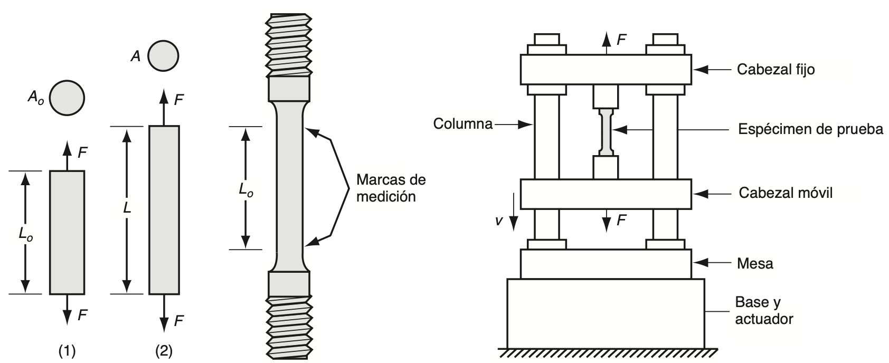

<small>*Font: Groover — Fundamentos de manufactura moderna.*</small>

L'assaig de tracció és el procediment més utilitzat per a estudiar la relació entre l'esforç i la deformació, especialment quan es tracta de metalls. Durant este assaig, s'aplica una força que estira el material, tendint tant a allargar-lo com a reduir-ne el diàmetre.

La forma en què s'ha de preparar i realitzar l'assaig ve especificada pels estàndards de l'ASTM (American Society for Testing and Materials). La proveta amb què s'inicia la prova compta amb una longitud original L0 i una àrea A0. Esta longitud es mesura com la distància entre les marques de referència, mentre que l'àrea correspon a la secció transversal de la proveta.

Al llarg de l'assaig la proveta es va estirant progressivament, fins que en un moment donat apareix un estrangulament localitzat i, finalment, es produeix la fractura del material. La finalitat de tot este procés és obtindre les dades necessàries per a poder determinar la relació entre l'esforç i la deformació. Existeixen dos tipus diferents de corbes esforç-deformació. Per una banda la corba d'esforç-deformació d'enginyeria, i per l'altra la corba d'esforç-deformació real.

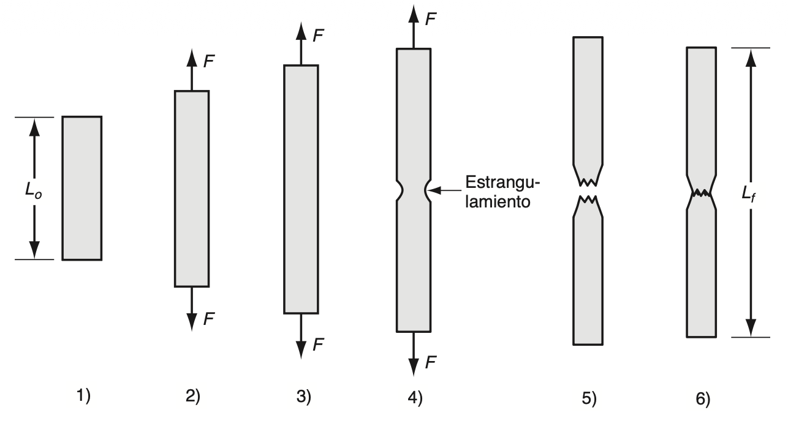

<small>*Font: Groover — Fundamentos de manufactura moderna.*</small>

### De enginyeria

L'esforç deformació d'enginyeria en una prova de tensió que es defineix en relació amb l'àrea i longitud originals de la proveta. Aquests valors són d'interès en el disseny pel fet que el dissenyador espera que les tensions-deformacions experimentades per qualsevol component del producte no canviaran la seva forma de manera significativa. L'esforç d'enginyeria (eix y) en qualsevol punt de la corba es defineix com la força dividida entre l'àrea original. 

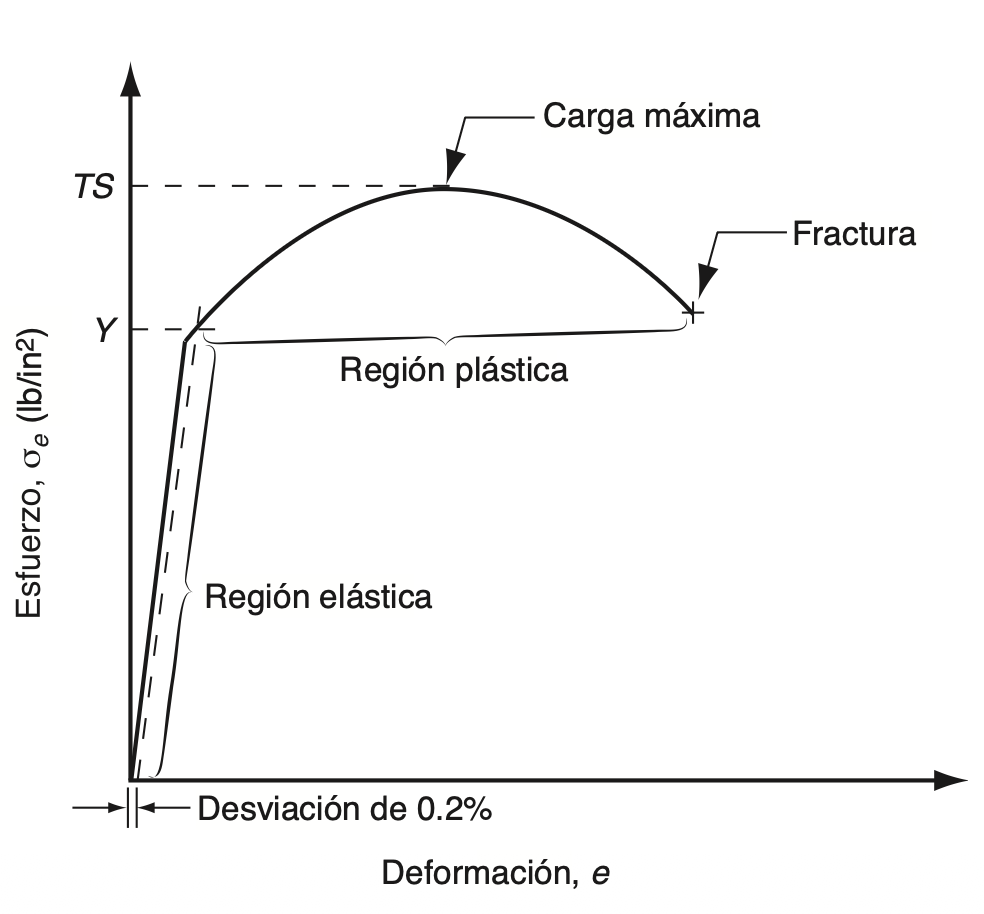{ width="50%" }

<small>*Font: Groover — Fundamentos de manufactura moderna.*</small>

$$\sigma_e = \frac{F}{A_o}$$

Mentre que la deformació d'enginyeria, es defineix per l'increment de longituds entre la longitud inicial

$$e = \frac{L - L_o}{L_o}$$

En la relació esforç-deformació es poden distingir dues regions ben diferenciades, que corresponen a dos comportaments diferents del material: el comportament elàstic i el comportament plàstic. En la regió elàstica, la relació entre l'esforç i la deformació és de tipus lineal, i el material es comporta de manera elàstica, ja que, si la càrrega, és a dir, l'esforç aplicat, deixa d'actuar, el material recupera la seua longitud original. Este comportament ve definit per la llei de Hooke, on el mòdul d'elasticitat representa un valor inherent del material.

$$\sigma_e = Ee$$

A mesura que l'esforç va augmentant, s'arriba a un punt en què la relació lineal deixa d'aplicar-se, i és en eixe moment quan el material comença a cedir. Este punt de deformació, que es representa com Y, queda identificat en la gràfica pel canvi de pendent que es produeix al final de la regió lineal. 

Ara bé, com que en la pràctica no és senzill detectar amb precisió a simple vista l'inici de la deformació, ja que habitualment no es manifesta com un canvi evident del pendent, s'ha establit com a criteri habitual definir Y com l'esforç al qual es produeix un avanç de la deformació del 0,2% respecte a la línia recta inicial. És a dir, el punt exacte en què la corba d'esforç-deformació del material talla una recta paral·lela a la part recta de la corba, però desplaçada respecte a ella una deformació del 0,2%. Este punt de deformació constitueix una característica pròpia de la resistència del material, motiu pel qual se sol fer referència a ell amb el nom de límit elàstic.

El punt de deformació marca la transició cap a la regió plàstica, és a dir, l'inici de la deformació plàstica del material. A partir d'este moment, la relació entre l'esforç i la deformació ja no es podrà explicar mitjançant la llei de Hooke. A mesura que la càrrega continua augmentant més enllà d'este punt de deformació, el material segueix allargant-se, però ara a un ritme molt més ràpid que abans, i este allargament va acompanyat, a més, d'una reducció uniforme de l'àrea de la secció transversal, la qual cosa resulta coherent amb el fet que el volum del material es mantinga pràcticament constant. 

Finalment, s'arriba a un punt en què la càrrega aplicada F assoleix el seu valor màxim. L'esforç d'enginyeria que es calcula en eixe punt concret és el que es coneix com a resistència a la tracció, o també <a>resistència final a la tracció del material</a>.

A partir del punt corresponent a la resistència a la tracció, i cap a la dreta de la corba esforç-deformació, la càrrega comença a disminuir, i és habitual que la proveta d'assaig inicie un procés d'allargament localitzat, conegut com a estrangulament. En lloc de continuar deformant-se de manera uniforme al llarg de tota la seua longitud, la deformació comença a concentrar-se en una xicoteta secció de la proveta. L'àrea d'esta secció es va estrenyent (s'estrangula), de manera cada vegada més notable, fins que finalment es produeix la fallada del material. L'esforç que es calcula just abans que este trencament tinga lloc rep el nom d'<a>esforç de fractura</a>.

La quantitat de deformació que un material és capaç de suportar abans que arribe a produir-se la seua fallada constitueix també una propietat mecànica de gran interés per a molts processos de fabricació. Esta propietat es sol mesurar habitualment a través de la <a>ductilitat</a>, la qual fa referència, precisament, a la capacitat que té un material per a deformar-se plàsticament sense arribar a fracturar-se.

### Real

Fins ara s'ha utilitzat sempre l'àrea original de la proveta per a calcular els esforços d'enginyeria, en lloc d'emprar l'àrea real, és a dir, l'àrea instantània, la qual va reduint-se progressivament a mesura que avança l'assaig. Si en lloc de l'àrea original es fera servir realment l'àrea real, els valors d'esforç obtinguts resultarien lògicament més elevats. Precisament, el valor de l'esforç que s'obté en dividir la càrrega aplicada entre el valor instantani de l'àrea és el que es coneix com a <a>esforç real</a>.

$$\sigma = \frac{F}{A}$$

De manera semblant, la deformació real ofereix una avaluació molt més realista de l'allargament instantani per unitat de longitud del material. El valor d'esta deformació real, dins d'un assaig de tracció, s'estima dividint l'allargament total en xicotets increments, fent càlculs *a posteriori* de la deformació d'enginyeria corresponent a cada un d'estos increments a partir de la seua longitud inicial, i sumant finalment tots eixos valors de deformació obtinguts.

$$\epsilon = \int_{L_o}^{L} \frac{dL}{L} = \ln \frac{L}{L_o}$$

Quan es representen gràficament les dades corresponents a l'esforç-deformació real i es comparen amb les de l'esforç-deformació d'enginyeria, s'observa que, en la regió elàstica, la gràfica resulta la mateixa. Açò es deu al fet que els valors de la deformació són molt xicotets, i per això la deformació real resulta pràcticament igual a la d'enginyeria per a la majoria dels metalls que solen tindre interés en este context. De la mateixa manera, els valors respectius d'esforç també resulten molt pròxims entre si. La raó d'esta gran semblança és que, dins de la regió elàstica, l'àrea de la secció transversal de la proveta no arriba a reduir-se de manera significativa. Per este motiu, encara és possible utilitzar la llei de Hooke per a relacionar l'esforç real amb la deformació real.

La diferència apareix quan s'entra a la regió plàstica. Ací, els valors de l'esforç resulten més elevats que en el cas anterior, ja que en este cas s'utilitza l'àrea instantània de la secció transversal de la proveta, la qual s'ha anat reduint de manera contínua al llarg de tot el procés d'allargament.

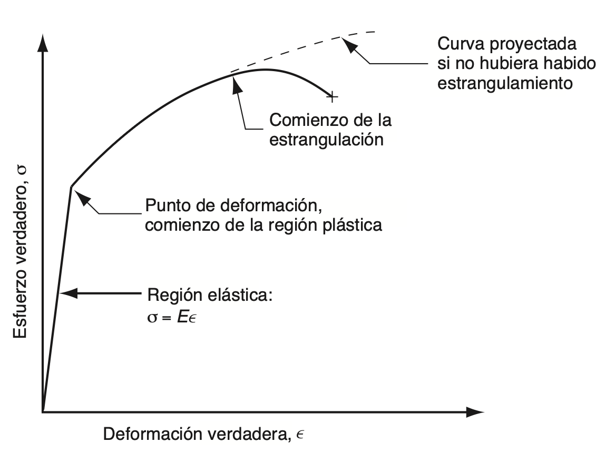{ width="50%" }

<small>*Font: Groover — Fundamentos de manufactura moderna.*</small>

En este anàlisi cal tindre en compte que, dins de la regió plàstica, l'esforç va augmentant de manera contínua fins al moment en què comença l'estrangulament. Quan este fenomen es representa sobre la corba d'esforç-deformació d'enginyeria, el seu significat real es perd, ja que, per a calcular l'esforç, s'utilitza un valor d'àrea que ja se sap que no és correcte. En canvi, en este cas, com que l'esforç real també continua augmentant, este fet ja no es pot ignorar de cap manera. El que això significa, en definitiva, és que el metall es va tornant cada vegada més fort a mesura que la deformació augmenta. Esta propietat és, precisament, la que es coneix com a enduriment per deformació.

### Tipus de relacions esforç-deformació

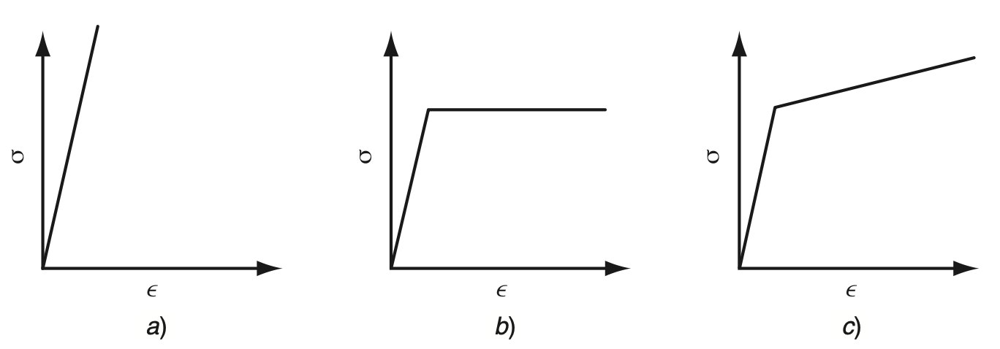

<small>*Font: Groover — Fundamentos de manufactura moderna.*</small>

#### Comportament perfectament elàstic

Este tipus de material queda totalment caracteritzat per la seua rigidesa, representada pel mòdul d'elasticitat E. La particularitat que té este material és que, quan s'arriba al límit de la seua capacitat de deformar-se elàsticament, no experimenta cap flux plàstic, sinó que directament es fractura. És a dir, no hi ha una fase intermèdia de deformació plàstica: el material passa directament de deformar-se elàsticament a trencar-se.

Este comportament és propi dels materials fràgils, com ara les ceràmiques, molts tipus de ferro colat i els polímers termoestables. Precisament per esta manca de capacitat de deformació plàstica, este tipus de materials no resulten adequats per a operacions de conformat com el laminatge, ja que no poden acomodar-se a canvis de forma sense trencar-se.

#### Comportament elàstic i perfectament plàstic

En este cas, el material també té una rigidesa definida per E dins de la regió elàstica. La diferència apareix quan s'arriba a la resistència de deformació Y: a partir d'eixe punt, el material comença a deformar-se plàsticament, però ho fa mantenint-se sempre al mateix nivell d'esforç, sense necessitat d'augmentar-lo per a continuar la deformació. Açò es tradueix, en la corba de flux, en què el coeficient de resistència K és igual a Y, i l'exponent d'enduriment per deformació n val zero.

Este tipus de comportament és típic dels metalls quan s'escalfen a temperatures prou elevades per a recristal·litzar-se en lloc d'endurir-se per deformació mentre es treballen. Un exemple característic és el plom, que ja mostra este comportament a temperatura ambient, atés que esta temperatura ja se situa per damunt del seu punt de recristal·lització.

#### Comportament elàstic i amb enduriment per deformació

Este tercer tipus de material segueix la llei de Hooke mentre es troba dins de la regió elàstica, i comença a fluir en arribar a la seua resistència de deformació Y. Ara bé, a diferència del cas anterior, si es vol continuar deformant el material una vegada superat este punt, cal anar aplicant un esforç cada vegada més gran. Este comportament es representa mitjançant una corba de flux en què el coeficient de resistència K és més gran que Y, i l'exponent d'enduriment per deformació n és més gran que zero.

Normalment, esta corba de flux es representa com una funció lineal quan es dibuixa sobre paper logarítmic. La major part dels metalls dúctils presenten este tipus de comportament quan es treballen en fred, ja que, a mesura que es deformen, es van tornant progressivament més resistents.

## Compressió 

A diferència de l'assaig de tracció, en què el material s'estira i tendeix a allargar-se, en l'esforç de compressió el que es fa és, precisament, aplicar una càrrega que tendeix a comprimir el material, en lloc d'estirar-lo. Un exemple habitual d'este tipus d'assaig consisteix a col·locar una proveta cilíndrica entre dues plaques i aplicar-hi una força que la comprimisca progressivament. A mesura que la proveta es va comprimint, la seua altura es va reduint, mentre que, en canvi, l'àrea de la seua secció transversal va augmentant, ja que el material tendeix a eixamplar-se lateralment en compensació.

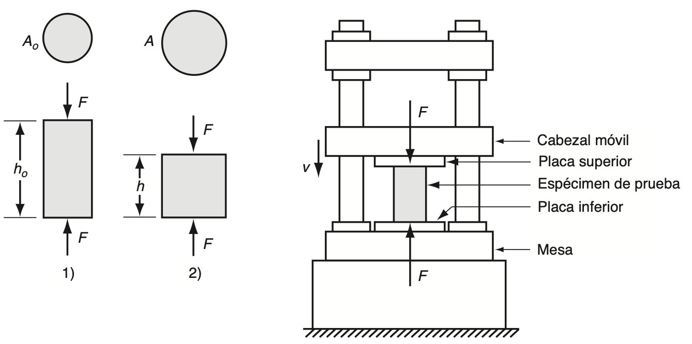

<small>*Font: Groover — Fundamentos de manufactura moderna.*</small>

En este context, l'esforç d'enginyeria es defineix de la mateixa manera que en el cas de la tracció:

$$\sigma_e = \frac{F}{A_o}$$

De manera semblant, la deformació d'enginyeria també es defineix seguint el mateix principi:

$$e = \frac{h - h_o}{h_o}$$

Ara bé, en este cas cal tindre en compte que, com que durant la compressió l'altura de la proveta disminueix respecte al seu valor inicial ho, el valor obtingut per a e resultarà negatiu, a diferència del que ocorre en l'assaig de tracció, on eixe valor sol ser positiu.

De la mateixa manera que passava en l'assaig de tracció, en este cas la corba també queda dividida en dues regions ben diferenciades: la regió elàstica i la regió plàstica. Ara bé, la forma que adopta la part corresponent a la regió plàstica és, en canvi, diferent de la que apareixia en l'assaig de tracció.

Açò s'explica pel fet que, en l'assaig de compressió, la secció transversal de la proveta va augmentant progressivament, en lloc de disminuir, com passava en l'assaig de tracció, la qual cosa fa que la càrrega necessària per a continuar deformant el material vaja creixent amb més rapidesa que abans. Com a conseqüència directa d'açò, el valor de l'esforç d'enginyeria calculat resulta també més elevat del que s'obtindria en una situació equivalent d'assaig de tracció.

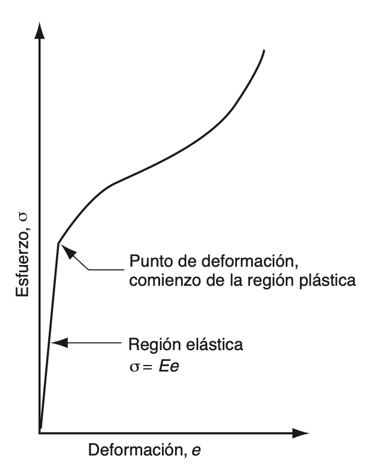{ width="50%" }

<small>*Font: Groover — Fundamentos de manufactura moderna.*</small>

En l'assaig de compressió, però, hi ha un altre fenomen que també contribueix a l'augment de l'esforç calculat. A mesura que la proveta cilíndrica es va comprimint, la fricció que apareix en les seues superfícies de contacte amb les plaques tendeix a impedir que els extrems del cilindre puguen expandir-se lliurement. Esta fricció fa que, durant l'assaig, es consumisca una quantitat addicional d'energia, la qual cosa provoca que calga aplicar una força major per a continuar la deformació. Com a conseqüència, este fet també es tradueix en un increment de l'esforç d'enginyeria que es calcula.

Així doncs, tant l'augment de l'àrea de la secció transversal com la fricció existent entre la proveta i les plaques són els dos factors que expliquen la forma característica que adopta la corba d'esforç-deformació d'enginyeria pròpia d'este tipus d'assaig, tal com es pot observar en la figura.

D'altra banda, esta mateixa fricció entre superfícies té encara una altra conseqüència: el material situat a prop de la zona central de la proveta pot arribar a incrementar la seua àrea molt més que el que es troba als extrems, els quals queden més limitats per l'efecte de la fricció amb les plaques. Este comportament diferencial fa que, finalment, la proveta acabe adoptant una forma característica de barril.

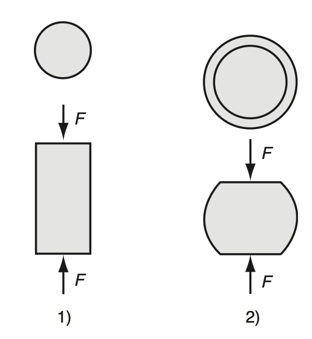{ width="50%" }

<small>*Font: Groover — Fundamentos de manufactura moderna.*</small>

Malgrat que hi ha diferències evidents entre les corbes d'esforç-deformació d'enginyeria corresponents a la tracció i a la compressió, quan es representen les dades respectives com a esforç-deformació reals, les relacions obtingudes resulten pràcticament idèntiques en tots dos casos.

## Flexió

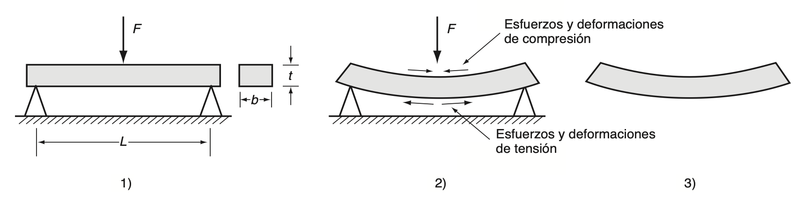

<small>*Font: Groover — Fundamentos de manufactura moderna.*</small>

El procés de doblegar una secció transversal rectangular sotmet el material, alhora, a dos tipus d'esforços diferents: d'una banda, a esforços de tracció, i per tant també de deformació, en la meitat exterior de la secció que es doblega; i, de l'altra, a esforços de compressió, amb la deformació corresponent, en la meitat interior d'esta mateixa secció. Si el material aconsegueix suportar este procés sense arribar a fracturar-se, acaba quedant doblegat de manera permanent, és a dir, es produeix una deformació plàstica.

Este tipus d'assaig resulta especialment útil en el cas dels materials durs i fràgils, com ara les ceràmiques, els quals solen presentar un cert grau d'elasticitat, però pràcticament cap capacitat de deformar-se plàsticament. Este tipus de materials no responen bé als assajos de tracció tradicionals, ja que resulta complicat preparar-ne adequadament les provetes, i, a més, hi ha sempre el risc que les parts de la premsa encarregades de subjectar-les no queden ben alineades entre si.

Per este motiu, quan es vol determinar la resistència d'este tipus de materials, se sol recórrer a l'assaig de flexió, que consisteix precisament a sotmetre la mostra a una càrrega flexionant per a poder avaluar-ne el comportament.

En este procediment, la proveta, de secció transversal rectangular, es col·loca damunt de dos suports, i s'aplica una càrrega justament en el seu punt central. Quan l'assaig es realitza d'esta manera, rep el nom d'assaig de doblegament de tres punts. En algunes ocasions, però, també s'utilitza una altra configuració alternativa, coneguda com de quatre punts.

En el cas dels materials fràgils, estos se solen deformar de manera elàstica fins al mateix moment anterior a la fractura, sense arribar a mostrar pràcticament cap comportament plàstic. La fallada del material sol produir se, generalment, perquè s'acaba superant la resistència final de tracció de les fibres exteriors de la proveta, la qual cosa dóna lloc a l'aparició d'esquerdes o a un fenomen de clivatge.

El valor de resistència que s'obté a partir d'este assaig rep el nom de resistència a la ruptura transversal, i es calcula a partir de la fórmula corresponent.

$$TRS = \frac{1.5FL}{bt^2}$$

L'assaig de flexió també s'utilitza en el cas de certs materials que no són fràgils, com per exemple els polímers termoplàstics. En esta situació, com que és probable que el material tendisca a deformar se en lloc de fracturar se directament, no resulta possible determinar la TRS a partir de la fallada de la proveta. Per este motiu, s'opta llavors per una de les dues mesures alternatives següents: 1) la càrrega registrada per a un determinat nivell de deflexió, o bé 2) la deflexió observada per a una càrrega donada.

## Cisallament

El cisallament és un altre dels tipus fonamentals d'esforç als quals pot veure's sotmés un material. Consisteix en l'aplicació de forces en direccions oposades sobre dues cares distintes d'un element prim, de manera que este tendeix a deformar-se per lliscament intern, en lloc d'estirar-se o comprimir-se com passava en els casos anteriors. Este tipus d'esforç és especialment habitual en elements com xapes, plaques o peces sotmeses a torsió, i resulta rellevant en molts processos de fabricació, com el tall o el punxonat de materials.

L'esforç de cisallament es defineix mitjançant l'expressió:

$$\tau = \frac{F}{A}$$

De manera semblant, la deformació també queda definida a partir d'una expressió pròpia que relaciona el desplaçament produït amb la geometria de l'element.

$$\gamma = \frac{\delta}{b}$$

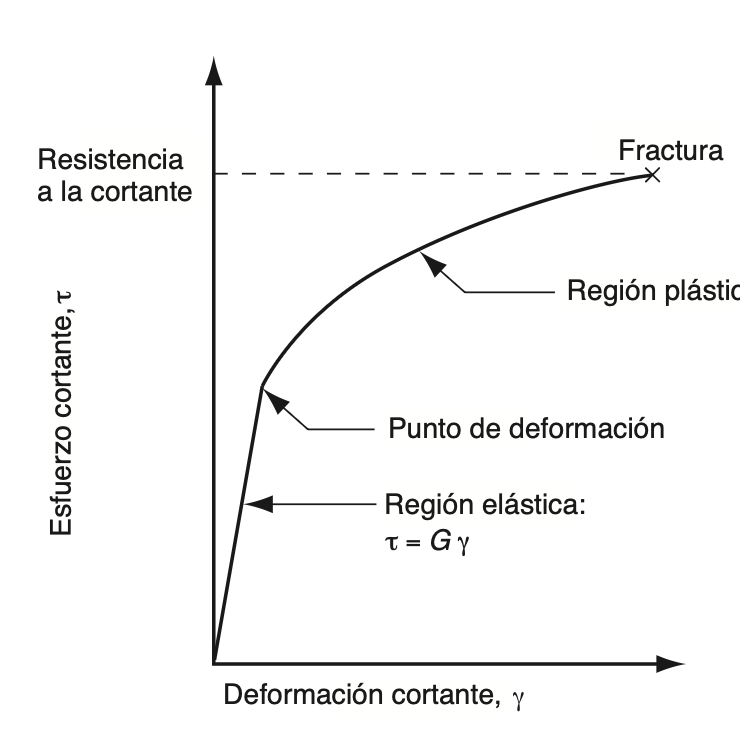{ width="50%" }

<small>*Font: Groover — Fundamentos de manufactura moderna.*</small>

En la regió elàstica, esta relació ve definida per l'expressió corresponent, en la qual G representa el mòdul de tall. Per a la majoria dels materials, el valor d'este mòdul de tall sol ser aproximadament de G = 0,4E, on E és el mòdul d'elasticitat convencional, el mateix que s'utilitza en els assajos de tracció.

Quant a la regió plàstica de la corba d'esforç deformació de tall, el material sotmés a deformació va endurint se progressivament, la qual cosa fa que el parell aplicat continue augmentant, fins que finalment es produeix la fractura del material.

$$\tau = G\gamma$$

## Torsió

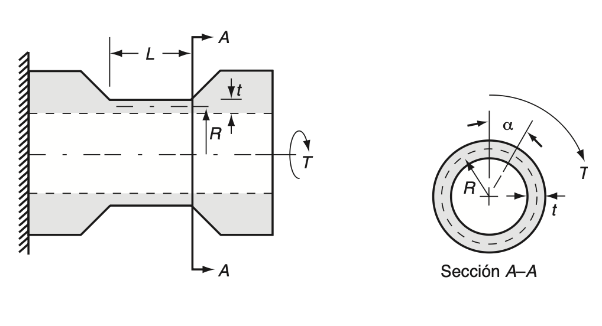

<small>*Font: Groover — Fundamentos de manufactura moderna.*</small>

Per a estudiar experimentalment el comportament de l'esforç i la deformació de tall, se sol recórrer habitualment a l'assaig de torsió. En este assaig, s'utilitza una proveta tubular de paret prima, sobre la qual s'aplica un parell de torsió. S'utilitza precisament esta geometria tubular de paret prima perquè permet que l'esforç de tall es distribuïsca de manera pràcticament uniforme al llarg de tot el gruix de la paret, cosa que no ocorreria, per exemple, amb una barra sòlida, en la qual l'esforç variaria de manera significativa des del centre fins a la superfície exterior.

A mesura que este parell va augmentant, el tub es va flexionant per torsió, fenomen que, per a este tipus de geometria, constitueix precisament una deformació de tall. L'esforç es determina de la següent manera:

$$\tau = \frac{T}{2\pi R^2 t}$$

on T representa el parell de torsió aplicat, R el radi mitjà del tub, i t el gruix de la seua paret. La deformació de tall es determina amb el mesurament de la quantitat de deflexió angular del tub, la qual es converteix a distància flexionada i es divideix entre la longitud de mesurament. Esta equació pot simplificar se, però, en la següent:

$$\gamma = \frac{R\alpha}{L}$$

on α és l'angle de deflexió, expressat en radians, i L la longitud de mesurament de la proveta. Cal tindre en compte que, en la regió elàstica, l'esforç i la deformació de tall obtinguts mitjançant l'assaig de torsió també compleixen la relació τ = Gγ, la qual cosa permet determinar experimentalment el valor del mòdul de tall G a partir de les dades obtingudes en este tipus d'assaig.

Este tipus d'assaig resulta especialment útil per a materials que, per la seua geometria o comportament, no es presten bé a l'assaig de tracció convencional. A més, permet obtindre dades sobre el comportament del material sota grans deformacions de tall, sense els problemes d'estrangulament que solen aparéixer en l'assaig de tracció.

## Vinclament

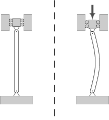

<small>*Font: Groover — Fundamentos de manufactura moderna.*</small>

El vinclament és el fenomen d'inestabilitat elàstica que pot patir un element esvelt (llarg i prim) quan es troba sotmés a un esforç de compressió. En lloc de fallar directament per aixafament del material, com passaria en una peça curta i massissa, l'element tendeix a doblegar-se lateralment de manera sobtada, apartant-se de la seua direcció original. Este fenomen es manifesta amb l'aparició de desplaçaments transversals importants respecte a la direcció principal de compressió, i és especialment habitual en pilars, columnes i barres comprimides d'estructures.

El comportament davant del vinclament depén molt de l'esveltesa mecànica de la peça: els elements molt esvelts solen fallar per vinclament elàstic, mentre que els elements de molt baixa esveltesa fallen més aviat per excés de compressió directa, sense que el vinclament arribe a tindre un paper rellevant.

Pel que fa al càlcul de la càrrega crítica de vinclament, esta ve determinada, segons el cas, per la fórmula de Leonhard Euler o per la fórmula d'Engesser. La càrrega crítica d'Euler depén de la longitud de la peça, del material, de la seua secció transversal i de les condicions d'unió, vinculació o subjecció en els seus extrems. Per a una peça biarticulada en els dos extrems, esta càrrega ve donada per l'expressió: 

$$P_{crit} = \pi^2 \frac{EI_{min}}{L^2} = \pi^2 \frac{EA}{\lambda^2}$$

on Pcr és la càrrega crítica, E el mòdul de Young del material de què està feta la barra, Imin el moment d'inèrcia mínim de la seua secció transversal, L la longitud de la barra, i λ l'esveltesa mecànica de la peça.

Finalment, val la pena assenyalar que la fórmula d'Euler només resulta vàlida per a columnes prou esveltes, és a dir, per a aquelles en què l'esforç crític de vinclament resulta inferior a la resistència de deformació del material. En canvi, en columnes curtes o poc esveltes, el material sol arribar abans a la seua deformació plàstica que no pas al vinclament, i per este motiu, en estos casos, la fórmula d'Euler ja no resulta aplicable.

## Bibliografia

**P. Groover, Mikell.** *Fundamentos de manufactura moderna.* McGrawHill, 2007.

**Fundació Wikimedia** *Vinclament.* Viquipèdia, l'enciclopèdia lliure, 2025. https://ca.wikipedia.org/wiki/Vinclament
