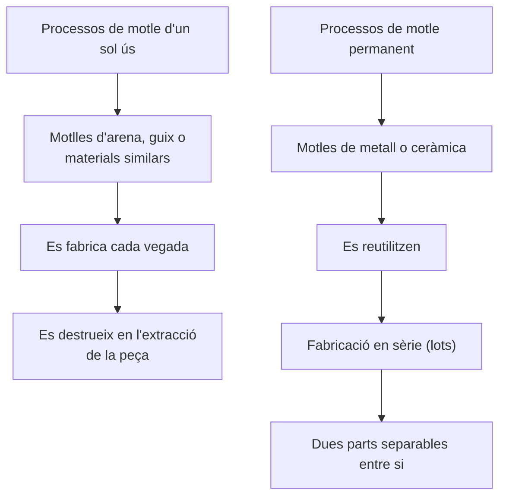
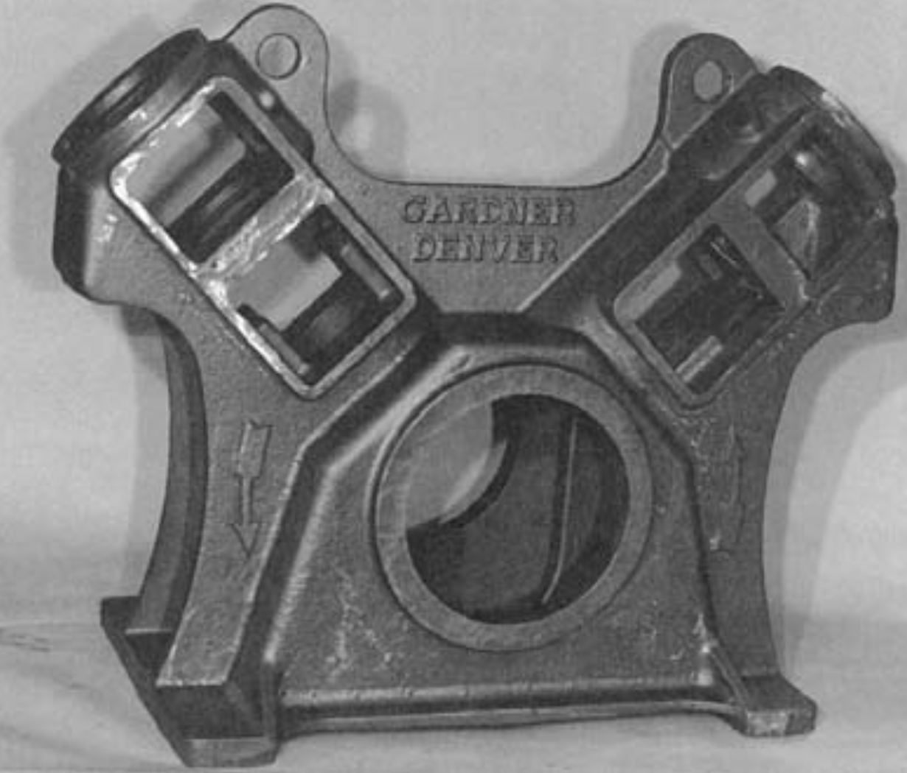
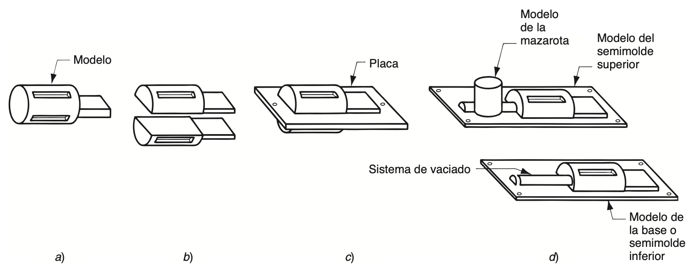
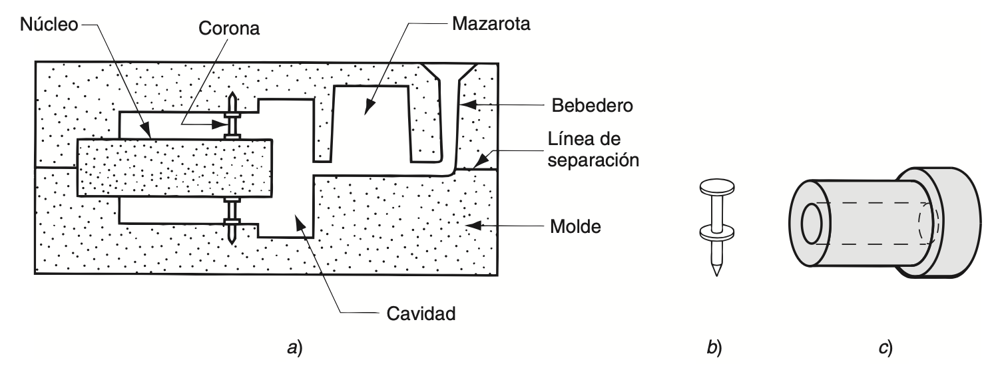
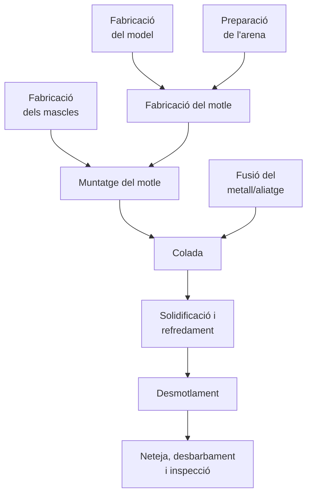
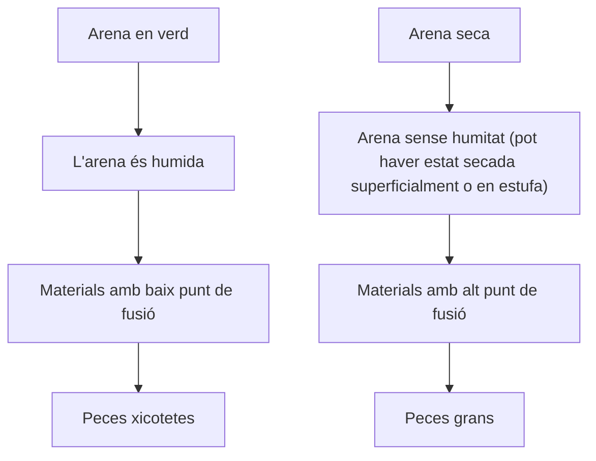
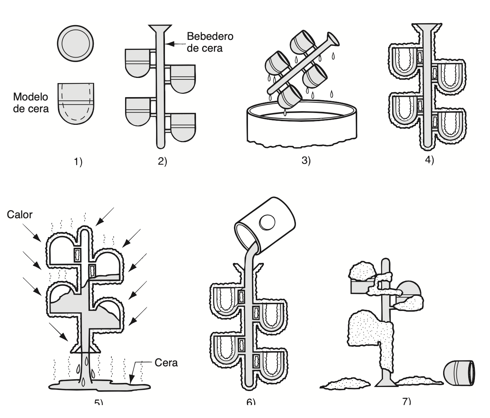

# Motles d'un sol ús

Els processos de fosa es classifiquen en dues grans categories segons el tipus de motlle emprat: ***<a><u>motlles d'un sol ús</u></a>*** i ***<a><u>motlles permanents</u></a>***. Quan es treballa amb un motlle d'un sol ús, cal destruir-lo per poder extraure'n la peça un cop fosa. Atès que cada peça exigeix fabricar un motlle nou, ***<a>la velocitat de producció en aquests processos sol dependre més del temps invertit a preparar el motlle que no pas del temps de fosa pròpiament dit</a>***. Tot i això, per a determinades geometries de peça, els motlles de sorra permeten arribar a ritmes de producció de 400 unitats per hora o fins i tot més.

## Motles per a fosa a l’arena.

La ***<a><u>fosa en sorra</u></a>*** és, de llarg, el mètode més emprat, ja que concentra la major part del pes total de peces foses que es produeixen. Pràcticament totes les aliatges de fosa s'hi poden treballar; de fet, ***<a>és una de les poques tècniques vàlides per a metalls amb punts de fusió alts</a>***, com l'acer, el níquel o el titani. La seua flexibilitat fa possible obtenir peces de mides molt diverses, des de xicotetes fins a molt grans.

Aquest procés, també anomenat fosa en motlle de sorra, consisteix a abocar metall fos dins d'un motlle de sorra i deixar-lo solidificar; posteriorment es trenca el motlle per extraure la peça. Un cop fosa, la peça cal netejar-la i inspeccionar-la, i de vegades sotmetre-la a un tractament tèrmic per millorar-ne les propietats metal·lúrgiques. La cavitat del motlle s'obté compactant la sorra al voltant d'un ***<a><u>model</u></a>*** (una rèplica aproximada de la peça que es vol fabricar), el qual es retira posteriorment separant el motlle en dues meitats. El motlle incorpora també el ***<a><u>sistema d'alimentació o de colada</u></a>*** i la ***<a><u>massalota</u></a>***. Quan la peça ha de presentar superfícies interiors (parts buides o amb forats, per exemple), cal afegir-hi un *<a>mascle o nucli</a>* dins del motlle. Com que el motlle s'ha de destruir per poder-ne extraure la peça, resulta imprescindible construir-ne un de nou per a cada unitat que es fabrica.

<small>*Font: Groover — Fundamentos de manufactura moderna.*</small>

La fosa en sorra requereix un model, és a dir, un "patró" que reprodueix la mida real de la peça, encara que lleugerament més gran per compensar les ***<a><u>toleràncies de contracció i de mecanitzat</u></a>*** que es donaran en el fundit definitiu. Per fabricar aquests models s'utilitzen materials com la fusta, els plàstics o el metall. La fusta és un dels més emprats gràcies a la facilitat amb què es pot treballar i donar-li forma, tot i que té l'inconvenient de deformar-se amb el temps i de desgastar-se per l'erosió de la sorra compactada al seu voltant, cosa que en limita la vida útil. Els models metàl·lics, en canvi, són més costosos però molt més duradors, mentre que els de plàstic ocupen una posició intermèdia entre ambdues opcions.

Existeixen diversos tipus de models. El més senzill és el ***<a><u>model massís</u></a>***, format per una sola peça, que reprodueix la forma exacta de la peça a fabricar amb les mides ajustades per contracció i mecanitzat. Encara que és el més fàcil de construir, no resulta el més còmode a l'hora de preparar motlles de sorra: cal decidir on situar la ***<a><u>línia de partició</u></a>*** entre les dues meitats del motlle, i la disposició del sistema d'alimentació i la maçarota depèn únicament del criteri i l'experiència de l'operari.

Els ***<a><u>models partits</u></a>***, en canvi, estan formats per dues meitats que divideixen la peça seguint un pla que coincideix amb la pròpia línia de separació del motlle. Aquest tipus resulta especialment adequat per a peces de geometria complexa i per a produccions de volum moderat, ja que la línia de partició ve fixada per les dues meitats del model i no depèn de la decisió de l'operari.

Quan es necessiten volums de producció més elevats, s'opta per ***<a><u>models muntats sobre plaques</u></a>***, ja siga en la modalitat de ***<a>placa ajustada</a>*** o en la de ***<a>placa doble (capucha i base)</a>***. En els models de placa ajustada, les dues meitats del model partit es fixen a costats oposats d'una mateixa placa, de fusta o de metall; els forats practicats en aquesta placa permeten alinear correctament els marcs superior i inferior del motlle. Els models de capucha i base funcionen d'una manera semblant, amb la diferència que cada meitat es munta sobre una placa independent, de manera que les seccions superior i inferior del motlle es poden fabricar per separat, sense necessitat de compartir el mateix utillatge.

<small>*Font: Groover — Fundamentos de manufactura moderna.*</small>

Els models determinen la forma exterior de la peça un cop fos el metall. Ara bé, quan la peça necessita tindre superfícies internes, cal recórrer a un ***<a><u>mascle o nucli</u></a>***: una reproducció a mida real d'aquestes cavitats interiors, que s'introdueix dins el motlle abans de l'abocament. D'aquesta manera, el metall fos circula i se solidifica entre les parets de la cavitat del motlle i el mateix nucli, donant lloc alhora a les superfícies externes i internes de la peça. Normalment, aquest nucli es fabrica compactant sorra fins a obtindre la forma requerida, i, igual que passa amb el model, les seues dimensions reals han d'incorporar el marge corresponent per contracció i mecanitzat.

Segons la geometria de la peça, pot ser necessari subjectar el nucli mitjançant suports, també anomenats ***<a><u>mates o corones</u></a>***, perquè es mantinga en la posició correcta dins la cavitat del motle durant l'abocament. Aquests suports es fabriquen amb un metall de punt de fusió superior al del metall que es fondrà; així, per exemple, en la fosa de ferro s'utilitzarien corones d'acer. Durant l'abocament i la solidificació posterior, aquestes corones queden integrades i formen part de la peça fosa final.

<small>*Font: Groover — Fundamentos de manufactura moderna.*</small>

Les sorres de fosa són de sílice (SiO2) o de sílice combinada amb altres minerals. Aquesta sorra ha de tindre bones propietats ***<a><u>refractàries</u></a>***, és a dir, capacitat per resistir temperatures elevades sense fondre's ni degradar-se d'una altra manera. També resulten rellevants la grandària del gra, la seua distribució dins la mescla i la forma que presenten els grans individuals.

Els grans fins proporcionen un millor acabat superficial a la peça obtinguda, mentre que els grans grossos ofereixen major *<a>permeabilitat</a>*, cosa que facilita l'eixida dels gasos durant l'abocament. ***<a>Els motlles fets amb grans de forma irregular solen resultar més resistents que els fabricats amb grans arredonits</a>***, atés que s'entrellacen millor entre si, encara que aquest entrellaçat tendeix alhora a reduir la permeabilitat.

En la fabricació del motlle, els grans de sorra es mantenen units gràcies a una mescla d'aigua i argila adhesiva. Una proporció habitual, en volum, és del 90% de sorra, un 3% d'aigua i un 7% d'argila. Per fixar l'argila en el seu lloc s'utilitzen diversos ***<a><u>agents adhesius</u></a>***, com ara resines orgàniques (per exemple, resines fenòliques) i aglutinants inorgànics (com el silicat de sodi o el fosfat). A banda de la sorra i l'***<a>aglutinant</a>***, de vegades s'hi incorporen additius amb l'objectiu de millorar propietats com la resistència o la permeabilitat del motlle.

Quant a la formació de la cavitat del motlle, el mètode tradicional consisteix a compactar la sorra al voltant del model per obtindre la caputxa i la base, dins d'un recipient conegut com a ***<a><u>caixa de motlle</u></a>***. Aquesta compactació es pot dur a terme de diverses maneres. La més senzilla és apilar i colpejar la sorra a mà, tasca que realitza directament l'operari de la fosa. Amb tot, també s'han desenvolupat diverses màquines que mecanitzen aquest procés de compactació. Aquestes funcionen mitjançant mecanismes diferents, entre els quals destaquen: 1) la ***<a><u>compressió</u></a>*** de la sorra al voltant del model per mitjà de pressió pneumàtica; 2) l'acció de ***<a><u>sacsejat</u></a>***, en què la sorra continguda dins la caixa de motlle juntament amb el model es deixa caure repetidament fins que queda ben compactada al seu lloc; i 3) l'acció de ***<a><u>projecció</u></a>***, en què els grans de sorra impacten a gran velocitat contra el model.

Com a alternativa a l'ús de caixes tradicionals per a cada motlle de sorra, existeix també el ***<a><u>emmotlament sense caixa</u></a>***, que consisteix a emprar una ***<a>caixa mestra</a>*** dins d'un sistema mecanitzat de producció de motlles. D'aquesta manera, cada motlle de sorra s'obté fent servir la mateixa caixa mestra.

Per avaluar la qualitat d'un motlle de sorra s'utilitzen diversos indicadors. En primer lloc, la ***<a><u>resistència</u></a>***, que és la capacitat del motlle per conservar la seua forma i suportar l'erosió provocada pel flux de metall fos, i que depén de la forma del gra, de les qualitats adhesives de l'aglutinant i d'altres factors. També cal considerar la ***<a><u>permeabilitat</u></a>***, entesa com la capacitat del motlle per deixar passar l'aire i els gasos calents a través dels buits de la sorra durant l'operació de fosa. Igualment important és l'***<a><u>estabilitat tèrmica</u></a>***, és a dir, la capacitat de la superfície de la cavitat del motlle per resistir esquerdes i deformacions quan entra en contacte amb el metall fos. A més, hi ha la ***<a><u>col·lapsabilitat</u></a>***, que fa referència a la facilitat amb què el motlle es pot retirar perquè la peça es contraga sense trencar-se, i que també inclou la facilitat per llevar la sorra de la peça durant la neteja posterior. Finalment, es té en compte la ***<a><u>reutilització</u></a>***, o siga, si la sorra procedent d'un motlle ja trencat es pot aprofitar per a fabricar-ne d'altres. Val a dir que ***<a>aquestes qualitats no sempre resulten compatibles entre si: per exemple, un motlle molt resistent sol ser menys col·lapsable</a>***.

Sovint els motlles de sorra es classifiquen en tres tipus: de ***<a><u>sorra verda</u></a>***, de ***<a><u>sorra seca</u></a>*** o de ***<a><u>superfície seca</u></a>***. Els motlles de sorra verda estan fets amb una barreja de sorra, argila i aigua, i el terme verd fa referència al fet que el motlle encara conté humitat en el moment de l'abocament. Aquests motlles tenen prou resistència per a la majoria d'aplicacions, ofereixen bona col·lapsabilitat, permeabilitat i possibilitat de reutilització, i són els menys costosos de tots.

Ara bé, la humitat de la sorra pot provocar defectes en determinats fosos, segons el metall i la forma de la peça de què es tracte. Per evitar-ho, existeix el motlle de sorra seca, elaborat amb aglutinants orgànics en lloc d'argila, que es courà en un forn gran a temperatures d'entre 200 ºC i 320 ºC. Aquest procés de cocció aporta resistència al motlle i endureix la superfície de la cavitat. Els motlles de sorra seca permeten un millor control dimensional de la peça fosa que els de sorra verda; en canvi, resulten més cars de fabricar i redueixen el ritme de producció a causa del temps que cal per a l'assecatge. Per això, el seu ús se sol limitar a peces mitjanes o grans amb ritmes de producció baixos o moderats.

Finalment, el motlle de superfície seca permet obtindre avantatges semblants als de sorra seca sense assumir-ne tots els inconvenients: n'hi ha prou d'assecar la superfície d'un motlle de sorra verda fins a una profunditat d'entre 10 i 25 mm des de la cavitat, mitjançant bufadors, làmpades de calor o altres mètodes similars. Per dotar de resistència la superfície de la cavitat, cal afegir a la barreja de sorra materials adhesius especials.

Un cop col·locat el nucli en la seua posició i encaixades les dues meitats del motle, es fa la fosa pròpiament dita. Aquesta fase inclou l'abocament, la solidificació i el refredament posterior de la peça. El sistema d'alimentació i la massalota del motlle han d'estar dissenyats de manera que permeten conduir el metall líquid fins a la cavitat i, alhora, oferisquen prou reserva de material per a compensar la contracció que es produeix durant la solidificació. Cal preveure també que l'aire i els gasos puguen eixir sense problemes.

Un dels riscos que apareixen durant l'abocament és que la força de ***<a><u>flotament</u></a>*** generada pel metall fos desplace el nucli de la seua posició. Aquesta flotació, seguint el ***<a>principi d'Arquimedes</a>***, sorgeix precisament del pes del metall fos que el nucli desplaça.

    <iframe src="https://www.youtube.com/embed/FIgRubIrEnc?si=Bmwh-fulD2G4t7Ux" title="YouTube video player" frameborder="0" allow="accelerometer; autoplay; clipboard-write; encrypted-media; gyroscope; picture-in-picture; web-share" referrerpolicy="strict-origin-when-cross-origin" allowfullscreen style="position: absolute; top: 0; left: 0; width: 100%; height: 100%;"></iframe>

## Motles per a fosa a la cera perduda

En la ***<a><u>fosa a la cera perduda</u></a>***, primer es fabrica un model de cera i posteriorment es recobreix amb un ***<a><u>material refractari</u></a>*** que constituirà el motlle; a continuació, la cera es fon i s'elimina abans d'abocar-hi el metall fos. El nom prové precisament d'aquest recobriment complet que envolta el model de cera. Es tracta d'un ***<a><u>procés de fosa de precisió</u></a>***, ja que permet obtindre peces d'una exactitud elevada i amb detalls molt fins.

Aquest procés té l'origen en l'antic Egipte, fa uns 3.500 anys, tot i que no se sap amb certesa quan va sorgir exactament ni qui va ser el seu inventor. Els historiadors pensen que va nàixer de la relació estreta que existia entre la ceràmica i el modelatge en aquella època, ja que eren els ceramistes els qui elaboraven els motles emprats per a fondre metalls.

Segons aquesta hipòtesi, tot va començar quan un ceramista, familiaritzat amb els processos de fosa, estava treballant en una peça de terrissa i va pensar que la peça guanyaria en atractiu i durabilitat si es feia de metall. Per aconseguir-ho, va construir un nucli amb la forma general de la peça però de mida més reduïda, i el va recobrir de cera per definir-ne les dimensions finals. La cera, fàcil de treballar, va permetre als artesans crear formes i dissenys molt elaborats. Sobre aquesta capa de cera, hi va aplicar diverses capes d'argila fins a trobar la manera d'unir tot el conjunt. Després va coure el motlle: l'argila es va endurir mentre la cera es fonia i eixia, deixant una cavitat buida al seu lloc. Finalment, hi va abocar bronze fos i, un cop la peça es va haver solidificat i refredat, va trencar el motlle per recuperar-la.

Així és com, segons aquesta explicació, va nàixer el que avui coneixem com la fosa a la cera perduda, anomenada així perquè el model de cera es "perd" (es fon i desapareix) abans que es duga a terme la fosa definitiva.

<small>*Font: Groover — Fundamentos de manufactura moderna.*</small>

La fabricació dels models se sol dur a terme mitjançant una operació de modelatge, en què la cera calenta s'aboca o s'injecta dins d'un ***<a><u>encuny mestre</u></a>*** dissenyat amb les toleràncies adequades per compensar la contracció, tant de la cera com del metall fos que es colarà posteriorment. Quan la peça presenta una forma complicada, es poden unir diverses parts separades de cera fins a completar el model desitjat. En les operacions de producció a gran escala, s'acostumen a agrupar diversos models al voltant d'un mateix canal d'alimentació, també fet de cera, per formar el que s'anomena un ***<a><u>arbre de models</u></a>***: la configuració geomètrica conjunta que finalment es farà servir per a fondre el metall.

El ***<a><u>recobriment amb material refractari</u></a>*** se sol dur a terme submergint l'arbre de models en una massa molt fina de sílice granular o d'algun altre refractari polvoritzat, mesclat amb una pasta que fixa el motlle a la forma desitjada. ***<a>La grandària reduïda del gra refractari permet obtindre una superfície llisa i reproduir amb precisió els detalls més fins del model de cera</a>***. Per acabar de formar el motlle definitiu, es torna a submergir repetidament l'arbre en la massa refractària, o bé es compacta amb suavitat aquest material al seu voltant dins d'un recipient. Tot seguit, es deixa assecar el motlle durant unes huit hores perquè l'aglutinant s'endurisca.

***<a>Entre els avantatges de la fosa a la cera perduda hi ha la possibilitat d'obtindre peces d'una complexitat i un detall molt elevats, un control dimensional excel·lent que pot arribar a toleràncies de ±0,075 mm, un bon acabat superficial, la possibilitat habitual de recuperar la cera per reutilitzar-la, i el fet que normalment no calga cap mecanitzat addicional posterior</a>***, ja que es tracta d'un ***<a><u>procés de forma neta</u></a>***. Tot i aquests avantatges, com que en aquesta operació intervenen moltes fases diferents, resulta un procés relativament costós.

    <iframe src="https://www.youtube.com/embed/LMeJ6eW4aVI?si=GXSSLn4XwiOE9CG0" title="YouTube video player" frameborder="0" allow="accelerometer; autoplay; clipboard-write; encrypted-media; gyroscope; picture-in-picture; web-share" referrerpolicy="strict-origin-when-cross-origin" allowfullscreen style="position: absolute; top: 0; left: 0; width: 100%; height: 100%;"></iframe>

    <iframe src="https://www.youtube.com/embed/wdP-wt1j1qc?si=IF30KDIys8Ry-9c_" title="YouTube video player" frameborder="0" allow="accelerometer; autoplay; clipboard-write; encrypted-media; gyroscope; picture-in-picture; web-share" referrerpolicy="strict-origin-when-cross-origin" allowfullscreen style="position: absolute; top: 0; left: 0; width: 100%; height: 100%;"></iframe>

    <iframe src="https://www.youtube.com/embed/D6f-WsIoUlE?si=RUyyFFMukTnQ1jyS" title="YouTube video player" frameborder="0" allow="accelerometer; autoplay; clipboard-write; encrypted-media; gyroscope; picture-in-picture; web-share" referrerpolicy="strict-origin-when-cross-origin" allowfullscreen style="position: absolute; top: 0; left: 0; width: 100%; height: 100%;"></iframe>

## Bibliografia

**P. Groover, Mikell.** *Fundamentos de manufactura moderna.* McGrawHill, 2007.

**Boronat Vitoria Teodomiro.** *Moldeo en arena verde | | UPV.* Universitat Politècnica de València, 27 mar 2022. https://youtu.be/FIgRubIrEnc?si=ubrUSK6C2_cy4NZv

**Marcos, Carmen.** *Elaboración del árbol de colada | 1/3. UPV.* Universitat Politècnica de València, 29 set. 2025. https://www.youtube.com/watch?v=LMeJ6eW4aVI

**Marcos, Carmen.** *Elaboración del molde de cáscara cerámica | 2/3. UPV* Universitat Politècnica de València, 29 set. 2025. https://www.youtube.com/watch?v=wdP-wt1j1qc

**Marcos, Carmen.** *Colada de los moldes de cáscara cerámica | 3/3. UPV* Universitat Politècnica de València, 29 set. 2025. https://www.youtube.com/watch?v=D6f-WsIoUlE

**Peydró Rasero, Miguel Ángel.** *Fundición a la cera perdida | 1/2. UPV* Universitat Politècnica de València, 29 set. 2025. https://www.youtube.com/watch?v=N2ZUu34i1ac

**Peydró Rasero, Miguel Ángel.** *Fundición de Aleación de Bismuto como prototipado rápido | 2/2. UPV* Universitat Politècnica de València, 17 nov. 2025. https://www.youtube.com/watch?v=dcGzK9Q7Gkw

